# 堆(优先级队列)—识别模式

> 原文：<https://itnext.io/heap-priority-queue-identify-pattern-aaedda7b3f6b?source=collection_archive---------6----------------------->

# 介绍

这是一种特殊的队列，称为修道院队列。它保持对一组对象的跟踪，其中每个对象都有一个键(优先级),以有效地维持像插入、删除和基于该优先级查找或查找特定对象这样的功能。最小堆和最大堆都是优先级队列，这取决于如何定义它们的优先级顺序。

**传统队列**

*   基于位置(前/后)访问/排序项目
*   它不关心物品的价值

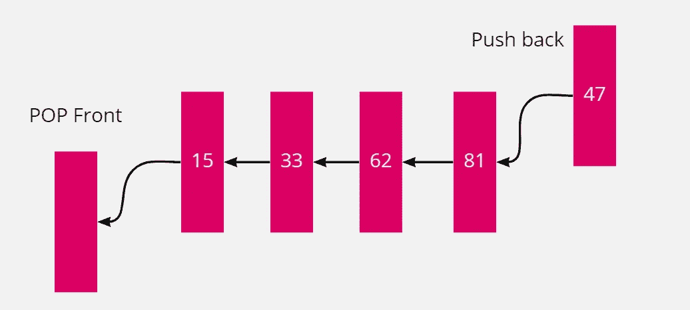

图 1:传统队列

**优先队列**

*   项目的顺序是基于价值的。(最小值或最大值)。
*   物品以某种任意的顺序到达。
*   总是产生最小值的堆称为最小堆。
*   总是产生最大值的堆称为最大堆。
*   当删除一个项目时，需要根据实现获得最小值或最大值。
*   它导致一个排序列表。

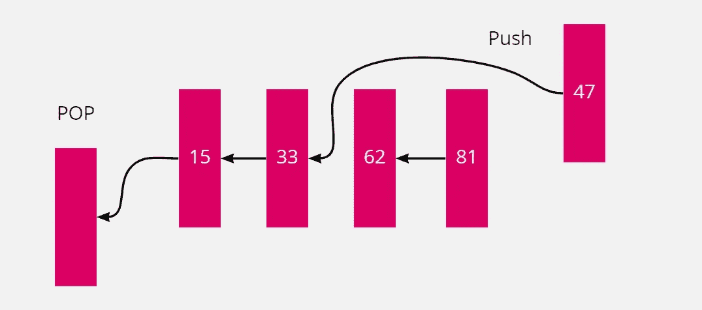

图 2:优先级队列

优先级队列的真实示例:

*   **医院急诊排队** : →患者排队中，情况最危急的患者排在第一位。
*   寻找最近的餐馆、酒店、厕所等。
*   航空公司在“经济舱”之前让“头等舱”的乘客登机。

# 优先级队列的效率

基于排序后的数组:

*   Insert() → O(n)
*   Top() → O(1)
*   Pop() → O(1)

基于未排序的数组:

*   Insert() → O(1)
*   Top() → O(n)
*   Pop() → O(n)

# 堆数据结构

堆数据结构为优先级队列提供了有效的实现。它通常是通过使用二叉树来构建的。在二叉树中，对于两个子树，每个父树都小于(如果是最小堆)或大于(如果是最大堆)。

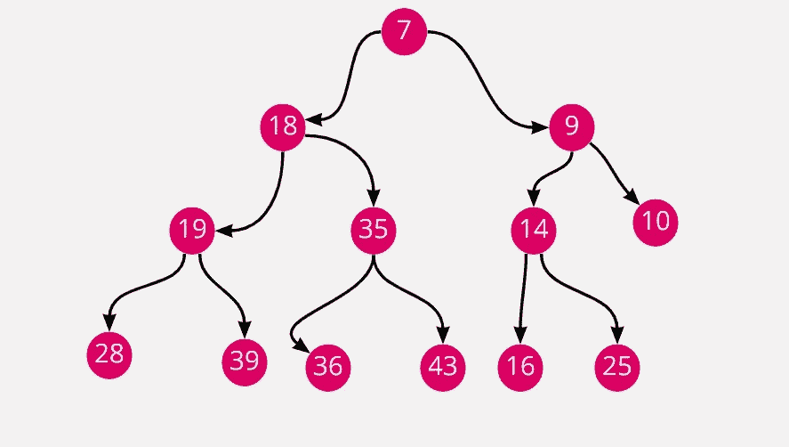

图 3:最小堆

## 堆成一棵树

一棵完整的二叉树可以被建模为一个数组。假设它从索引 1 开始，其中:

*   父代(i) = i/2
*   LeftChild(p) = 2 * p
*   RightChild(p) = 2 * p + 1

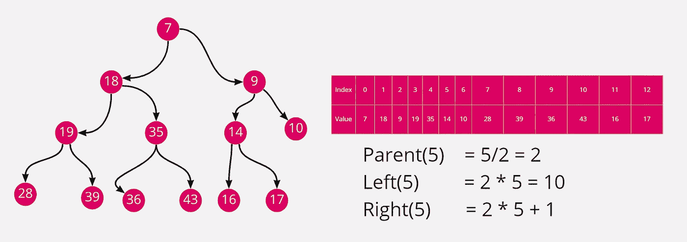

图 4:最小堆构造

这里，一个节点的键≤大于其子节点的键(min-heap)。

## 堆操作

下面是堆操作:

*   构建最大堆/平均堆:→它从一个未排序的数组中产生一个最大堆或最小堆。
*   max heapify/min heapify: →它纠正根子树中对堆属性的单个违反。
*   插入，提取最大值，堆排序

## 最大值

让我们取一个如下所示的数组:

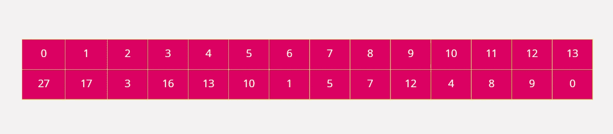

图 5:最大堆的数组

上述数组的最大值:

步骤 0:

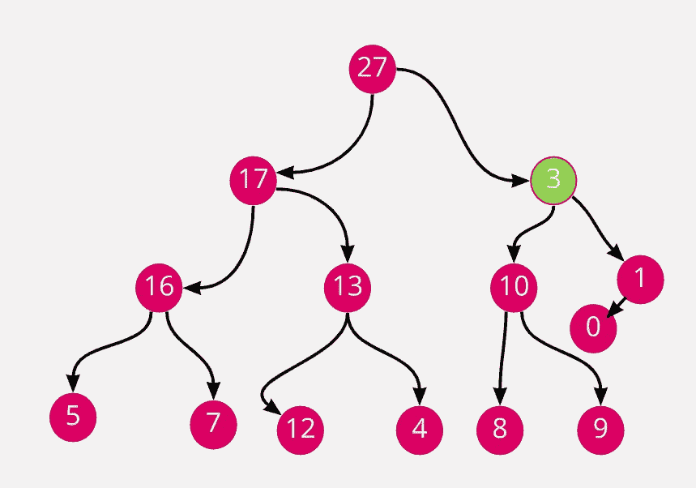

图 5: Heapify

第一步:

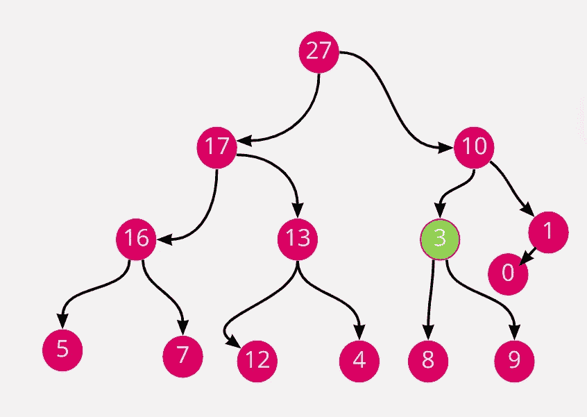

图 6: Heapify

第三步:

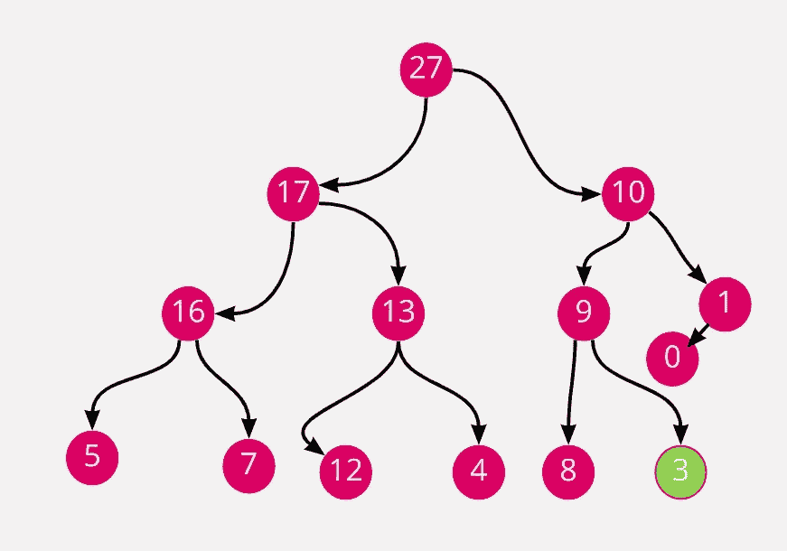

图 7: Heapify

构建最大堆的伪代码:

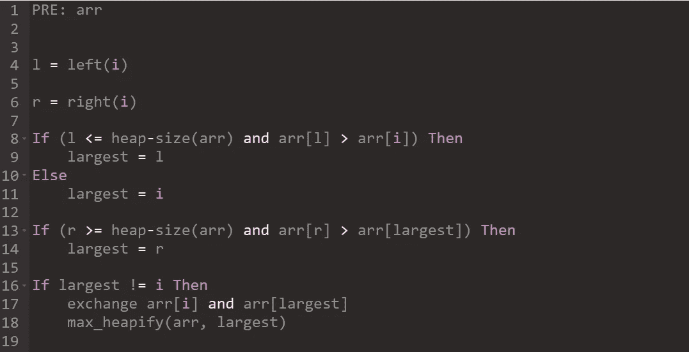

图 8:构造最大堆的伪代码

代码实现:

```
# **Max Heap**nums = [12, 11, 13, 5, 6, 7]def maxHeap(nums):
    n = len(nums)
    for i in range(n//2-1, -1, -1):
        heapify(nums, n, i)def heapify(nums, n, i):
    largest = i
    left = 2 * i + 1
    right = 2 * i + 2

    if (left < n and nums[largest] < nums[left]):
        largest = left

    if (right < n and nums[largest] < nums[right]):
        largest = right

    if (i != largest):
        nums[i], nums[largest] = nums[largest], nums[i]
        heapify(nums, n, largest)if __name__ == '__main__':
    maxHeap(nums)
    print(nums)
```

# 基于优先级队列或最小堆/最大堆的问题和解决方案

有许多问题是通过最小堆或最大堆来解决的。

## 数组中第 k 个最大的元素

给定一个整数数组`nums`和一个整数`k`，返回数组中最大的元素*`kth`。*

*注意，它是排序顺序中最大的元素`kth`，而不是`kth` distinct 元素。*

*示例:*

```
***Input:** nums = [3,2,1,5,6,4], k = 2
**Output:** 5*
```

***解决方案:***

```
*class Solution(object):
    def findKthLargest(self, nums, k):
        """
        :type nums: List[int]
        :type k: int
        :rtype: int
        """
        n = len(nums)
        minHeap = []

        for i in range(0, k):
            minHeap.append(nums[i])

        for i in range(k, n):
            minHeap.sort()
            if minHeap[0] > nums[i]:
                continue
            else:
                minHeap.pop(0)
                minHeap.append(nums[i])

        print(minHeap)
        minHeap.sort()
        return minHeap[0]*
```

## *从数据流中查找中值*

***中值**是有序整数列表中的中间值。如果列表的大小是偶数，则没有中间值，中间值是两个中间值的平均值。*

*   *例如，对于`arr = [2,3,4]`，中位数是`3`。*
*   *比如对于`arr = [2,3]`，中位数是`(2 + 3) / 2 = 2.5`。*

*实现 MedianFinder 类:*

*   *`MedianFinder()`初始化`MedianFinder`对象。*
*   *`void addNum(int num)`将数据流中的整数`num`添加到数据结构中。*
*   *`double findMedian()`返回到目前为止所有元素的中值。将接受实际答案的`10-5`范围内的答案。*

*示例:*

```
***Input**
["MedianFinder", "addNum", "addNum", "findMedian", "addNum", "findMedian"]
[[], [1], [2], [], [3], []]
**Output**
[null, null, null, 1.5, null, 2.0]*
```

***解决方案:***

```
*import heapqclass MedianFinder(object):def __init__(self):
        self.max = []
        self.min = []def addNum(self, num):
        """
        :type num: int
        :rtype: None
        """
        heapq.heappush(self.max, -num)
        heapq.heappush(self.min, -(heapq.heappop(self.max)))

        if len(self.max) < len(self.min):
            heapq.heappush(self.max, -heapq.heappop(self.min))def findMedian(self):
        """
        :rtype: float
        """
        if len(self.max) > len(self.min):
            return -(self.max[0])
        else:
            return ((float(-self.max[0]))+ float(self.min[0]))/2# Your MedianFinder object will be instantiated and called as such:
# obj = MedianFinder()
# obj.addNum(num)
# param_2 = obj.findMedian()*
```

## *前 K 个频繁元素*

*给定一个整数数组`nums`和一个整数`k`，返回*`k`*最频繁出现的元素*。您可以在**中以任意顺序**返回答案。**

****举例:****

```
****Input:** nums = [1,1,1,2,2,3], k = 2
**Output:** [1,2]** 
```

****解决方案:****

```
**class Solution:
    def topKFrequent(self, nums: List[int], k: int) -> List[int]:
        hashmap = {}
        for num in nums:
            if num in hashmap:
                hashmap[num] += 1
            else:
                hashmap[num] = 1

        heap = []
        for key in hashmap:
            heapq.heappush(heap, (-hashmap[key], key))

        res = []
        for _ in range(k):
            popped = heapq.heappop(heap)
            res.append(popped[1])

        return res**
```

## **设计推特**

**设计一个简化版本的 Twitter，用户可以发布推文，关注/取消关注另一个用户，并能够在用户的新闻提要中看到最近的推文。**

**实现`Twitter`类:**

*   **初始化你的 twitter 对象。**
*   **`void postTweet(int userId, int tweetId)`由用户`userId`撰写 ID 为`tweetId`的新推文。对这个函数的每次调用都有一个唯一的`tweetId`。**
*   **`List<Integer> getNewsFeed(int userId)`在用户的新闻提要中检索`10`最近的 tweet IDs。新闻提要中的每一项都必须由用户关注的用户或用户自己发布。推文必须按照从最近到最近的顺序排序**。****
*   **`void follow(int followerId, int followeeId)`ID 为`followerId`的用户开始关注 ID 为`followeeId`的用户。**
*   **ID 为`followerId`的用户开始取消关注 ID 为`followeeId`的用户。**

**示例:**

```
****Input**
["Twitter", "postTweet", "getNewsFeed", "follow", "postTweet", "getNewsFeed", "unfollow", "getNewsFeed"]
[[], [1, 5], [1], [1, 2], [2, 6], [1], [1, 2], [1]]
**Output**
[null, null, [5], null, null, [6, 5], null, [5]]

**Explanation**
Twitter twitter = new Twitter();
twitter.postTweet(1, 5); // User 1 posts a new tweet (id = 5).
twitter.getNewsFeed(1);  // User 1's news feed should return a list with 1 tweet id -> [5]. return [5]
twitter.follow(1, 2);    // User 1 follows user 2.
twitter.postTweet(2, 6); // User 2 posts a new tweet (id = 6).
twitter.getNewsFeed(1);  // User 1's news feed should return a list with 2 tweet ids -> [6, 5]. Tweet id 6 should precede tweet id 5 because it is posted after tweet id 5.
twitter.unfollow(1, 2);  // User 1 unfollows user 2.
twitter.getNewsFeed(1);  // User 1's news feed should return a list with 1 tweet id -> [5], since user 1 is no longer following user 2.**
```

****解决方案:****

```
**from heapq import *class Twitter(object):def __init__(self):
        """
        Initialize your data structure here.
        """
        self.following = {}
        self.tweets = {}
        self.count = 0def postTweet(self, userId, tweetId):
        """
        Compose a new tweet.
        :type userId: int
        :type tweetId: int
        :rtype: None
        """
        self.count -= 1
        if userId in self.tweets:
            self.tweets[userId].append((self.count, tweetId))
        else:
            self.tweets[userId] = [(self.count, tweetId)]def getNewsFeed(self, userId):
        """
        Retrieve the 10 most recent tweet ids in the user's news feed. Each item in the news feed must be posted by users who the user followed or by the user herself. Tweets must be ordered from most recent to least recent.
        :type userId: int
        :rtype: List[int]
        """
        heap = []

        if userId in self.tweets:
            heap.extend(self.tweets[userId])

        following = self.following.get(userId, [])
        for ids in following:
            if ids in following:
                if ids != userId:
                    tweetData = self.tweets.get(ids, [])
                    heap.extend(tweetData)

        heapq.heapify(heap)
        res = []
        while heap and len(res) < 10:
            item = heapq.heappop(heap)
            res.append(item[1])

        return resdef follow(self, followerId, followeeId):
        """
        Follower follows a followee. If the operation is invalid, it should be a no-op.
        :type followerId: int
        :type followeeId: int
        :rtype: None
        """
        if followerId in self.following:
            self.following[followerId].add(followeeId)
        else:
            self.following[followerId] = {followeeId}def unfollow(self, followerId, followeeId):
        """
        Follower unfollows a followee. If the operation is invalid, it should be a no-op.
        :type followerId: int
        :type followeeId: int
        :rtype: None
        """
        if followerId in self.following:
            if followeeId in self.following[followerId]:
                self.following[followerId].remove(followeeId)# Your Twitter object will be instantiated and called as such:
# obj = Twitter()
# obj.postTweet(userId,tweetId)
# param_2 = obj.getNewsFeed(userId)
# obj.follow(followerId,followeeId)
# obj.unfollow(followerId,followeeId)**
```

## **排序矩阵中的第 k 个最小元素**

**给定一个`n x n` `matrix`，其中每行和每列都按升序排序，返回矩阵中的 `kth` *最小元素*。****

*请注意，它是排序顺序中的`kth`最小元素**，而不是`kth` **相异**元素。***

*你必须找到一个内存复杂度优于`O(n2)`的解决方案。*

*示例:*

```
***Input:** matrix = [[1,5,9],[10,11,13],[12,13,15]], k = 8
**Output:** 13
**Explanation:** The elements in the matrix are [1,5,9,10,11,12,13,**13**,15], and the 8th smallest number is 13*
```

***解决方案:***

```
*import heapqclass Solution(object):
    def kthSmallest(self, matrix, k):
        """
        :type matrix: List[List[int]]
        :type k: int
        :rtype: int
        """
        r = len(matrix)
        c = len(matrix[0])

        heap = []
        for i in range(r):
            heapq.heappush(heap, (matrix[i][0], i, 0))

        while k > 1:
            item, row, col = heapq.heappop(heap)
            if (col + 1) < c:
                heapq.heappush(heap, (matrix[row][col+1], row, col+1))

            k -=1

        return heap[0][0]*
```

## *按频率排序字符*

*给定一个字符串`s`，根据字符的**频率**按**降序**排序。一个字符的**频率**就是它在字符串中出现的次数。*

*返回*排序后的字符串*。如果有多个答案，返回*其中任何一个*。*

*示例:*

```
***Input:** s = "tree"
**Output:** "eert"
**Explanation:** 'e' appears twice while 'r' and 't' both appear once.
So 'e' must appear before both 'r' and 't'. Therefore "eetr" is also a valid answer.*
```

***解决方案:***

```
*import heapqclass Solution(object):
    def frequencySort(self, s):
        """
        :type s: str
        :rtype: str
        """
        freq = {}
        for char in s:
            if char in freq:
                freq[char] += 1
            else:
                freq[char] = 1

        heap = []
        for char, count in freq.items():
            heapq.heappush(heap, (-count, char))

        result = ''
        while heap:
            count, char = heapq.heappop(heap)
            result += (char * -count)

        return result*
```

## *相对等级*

*给你一个大小为`n`的整数数组`score`，其中`score[i]`是`ith`运动员在比赛中的分数。所有分数保证**唯一**。*

*运动员根据他们的分数排名**到**，其中`1st`名运动员得分最高，`2nd`名运动员得分最高，`2nd`名运动员得分最高，以此类推。每位运动员的名次决定了他们的排名:*

*   *第`1st`名运动员的名次是`"Gold Medal"`。*
*   *第`2nd`名运动员的名次是`"Silver Medal"`。*
*   *第`3rd`名运动员的名次是`"Bronze Medal"`。*
*   *对于`4th`位到`nth`位运动员，他们的名次是他们的名次(即`xth`位运动员的名次是`"x"`)。*

*返回一个大小为`n`的数组`answer`，其中`answer[i]`是`ith`运动员的**排名**。*

*示例:*

```
***Input:** score = [5,4,3,2,1]
**Output:** ["Gold Medal","Silver Medal","Bronze Medal","4","5"]
**Explanation:** The placements are [1st, 2nd, 3rd, 4th, 5th].*
```

***解决方案:***

```
*class Solution(object):
    def findRelativeRanks(self, score):
        """
        :type score: List[int]
        :rtype: List[str]
        """
        heap = [(-num, i) for i, num in enumerate(score)]
        heapq.heapify(heap)

        n = len(score)
        res = [0] * n
        count = 1

        while heap:
            num, i = heapq.heappop(heap)
            if count == 1:
                res[i] = "Gold Medal"
            elif count == 2:
                res[i] = "Silver Medal"
            elif count == 3:
                res[i] = "Bronze Medal"
            else:
                res[i] = str(count)

            count += 1

        return res*
```

## *课程表三*

*从`1`到`n`有`n`不同的在线课程。给你一个数组`courses`，其中`courses[i] = [durationi, lastDayi]`表示`ith`课程应该连续**进行**天`durationi`并且必须在`lastDayi`之前或当天完成。*

*你将在`1st`日开始，你不能同时选两门或更多的课程。*

*返回*你可以选修的最大课程数*。*

*示例:*

```
***Input:** courses = [[100,200],[200,1300],[1000,1250],[2000,3200]]
**Output:** 3
Explanation: 
There are totally 4 courses, but you can take 3 courses at most:
First, take the 1st course, it costs 100 days so you will finish it on the 100th day, and ready to take the next course on the 101st day.
Second, take the 3rd course, it costs 1000 days so you will finish it on the 1100th day, and ready to take the next course on the 1101st day. 
Third, take the 2nd course, it costs 200 days so you will finish it on the 1300th day. 
The 4th course cannot be taken now, since you will finish it on the 3300th day, which exceeds the closed date.*
```

***解决方案:***

```
*class Solution(object):
    def scheduleCourse(self, courses):
        """
        :type courses: List[List[int]]
        :rtype: int
        """
        courses.sort(key=lambda c: c[1])

        A, curr = [], 0
        for dur, ld in courses:
            heapq.heappush(A,-dur)
            curr += dur
            if curr > ld: curr += heapq.heappop(A)

        return len(A)*
```

## *查找 K 个最近的元素*

*给定一个**排序的**整数数组`arr`，两个整数`k`和`x`，返回数组中与`x`最接近的`k`整数。结果也应该按升序排序。*

*整数`a`比整数`b`更接近于`x`，如果:*

*   *`|a - x| < |b - x|`，或者*
*   *`|a - x| == |b - x|`和`a < b`*

*示例:*

```
***Input:** arr = [1,2,3,4,5], k = 4, x = 3
**Output:** [1,2,3,4]*
```

***解决方案:***

```
*import heapq
class Solution(object):
    def findClosestElements(self, arr, k, x):
        """
        :type arr: List[int]
        :type k: int
        :type x: int
        :rtype: List[int]
        """
        if len(arr) < k:
            return []

        heap = []

        for item in arr:
            val = abs(x - item)
            if len(heap) < k:
                heapq.heappush(heap, (-1* val, item))
            else:
                if (-1 * heap[0][0] > val):
                    heapq.heappop(heap)
                    heapq.heappush(heap, (-1 * val, item))

        return sorted([val for _, val in heap])*
```

## *前 K 个常用词*

*给定一个字符串数组`words`和一个整数`k`，返回*`k`*最频繁出现的字符串*。**

**将按**排序**的答案**返回，频率**从高到低。将出现频率相同的单词按其**字典顺序**排序。**

**示例:**

```
****Input:** words = ["i","love","leetcode","i","love","coding"], k = 2
**Output:** ["i","love"]
**Explanation:** "i" and "love" are the two most frequent words.
Note that "i" comes before "love" due to a lower alphabetical order.**
```

****解决方案:****

```
**class Solution(object):
    def topKFrequent(self, words, k):
        """
        :type words: List[str]
        :type k: int
        :rtype: List[str]
        """
        d = {}
        for item in words:
            if item not in d:
                d[item] = 1
            else:
                d[item] += 1

        heap = []
        for word, count in d.items():
            heapq.heappush(heap, (-count, word))

        data = [heapq.heappop(heap)[-1] for _ in range(k)]
        return data**
```

## **流中的第 k 个最大元素**

**设计一个类来找出流中最大的元素。请注意，它是排序顺序中最大的`kth`元素，而不是`kth` distinct 元素。**

**实现`KthLargest`类:**

*   **`KthLargest(int k, int[] nums)`用整数`k`和整数流`nums`初始化对象。**
*   **`int add(int val)`将整数`val`附加到流中，并返回代表流中最大元素`kth`的元素。**

**示例:**

```
****Input**
["KthLargest", "add", "add", "add", "add", "add"]
[[3, [4, 5, 8, 2]], [3], [5], [10], [9], [4]]
**Output**
[null, 4, 5, 5, 8, 8]

**Explanation**
KthLargest kthLargest = new KthLargest(3, [4, 5, 8, 2]);
kthLargest.add(3);   // return 4
kthLargest.add(5);   // return 5
kthLargest.add(10);  // return 5
kthLargest.add(9);   // return 8
kthLargest.add(4);   // return 8**
```

****解决方案:****

```
**import heapqclass KthLargest(object):def __init__(self, k, nums):
        """
        :type k: int
        :type nums: List[int]
        """
        self.heap = []
        self.k = k

        for num in nums:
            self.add(num)def add(self, val):
        """
        :type val: int
        :rtype: int
        """
        heapq.heappush(self.heap, val)

        if len(self.heap) > self.k:
            heapq.heappop(self.heap)

        return self.heap[0]# Your KthLargest object will be instantiated and called as such:
# obj = KthLargest(k, nums)
# param_1 = obj.add(val)**
```

## **重组字符串**

**给定一个字符串`s`，重新排列`s`的字符，使任意两个相邻的字符不相同。**

**返回*任何可能的重排* `s` *或者返回* `""` *如果不可能*。**

**示例:**

```
****Input:** s = "aab"
**Output:** "aba"**
```

****解决方案:****

```
**import heapqclass Solution(object):
    def reorganizeString(self, s):
        """
        :type s: str
        :rtype: str
        """
        d = {}
        for item in s:
            if item not in d:
                d[item] = 1
            else:
                d[item] += 1

        heap = []
        for char, count in d.items():
            heapq.heappush(heap, (-count, char))

        res = ''
        prev_count = 0
        prev_char = ''
        while len(heap) > 0:
            count, char = heapq.heappop(heap)
            res += char

            if prev_count < 0:
                heapq.heappush(heap, (prev_count, prev_char))

            prev_count = count + 1
            prev_char = char

        if len(res) == len(s):
            return res

        return ""**
```

## **K 站以内最便宜的航班**

**有许多航班将城市连接起来。给你一个数组`flights`，其中`flights[i] = [fromi, toi, pricei]`表示有一个从城市`fromi`到城市`toi`的航班，费用为`pricei`。**

**同样给你三个整数`src`、`dst`、`k`，返回 ***最便宜的价格*** *从* `src` *到* `dst` *最多有* `k` *个止损点。*如果没有这条路线，返回`-1`。**

**示例:**

**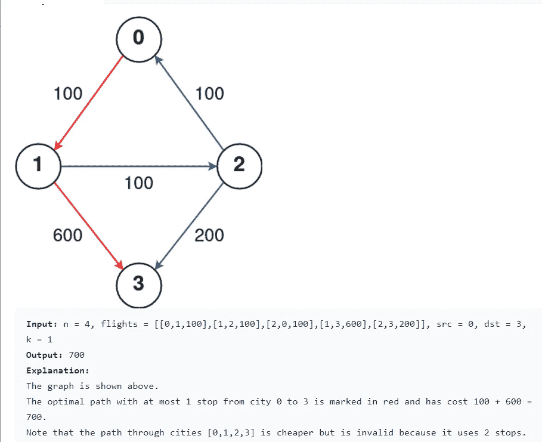**

****解决方案:****

```
**class Solution(object):
    def findCheapestPrice(self, n, flights, src, dst, k):
        """
        :type n: int
        :type flights: List[List[int]]
        :type src: int
        :type dst: int
        :type k: int
        :rtype: int
        """
        graph = defaultdict(list)

        for a, b, price in flights:
            graph[a].append((b, price))

        node2minNstop = {i: float("inf") for i in range(n)}
        pq = [(0, src, -1)]
        while pq:
            dist_from_src, node, n_stops = heappop(pq)
            if node == dst:
                return dist_from_src
   # skip current iteration if number of stops exceeds maximum
   # or we can reach current node with fewer stops. Suppose we've
   # visited this node before, by the property of Dijkstra we must have found
   # a path with lower cost to this node before. The only reason we might want
   # to visit it again is if we can visit it with fewer stops. If this is not the case, we
   # skip.
            if n_stops >= min(k, node2minNstop[node]):
                continue
            node2minNstop[node] = n_stops
            for neighbor, dist_to_neighbor in graph[node]:
                heappush(pq, (dist_from_src+dist_to_neighbor, neighbor, n_stops+1))

        return -1**
```

## **对数组排序**

**给定一个整数数组`nums`，按升序对数组排序。**

**示例:**

```
****Input:** nums = [5,2,3,1]
**Output:** [1,2,3,5]**
```

****解决方案:****

```
**class Solution(object):
    def sortArray(self, nums):
        """
        :type nums: List[int]
        :rtype: List[int]
        """
        n = len(nums)
        for i in range(n//2-1, -1, -1):
            self.heapify(nums, n, i)

        for i in range(n-1, 0, -1):
            nums[i], nums[0] = nums[0], nums[i]
            self.heapify(nums, i, 0)

        return nums

    def heapify(self, arr, n, i):
        largest = i
        l = 2* i + 1
        r = 2 * i + 2

        if l < n and arr[largest] < arr[l]:
            largest = l

        if r < n and arr[largest] < arr[r]:
            largest = r

        if largest != i:
            arr[i], arr[largest] = arr[largest], arr[i]
            self.heapify(arr, n, largest)**
```

## **k 个离原点最近的点**

**给定一个`points`数组，其中`points[i] = [xi, yi]`代表 **X-Y** 平面上的一个点和一个整数`k`，返回离原点`(0, 0)`最近的`k`点。**

****X-Y** 平面上两点之间的距离为欧氏距离(即`√(x1 - x2)2 + (y1 - y2)2`)。**

**您可以在**中以任何顺序**返回答案。答案是**保证**是**唯一的**(除了它所在的顺序)。**

**示例:**

**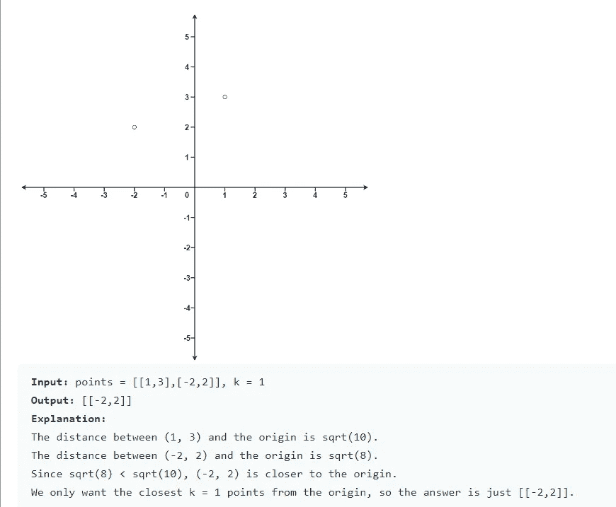**

****解决方案:****

```
**import heapqclass Solution(object):
    def kClosest(self, points, k):
        """
        :type points: List[List[int]]
        :type k: int
        :rtype: List[List[int]]
        """
        heap = []

        for point in points:
            distance = self.findDistance(point[0], point[1])
            heapq.heappush(heap, (distance, point))

        lst = []
        while k > 0:
            count, item = heapq.heappop(heap)
            lst.append(item)
            k -= 1

        return lst

    def findDistance(self, x, y):
        return (x**2 + y**2)**
```

## **最后一石重量**

**给你一个整数数组`stones`，其中`stones[i]`是`ith`宝石的重量。**

**我们在用石头玩游戏。在每一轮，我们选择最重的两块石头并一起打碎。假设最重的两块石头的重量为`x`，T4 的重量为`x <= y`。这次粉碎的结果是:**

*   **如果`x == y`，两块石头都被摧毁，并且**
*   **如果`x != y`，重量`x`的石头被破坏，重量`y`的石头有了新的重量`y - x`。**

**游戏结束，最多剩下**一块**石头。**

**返回最后剩余石头的重量。如果没有剩余的石头，返回`0`。**

**示例:**

```
****Input:** stones = [2,7,4,1,8,1]
**Output:** 1
**Explanation:** 
We combine 7 and 8 to get 1 so the array converts to [2,4,1,1,1] then,
we combine 2 and 4 to get 2 so the array converts to [2,1,1,1] then,
we combine 2 and 1 to get 1 so the array converts to [1,1,1] then,
we combine 1 and 1 to get 0 so the array converts to [1] then that's the value of the last stone.**
```

****解决方案:****

```
**class Solution(object):
    def lastStoneWeight(self, stones):
        """
        :type stones: List[int]
        :rtype: int
        """
        if not stones:
            return 0

        negWeights = [-weight for weight in stones]
        heapq.heapify(negWeights)

        while len(negWeights) > 1:
            heaviest = -heapq.heappop(negWeights)
            secondHeaviest = -heapq.heappop(negWeights)

            if heaviest == secondHeaviest:
                continue
            else:
                add = secondHeaviest - heaviest
                heapq.heappush(negWeights, add)

        if len(negWeights) > 0:
            return -negWeights[0]
        return 0**
```

## **远程条形码**

**在一个仓库里，有一排条形码，其中`ith`条形码是`barcodes[i]`。**

**重新排列条形码，使相邻的两个条形码不相等。你可以返回任何答案，并保证有答案存在。**

**示例:**

```
****Input:** barcodes = [1,1,1,2,2,2]
**Output:** [2,1,2,1,2,1]**
```

****解决方案:****

```
**import heapqclass Solution(object):
    def rearrangeBarcodes(self, barcodes):
        """
        :type barcodes: List[int]
        :rtype: List[int]
        """
        count, pq, ans = {}, [], []
        for num in barcodes:
            if num in count:
                count[num] += 1
            else:
                count[num] = 1

        for n, c in count.items():
            heapq.heappush(pq, (-c, n))

        prev_cnt, prev_num = 0, 0

        while pq:
            cnt, num = heapq.heappop(pq)
            if prev_cnt:
                heapq.heappush(pq, (prev_cnt, prev_num))

            ans.append(num)
            prev_cnt, prev_num = cnt+1, num

        return ans**
```

## **用多重和构造目标阵列**

**给你一个 n 个整数的数组`target`。从由`n` 1 组成的起始数组`arr`中，您可以执行以下程序:**

*   **设`x`是当前数组中所有元素的总和。**
*   **选择索引`i`，使`0 <= i < n`将索引`i`处的`arr`的值设置为`x`。**
*   **您可以根据需要多次重复此过程。**

**如果可以从 `arr` *构造* `target` *数组，则返回`true` *，否则返回* `false`。***

*示例:*

```
***Input:** target = [9,3,5]
**Output:** true
**Explanation:** Start with arr = [1, 1, 1] 
[1, 1, 1], sum = 3 choose index 1
[1, 3, 1], sum = 5 choose index 2
[1, 3, 5], sum = 9 choose index 0
[9, 3, 5] Done*
```

***解决方案:***

```
*class Solution(object):
    def isPossible(self, target):
        """
        :type target: List[int]
        :rtype: bool
        """
        n = len(target)
        total = sum(target)
        h = []
        for e in target:
            heappush(h, -e)
        while True:
            cur_max = -heappop(h) 
            if total == n: return True
            if total - cur_max == 0: 
                return False
            remainder = total % (total - cur_max ) if total %(total - cur_max) else total - cur_max 
            if remainder == cur_max: 
                return False
            heappush(h, -remainder)
            total += - cur_max + remainder*
```

## *数组中两个元素的最大乘积*

*给定整数数组`nums`，你将选择该数组的两个不同的索引`i`和`j`。*返回*的最大值`(nums[i]-1)*(nums[j]-1)`。*

*示例:*

```
***Input:** nums = [3,4,5,2]
**Output:** 12 
**Explanation:** If you choose the indices i=1 and j=2 (indexed from 0), you will get the maximum value, that is, (nums[1]-1)*(nums[2]-1) = (4-1)*(5-1) = 3*4 = 12.*
```

***解决方案:***

```
*class Solution(object):
    def maxProduct(self, nums):
        """
        :type nums: List[int]
        :rtype: int
        """
        temp = [-x for x in nums]
        heapq.heapify(temp)

        while len(temp) > 0:
            first = -heapq.heappop(temp)
            second = -heapq.heappop(temp)
            mul = (first - 1) * (second - 1)
            return mul*
```

## *最大概率路径*

*给你一个由`n`个节点(索引为 0)组成的无向加权图，由一个边列表表示，其中`edges[i] = [a, b]`是一条连接节点`a`和`b`的无向边，成功穿越该边的概率为`succProb[i]`。*

*给定两个节点`start`和`end`，找出从`start`到`end`成功概率最大的路径，并返回其成功概率。*

*如果没有从`start`到`end`的路径，**返回 0** 。如果您的答案与正确答案最多相差 **1e-5** ，您的答案将被接受。*

*示例:*

*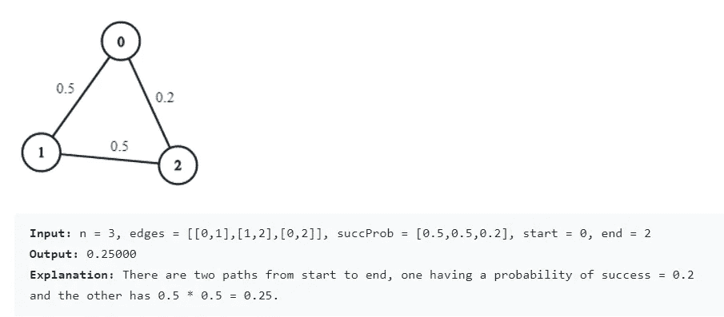*

***解决方案:***

```
*class Solution(object):
    def maxProbability(self, n, edges, succProb, start, end):
        """
        :type n: int
        :type edges: List[List[int]]
        :type succProb: List[float]
        :type start: int
        :type end: int
        :rtype: float
        """
        graph = [{} for i in range(n)]
        for i in range(len(edges)):
            i, j = edges.pop()
            graph[i][j] = graph[j][i] = succProb.pop()

        queue = [(-1, start)]
        visited = set()

        while queue:
            p, i = heappop(queue)

            if i == end:
                return -p

            if i not in visited:
                visited.add(i)

            for j, q in graph[i].items():
                if j not in visited:
                    heappush(queue, (p*q, j))

        return 0.0*
```

## *你能到达的最远的建筑*

*给你一个表示建筑物高度的整数数组`heights`，有的`bricks`，有的`ladders`。*

*你通过建造`0`开始你的旅程，并通过使用砖块或梯子移动到下一个建筑。*

*当从建筑`i`移动到建筑`i+1`(**0-索引**)时，*

*   *如果当前建筑的高度大于或等于下一个建筑的高度，你不需要梯子或砖块。*
*   *如果当前建筑的高度比下一个建筑的高度低，你可以使用一个梯子或者砖块。*

**返回你能到达的最远的建筑指数(0-指数),如果你最佳地使用给定的梯子和砖块。**

*示例:*

```
***Input:** heights = [4,2,7,6,9,14,12], bricks = 5, ladders = 1
**Output:** 4
**Explanation:** Starting at building 0, you can follow these steps:
- Go to building 1 without using ladders nor bricks since 4 >= 2.
- Go to building 2 using 5 bricks. You must use either bricks or ladders because 2 < 7.
- Go to building 3 without using ladders nor bricks since 7 >= 6.
- Go to building 4 using your only ladder. You must use either bricks or ladders because 6 < 9.
It is impossible to go beyond building 4 because you do not have any more bricks or ladders.*
```

***解决方案:***

```
*class Solution(object):
    def furthestBuilding(self, heights, bricks, ladders):
        """
        :type heights: List[int]
        :type bricks: int
        :type ladders: int
        :rtype: int
        """
        laddersUsed = []for i in range(len(heights) - 1):
            diff = heights[i + 1] - heights[i]
            if diff <= 0:
                continue

            heapq.heappush(laddersUsed, diff)
            if ladders:
                ladders -= 1
                continue

            bricks -= heapq.heappop(laddersUsed)
            if bricks < 0:
                return i

        return len(heights) - 1*
```

## *K 次增量后的最大乘积*

*给你一个非负整数数组`nums`和一个整数`k`。在一次操作中，你可以从`nums`中选择**任何一个**元素，**用`1`将**递增。*

*返回****最大值*** ***乘积****`nums`****后最多*** `k` *运算。*既然答案可能很大，那就返回吧**模** `109 + 7`。请注意，您应该在取模之前将乘积最大化。****

**示例:**

```
****Input:** nums = [0,4], k = 5
**Output:** 20
**Explanation:** Increment the first number 5 times.
Now nums = [5, 4], with a product of 5 * 4 = 20.
It can be shown that 20 is maximum product possible, so we return 20.
Note that there may be other ways to increment nums to have the maximum product.**
```

****解决方案:****

```
**import heapqclass Solution(object):
    def maximumProduct(self, nums, k):
        """
        :type nums: List[int]
        :type k: int
        :rtype: int
        """
        heapq.heapify(nums)

        for _ in range(k):
            item = heapq.heappop(nums)
            heapq.heappush(nums,  item + 1)

        product = 1
        mod = 10 ** 9 + 7

        for num in nums:
            product  = (product * num) % mod

        return product**
```

## **到达拐角所需的最小障碍移除**

**给你一个大小为`m x n`的 **0 索引的** 2D 整数数组`grid`。每个单元格有两个值之一:**

*   **`0`代表一个**空的**单元格，**
*   **`1`表示一个**障碍物**可以被移除。**

**您可以在空单元格之间上下左右移动。**

**返回****最小*** *数量* ***障碍*** *到* ***去掉*** *这样就可以从左上角的* `(0, 0)`移动到右下角的 `(m - 1, n - 1)`。***

**示例:**

```
****Input:** grid = [[0,1,1],[1,1,0],[1,1,0]]
**Output:** 2
**Explanation:** We can remove the obstacles at (0, 1) and (0, 2) to create a path from (0, 0) to (2, 2).
It can be shown that we need to remove at least 2 obstacles, so we return 2.
Note that there may be other ways to remove 2 obstacles to create a path.**
```

****解决方案:****

```
**class Solution(object):
    def minimumObstacles(self, grid):
        """
        :type grid: List[List[int]]
        :rtype: int
        """
        m, n = len(grid), len(grid[0])
        # minimum removed obstacles table
        dp = [[float('inf') for _ in range(n)] for _ in range(m)]
        dp[0][0] = grid[0][0]

        # removed obstacles count, i, j
        heap = [(0, 0, 0)]

        while heap:
            removed, i, j = heappop(heap)
            if i == m-1 and j == n-1:
                return removed

            for ii, jj in [(i, j+1), (i+1, j), (i, j-1), (i-1, j)]:
                if (0 <= ii < m and 0 <= jj < n) and grid[ii][jj] + removed < dp[ii][jj]:
                    dp[ii][jj] = grid[ii][jj] + removed
                    heappush(heap, (dp[ii][jj], ii, jj))
        return dp[-1][-1]**
```

## **合并 k 个排序列表**

**给你一个`k`链表`lists`的数组，每个链表按升序排序。**

***将所有链表合并成一个排序后的链表并返回。***

****例 1:****

```
****Input:** lists = [[1,4,5],[1,3,4],[2,6]]
**Output:** [1,1,2,3,4,4,5,6]
**Explanation:** The linked-lists are:
[
  1->4->5,
  1->3->4,
  2->6
]
merging them into one sorted list:
1->1->2->3->4->4->5->6**
```

****解决方案****

```
**import heapq# Definition for singly-linked list.
# class ListNode(object):
#     def __init__(self, val=0, next=None):
#         self.val = val
#         self.next = next
class Solution(object):
    def mergeKLists(self, lists):
        """
        :type lists: List[ListNode]
        :rtype: ListNode
        """
        heap = []

        for item in lists:
            while item:
                heapq.heappush(heap, item.val)
                item = item.next

        result = None
        head = None

        while heap:
            item = heapq.heappop(heap)
            if not result:
                result = ListNode(item)
                head = result
            else:
                result.next = ListNode(item)
                result = result.next

        return head**
```

## **滑动窗口最大值**

**给你一个整数数组`nums`，有一个大小为`k`的滑动窗口，它从数组的最左边移动到最右边。您只能在窗口中看到`k`数字。每次滑动窗口向右移动一个位置。**

**返回*最大滑动窗口*。**

****例 1:****

```
****Input:** nums = [1,3,-1,-3,5,3,6,7], k = 3
**Output:** [3,3,5,5,6,7]
**Explanation:** 
Window position                Max
---------------               -----
[1  3  -1] -3  5  3  6  7       **3**
 1 [3  -1  -3] 5  3  6  7       **3**
 1  3 [-1  -3  5] 3  6  7      ** 5**
 1  3  -1 [-3  5  3] 6  7       **5**
 1  3  -1  -3 [5  3  6] 7       **6**
 1  3  -1  -3  5 [3  6  7]      **7****
```

****解决方案****

```
**class Solution(object):
    def maxSlidingWindow(self, nums, k):
        """
        :type nums: List[int]
        :type k: int
        :rtype: List[int]
        """
        maxHeap = [];
        windowStart = 0;
        result = [];
        n = len(nums)

        for i in range(n):
            heapq.heappush(maxHeap, (-nums[i], i));

            if i - windowStart + 1 > k:
                while len(maxHeap) > 0 and maxHeap[0][1] <= windowStart:
                    heapq.heappop(maxHeap);
                windowStart += 1;

            if i - windowStart + 1 == k:               
                result.append(-maxHeap[0][0]);

        return result;**
```

## **找出总和最小的 K 对**

**给你两个整数数组`nums1`和`nums2`，按**升序排列**和一个整数`k`。**

**定义一个对`(u, v)`，它由第一个数组中的一个元素和第二个数组中的一个元素组成。**

**返回*和*最小的 `k` *对* `(u1, v1), (u2, v2), ..., (uk, vk)` *。***

****例 1:****

```
****Input:** nums1 = [1,7,11], nums2 = [2,4,6], k = 3
**Output:** [[1,2],[1,4],[1,6]]
**Explanation:** The first 3 pairs are returned from the sequence: [1,2],[1,4],[1,6],[7,2],[7,4],[11,2],[7,6],[11,4],[11,6]**
```

****解决方案****

```
**import heapqclass Solution(object):
    def kSmallestPairs(self, nums1, nums2, k):
        """
        :type nums1: List[int]
        :type nums2: List[int]
        :type k: int
        :rtype: List[List[int]]
        """
        n1 = len(nums1)
        n2 = len(nums2)
        maxHeap = []

        for i in range(0, min(k, n1)):
            for j in range(0, min(k, n2)):
                total = nums1[i] + nums2[j]

                if len(maxHeap) < k:
                    heapq.heappush(maxHeap, [-total, nums1[i], nums2[j]])
                else:
                    if total > -maxHeap[0][0]:
                        break

                    heapq.heappush(maxHeap, [-total, nums1[i], nums2[j]])

                    heapq.heappop(maxHeap)

        result = []
        while maxHeap:
            popped = heapq.heappop(maxHeap)
            result.append([popped[1], popped[2]])

        return result**
```

## **矩阵中 K 个最弱的行**

**你会得到一个由`1`(代表士兵)和`0`(代表平民)组成的`m x n`二元矩阵`mat`。士兵被安置在平民的前面。也就是说，所有的`1`将出现在每行所有`0`的左侧的**处。****

**如果下列情况之一成立，则行`i`比行`j`弱**:****

*   **第`i`行的士兵数量少于第`j`行的士兵数量。**
*   **两排士兵人数相同，且`i < j`。**

**返回*矩阵中* `k` ***最弱*** *行的索引，从最弱到最强*。**

****例一:****

```
****Input:** mat = 
[[1,1,0,0,0],
 [1,1,1,1,0],
 [1,0,0,0,0],
 [1,1,0,0,0],
 [1,1,1,1,1]], 
k = 3
**Output:** [2,0,3]**
```

****解决方案****

```
**class Solution(object):
    def kWeakestRows(self, mat, k):
        """
        :type mat: List[List[int]]
        :type k: int
        :rtype: List[int]
        """
        hashMap = {}

        for i in range(len(mat)):
            hashMap[i] = mat[i].count(1)

        minHeap = []

        for rowId, num in hashMap.items():
            heapq.heappush(minHeap, (num, rowId))

        lst = []
        while k > 0:
            popped = heapq.heappop(minHeap)
            lst.append(popped[1])
            k -= 1

        return lst**
```

## **对角线导线 II**

**给定一个 2D 整数数组`nums`，按对角线顺序返回 `nums` *的所有元素*，如下图* .3 所示***

*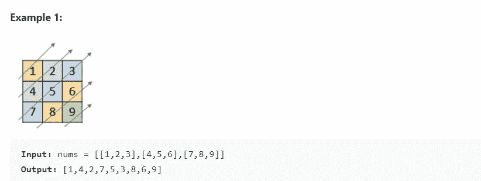*

***解决方案***

```
*class Solution(object):
    def findDiagonalOrder(self, nums):
        """
        :type nums: List[List[int]]
        :rtype: List[int]
        """
        heap = []

        for i in range(len(nums)):
            for j in range(len(nums[i])):
                heapq.heappush(heap, [i+j, j, i])

        result = []

        while len(heap) > 0:
            popped = heapq.heappop(heap)
            result.append(nums[popped[2]][popped[1]])

        return result*
```

## *优先级分配*

*人力资源管理员创建了一个队列，列出了所有当前的合规性问题及其优先级。优先级范围从 1 到 99。创建一个重新分配优先级的算法，使分配的最大优先级值最小化，同时保持所有问题之间的优先级顺序相同。*

***例**
优先级= [1，4，8，4]*

***输出**:
【1，2，3，2】*

***解决方案***

```
*# Prioritiespriorities = [1, 3, 7, 3]def getPriorities(priorities):
    n = len(priorities)
    heap = []

    for i in range(n):
        heapq.heappush(heap, (priorities[i], i))

    priority = 0
    prevNumber = 0

    while len(heap) > 0:
        popped = heapq.heappop(heap)

        if prevNumber != popped[0]:
            priority += 1
            prevNumber = popped[0]

        priorities[popped[1]] = priority

    return priorities

if __name__ == '__main__':
    result = getPriorities(priorities)
    print(result)*
```

## *结论*

*在开始解决任何问题陈述之前，理解和识别数据结构和算法的模式是非常重要的。模式识别使解决方案变得简单。最小堆或最大堆或优先级队列也是一个棘手的概念。*