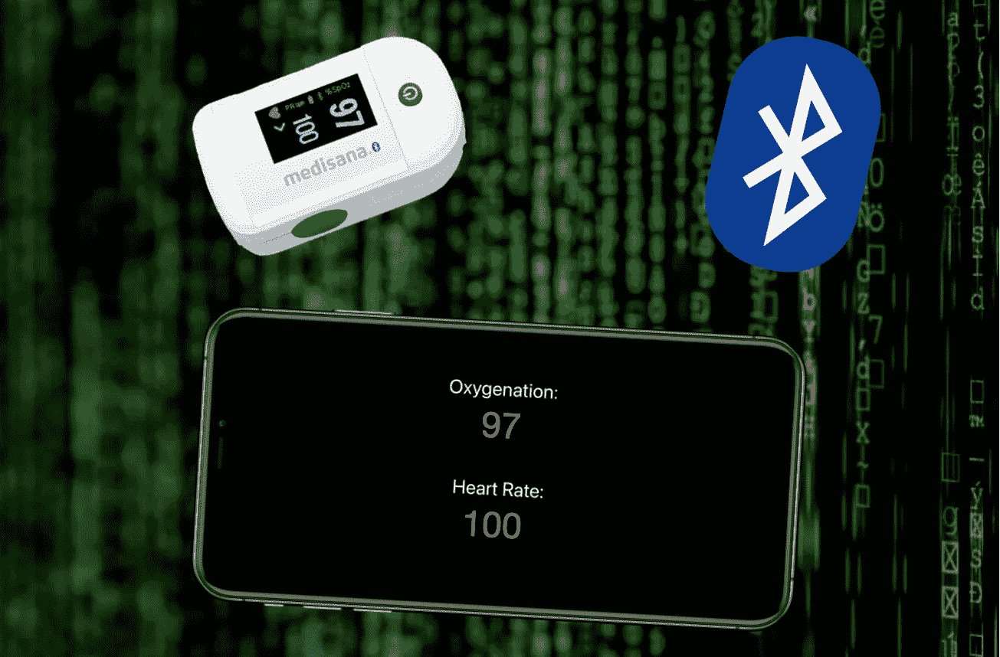
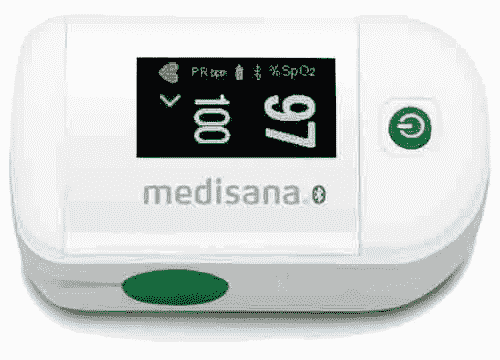
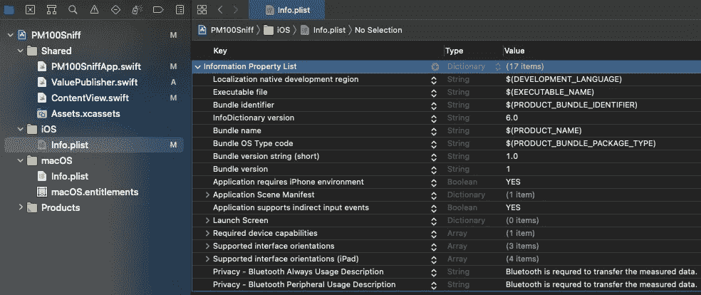
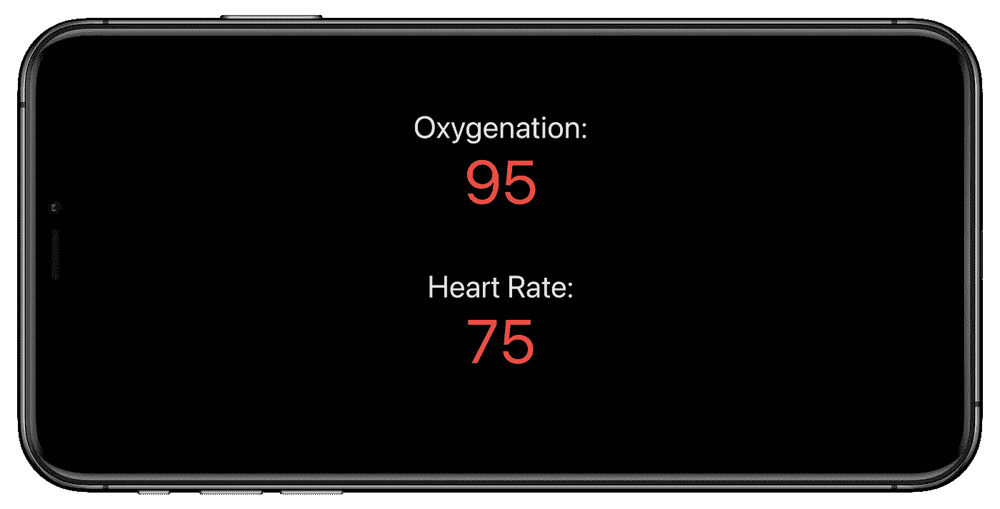

# Swift 中的心率监测器和血氧计

> 原文：<https://itnext.io/heart-rate-monitor-and-blood-oximeter-in-swift-a359a16d94f0?source=collection_archive---------4----------------------->

## 核心蓝牙简介



本教程将以心率和血氧监测仪为例，介绍如何从蓝牙低能耗设备中获取数据。

对于本教程，我使用:

*   Medisana PM100 连接
*   iPhone 11 Pro Max
*   iOS 14.4
*   MacBook Pro，13 英寸，2016 年
*   2 月 11 日，马科斯大苏尔
*   XCode 12.4

虽然本教程是关于一个特定的 BLE 设备，它应该很容易适应任何其他 BLE 设备。



Medisana PM100 连接

[**完整的项目代码可以从这里下载**](https://www.buymeacoffee.com/twissmueller/e/49487) **。**

## 介绍

很长一段时间以来，我一直在寻找一款可以通过蓝牙连接到智能手机的经济型心率监测器和血氧计。

最后运气好，找到了 Medisana 的[“pm 100 Connect”。](https://www.medisana.com/en/Health-control/Pulsoximeter/PM-100-connect-Pulse-oximeter.html?force_sid=bpi0b7tpenm3flllv90g1452r5)

该公司声称，他们有一个名为“VitaDock”的应用程序，可以捕捉并显示设备中的数据。

长话短说，我无法让设备与这个应用程序一起工作。在阅读亚马逊上的评论时，我发现我不是唯一一个在让它工作时遇到问题的人。

当我想到这是一个了解苹果公司[“核心蓝牙”框架](https://developer.apple.com/documentation/corebluetoothhttps://developer.apple.com/documentation/corebluetooth)并了解蓝牙低能耗设备如何工作的绝佳机会时，我已经受够了，并接近归还它。

是时候开始编码了，让双手变脏，或者提高心率，在本教程的最后，可以用后面的代码来测量。

## 先决条件

为了允许设备使用蓝牙，需要在`Info.plist`中设置两个键。

*   `Privacy - Bluetooth Always Usage Description`
*   `Privacy - Bluetooth Peripheral Usage Description`



信息列表

## 中央管理器和外围设备

本教程的切入点是`[CBCentralManager](https://developer.apple.com/documentation/corebluetooth/cbcentralmanager)`，它是“一个扫描、发现、连接和管理外围设备的对象。

让我们创建一个并连接它。

```
var centralManager: CBCentralManager?
centralManager = CBCentralManager(delegate: self, queue: nil)
```

在实例化时，需要提供将充当委托的对象。

这个委托必须实现`centralManagerDidUpdateState(_ central: CBCentralManager)`，这样就可以检查应用程序运行的设备是否支持蓝牙。

```
func centralManagerDidUpdateState(_ central: CBCentralManager) {
    guard central.state == .poweredOn else {
        logger.debug("No Bluetooth available")
    return
    }
    central.scanForPeripherals(withServices: nil, options: nil)
}
```

当蓝牙可用时，应用程序将扫描其附近的外围设备。

需要实现另一个委托方法，以便检查哪些外设可用。

```
func centralManager(_ central: CBCentralManager, didDiscover peripheral: CBPeripheral, advertisementData: [String : Any], rssi RSSI: NSNumber) {
    logger.debug("Found peripheral: \(peripheral.description)")
}
```

打开 PM100 运行它，我很快发现它的名字是“电子血氧仪”。

让我们连接到它。

```
centralManager?.connect(peripheral, options: nil)
```

如果连接已经建立，将在此委托方法中接收。

```
func centralManager(_ central: CBCentralManager, didConnect peripheral: CBPeripheral) {
    logger.debug("Connected to peripheral: \(peripheral.description)")
}
```

搞定了。我们已成功连接到 PM100 或您可能在本教程中使用的任何其他设备。在下一步中，我们将介绍实际发现设备能够发送的所有数据所需的所有步骤。

## 服务和特点

要了解蓝牙设备(外设)能提供什么，我们需要首先发现它的服务:

```
peripheral.discoverServices(nil)
```

在文档中，我们需要寻找`[CBService](https://developer.apple.com/documentation/corebluetooth/cbservice)`。服务被描述为

> "完成设备功能或特性的数据和相关行为的集合."

需要实现一个`CBPeripheralDelegate`的委托方法，在发现服务时调用该方法。

```
func peripheral(_ peripheral: CBPeripheral, didDiscoverServices error: Error?) {
    peripheral.services?.forEach { service in
        logger.debug("Discovered service: \(service.description)")        
    }
}
```

PM100 有四种服务:

```
Discovered service: <CBService: 0x2816b8700, isPrimary = YES, UUID = Device Information>
Discovered service: <CBService: 0x2816b82c0, isPrimary = YES, UUID = Battery>
Discovered service: <CBService: 0x2816b84c0, isPrimary = YES, UUID = 1822>
Discovered service: <CBService: 0x2816b8300, isPrimary = YES, UUID = 0000FEE8-0000-1000-8000-00805F9B34FB>
```

对于每项服务，我们都能发现所谓的特征:

```
peripheral.discoverCharacteristics(nil, for: service)
```

我们非常接近用`[CBCharacteristic](https://developer.apple.com/documentation/corebluetooth/cbcharacteristic)`检索心率和氧合数据。让我们再次查阅文档:

> " CBCharacteristic 及其子类 CBMutableCharacteristic 代表关于外围设备服务的进一步信息。特别是，CBCharacteristic 对象表示远程外围设备服务的特征。特征包含单个值和描述该值的任意数量的描述符。特性的属性决定了如何使用特性的值，以及如何访问描述符。”

同样，我们需要实现一个委托方法来检索所有发现的特征:

```
func peripheral(_ peripheral: CBPeripheral, didDiscoverCharacteristicsFor service: CBService, error: Error?) {
    service.characteristics?.forEach { characteristic in
        logger.debug("Discovered characteristic: \(characteristic.description) for service \(service.uuid)")
      }
}
```

现在，需要在[蓝牙规范](https://www.bluetooth.com)中进行一些挖掘，找出我们想要的服务`1822`的特性`2A5F`的值。你也可以谷歌一下。-).

我们希望在设备发出心率和血氧数据时得到通知。因此我们需要调用以下内容:

```
if (characteristic.uuid == CBUUID(string: "2A5F")) {
    peripheral.setNotifyValue(true, for: characteristic)
}
```

最后，我们可以通过实现最后一个委托方法来检索值:

```
func peripheral(_ peripheral: CBPeripheral, didUpdateValueFor characteristic: CBCharacteristic, error: Error?) { 
    guard characteristic.service.uuid == CBUUID(string: "1822"),
              characteristic.uuid == CBUUID(string: "2A5F"),
              let data = characteristic.value else {
            return
    }

    let numberOfBytes = data.count
    var byteArray = [UInt8](repeating: 0, count: numberOfBytes)
    (data as NSData).getBytes(&byteArray, length: numberOfBytes)

    logger.debug("Data: \(byteArray)")
}
```

通过将`byteArray`的值与我的 PM100 的显示值进行比较，很容易发现哪个值是心率值，哪个值是氧合值:

```
let oxygenation = byteArray[1]
let heartRate = byteArray[3]
```

我们完了！因此，无论您对什么样的蓝牙设备感兴趣，发现其服务和特性的方法应该总是相同的。

事实上，我们还没有完成，还…

## 示例应用程序

您可以下载一个完整的 Xcode-workspace 来构建功能齐全的心率监测 iOS 应用程序，而无需编写任何代码。

[**完整的项目代码可以从这里下载**](https://www.buymeacoffee.com/twissmueller/e/49487) **。**



感谢阅读，感谢支持！

*   如果你喜欢这个，请[在 Medium](https://twissmueller.medium.com/) 上跟随我
*   给我买杯咖啡让我继续前进
*   支持我和其他媒体作者，在此[报名](https://twissmueller.medium.com/membership)

[](https://twissmueller.medium.com/membership) [## 通过我的推荐链接加入媒体

### 作为一个媒体会员，你的会员费的一部分会给你阅读的作家，你可以完全接触到每一个故事…

twissmueller.medium.com](https://twissmueller.medium.com/membership) 

## 资源

*   [核心蓝牙框架](https://developer.apple.com/documentation/corebluetooth)
*   [核心蓝牙编程指南](https://developer.apple.com/library/archive/documentation/NetworkingInternetWeb/Conceptual/CoreBluetooth_concepts/AboutCoreBluetooth/Introduction.html#//apple_ref/doc/uid/TP40013257-CH1-SW1)
*   [核心蓝牙和 BLE](https://gist.github.com/brayden-morris-303/09a738ed9c83a7d14c82)
*   [如何使用 CoreBluetooth 从 1822 PulseOximeter 的蓝牙 LE 数据中提取 SFLOAT 值](https://stackoverflow.com/q/51249335/1065468)