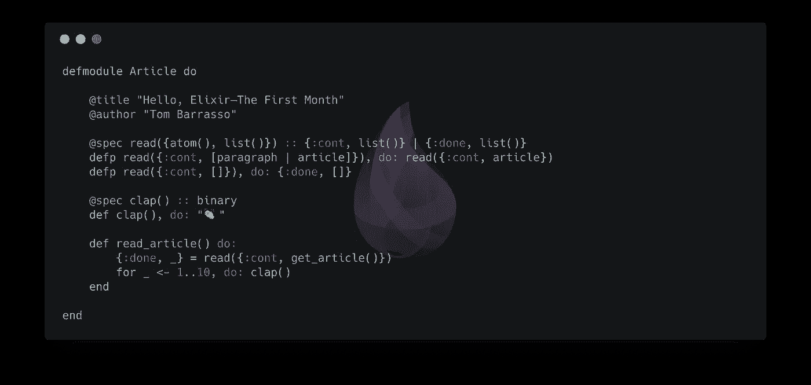

# 你好，长生不老药——第一个月

> 原文：<https://itnext.io/hello-elixir-the-first-month-d24255860b?source=collection_archive---------0----------------------->

# TL；博士——我已经用了一个月的灵药，基本上很喜欢

[Elixir](https://elixir-lang.org/) 是一种基于 [Erlang/OTP](http://www.erlang.org/) 和[快速增长社区](https://redmonk.com/sogrady/2018/03/07/language-rankings-1-18/)的函数式编程语言。它拥有令人印象深刻的功能集:可伸缩性、容错、热插拔代码和开箱即用的轻松并发。

在用 Java 和 Javascript 构建了许多应用程序之后，Elixir 中数据的功能性质和强制不变性要求对程序结构采用稍微不同的方法。然而，语言的简单性、文档的彻底性和代码的可读性显著地缩短了学习曲线。

# 介绍

我从萨莎·尤里奇的书[开始了长生不老药之旅。除了阅读，我还加入了](https://www.manning.com/books/elixir-in-action)[exercisem](https://exercism.io/tracks/elixir)的 Elixir track(一个免费的在线平台，有数千个指导的编码挑战)。

我最惊讶的是语言的表现力。将我对 Elixir 中的[罗马数字问题的递归解决方案与 Javascript](https://exercism.io/tracks/elixir/exercises/roman-numerals/solutions/6d1f1fbafdf041e6b3f5740e215b478d) 中的[类似解决方案进行对比。那是在我发现](https://stackoverflow.com/questions/9083037/convert-a-number-into-a-roman-numeral-in-javascript)[单行函数声明](https://elixir-lang.org/getting-started/modules-and-functions.html)之前，而且与许多面向对象语言中的类似解决方案相比，Elixir 代码显然更具可读性。

# 熟悉的

奇怪的是，这种语言让人感觉很熟悉。Elixir 采用了许多常见的范例，通常还进行了额外的改进。

**管道操作员**

以方法链接为例，在 Javascript 中可能是这样的:

可以使用 Elixir 中的[管道操作符](https://elixirschool.com/en/lessons/basics/pipe-operator/)编写相同的代码:

它甚至可以内联:

然而，使用管道运算符的两个示例似乎都比:

**管道操作符接受一个表达式的结果，并将它(作为第一个参数)传递给下一个表达式**。这将生成在视觉上近似于英语阅读方式的代码:从左到右。

**守卫**

守卫是另一个受欢迎的语言特征。**守卫评估布尔表达式以确定调用哪个函数声明**。尽管它们在很大程度上是语法糖，但在像 Elixir 这样的注重递归的语言中，它们有助于阐明分支模式。

以 Javascript 中的斐波那契数列为例:

可以用药剂中的守卫来写:

在这两个例子中，基本情况都有定义，但在酏剂中更明确。另一个用例是[方法重载](https://beginnersbook.com/2013/05/method-overloading/):

`Greet.hey`可以接受一个原子(即`Greet.hey(:Joe)`)或一个二进制(即`Greet.hey("Joe")`)，这使得 API 更加方便。也可以独立处理每种情况。

**注释**

从技术上讲[模块属性](https://medium.com/@cowen/annotations-in-elixir-450015ecdd97)，Elixir 提供了一种在编译时声明信息的机制。最突出的用法是[类型规格](https://elixir-lang.org/getting-started/typespecs-and-behaviours.html)。

Elixir 是动态类型的，但是使用像[透析器](http://www.erlang.org/doc/man/dialyzer.html)这样的工具，你可以执行静态代码分析。就[元编程](https://elixir-lang.org/getting-started/meta/domain-specific-languages.html#storing-information-with-attributes)而言，模块属性与 Java 中的[注释具有相似的可访问性。](https://en.wikipedia.org/wiki/Java_annotation)

据说 **Elixir 是几个函数加上一些胶水**，这与事件驱动开发并没有很大的偏差。如果 Javascript 有这些特性，它可能有助于逃离回调地狱。

# 不太熟悉的

learning Elixir 更具挑战性的方面是模式匹配、递归和列表操作。

**模式匹配**

模式匹配非常强大，因为除了递归，它[最小化了临时变量赋值和嵌套条件的使用](https://www.reddit.com/r/elixir/comments/34jyto/what_are_the_benefits_of_pattern_matching_as/)。虽然它看起来像任务，但它更复杂，也更有能力。

在某些方面，它类似于 ES6 中的[析构](https://developer.mozilla.org/en-US/docs/Web/JavaScript/Reference/Operators/Destructuring_assignment)，在那里你解包一个对象或数组，并将感兴趣的部分赋给局部变量。

> 模式匹配非常适合递归，递归允许您轻松地将转换分解成一系列步骤。— [ABC_AlwaysBeCoding](https://www.reddit.com/user/ABC_AlwaysBeCoding)

**兰姆达斯**

Elixir 的另一个有趣特性是无需显式定义参数就能编写 lambdas。比较 Javascript 的箭头函数:

在酏剂中具有功能:

或者用[捕捉操作符](https://dockyard.com/blog/2016/08/05/understand-capture-operator-in-elixir):

虽然 capture 操作符似乎与清晰的焦点相反，但如果仅限于简单的用例，它确实提供了一种受欢迎的简洁形式。

# 结论

当其他人对面向对象编程说再见的时候，我还没有准备好放弃像 Java 或 Javascript 这样的语言。这两种语言都有大量的库和框架，这些库和框架对它们进行了改编和扩展，以适应从移动开发到分布式 web 服务的各种环境。但是，一般来说，函数式编程也有缺点，特别是对于 Elixir，我希望在另一篇文章中分享。

尽管如此，我对学习长生不老药如此容易感到高兴，至少达到了基本熟练的程度。我希望很快能有机会使用开源工具如[凤凰](https://phoenixframework.org/)、[酒厂](https://github.com/bitwalker/distillery)和[苦艾酒](https://github.com/absinthe-graphql/absinthe)从事网络服务工作。

**跟随**`|>`[**LinkedIn**](https://www.linkedin.com/in/tombarrasso/)`|>`[**GitHub**](https://github.com/Tombarr)`|>`[**中型**](https://medium.com/@tbarrasso)