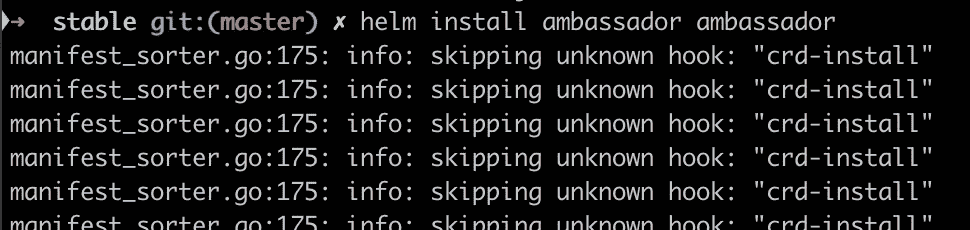
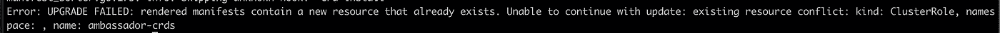
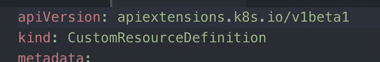
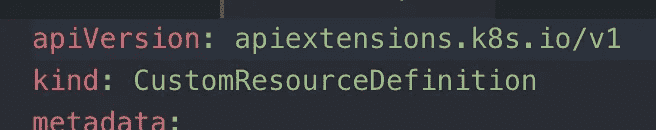

# 现实生活中的舵手 3(下)

> 原文：<https://itnext.io/helm-3-in-real-life-dfdc1522dd04?source=collection_archive---------3----------------------->

凯文·Ku 在 [Unsplash](https://unsplash.com?utm_source=medium&utm_medium=referral) 上的照片

几周前，我写了一篇关于 Helm2 和 Helm3 之间变化的文章:

 [## Helm2 与 Helm3(第一部分)

### 所以 Helm3 终于发布了。每个人都在和蒂勒说再见，但这并不是《头盔 3》的唯一变化。让我们…

itnext.io](/helm2-vs-helm3-part-1-c76c29106e99) 

从那以后，我一直使用 Helm3 进行私有测试和客户端测试。所以我又来了——准备和你分享一些你在使用 Helm3 时会遇到的问题。

# 您需要做出的更改:

**重写你所有的 CI/CD 管道**。有一些变化需要您重写所有的 CI/CD 管道。我在上一篇文章中已经列出了它们(删除 helm init，需要指定名称，需要存在名称空间，等等)，但是我需要在这里再次指出，因为这是迄今为止大多数公司面临的最大问题。查看杰克·莫里斯的一篇关于这个的文章:

 [## 头盔 3 的突破性变化(以及如何修复它们)

### 最近我很幸运地测试了从头盔 2 到头盔 3 的迁移。头盔 3 是一个主要版本，解决了许多…

itnext.io](/breaking-changes-in-helm-3-and-how-to-fix-them-39fea23e06ff) 

管道可能会非常复杂，找到所有必要的掌舵零件的变化可能会比你想象的更棘手。因此，请仔细检查您是否删除了所有 helm inits，是否在安装 helm3 图表之前创建了名称空间，是否提供了名称(或使用— generate-name)等。我见过一些情况，大多数使用的管道被适当地改变了，但是那些不经常使用的管道(例如回滚管道)却没有。这是一个危险的情况，因为你可能已经对 Helm3 充满信心，然后当你决定转向生产时，它会打击你。

# 您可能面临的问题:

**CRD 安装—它失败了，但它没有**

安装包含 CRD 的舵图时，您可能会看到以下错误:

别慌！这实际上是一个假错误，它们已被正确安装:

您会看到这个错误，因为 Helm 3 不赞成使用 crd 的钩子，现在有了一个策略，它们应该在 CRD 目录中。但是它还是安装了它们；)更多信息请点击此处:

 [## 图表挂钩

### Helm 提供了一种挂钩机制，允许图表开发人员在某个版本的生命周期中的某些点进行干预。对于…

v3.helm.sh](https://v3.helm.sh/docs/topics/charts_hooks/) 

**“升级失败:呈现的清单包含一个已经存在的新资源”**

另一个讨厌的问题。当你尝试运行“头盔升级”时，有时可能会发生这种情况。但是你可能想知道…等等…三路合并补丁(升级时考虑实时状态)不是头盔 3 的关键特性之一吗？那么为什么我的升级会因为“资源已经存在”而失败呢？？？这个特殊的问题有点复杂，不幸的是，错误消息没有正确解释这里发生了什么。您看，只有当您更改资源的“apiVersion ”,然后尝试升级它时，才会出现这个问题。如果你想改变其他任何东西(元数据，规范)，那么它会像预期的那样工作得很好。但是如果你改变这个:

对此:

…那么它将失败，因为 kubernetes 将 apiVersion 更改视为重大更改，并且不允许像这样更改它。这需要一些地下逻辑来实现，但赫尔姆 3 没有实现([但](https://github.com/helm/helm/issues/6850))。有一个解决方法——您可以手动升级特定资源(通过 kubectl ),然后删除特定图表的 Helm secret。或者只是在 Helm 修复问题之前不要升级 apiVersion)