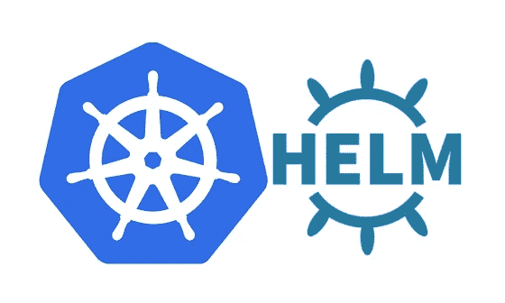

# 掌舵 3 —秘密管理，一种替代方法

> 原文：<https://itnext.io/helm-3-secrets-management-4f23041f05c3?source=collection_archive---------0----------------------->



在 Kubernetes 中有许多管理秘密的方法，有些方法比其他方法简单，但当我在工作中为我的项目研究这个主题时，我发现许多这些方法都有缺点。当在任何现代软件系统中管理你的秘密时，你需要考虑许多重要的方面。对我的项目来说，这些是最重要的:

1.  所有的秘密都必须存储在版本控制中。对于任何基于 Helm 的部署来说，这都是一个至关重要的方面，在我看来，如果您的任何管道步骤涉及手动干预，即填充机密，您将有效地削弱自动化 CD 管道的优势。
2.  **所有打包的舵图必须加密。**为您的项目将您的图表发布到图表博物馆时，重要的是不要公开存储任何秘密。这意味着在你打包图表并把它放进图表博物馆之前，秘密必须被加密。相反，机密应该只在安装/升级阶段的运行时解密。
3.  **统治他们的工具——头盔！**对我来说，另一个更私人的要求是只依靠 Helm。以[掌舵秘笈](https://github.com/jkroepke/helm-secrets)为例；非 CNCF 项目往往会在一段时间后被扔进垃圾堆，或者转向不同的方向。当核心软件升级出现不兼容时，依赖小的边缘工具又回来咬我，让你陷入困境。

# 探索现有工具

在开始构建任何自己的工具或脚本之前，了解已经存在的东西是很重要的。对于基于头盔的 Kubernetes 装置，有多种选择:

## **掌舵秘笈**

[这是赫尔姆](https://github.com/jkroepke/helm-secrets)最知名的秘密管理工具之一。简而言之，这个工具加密 Helm 中的特定值文件。任何以前缀“secrets”开头的值文件在签入 Git 之前都会被完全加密。

缺点:

*   这个工具有一个主要缺点；即多值文件。这个工具允许你在安装/升级头盔时使用一个包装器，比如“头盔秘密升级”。主要问题是 Helm 目前不支持打包图表中的多个值文件。如果程序包图表中有多个值文件，首先需要提取该图表，然后通过命令行传递多个值。这不优雅。
*   通过将所有秘密限制在它自己的文件中，您失去了值文件的可读性。如果您有多组设置(就像我的项目一样)，将秘密移动到它们自己的文件中会导致可读性的损失，最终导致维护的损失。我不得不承认，这很可能是一种个人偏好，让事情保持在一起。

## 哈希公司金库

Hashicorp 的 Vault 可能是与 Kubernetes 合作时最常见的秘密管理解决方案之一。我不打算详细介绍 Vault 能做什么，但对我来说，Kubernetes 集群中的 Vault 面临着先有鸡还是先有蛋的问题…

缺点:

*   也就是说，什么填充了 Vault？如果手动这样做，就无法将机密管理集成到 CI/CD 管道中。自动化不是我决定研究的东西，因为从 Helm 集成到 Vault 的本地工具不存在，所以必须找到一个定制的解决方案。
*   需要安装一个 Vault 实例。从表面上看，这当然不是问题，但是如果您只有少量的秘密，那么设置一个需要在启动时自动解封的 Vault 实例可能是一个相当棘手的解决方案。

# 自定义解决方案

鉴于上述解决方案的一些局限性，我决定更深入地研究本机 Helm 功能中内置的加密/解密选项。谢天谢地，Helm 有两个方便的[内置函数](https://helm.sh/docs/chart_template_guide/function_list/#cryptographic-and-security-functions)。这些功能，加密和解密，允许在 Helm 的秘密管理。综上所述，我提出的解决方案借用了[掌舵秘笈](https://github.com/jkroepke/helm-secrets)中的一些概念，如下所示:

## 1.舵图

首先，我开始写一个小的舵图，它包含三个可能的值，如下面的值文件中所列。这个舵图使用了一个基本的配置图，我只用于输出(我们不会使用配置图)

```
aesKey: set
valueToEncrypt: set
valueToDecrypt: set
```

配置图如下所示:

```
**apiVersion**: v1
**kind**: ConfigMap
  **name**: game-config
**data**:
  **encryptedValue**: {{ encryptAES .Values.valueToEncrypt (.Values.aesKey | b64dec)}}
  **decryptedValue**: {{ .Values.valueToDecrypt | decryptAES (.Values.aesKey | b64dec) }}
```

这个舵图满足了我的第三个要求——使用本地工具。使用 Helm 加密/解密机密的另一个原因是底层 Go 引擎对 AES 加密和解密的实现与 OpenSSL 加密的 AES 机密不兼容。换句话说，Helm 将无法解密 OpenSSL 加密的秘密。

## **2。包装脚本**

接下来，我编写了一个名为 secure.sh 的包装器脚本，它利用了上面指定的舵图。该脚本采用以下参数:

```
Options:
-e    Encrypt a Helm chart's values file
-d    Decrypt a Helm chart's values file
-c    Clean the working directory
-w    Overwrite values file with encrypted values fileFlags:
-p    The path to a Helm chart
-k    The AES key (used in both encryptions and decryption)
-x    Prefix of the key names to encrypt (defaults to "encrypted")
```

当指定 *-e* (encrypt)选项时，该脚本将在 values.yaml 文件中搜索所有以关键字“encrypted”开头的密钥。这可以用 *-x* 标志来改变。一个名为 *values.enc.yaml* 的新文件被创建，所有密钥都被加密。下面显示了一个加密执行示例:

```
secure.sh -e -p /path/to/chart -k fTjWnZr4u7x!A%D*G-KaNdRgUkXp2s5v
```

这种方法的好处是，加密的值存储在与所有其他秘密相同的 values.yaml 文件中。

要用加密值覆盖值文件，需要执行以下命令:

```
secure.sh -w -p /path/to/chart
```

解密加密图表时，会生成一个 *values.dec.yaml* 文件。可以运行以下命令来生成此文件:

```
secure.sh -d -p /path/to/chart -k fTjWnZr4u7x!A%D*G-KaNdRgUkXp2s5v
```

解密后的文件可用于解决密码问题、与其他文件进行比较等。

最后，可以使用以下命令清理临时文件:

```
secure.sh -w -p /path/to/chart
```

## 3.Git 配置

配置的倒数第二部分是确保 Git 不会意外签入任何临时文件。这可以通过将文件 *values.enc.yaml* 和 *values.dec.yaml* 添加到*来实现。gitignore 项目中的*文件。如果您忘记清理任何文件，可以肯定 Git 将跳过这些文件。

最后，如果您使用 CI/CD 管道来安装您的 Helm charts，您可以存储 AES 密钥，该密钥将加密和解密您的敏感机密作为管道机密，并将其作为命令行参数传递给管道中的包装器。如果你正在使用 Gitlab，在 Gitlab 变量中放置秘密时，一定要检查“屏蔽”选项，并确定你的团队中谁可以访问这些变量。请注意，Gitlab 中的掩码变量不能包含非 base64 编码的字符。因此，上述示例首先从 base64 解码 AES 密钥。

# 结论

我通常不提倡编写自己的工具。在大多数情况下，利用现有的工具来完成大多数事情是可能的。然而，尽管如此，这个工具解决了我们项目中的许多问题。

*   我们能够加密存储在我们的舵图中的秘密。
*   我们能够将舵图打包并上传到海图博物馆，所有的秘密都被加密。
*   我们能够将加密的秘密存储在 Git 中，而不用担心我们的秘密会以明文形式存储。
*   当我们使用一个自定义脚本时，这个脚本相当简单明了，只是简单地包装了本地/内置的 Helm 功能。

*27/04/2021 注:一旦我修复了一个小 bug 并使其更加人性化，我会把这个插件上传到 Github。*

*25/07/2021——你现在可以找到这个插件@* [克里斯-帕克-扎/赫尔姆-加密(github.com)](https://github.com/chris-parker-za/helm-encryption)