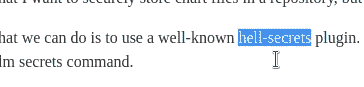
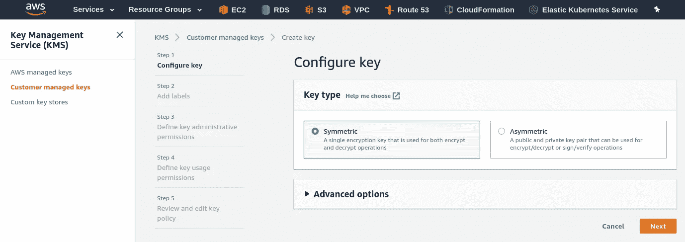
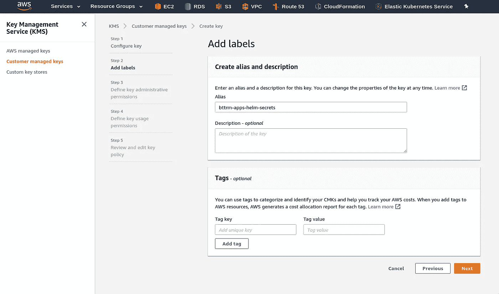
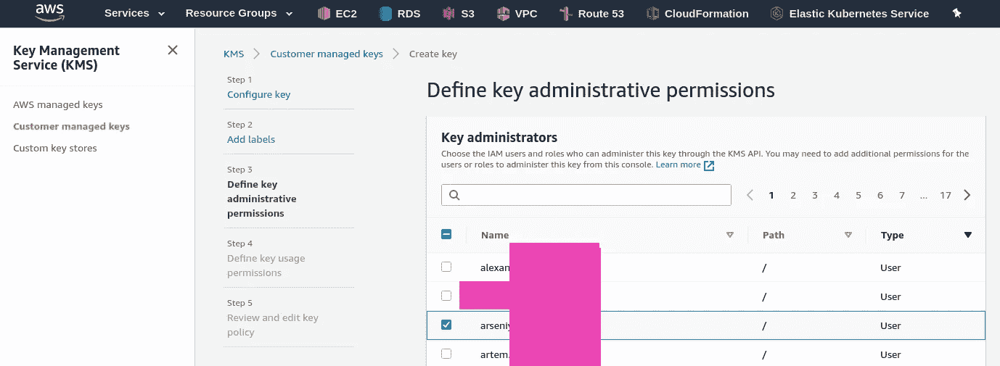
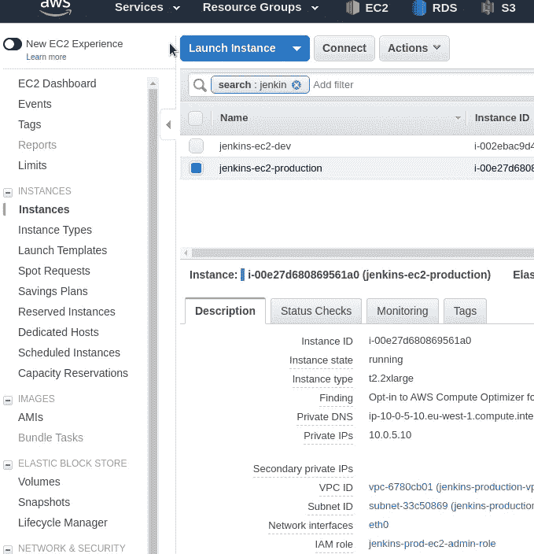
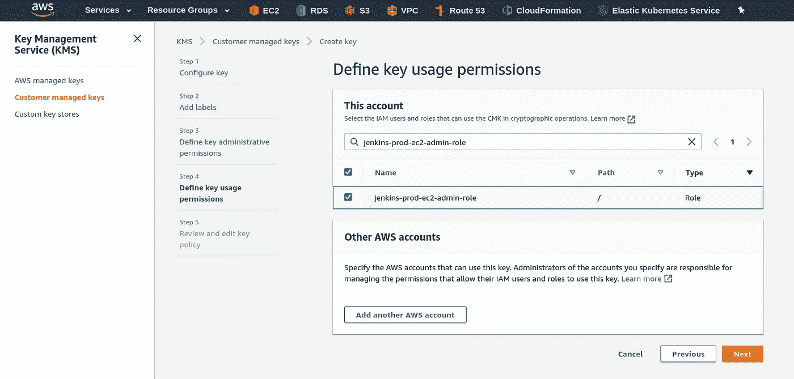
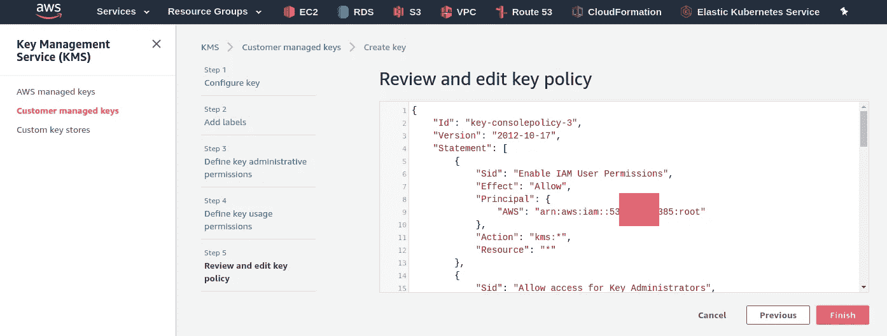
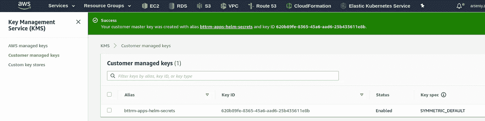
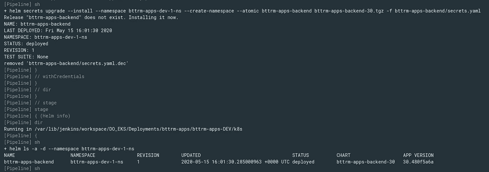

# 赫尔姆:赫尔姆-秘密-敏感数据加密与 AWS KMS 和使用它与詹金斯

> 原文：<https://itnext.io/helm-helm-secrets-sensitive-data-encryption-with-aws-kms-and-use-it-from-jenkins-73d05c22c118?source=collection_archive---------0----------------------->


因此，作为[Helm:Kubernetes package manager——概述，入门](https://rtfm.co.ua/en/helm-kubernetes-package-manager-an-overview-getting-started/)帖子的后续，让我们讨论一下 Helm 图表中的敏感数据。

我想要的是在存储库中存储一个图表文件，但即使这样的回购将是一个私有的 Github 回购——我仍然不想在那里以明文的方式存储密码。

这里的解决方案可能是使用一个众所周知的`[helm-secrets](https://github.com/zendesk/helm-secrets/)`插件。插件本身只是一个使用[Mozilla SOPS](https://godoc.org/go.mozilla.org/sops/v3)(*SOPS-Secrets OPerationS*)的 bash 脚本的集合，是 helm secrets 命令的包装器。

它允许我们使用 GPG/AWS KMS/GCP KMS 密钥加密指定文件中的字符串，并即时解密这样的数据，将其作为一个普通值嵌入，就像我们使用普通的`values.yaml`文件一样。

因此，在这篇文章中，我们将在 Arch Linux 上安装插件，将创建一个 AWS KMS 密钥，然后将查看如何在 Helm chart 中加密/解密数据，然后将在 Jenkins 作业中使用它，该作业在我的工作项目中用于部署一个真正的工作应用程序。

*写这篇文章的时候打错了，顺便说一句*:



# `helm-secrets`插件安装

实际上，安装必须通过输入“`helm plugin install`”来完成，但是它的安装脚本有点笨拙，在某些操作系统上可能无法正常工作。

## `helm-secrets` & `sops`上拱 Linux

例如，在我的 Arch Linux 上，我首先遇到了权限问题:

```
$ helm plugin install [https://github.com/futuresimple/helm-secrets](https://github.com/futuresimple/helm-secrets)
which: no dpkg in (/usr/local/sbin:/usr/local/bin:/usr/bin:/usr/lib/jvm/default/bin:/usr/bin/site_perl:/usr/bin/vendor_perl:/usr/bin/core_perl:/home/setevoy/go/bin)
mv: cannot create regular file ‘/usr/local/bin/sops’: Permission denied
Error: plugin install hook for “secrets” exited with error
```

然后又是权限错误，无论如何我都不愿意用`sudo`把它安装到`/root`目录:

```
$ sudo helm plugin install [https://github.com/futuresimple/helm-secrets](https://github.com/futuresimple/helm-secrets)
which: no dpkg in (/usr/local/sbin:/usr/local/bin:/usr/bin:/usr/lib/jvm/default/bin:/usr/bin/site_perl:/usr/bin/vendor_perl:/usr/bin/core_perl:/home/setevoy/go/bin)
/root/.local/share/helm/plugins/helm-secrets/install-binary.sh: line 62: /tmp/sops: Permission denied
Error: plugin install hook for “secrets” exited with error
```

所以—只需安装来自 AUR 的`sops`包:

```
$ yay -S sops
```

或者，如果您是 macOS 用户，请使用`brew`:

```
$ brew install sops
```

然后重复`helm plugin install https://github.com/futuresimple/helm-secrets`命令并检查[文档](https://helm.sh/docs/topics/plugins/)——让我们看看它为我们安装了什么。

它必须使用`$XDG_DATA_HOME/helm/plugins`目录，并且`[$XDG_DATA_HOME](https://wiki.archlinux.org/index.php/XDG_Base_Directory)`必须指向`$HOME/.local/share`位置:

```
$ ll $HOME/.local/share/helm/plugins/
total 4
lrwxrwxrwx 1 setevoy setevoy 76 May 15 08:30 helm-secrets -> /home/setevoy/.cache/helm/plugins/https-github.com-futuresimple-helm-secrets
```

插件的目录内容如下:

```
$ ls -l /home/setevoy/.cache/helm/plugins/https-github.com-futuresimple-helm-secrets/
total 68
-rw-r — r — 1 setevoy setevoy 11337 May 15 08:30 LICENSE
-rw-r — r — 1 setevoy setevoy 20057 May 15 08:30 README.md
drwxr-xr-x 4 setevoy setevoy 4096 May 15 08:30 example
-rwxr-xr-x 1 setevoy setevoy 2346 May 15 08:30 install-binary.sh
-rw-r — r — 1 setevoy setevoy 338 May 15 08:30 plugin.yaml
-rwxr-xr-x 1 setevoy setevoy 12388 May 15 08:30 secrets.sh
-rwxr-xr-x 1 setevoy setevoy 4621 May 15 08:30 test.sh
```

这里是上面提到的 bash 脚本和项目文档中的[活动部分。](https://github.com/zendesk/helm-secrets#moving-parts-of-project)

此外，我们可以检查`plugin.yaml`文件，看看插件将执行哪些操作:

```
$ cat /home/setevoy/.cache/helm/plugins/https-github.com-futuresimple-helm-secrets/plugin.yaml
name: “secrets”
version: “2.0.2”
usage: “Secrets encryption in Helm for Git storing”
description: |-
This plugin provides secrets values encryption for Helm charts secure storing
command: “$HELM_PLUGIN_DIR/secrets.sh”
useTunnel: true
hooks:
install: “$HELM_PLUGIN_DIR/install-binary.sh”
update: “$HELM_PLUGIN_DIR/install-binary.sh”
```

`command: "$HELM_PLUGIN_DIR/secrets.sh"`——嗯，是的——`secrets.sh`是插件的主要工作脚本。

你也可以检查它的内容——但它真的足够大:

```
$ cat /home/setevoy/.cache/helm/plugins/https-github.com-futuresimple-helm-secrets/secrets.sh | wc -l
534
```

# 加密配置

为了找到用于加密和解密过程的密钥，将使用`.sops.yaml`文件，它存储在您的图表目录的根目录中。

实际上，该文件由 SOPS 实用程序使用，因此您可以在使用. sops.yaml conf 为新文件 doc 选择 KMS/PGP 的[中找到它的配置示例。](https://github.com/mozilla/sops#id18)

现在，我们可以创建一个 AWS KMS 密钥，用于保护我们的数据。

## 自动气象站 KMS——一个重要的创新

如果你以前没有使用过 https://aws.amazon.com/ru/kms/getting-started 的 AWS KMS 服务，请点击这里查看它的文档。

转到 AWS 控制台并创建一个新的对称密钥(参见[使用对称和非对称密钥](https://docs.aws.amazon.com/kms/latest/developerguide/symmetric-asymmetric.html)):



设置其*管理员*:



现在，我们需要添加它的用户。

因为我将使用运行在 AWS EC2 上的 Jenkins 实例中的密钥，并且该 EC2 实例具有附加的 [AWS EC2 实例概要文件](https://rtfm.co.ua/en/aws-iam-users-keys-rotation-ec2-iam-roles-and-jenkins/)来验证 AWS 服务，所以我需要添加它的 IAM 角色作为密钥的用户。

转到 Jenkins EC2，找到它的 IAM 角色(在下面截图的底部):



将它附加到我们正在创建的键的*用户*:



确认生成的策略:



顺便说一句——注意这里:

```
...
            "Principal": {
                "AWS": "arn:aws:iam::534***385:root"
            },
            "Action": "kms:*",
            "Resource": "*"
...
```

这个"*arn:aws:iam::534 * * * 385:root "*arn 指的是 AWS 账户的所有用户，我记得是从[AWS elastic kubernetes service:rbac-авторизациячерезAWS iamиRBACгруппы](https://rtfm.co.ua/aws-elastic-kubernetes-service-rbac-avtorizaciya-cherez-aws-iam-i-rbac-gruppy/#IAM_Role_Trust_relationships)post(*目前只有俄语*)上看到的，所以要记住。

按下*完成*按钮，钥匙准备好；



## `.sops.yaml`配置

现在，转到您的图表目录并创建`.sops.yaml`文件来配置用于我们的秘密的密钥。

让我们使用这里唯一的一个默认规则来应用于我们上面创建的带有 AWS KMS 密钥的任何机密文件:

```
---
creation_rules:
  - kms: 'arn:aws:kms:eu-west-1:534***385:key/620b89fe-***-25b435611e8b'
```

## 秘密文件

接下来，创建一个名为`secrets.yaml`的新文件。

这里有一个小陷阱——脚本将寻找*秘密。*.yaml* 文件默认情况下，请参见[用法和示例](https://github.com/zendesk/helm-secrets#usage-and-examples)，并且您不能只使用像“ *my-passwords.yaml* 这样的名称，至少在没有一些额外配置的情况下:

> 按照惯例，包含秘密的文件被命名为 secrets.yaml，或者任何以“secrets”开头的文件。并以“，”结尾。yaml”。例如 secrets.test.yaml 和 secrets.prod.yaml。

例如，我现有的`values.yaml`中有以下字符串——这里是一个“*密码”*密钥，带有一个明文值“ *pass* ”:

```
...
image:
  registry: "docker.io"
  username: "bttrm"
  password: "pass"
  repository: "bttrm"
  name: "bttrm-apps"
  tag: "120"
...
```

从`values.yaml`上切下`image.password`并将其移动到`secrets.yaml`:

```
image:
  password: "pass"
```

或者，为了使这个例子更加清楚和简单，我们也给这个`secrets.yaml`添加一个新的键和值:

```
test:
    secret: testecret
```

然后为 Kubernetes Secrets 创建一个清单，在我的例子中，所有的秘密都在`bttrm-apps-backend/templates/bttrm-apps-secrets.yaml`文件中描述，其中 *bttrm-apps-backend* 是图表的目录:

```
---
apiVersion: v1
kind: Secret
metadata:
  name: test-secret
type: Opaque
stringData:
  example-secret: {{ .Values.test.secret }}
```

正如你所看到的——在`stringData`字段中，我们通常将`.Values`用于普通的`values.yaml`文件。

## `helm secrets` - AccessDeniedException

现在，我们可以使用`helm secrets enc`命令加密文件:

```
$ helm secrets enc secrets.yaml
Encrypting secrets.yaml
Could not generate data key: [failed to encrypt new data key with master key “arn:aws:kms:eu-west-1:534***385:key/620b89fe-8365–45a6-aad6–25b435611e8b”: Failed to call KMS encryption service: AccessDeniedException:
status code: 400, request id: 699332aa-492b-47b4-b9ab-50f83dbcc2a4]
Error: plugin “secrets” exited with error
```

啊，好吧。

问题很明显 SOPS 试图使用`~/.aws/credentials`中的*默认* [AWS CLI 配置文件](https://rtfm.co.ua/en/aws-cli-named-profiles/)访问`.sops.yaml`配置中指定的 AWS KMS 密钥，我在这里配置了我的个人 AWS 帐户，而密钥位于我的工作帐户中。

因此，在这种情况下，您可以使用`.sops.yaml`中的`aws_profile`选项来指定一个概要文件:

```
---
creation_rules:
  - kms: 'arn:aws:kms:eu-west-1:534***385:key/620b89fe-***-25b435611e8b'
    aws_profile: 'arseniy'
```

但同样的帐户将被用于詹金斯的工作。

另一种方法是使用`$AWS_PROFILE`环境变量:

```
$ AWS_PROFILE=arseniy
```

在 *bttrm-apps-backend* 目录下重复`secrets.yaml`文件加密:

```
$ helm secrets enc bttrm-apps-backend/secrets.yaml
```

现在检查其内容:

```
image:
    password: ENC[AES256_GCM,data:1t7 .. PyY,iv:9mzTyB ... 9KG7+Hg=,tag:6KJ ... gvA==,type:str]
test:
    secret: ENC[AES256_GCM,data:l4c ... vCy,iv:9riw ... 0fvQ=,tag:G3p ... oSw==,type:str]
sops:
    kms:
    -   arn: arn:aws:kms:eu-west-1:534***385:key/620b89fe- ... -25b435611e8b
        created_at: '2020-05-15T06:33:44Z'
        enc: AQICAHj9F0HBsgu ... kb6GOxJkiOMZSSxOtA==
...
```

如您所见，这些值现在已被加密，然后还有关于加密过程中应用的配置的 sop 信息。

您可以使用`secrets view`命令查看初始数据:

```
$ helm secrets view bttrm-apps-backend/secrets.yaml
image:
password: pass
test:
secret: testecret
```

并用`secrets edit`编辑文件:

```
$ helm secrets edit bttrm-apps-backend/secrets.yaml
```

并用`secrets dec`命令解密——这将在原来的`secrets.yaml`附近创建一个新的`secrets.yaml.dec`文件。

## 测试部署

要部署带有加密数据的图表——像往常一样使用`install`或`upgrade`调用`helm`,或者在我的例子中使用 Jenkins 作业(稍后会谈到)——`upgrade --install`,但是现在添加`secrets`命令- `helm`将执行`secrets.sh`脚本，该脚本将执行所有必要的操作。

在下面的例子中，我使用`values.yaml` **和** `secrets.yaml`文件作为值的来源，将 *bttrm-apps-backend/* 图表安装为 *bttrm-apps-backend* 版本(实际上，您可以跳过默认的`values.yaml`文件，指定唯一的`secrets.yaml`作为附加文件):

```
$ helm secrets upgrade — install bttrm-apps-backend bttrm-apps-backend/ -f bttrm-apps-backend/values.yaml -f bttrm-apps-backend/secrets.yaml
Release “bttrm-apps-backend” has been upgraded. Happy Helming!
…
```

在执行了`helm secrets upgrade`之后，检查加密过程中启动的进程可能会很有趣:

```
$ ps aux | grep helm
setevoy 74906 0.0 0.3 1270888 49984 pts/1 Sl+ 17:05 0:00 helm secrets upgrade — install — namespace bttrm-apps-dev-1-ns — create-namespace — atomic bttrm-apps-backend bttrm-apps-backend/ -f bttrm-apps-backend/values.yaml -f bttrm-apps-backend/secrets.yaml
setevoy 74914 0.0 0.0 4436 3672 pts/1 S+ 17:05 0:00 bash /home/setevoy/.local/share/helm/plugins/helm-secrets/secrets.sh upgrade — install — create-namespace — atomic bttrm-apps-backend bttrm-apps-backend/ -f bttrm-apps-backend/values.yaml -f bttrm-apps-backend/secrets.yaml
setevoy 74963 0.8 0.5 1271768 96876 pts/1 Sl+ 17:06 0:00 helm upgrade bttrm-apps-backend bttrm-apps-backend/ — install — create-namespace — atomic -f bttrm-apps-backend/values.yaml -f bttrm-apps-backend/secrets.yaml.dec
```

例如:

1.  我们跑了`helm secrets upgrade`
2.  它叫做`bash /home/setevoy/.local/share/helm/plugins/helm-secrets/secrets.sh upgrade`
3.  执行了`helm upgrade`

现在，我们来看看 Kubernetes 的秘密:

```
$ kubectl -n bttrm-apps-dev-1-ns get secret test-secret -o yaml
apiVersion: v1
data:
example-secret: dGVzdGVjcmV0
…
```

而来自 *dGVzdGVjcmV0* base64 编码字符串的值为:

```
$ echo dGVzdGVjcmV0 | base64 — decode
testecret
```

酷—”*管用！*”

去找詹金斯的工作。

# 詹金斯

现在，我需要将上述内容嵌入到一个詹金斯文件中，我在 [Helm 中写道:пошаговоерожгегречартаигерееорертарез詹金斯](https://rtfm.co.ua/helm-poshagovoe-sozdanie-charta-i-deplojmenta-iz-jenkins/#Jenkins_job_stages)岗位(也是俄语，不幸的是*)——该脚本将建立一个码头工人的形象并将进行部署*

如果现在删除发行:

```
$ helm -n bttrm-apps-dev-1-ns delete bttrm-apps-backend
release “bttrm-apps-backend” uninstalled
```

运行 Jenkins 作业时，它显然将失败，因为`helm`将无法找到我们从`values.yaml`移动到`secrets.yaml`文件中的数据:

```
+ helm upgrade — install bttrm-apps-backend bttrm-apps-backend-20.tgzRelease “bttrm-apps-backend” does not exist. Installing it now.Error: unable to build kubernetes objects from release manifest: error validating “”: error validating data: [unknown object type “nil” in Secret.stringData.backend-apple-cert-passphrase, unknown object type “nil” in Secret.stringData.backend-apple-sigin-key-id, unknown object type “nil” in Secret.stringData.backend-db-password, unknown object type “nil” in Secret.stringData.backend-private-key, unknown object type “nil” in Secret.stringData.backend-secret]
```

因此，为了让它再次发挥作用，我需要在构建时使用的 Docker 映像中添加 SOPS 工具和`helm-secrets`插件，然后更新脚本中的*阶段(“Helm install”)*，以添加`secrets`命令和`-f secrets.yaml`。

## Jenkins Docker 构建-形象

目前，我的 Docker 映像是使用下一个 Docker 文件构建的:

```
FROM bitnami/minideb:stretch

RUN apt update && install_packages ca-certificates wget
RUN install_packages curl python-pip python-setuptools jq git

RUN curl -LO [https://storage.googleapis.com/kubernetes-release/release/`curl](https://storage.googleapis.com/kubernetes-release/release/`curl) -s [https://storage.googleapis.com/kubernetes-release/release/stable.txt`/bin/linux/amd64/kubectl](https://storage.googleapis.com/kubernetes-release/release/stable.txt`/bin/linux/amd64/kubectl)
RUN chmod +x ./kubectl
RUN mv ./kubectl /usr/local/bin/kubectl

WORKDIR /tmp
RUN curl  --location "https://github.com/weaveworks/eksctl/releases/latest/download/eksctl_$(uname -s)_amd64.tar.gz" | tar xz -C /tmp
RUN mv /tmp/eksctl /usr/local/bin

RUN pip install ansible boto3 awscli

WORKDIR /tmp
RUN curl -fsSL -o get_helm.sh [https://raw.githubusercontent.com/helm/helm/master/scripts/get-helm-3](https://raw.githubusercontent.com/helm/helm/master/scripts/get-helm-3)
RUN /bin/bash get_helm.sh

USER root
```

加上插件安装——这里使用的是`bitnami/minideb:stretch`映像，所以我希望 SOPS 的安装没有任何问题，就像我的 Arch Linux 一样:

```
...
RUN curl -fsSL -o get_helm.sh [https://raw.githubusercontent.com/helm/helm/master/scripts/get-helm-3](https://raw.githubusercontent.com/helm/helm/master/scripts/get-helm-3)
RUN /bin/bash get_helm.sh
RUN helm plugin install [https://github.com/futuresimple/helm-secrets](https://github.com/futuresimple/helm-secrets) 

USER root
```

尝试构建:

```
$ docker build -t bttrm/kubectl-aws:4.1 .
…
Step 14/15 : RUN helm plugin install [https://github.com/futuresimple/helm-secrets](https://github.com/futuresimple/helm-secrets)
 — -> Running in 9c8b1e891e86
/usr/bin/dpkg
/root/.local/share/helm/plugins/helm-secrets/install-binary.sh: line 57: sudo: command not found
Error: plugin install hook for “secrets” exited with error
The command ‘/bin/sh -c helm plugin install [https://github.com/futuresimple/helm-secrets'](https://github.com/futuresimple/helm-secrets') returned a non-zero code: 1
```

嗯——没有:-)

好的—我们可以使用 PIP 进行安装:

```
...
RUN mv /tmp/eksctl /usr/local/bin 

RUN pip install ansible boto3 awscli sops

WORKDIR /tmp
...
```

虽然在打造赫尔姆的过程中曾说过:

```
…
sops is already installed:
INFO: You’re using Sops 1 written in Python. Sops 2 was rewritten in Go. Consider installing it with: $ go get -u go.mozilla.org/sops/cmd/sops
sops 1.18
…
```

但让我们看看这是否能在 Jenkins 构建中起作用。

## Jenkinsfile 和部署作业

最后一步是更新管道的詹金斯文件——添加`secrets`和`-f bttrm-apps-backend/secrets.yaml`:

```
...
        stage("Helm install") {
                    ...
                    sh "helm secrets upgrade --install --namespace ${AWS_EKS_NAMESPACE} --create-namespace --atomic ${APP_CHART_NAME} ${APP_CHART_NAME}-${RELEASE_VERSION}.tgz -f bttrm-apps-backend/secrets.yaml"
                }
            }   
        }
...
```

运行:



一切都准备好了。

# 有用的链接

*   [赫尔姆的秘密管理——库本内斯](https://thefirstapril.com/2019/06/29/Secret-Management-in-Helm-Kubernetes/)
*   [加密头盔密码](https://medium.com/@Devopscontinens/encrypting-helm-secrets-7f37a0ccabeb)
*   [掌舵秘籍](https://www.diycode.cc/projects/futuresimple/helm-secrets)

*最初发表于* [*RTFM: Linux、DevOps 和系统管理*](https://rtfm.co.ua/en/helm-helm-secrets-sensitive-data-encryption-with-aws-kms-and-use-it-from-jenkins/) *。*