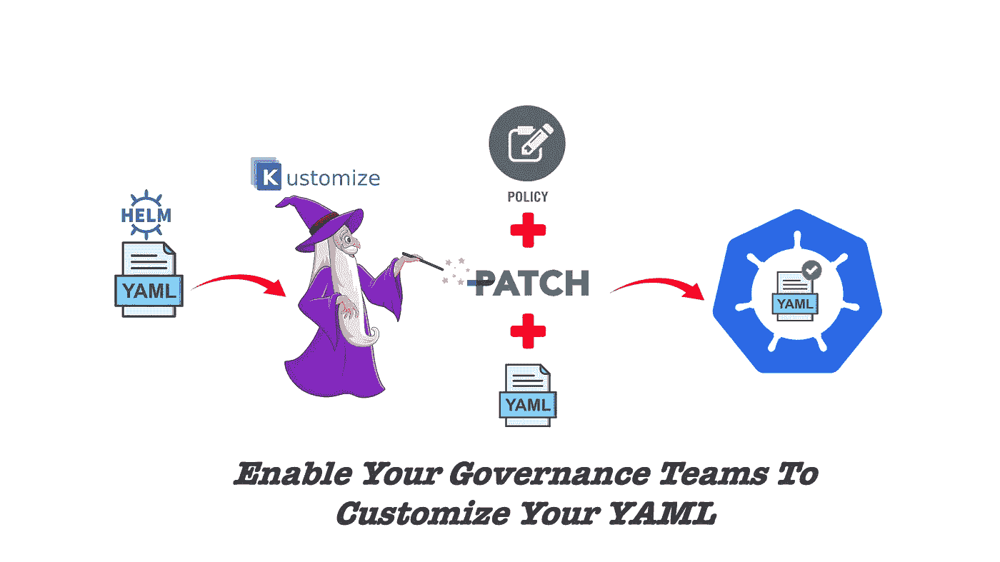
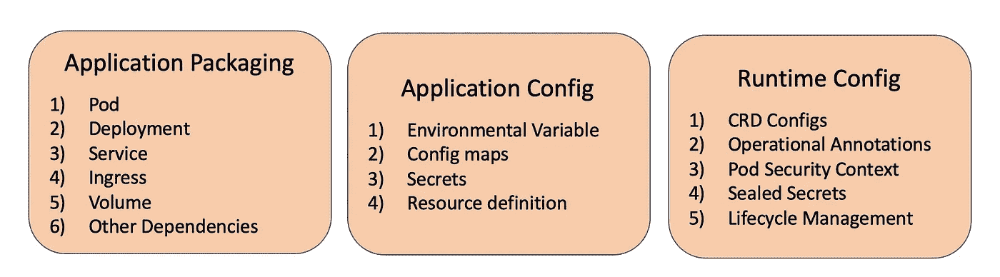
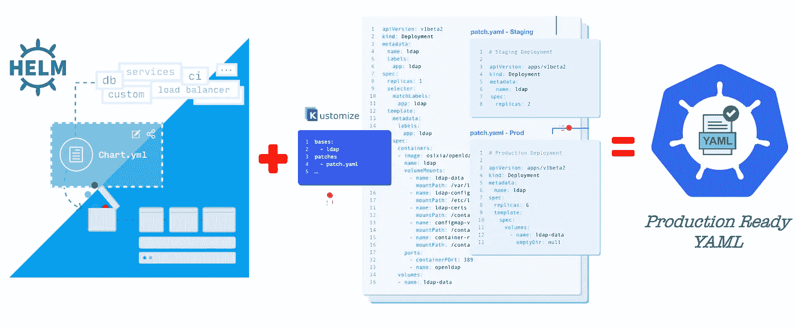
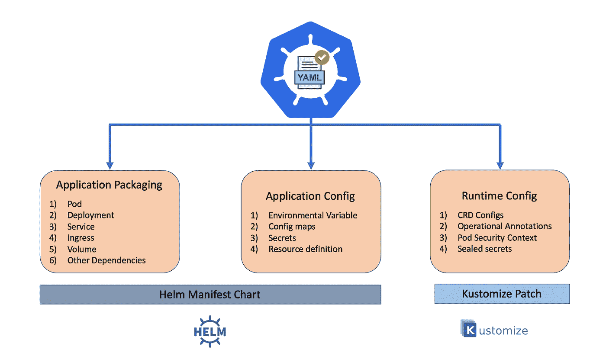
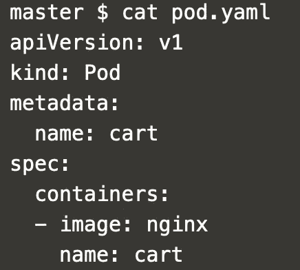
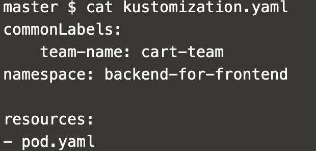
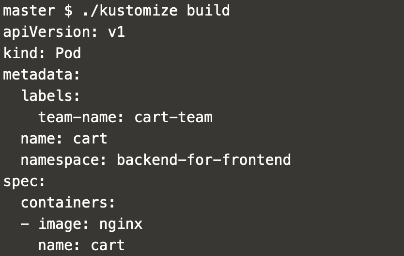
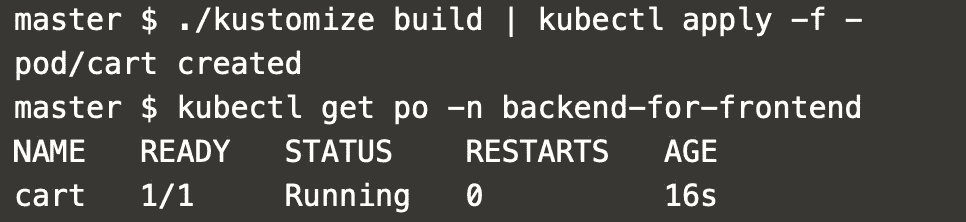
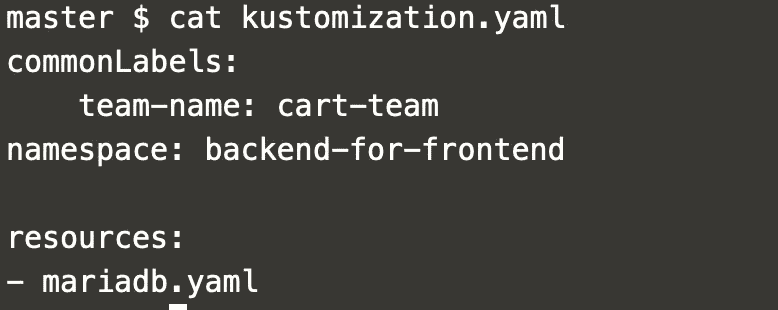

# 头盔是不够的，你还需要 Kustomize

> 原文：<https://itnext.io/helm-is-not-enough-you-also-need-kustomize-82bae896816e?source=collection_archive---------0----------------------->

## 自定义 YAML 以实施来自应用程序操作员、安全操作员和群集操作员的策略。✊

Kubernetes 让我们声明性地指定我们的意图，即应用程序应该如何通过 YAML 部署在底层基础设施中。这些 YAML 将包含应用程序定义、治理所需的标签、日志记录等横切关注点所需的标签、应用程序安全上下文定义、应用程序资源依赖性等。当我们开始将我们的 Kubernetes 扩展到数十个或数百个 pod 时，管理所有 YAML 将成为一场噩梦。

为了便于理解，这些声明性配置可以分为三个主要类别

1.  应用程序打包
2.  应用程序配置
3.  运行时配置

难道赫尔姆不能轻松地帮我们做到这一点吗？我们为什么需要新工具？新工具能带来什么？Helm 和 Kustomize 如何一起实现一些强大的用例？让我们在这篇博客中尝试回答所有这些问题。

## 什么舵好不好？

首先，让我们看看将应用程序部署到 Kubernetes 中所需的不同技术能力。

***应用打包&描述***

> 帮助我们描述应用程序并将相关资源打包在一起的功能，例如，1)应用程序元数据定义，如资源约束，2)将配置和服务打包在一起

***依赖关系管理***

> 该功能将帮助我们定义依赖性，例如，在部署 pod 资源之前部署配置资源。

***应用发现&仪表盘***

> 该功能将帮助我们发现部署在集群中的应用程序，以及它们的部署历史、依赖关系等。,

***生命周期管理***

> 该功能将帮助我们执行不同的应用程序部署策略，如首次展示、回滚、蓝绿色部署。

**应用描述定制**

> 该功能将帮助我们将应用/安全/集群标记添加到 YAML 中，以解决治理/安全/跨领域问题

Helm 可以很好地完成所有这些工作，但对于“*应用描述定制*”类别下的用例来说，它不是一个很好的工具。让我们看一些坚实的例子来理解这一点。

**案例 1:维护成本——Git Fork 或 Copy**

假设我们使用 Nginx helm charts 将 Nginx WAF 部署到我们的集群中。作为产品团队需求的一部分，我们应该添加一个注释来指定负责部署的团队名称。我们不能对主要的 Nginx git 库进行修改，因为它只与我们组织中的应用*操作治理策略相关。为了实现这一点，我们应该从 Nginx 存储库中派生或复制图表模板，并根据我们的定制需求对其进行修改。维护分支/副本的成本很高。Kustomize 能帮上忙。*

**案例 2:泄漏的抽象**

假设我们有一些网络策略要应用于一组 pod。安全操作员希望将标签添加到所有相关的 pod，然后他可以将网络策略资源添加到具有给定标签的所有 pod。按照传统的掌舵方式，我们应该将标签添加到开发人员工作的图表模板中。很明显，我们将安全声明性标签泄露给了应用程序开发人员。

**案例 3:不同横切关注点之间的耦合**

在 Kubernetes 资源 YAML 上，有关于应用程序开发人员、应用程序操作人员、安全操作人员和集群操作人员的声明性标签。应用、安全和集群运营商的关注本质上是交叉的。耦合所有这些问题会阻碍团队的敏捷性。

**案例 4:在连续部署管道中应用补丁**

假设 Nginx pod 中存在一个安全漏洞，安全团队正在寻找一种方法来拦截所有持续部署管道，并使用最新版本更新 Nginx 映像版本。Kustomize 在这种情况下会工作得很好。

> 这是 Kustomize 的最佳位置。这有助于我们定制 YAML 的文件，而不影响 YAML 的原作。Kustomize 是一个简单的命令行 CLI 工具，可以添加到任何持续部署/集成工作流中，甚至可以根据需要作为一个独立的工具

下图可以给我们一个高层次的视角，让我们了解 Helm 和 Kustomize 如何合作来创建一些强大的工作流。

## Kustomize 是如何工作的？

非常简单的三个步骤

*   将“kustomization.yaml”添加到我们希望定制的 yaml 中
*   在 YAML 中定义您的自定义
*   然后运行“kustomize build”

现在，kustomization.yaml 的内容是什么？我们举个例子，看看相关的“kustomization.yaml”

**例 1** :我们有一个由购物车团队部署的 pod，供移动应用团队使用。此外，安全团队要求将移动应用团队使用的所有服务保存在“后端对前端”的名称空间中。除此之外，应用程序操作者有一个横切标签，其中包括用于分布式跟踪的团队名称。上例中的“kustomization.yaml”如下所示

吊舱 YAML

YAML 的 kustomization

运行“kustomize build”的输出

如果您想直接安装到您的 kubernetes 集群中，请使用

> kustomize build | kubectl apply -f -

## 赫尔姆·➕·库什托米泽

同时使用 helm 和 kustomize 是一个非常简单的三步过程。让我们这样安装 MariaDB。

将值文件覆盖到 mariadb.yaml 后，保存一个 helm 模板。在下面的示例中，值被 config.yaml 替换

> 舵模板-f config . YAML stable/Maria db > Maria db . YAML

然后为 mariadb.yaml 添加 kustomization YAML

最后，定制更改并应用到集群

> kustomize build | kubectl apply -f -

阅读有关 Kubernetes DevOps 的端到端 DevOps 工作流[的更多信息。](https://link.medium.com/yqPhMzi4G5)

希望阅读有用。让我们创建一些强大的声明性工作流🚀。在下一篇文章中再见🏄