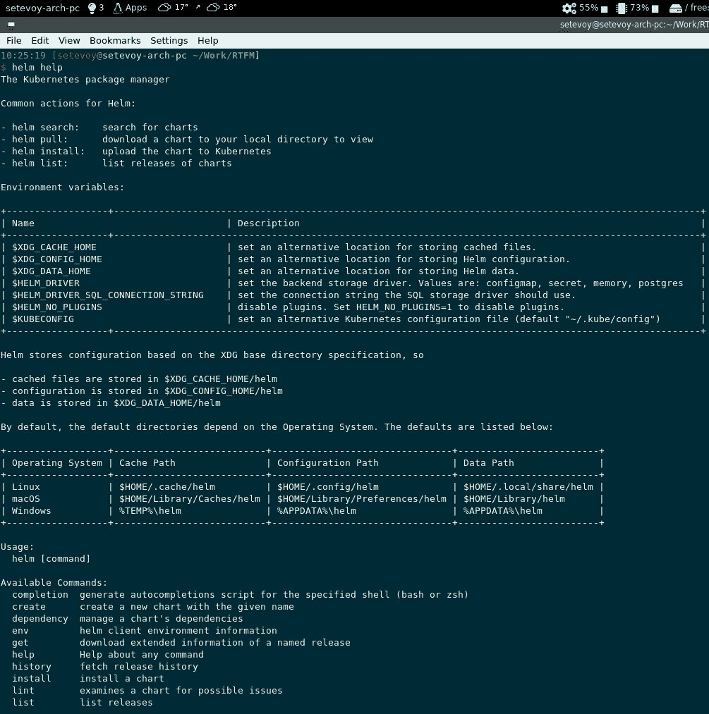
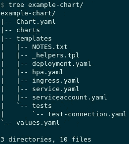

# Helm: Kubernetes 包管理器——概述，入门

> 原文：<https://itnext.io/helm-kubernetes-package-manager-an-overview-getting-started-ee62cf8b35b7?source=collection_archive---------7----------------------->


[官方文档](https://helm.sh/)称 Helm 为“*Kubernetes*的包管理器”，但事实上，Helm 不仅仅是一个包管理器——它更是一个应用程序控制工具，用于安装、管理、升级、配置等。

在本帖中，我们将概括介绍 Helm，它的图表、模板、变量和存储库。

这篇文章实际上更像是对帮助的介绍，并没有涵盖一些方面，如版本控制、依赖关系等。

与 Kubernetes 本身相比，Helm 拥有非常好的[文档](https://helm.sh/docs/intro/)。

*   [掌舵架构](https://rtfm.co.ua/en/helm-kubernetes-package-manager-an-overview-getting-started/#Helm_architecture)
*   [舵的概念](https://rtfm.co.ua/en/helm-kubernetes-package-manager-an-overview-getting-started/#Helm_concepts)
*   [舵组件](https://rtfm.co.ua/en/helm-kubernetes-package-manager-an-overview-getting-started/#Helm_components)
*   [舵图](https://rtfm.co.ua/en/helm-kubernetes-package-manager-an-overview-getting-started/#Helm_Charts)
*   [文件结构](https://rtfm.co.ua/en/helm-kubernetes-package-manager-an-overview-getting-started/#Files_structure)
*   [准备环境](https://rtfm.co.ua/en/helm-kubernetes-package-manager-an-overview-getting-started/#Preparing_the_environment)
*   [mini kube——一个 Kubernetes 星团](https://rtfm.co.ua/en/helm-kubernetes-package-manager-an-overview-getting-started/#Minikube_%E2%80%93_a_Kubernetes_cluster)
*   [安装舵](https://rtfm.co.ua/en/helm-kubernetes-package-manager-an-overview-getting-started/#Installing_Helm)
*   [创建舵图](https://rtfm.co.ua/en/helm-kubernetes-package-manager-an-overview-getting-started/#Creating_a_Helm_Chart)
*   [添加模板](https://rtfm.co.ua/en/helm-kubernetes-package-manager-an-overview-getting-started/#Adding_a_template)
*   [图表短绒](https://rtfm.co.ua/en/helm-kubernetes-package-manager-an-overview-getting-started/#chart_linter)
*   [图表安装](https://rtfm.co.ua/en/helm-kubernetes-package-manager-an-overview-getting-started/#chart_install)
*   [图表卸载](https://rtfm.co.ua/en/helm-kubernetes-package-manager-an-overview-getting-started/#chart_uninstall)
*   [模板变量](https://rtfm.co.ua/en/helm-kubernetes-package-manager-an-overview-getting-started/#Template_variables)
*   [图表升级](https://rtfm.co.ua/en/helm-kubernetes-package-manager-an-overview-getting-started/#chart_upgrade)
*   [头盔组件](https://rtfm.co.ua/en/helm-kubernetes-package-manager-an-overview-getting-started/#helm_package)
*   [舵库](https://rtfm.co.ua/en/helm-kubernetes-package-manager-an-overview-getting-started/#Helm_repositories)
*   [运行本地舵回购](https://rtfm.co.ua/en/helm-kubernetes-package-manager-an-overview-getting-started/#Running_local_Helm_repo)

## 赫尔姆

Helm 通过软件包运行 Kubernetes 中的应用程序，就 Helm 而言，它们被称为**图表**，并且`helm`允许:

*   创建新图表
*   将图表打包归档(tgz)
*   使用共享图表的存储库来处理共享图表
*   在 Kubernetes 集群中安装和卸载图表
*   管理集群中的图表发布

## 舵的概念

主要的三个概念是:

1.  *图表*:在 Kubernetes 集群中运行应用程序所需的信息
2.  *config* :关于必要配置选项的信息，该图表使用这些配置选项来创建应用程序实例并管理其发布
3.  *发布* : работающий инстанс *图表* -а，связанный с определённым *配置-* ом

## 舵组件

Helm 可以分为两个主要部分——客户端本身和 Helm 库

*   *Helm 客户端*:是一个命令行工具(Helm 是用 Go 编写的)，负责图表创建、使用存储库、发布管理等
*   Helm 库:Helm 的逻辑部分负责与 Kubernetes API 一起管理图表、图表发布、集群安装等

## 舵图

因此，*图表* —是一个文件集合，描述了一些 Kubernetes 资源，这些资源可用于创建单 pod 应用程序—或整个复合 web 服务，包括 web 服务器、前端 ap 和后端应用程序、缓存服务等。

## 文件结构

图表被组织成目录和文件树，其中顶层目录名是图表名。

例如:

```
$ tree example-chart/
example-chart/
| — Chart.yaml
| — charts
| — templates
| | — NOTES.txt
| | — _helpers.tpl
| | — deployment.yaml
| | — hpa.yaml
| | — ingress.yaml
| | — service.yaml
| | — serviceaccount.yaml
| ` — tests
| ` — test-connection.yaml
` — values.yaml
```

这里:

*   `example-chart` : top-catalog，一个图表名称
*   `Chart.yaml`:图表的元数据，描述图表的用途、版本、依赖关系等
*   `charts`:一个图表可以包含多个子图表或者*子图表*——它们将被存储在这里
*   `templates`:包含使用 [Go 模板](https://golang.org/pkg/text/template/)应用于 Kubernetes 集群的模板文件
*   `NOTES.txt` -帮助-为用户显示的文本
*   【Kubernetes 部署清单示例
*   【Kubernetes 服务清单示例
*   `values.yaml` -包含模板的默认值

好了，理论到此为止——让我们开始实践吧！

## 准备环境

在此将使用 Minikube、kubectl 和 Helm v3:

*   minikube v1.9 版
*   Kubernetes v1.18 版
*   kubectl v1.18.2
*   舵-3.2.0

## mini kube——一个 Kubernetes 星团

[安装](https://rtfm.co.ua/kubernetes-zapusk-minikube-na-arch-linux/) `[minikube](https://rtfm.co.ua/kubernetes-zapusk-minikube-na-arch-linux/)`:

```
$ sudo pacman -S minikube
```

创建集群:

```
$ minikube start
😄 minikube v1.9.2 on Arch rolling
…
🌟 Enabling addons: default-storageclass, storage-provisioner
🏄 Done! kubectl is now configured to use “minikube”
```

检查:

```
$ kubectl cluster-info
Kubernetes master is running at [https://192.168.99.100:8443](https://192.168.99.100:8443)
KubeDNS is running at [https://192.168.99.100:8443/api/v1/namespaces/kube-system/services/kube-dns:dns/proxy](https://192.168.99.100:8443/api/v1/namespaces/kube-system/services/kube-dns:dns/proxy)
```

其节点:

```
$ kubectl get nodes
NAME STATUS ROLES AGE VERSION
minikube Ready master 4m16s v1.18.0
```

## 安装舵

Arch Linux —来自存储库:

```
$ sudo pacman -S helm
```

macOS —自制:

```
$ brew install helm
```

Debian 等—使用 Snap:

```
$ sudo apt install snapd
$ sudo snap install helm — classic
```

而且对`helm help`真的很有帮助:



## 创建舵图

现在，让我们使用模板创建自己的图表，并尝试将其部署到 Kubernetes 集群中。

创建新图表:

```
$ helm create example-chart
Creating example-chart
```

我们已经看到了它的内容:

```
$ tree example-chart/
example-chart/
| — Chart.yaml
| — charts
| — templates
| | — NOTES.txt
| | — _helpers.tpl
| | — deployment.yaml
| | — hpa.yaml
| | — ingress.yaml
| | — service.yaml
| | — serviceaccount.yaml
| ` — tests
| ` — test-connection.yaml
` — values.yaml
3 directories, 10 files
```



让我们检查一下它的部署文件:

```
$ cat example-chart/templates/deployment.yaml
apiVersion: apps/v1
kind: Deployment
metadata:
name: {{ include “example-chart.fullname” . }}
labels:
{{- include “example-chart.labels” . | nindent 4 }}
spec:
{{- if not .Values.autoscaling.enabled }}
replicas: {{ .Values.replicaCount }}
{{- end }}
…
```

和`Values`:

```
$ cat example-chart/values.yaml
Default values for example-chart.
This is a YAML-formatted file.
Declare variables to be passed into your templates.
replicaCount: 1
…
```

必须足够明显——因为`templates/deployment.yaml`中的`replicas: {{ .Values.replicaCount }}`将使用来自`values.yaml`的`replicaCount: 1`值。

但不会使用这些文件—让我们创建自己的图表。

移除它们:

```
$ rm -rf example-chart/templates/*
```

现在添加我们的配置图。

## 添加模板

创建一个新文件`example-chart/templates/configmap.yaml`，在这里，例如，一个`index.html`文件的内容:

```
apiVersion: v1
kind: ConfigMap
metadata:
  name: nginx-configmap
data:
  index.html: "Hello, World
```

## 海图夹

在安装图表之前，最好检查其语法——为此使用`helm lint`:

```
$ helm lint example-chart/
==> Linting example-chart/
[INFO] Chart.yaml: icon is recommended
1 chart(s) linted, 0 chart(s) failed
```

## 图表安装

再次检查您的`kubectl`中配置了哪个集群:

```
$ kubectl config current-context
minikube
```

要安装图表，使用`helm install`传递一个版本名作为第一个参数，然后是选项和图表文件的路径。

但同样，在运行实际操作之前，最好使用`--dry-run`进行试运行，并添加`--debug`以查看更多细节:

```
$ helm install example-chart — dry-run — debug example-chart/
install.go:159: [debug] Original chart version: “”
install.go:176: [debug] CHART PATH: /home/setevoy/Work/RTFM/example-chart
NAME: example-chart
LAST DEPLOYED: Sun May 3 13:17:07 2020
NAMESPACE: default
STATUS: pending-install
REVISION: 1
TEST SUITE: None
USER-SUPPLIED VALUES:
{}
COMPUTED VALUES:
affinity: {}
autoscaling:
enabled: false
maxReplicas: 100
minReplicas: 1
targetCPUUtilizationPercentage: 80
fullnameOverride: “”
image:
pullPolicy: IfNotPresent
repository: nginx
tag: “”
…
 — -
Source: example-chart/templates/configmap.yaml
apiVersion: v1
kind: ConfigMap
metadata:
name: nginx-configmap
data:
index.html: “Hello, World”
```

好的—没有错误，现在安装:

```
$ helm install example-chart example-chart/
NAME: example-chart
LAST DEPLOYED: Sun May 3 13:20:52 2020
NAMESPACE: default
STATUS: deployed
REVISION: 1
TEST SUITE: None
```

检查其状态:

```
$ helm get manifest example-chart
 — -
Source: example-chart/templates/configmap.yaml
apiVersion: v1
kind: ConfigMap
metadata:
name: nginx-configmap
data:
index.html: “Hello, World”
```

并请示了`kubectl`:

```
$ kubectl describe cm nginx-configmap
Name: nginx-configmap
Namespace: default
Labels: app.kubernetes.io/managed-by=Helm
Annotations: meta.helm.sh/release-name: example-chart
meta.helm.sh/release-namespace: default
Data
====
index.html:
 — — 
Hello, World
```

## 图表卸载

同样，您可以删除一个图表——使用`helm uninstall`和一个发布名称:

```
$ helm uninstall example-chart
release “example-chart” uninstalled
```

## 模板变量

好的——一切似乎都在工作，但是我们的 ConfgiMap 中有静态数据和硬编码的值。

让我们改变它，应用模板引擎。

对于`helm`，您可以使用一组预定义的变量，如`Release.Name`，参见[文档](https://helm.sh/docs/topics/charts/)中的完整列表。

шаблон нашего配置图:

```
apiVersion: v1
kind: ConfigMap
metadata:
  name: {{ .Release.Name }}-configmap
data:
  index.html: "Hello, World"
```

接下来，添加自己的变量—移除`values.yaml`:

```
$ rm example-chart/values.yaml
```

创建它，但是只有一行代码:

```
user: "Username"
```

现在，您可以通过`.Values.user`在模板中使用它:

```
apiVersion: v1
kind: ConfigMap
metadata:
  name: {{ .Release.Name }}-configmap
data:
  index.html: "Hello, {{ .Values.user }}"
```

`.Values`告诉 Helm 使用`values,yaml`获取*用户*变量的值。

应用:

```
$ helm install example-chart example-chart/
NAME: example-chart
LAST DEPLOYED: Sun May 3 13:35:49 2020
NAMESPACE: default
STATUS: deployed
REVISION: 1
TEST SUITE: None
Check:
kubectl get cm
NAME DATA AGE
example-chart-configmap 1 31s
```

内容:

```
$ kubectl describe cm example-chart-configmap
Name: example-chart-configmap
Namespace: default
Labels: app.kubernetes.io/managed-by=Helm
Annotations: meta.helm.sh/release-name: example-chart
meta.helm.sh/release-namespace: default
Data
====
index.html:
 — — 
Hello, Username
```

## 图表升级

好吧，但是如果我们想改变用户名字符串呢？

您可以删除整个版本，并在`values.yaml`中用更改后的值重新部署，或者直接用`--set`选项指定:

```
$ helm uninstall example-chart
release “example-chart” uninstalled
helm install example-chart example-chart/ — set user=NewUser
```

检查:

```
$ kubectl describe cm example-chart-configmap
…
Data
====
index.html:
 — — 
Hello, NewUser
```

另一种方法是使用带有发布名称和新值的`helm upgrade`:

```
$ helm upgrade example-chart example-chart/ — set user=AnotherOneUser
Release “example-chart” has been upgraded. Happy Helming!
…
```

结果是:

```
$ kubectl describe cm example-chart-configmap
…
Data
====
index.html:
 — — 
Hello, AnotherOneUser
```

## 头盔组件

为了能够与同事分享我们的图表，我们可以将它打包成 tgz 文件。

使用`helm package`，这将创建一个名为*chart-name-chart-verstion . tgz*的新文件。

版本`helm`将从图表的元数据中获取:

```
$ cat example-chart/Chart.yaml | grep version:
version: 0.1.0
```

打包:

```
$ helm package example-chart/
Successfully packaged chart and saved it to: /home/setevoy/Work/RTFM/example-chart-0.1.0.tgz
```

检查归档的内容:

```
$ tar tf example-chart-0.1.0.tgz
example-chart/Chart.yaml
example-chart/values.yaml
example-chart/templates/configmap.yaml
example-chart/.helmignore
```

## 赫尔姆仓库

为了共享我们的打包图表，使用了 Helm 存储库。

之前，你可以使用`helm serve`来创建一个，但是在 Helm v3 中它被移除了。

现在使用`helm repo`来处理存储库。

默认情况下，您已经添加了来自 Google 的回购:

```
$ helm repo list
NAME URL
stable [https://kubernetes-charts.storage.googleapis.com/](https://kubernetes-charts.storage.googleapis.com/)
```

## 运行本地 Helm repo

创建自己的存储库—it；对一个图表执行`helm package`就足够了，然后在用于存储图表存档的目录中生成`index.yaml`文件。

作为后端存储，你几乎可以使用任何东西——从 Github 页面开始，到 AWS S3，见[图表库指南](https://helm.sh/docs/topics/chart_repository/)。

下面是一个如何运行本地 Helm 存储库的示例。

创建一个目录，将存档的图表移入其中:

```
$ mkdir helm-local-repo
$ mv example-chart-0.1.0.tgz helm-local-repo/
```

初始化存储库:

```
$ helm repo index helm-local-repo/
```

检查其内容:

```
$ tree helm-local-repo/
helm-local-repo/
| — example-chart-0.1.0.tgz
` — index.yaml
```

要访问它——运行一个网络服务器，例如一个普通的 NGINX:

```
$ sudo docker run -ti -v $(pwd)/helm-local-repo/:/usr/share/nginx/html -p 80:80 nginx
```

检查连接:

```
$ curl localhost/index.yaml
apiVersion: v1
entries:
example-chart:
- apiVersion: v2
appVersion: 1.16.0
created: “2020–05–03T14:04:44.896115358+03:00”
description: A Helm chart for Kubernetes
digest: afa314247a03c4c85f339bda665659f3ab13a5e8656336e14ed37ed7f31b5352
name: example-chart
type: application
urls:
- example-chart-0.1.0.tgz
version: 0.1.0
generated: “2020–05–03T14:04:44.895678349+03:00”
```

将此存储库添加到您的本地舵:

```
$ helm repo add example-chart [http://localhost](http://localhost)
“example-chart” has been added to your repositories
```

检查:

```
$ helm repo list
NAME URL
stable [https://kubernetes-charts.storage.googleapis.com/](https://kubernetes-charts.storage.googleapis.com/)
example-chart [http://localhost](http://localhost)
```

尝试搜索图表:

```
$ helm search repo example
NAME CHART VERSION APP VERSION DESCRIPTION
example-chart/example-chart 0.1.0 1.16.0 A Helm chart for Kubernetes
```

安装它:

```
$ helm install example-chart-from-repo example-chart/example-chart
NAME: example-chart-from-repo
LAST DEPLOYED: Sun May 3 14:15:51 2020
NAMESPACE: default
STATUS: deployed
```

入住 Kubernetes 集群:

```
$ kubectl get cm
NAME DATA AGE
example-chart-configmap 1 34m
example-chart-from-repo-configmap 1 22s
```

大体就是这样。

*最初发布于* [*RTFM: Linux、DevOps、系统管理*](https://rtfm.co.ua/en/helm-kubernetes-package-manager-an-overview-getting-started/) *。*