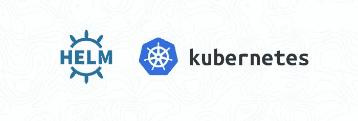

# Helm:可重复使用的图表——命名模板，以及适用于多个应用程序的通用图表

> 原文：<https://itnext.io/helm-reusable-chart-named-templates-and-a-generic-chart-for-multiple-applications-13d9b26e9244?source=collection_archive---------3----------------------->



我们的项目正在增长，越来越多的应用程序开始在 AWS Elastic Kubernetes 服务上运行。

最后，我们面对的问题已经在[Helm:пошаговоесозданиечартаиелокментаиззJenkins](https://rtfm.co.ua/helm-poshagovoe-sozdanie-charta-i-deplojmenta-iz-jenkins/)(*RUS*)—当使用大量类似的应用程序时，如何处理 Kubernetes 清单和 helm 模板？

尤其是现在，当我们从同一个存储库中部署了相同的代码，但是有三个相似的应用程序时。

起初，我们只有一个，后来又增加了一个，现在我们正准备发布第三个。

因此，他们的图表现在看起来如下:

```
$ tree -d k8s/
k8s/
├── app1-chart
│ ├── charts
│ ├── env
│ │ ├── dev
│ │ ├── dev-2
│ │ └── prod
│ └── templates
└── app2-chart
├── charts
├── env
│ ├── dev
│ ├── prod
│ └── stage
└── templates
```

所以，现在我需要再次复制相同的图表？

我一点也不喜欢这个想法，所以让我们更深入地了解一下 Helm 模板，并尝试创建一个图表来部署三个类似的应用程序。

# 内容

*   [部署—文件的结构](https://rtfm.co.ua/en/helm-reusable-chart-named-templates-and-a-generic-chart-for-multiple-applications/#Deployment_%E2%80%93_the_file%E2%80%99s_structure)
*   [头盔命名模板](https://rtfm.co.ua/en/helm-reusable-chart-named-templates-and-a-generic-chart-for-multiple-applications/#Helm_Named_templates)
*   [常见标签](https://rtfm.co.ua/en/helm-reusable-chart-named-templates-and-a-generic-chart-for-multiple-applications/#Common_labels)
*   [定义](https://rtfm.co.ua/en/helm-reusable-chart-named-templates-and-a-generic-chart-for-multiple-applications/#define)
*   [包括](https://rtfm.co.ua/en/helm-reusable-chart-named-templates-and-a-generic-chart-for-multiple-applications/#include)
*   [缩进与非缩进](https://rtfm.co.ua/en/helm-reusable-chart-named-templates-and-a-generic-chart-for-multiple-applications/#indent_vs_nindent)
*   [模板内部的模板](https://rtfm.co.ua/en/helm-reusable-chart-named-templates-and-a-generic-chart-for-multiple-applications/#Templates_inside_of_a_template)
*   [来自项目的 values.yaml 文件的 env 块](https://rtfm.co.ua/en/helm-reusable-chart-named-templates-and-a-generic-chart-for-multiple-applications/#The_env_block_from_a_project%E2%80%99s_values_yaml_file)
*   [范围循环](https://rtfm.co.ua/en/helm-reusable-chart-named-templates-and-a-generic-chart-for-multiple-applications/#The_rangeloop)
*   [带变量的范围循环](https://rtfm.co.ua/en/helm-reusable-chart-named-templates-and-a-generic-chart-for-multiple-applications/#The_range_loop_with_variables)
*   [托亚姆](https://rtfm.co.ua/en/helm-reusable-chart-named-templates-and-a-generic-chart-for-multiple-applications/#toYaml)
*   [空格](https://rtfm.co.ua/en/helm-reusable-chart-named-templates-and-a-generic-chart-for-multiple-applications/#Whitespaces)
*   [舵 tpl](https://rtfm.co.ua/en/helm-reusable-chart-named-templates-and-a-generic-chart-for-multiple-applications/#Helm_tpl)
*   [来自 _helpers.tpl 的 env 块](https://rtfm.co.ua/en/helm-reusable-chart-named-templates-and-a-generic-chart-for-multiple-applications/#The_env_block_from_the_helpers_tpl)
*   [if/else —流量控制](https://rtfm.co.ua/en/helm-reusable-chart-named-templates-and-a-generic-chart-for-multiple-applications/#if/else_%E2%80%94_flow_control)
*   [来自外部文件的 env 块](https://rtfm.co.ua/en/helm-reusable-chart-named-templates-and-a-generic-chart-for-multiple-applications/#The_env_block_from_an_external_file)
*   [从图表中排除模板](https://rtfm.co.ua/en/helm-reusable-chart-named-templates-and-a-generic-chart-for-multiple-applications/#Excluding_a_template_from_the_chart)

# 部署—文件的结构

为了考虑未来通用模板的结构，让我们检查哪些块将是所有应用程序通用和共享的，哪些块将是不同的，并将包含在模板中。

在这里，我们将主要讨论`deployment.yaml`文件，其他的将会以类似的方式完成。

所以:

*   `deployment.yaml`文件:
*   `metadata`:
*   `name`:常用，从具体项目的`values.yaml`中取值
*   `annotations` : common，我们这里只有`reloader.stakater.com/auto`，它将始终被设置为 *true* (不过，请查看 [Kubernetes: ConfigMap 和 Secrets–pod 中的数据自动重新加载](https://rtfm.co.ua/en/kubernetes-configmap-and-secrets-data-auto-reload-in-pods/)帖子，了解其他可用选项)
*   `labels` : common，将在不同的地方使用，例如在下面的`spec.template.metadata.labels`中的同一个文件中，以及在带有 Kubernetes Cronjobs 的模板中，所以将标签移动到`_helpers.yaml`文件中是一个好主意
*   `spec`:
*   `replicas`:常用，从具体项目的`values.yaml`中取值
*   `strategy`:
*   type: common，从具体项目的`values.yaml`中取值
*   `selector`:
*   `matchLabels`:同样常见，也会在不同的地方使用，我们把它移到`_helpers.yaml`
*   `template`:
*   `metadata`:
*   `labels`:取自`_helpers.yaml`
*   `spec`:
*   `containers`:
*   `name`:常用，从具体项目的`values.yaml`中取值
*   `image`:常见，取自具体项目的`values.yaml`
*   `env`:本帖最有趣的部分:

1.  我们可以将它移动到每个项目
    的`values.yaml`中-优点:不需要指定值，因为它们可以在变量
    的`value`字段中直接设置-缺点:
    -我们的变量在所有项目中几乎是相同的-因此它们将被复制
    -由于我们有许多变量要添加
    ，`values.yaml`将变得臃肿-并非所有变量都在*键:值*视图中 —一些将从`valueFrom.secretKeyRef.<KUBE_SECRET_NAME>`中获取其值，因此无法直接在`values.yaml`中设置其值
2.  另一种方法是使用`_helpers.yaml`文件，其中我们将有一组公共变量，每个变量都有自己的`if/then`——如果项目的`values.yaml`不包含变量值，那么这样的变量将不会被添加到通用模板中，因此不会因为添加新变量而破坏项目的部署
3.  对于一个项目必须有自己的一组变量的情况，我们可以通过检查类似`if {{ .Values.chartSettings.customEnvs == true }}`的东西在`env`块前添加一个条件，并跳过从`_helpers.yaml`或`values.yaml`添加块，而是使用类似`tpl .File.Get project1/envs.yaml`的专用文件

*   `volumeMounts`:也可以有所不同，以后再考虑吧
*   `ports`:
*   `containerPort`:将总是，将从`values.yaml`中获取其值(顺便说一下，根本没有必要在这里添加它们，参见[我应该在 Kubernetes 部署中配置端口吗？](https://medium.com/faun/should-i-configure-the-ports-in-kubernetes-deployment-c6b3817e495)帖子)
*   `livenessProbe`、`readinessProbe`:将与`httpGet.path`和`httpGet.port`共用，因此可以移动到`_helpers.yaml`中，但也可以添加一个选项，通过带有`.File.Get`的外部文件包含它
*   `resources`:
*   `requests.cpu`，`requests.memory`——嗯...我想会为所有人添加，但仍然是一个问题——需要以后再考虑查看 [Kubernetes:驱逐的 pod 和 pod 服务质量](https://rtfm.co.ua/en/kubernetes-evicted-pods-and-pods-quality-of-service/)帖子了解更多细节
*   `limits.cpu`，`limits.memory`——所有人的记忆都会受到限制...或者不是...以后会想
*   `volumes`:也可有所不同，留待以后再说
*   `imagePullSecrets`:所有人都一样
*   `hpa.yaml` -用于 HPA
*   `network.yaml` -入口服务
*   `secrets.yaml` -库伯内特的秘密
*   `rbac.yaml` -将用户组附加到 Helm 在部署期间创建的 c 命名空间中
*   `cronjobs.yaml` -库伯内特·克朗乔布斯
*   `_helpers.tpl`——和我们的【助手】为[掌舵命名的模板](https://helm.sh/docs/chart_template_guide/named_templates/)

所以，基本上，主要观点如下:

*   在`templates`目录中带有模板的通用图表
*   在`templates`中会保留`deployment.yaml`、`hpa.yaml`、`_helpers.tpl`等
*   在`templates`附近会创建一个名为`projects`的附加目录
*   在里面——按项目名称分类
*   *项目 1*
*   *项目 2*
*   *项目 3*
*   并且在它们中的每一个里面都会有一个`env`目录
*   带有`dev`、`stage`、`prod`目录
*   带专用`values.yaml`和`secrets.yaml`文件

# 赫尔姆命名模板

关于命名模板的好帖子— [如何用命名模板减少舵图样板](https://austindewey.com/2020/08/09/how-to-reduce-helm-chart-boilerplate-with-named-templates/)(更多链接在本文末尾)。

官方文档这里是[>>>](https://helm.sh/docs/chart_template_guide/named_templates/)。

我们想要移入`_helpers.yaml`的模板中的第一个块是`labels`。

Helm 中命名模板背后的一般思想是只编写一次代码，然后将它包含在我们需要该代码的每个地方。此外，这有助于减少模板的内容，使其更具可读性。

已命名的模板文件名以带`.tpl`扩展名的下划线开头。

最常见的文件是我们将在本例中使用的`_helpers.tpl`。

这个文件中的每个模板定义都以关键字`define`开始，以`end`结束。

命名模板的名称通常包括一个图表名称和一个描述模板的块，但也可以使用其他名称。例如，在我们的文件中，我们将使用*助手。<块名*名。

这里的一个不便之处是，你不能使用像`.Chart.Name`这样的值，但是你可以在里面创建一个 Helm 变量。不确定这一点，以后会看到，现在，将只是硬编码的*助手*。

## 普通`labels`

嗯，有哪些标签是好的呢？

*   *环境* — *开发*、*阶段*、*生产*——将从`values.yaml`设置
*   *appversion* —将在 Jenkins 中通过`--set`选项进行编译时设置

想知道更多好主意，我们可以问谷歌—“*kubernetes 推荐标签*”，第一个链接是[推荐标签](https://kubernetes.io/docs/concepts/overview/working-with-objects/common-labels/)。

此外，检查舵文档中的[标签和注释](https://helm.sh/docs/chart_best_practices/labels/)

另外，看看一些现有的图表可能是个好主意，例如[sonar cube/templates/deployment . YAML](https://github.com/helm/charts/blob/0445fad8d8308f089f5fb6756a5570bc6d6f0bf5/stable/sonarqube/templates/deployment.yaml#L5)。

现在，我们可以添加四个自定义标签:

*   *应用* : `{{ .Values.appConfig.appName }}`，将在`values.yaml`中为每个应用设定
*   *版本* : `{{ .Chart.Version }}-{{ .Chart.AppVersion }}`，将由詹金斯设定
*   *环境* : `{{ .Values.appConfig.appEnv }}`，将在`values.yaml`中为每个应用程序设置
*   *被管理人* : `{{ .Release.Service }}`被掌舵人

如果我们想要添加另一个——我们可以在一个地方完成，而不是更新所有使用`labels`的地方。

## `define`

回到我们的`_helpers.tpl`并描述我们的标签:

```
{{- define "helpers.labels" -}}
application: {{ .Values.appConfig.appName }}
version: {{ .Chart.Version }}-{{ .Chart.AppVersion }}
environment: {{ .Values.appConfig.appEnv }}
managed-by: {{ .Release.Service }}
{{- end }}
```

## `include`

然后，使用`include`，指定它必须包含在一般部署的模板中的位置:

```
apiVersion: apps/v1
kind: Deployment
metadata:
  name: {{ .Values.appConfig.appName }}-deployment
  labels: {{- include "helpers.labels" . | nindent 4 }}
...
```

## `indent` vs `nindent`

*   `indent` -只是会添加空格
*   `nindent` -将添加空格加一个新的线符号

也就是说，不要像这样写:

```
...
  labels: 
    {{- include "helpers.labels" . | indent 4 }}
...
```

我们可以在一行中设置它，避免在模板中键入空格:

```
...
labels: {{- include "helpers.labels" . | nindent 4 }}
...
```

此外，这也起到了将 YAML 块添加到模板中的作用，将在下面看到它的作用。

回到命名模板——让我们对`spec.selector.matchLabels`做同样的事情——将它移动到一个专用模板，这样我们可以在以后重用它，例如在服务中。

在`_helpers.tpl`中添加一个新块:

```
...
{{- define "helpers.selectorLabels" -}}
application: {{ .Values.appConfig.appName }}
{{- end }}
```

现在，我们只按应用程序名进行选择，以后我们可以更新它并包含任何其他选择器。

将其添加到部署中:

```
...
  selector:
    matchLabels:
      {{- include "helpers.selectorLabels" . | nindent 6 }}
  template:
...
```

# 模板中的模板

我们来到了任务中最有趣的部分——将整个块添加到模板文件中。

所以，在当前使用的模板中，我们有`env`块:

```
...
        env:
        - name: APP_SECRET
          valueFrom:
            secretKeyRef:
              name: app-backend-secrets
              key: backend-app-secret
        - name: AUTH_SECRET
          valueFrom:
            secretKeyRef:
              name: app-backend-secrets
              key: backend-auth-secret
        - name: CLIENT_HOST
          value: {{ .Values.appConfig.clientHost }}
        - name: DATABASE_HOST
          value: {{ .Values.appConfig.db.host }}
        - name: DATABASE_SLAVE_HOST
          value: {{ .Values.appConfig.db.slave }}
        - name: DB_USERNAME
          value: {{ .Values.appConfig.db.user }}
        - name: INSTANA_AGENT_HOST
          valueFrom:
            fieldRef:
              fieldPath: status.hostIP
...
```

我们希望将它移动到另一个文件中的一个块中，并将其包含在我们正在编写的新模板中。

## 项目的`values.yaml`文件中的`env`块

让我们看看如何实现这一点。

首先，需要给`values.yaml`添加环境变量。

创建目录树:

```
$ mkdir -p projects/newapp/env/dev
```

以及里面的文件— `values.yaml`和`secrets.yaml`:

```
$ touch projects/newapp/env/dev/{values.yaml,secrets.yaml}
```

然后，在`projects/newapp/env/dev/values.yaml`中创建一个名为 *environments* 的列表，现在只有一个变量:

```
environments:    
  - name: 'DATABASE_HOST'
    value: 'dev.aurora.web.example.com'
```

为了能够使用`helm --debug --dry-run`测试模板，添加所有其他数据，如`{{ .Values.deployment.replicaCount }}`。

## `range`循环

文档— [流量控制](https://helm.sh/docs/chart_template_guide/control_structures/)。

好例子— [舵模板范围](https://kb.novaordis.com/index.php/Helm_Template_range)。

因此，我们有一个环境变量`DATABASE_HOST`，它的*dev.aurora.web.example.com*值在`values.yaml`中描述，它被设置为带有两个*键:值*对的列表元素:

```
...
  <LIST_NAME>:
    - <VAR_NAME>: <VAR_VALUE>
      <VAR_NAME>: <VAR_VALUE>
...
```

然后我们可以用下面的代码将它包含在通用模板中:

```
...
    spec:
      containers:
      - name: {{ .Values.appConfig.appName }}-pod
        image: {{ .Values.deployment.image.repository }}/{{ .Values.deployment.image.name }}:{{ .Values.deployment.image.tag }}
        env:
        {{- range .Values.deployment.environments }}
        - name: {{ .name }}                        
          value: {{ .value }}
        {{- end }}
...
```

这里:

*   用键:值行迭代`environments`列表
*   迭代列表中的每个元素，寻找 VAR _ NAME`.name`——这将在 name: `{{ .name }}`中设置
*   迭代列表中的每个元素，寻找 VAR _ NAME`.value`——这将在值:`{{ .value }}`中设置

检查一下:

```
$ helm upgrade --install eks-dev-1-newapp-backend --namespace eks-dev-1-newapp-backend-ns --create-namespace -f projects/newapp/env/dev/values.yaml --debug --dry-run .
…
spec:
replicas: 2
strategy:
type:
selector:
matchLabels:
application: newapp
template:
metadata:
labels:
application: newapp
version: 0.1.0–1.16.0
environment: dev
managed-by: Helm
spec:
containers:
- name: newapp-pod
image: projectname/projectname:latest
env:
- name: DATABASE_HOST
value: dev.aurora.web.example.com
ports:
- containerPort: 3001
…
```

顺便说一下，我们在这里看到了我们的标签。

这是我们的环境变量:

```
…
env:
- name: DATABASE_HOST
value: dev.aurora.web.example.com
…
```

## 带变量的`range`循环

另一个解决方案是使用相同的循环，但是现在使用了`$key`和`$value`变量——在这种情况下，我们不依赖于`values.yaml`文件中的变量名，而是迭代每个变量:

```
...
        {{- range $key, $value := .Values.deployment.environments }}
        env:
        - name: {{ $key }}
          value: {{ $value }}
        {{- end }}
...
```

更新`values.yaml`——现在我们的`environments`被设置为一个字典，包含我们的变量，就像一个*键:值*对一样，这里添加了另一个`DB_USERNAME`对，以使示例更具说明性:

```
...
  environments:  
    DATABASE_HOST: 'dev.aurora.web.example.com'
    DB_USERNAME: 'dbuser'
...
```

检查一下:

```
$ helm upgrade --install eks-dev-1-newapp-backend --namespace eks-dev-1-newapp-backend-ns --create-namespace -f projects/newapp/env/dev/values.yaml --debug --dry-run .
…
spec:
containers:
- name: newapp-pod
image: projectname/projectname:latest
env:
- name: DATABASE_HOST
value: dev.aurora.web.example.com
- name: DB_USERNAME
value: dbuser
ports:
- containerPort: 3001
…
```

## `toYaml`

但是让我们回忆一下我们最初的模板:

```
...
        - name: DATABASE_HOST
          value: {{ .Values.backendConfig.db.host }}
        - name: DB_USERNAME
          value: {{ .Values.backendConfig.db.user }}
        - name: DB_PASSWORD
          valueFrom:
            secretKeyRef:
              name: projectname-backend-secrets
              key: backend-db-password
...
```

这里我们不能使用简单的循环，所以第三种解决方案将是在`values.yaml`中描述整个`env`块，然后通过使用`toYaml` 将其包含在通用模板中。

更新`values.yaml`并在此设置块:

```
environments:
  - name: DATABASE_HOST
    value: 'dev.aurora.web.example.com'
  - name: DB_USERNAME
    value: 'dbuser'
  - name: DB_PASSWORD
    valueFrom:
      secretKeyRef:
        name: projectname-backend-secrets
        key: backend-db-password
```

然后将其包含到`env`块的通用模板中:

```
...
      containers:
      - name: {{ .Values.appConfig.appName }}-pod
        image: {{ .Values.deployment.image.repository }}/{{ .Values.deployment.image.name }}:{{ .Values.deployment.image.tag }}
        env: 
        {{- toYaml .Values.deployment.environments | nindent 8 }}
...
```

## 空白

请注意，在`toYaml`之前和`{{`之后，我们设置了破折号“`-`”:

```
{{- toYaml .Values.deployment.environments | nindent 8 }}
```

它用于删除要包含的块之前的空白，同时请记住，新行也是作为空白穿过的。

如果从这里删除"`-`"我们将在结果清单中得到一个额外的换行符:

```
…
env:
- name: DATABASE_HOST
value: dev.aurora.web.example.com
- name: DB_USERNAME
…
```

参见[流程控制](https://helm.sh/docs/chart_template_guide/control_structures/)上的*控制空格*以及[指令和空格处理](https://kb.novaordis.com/index.php/Helm_Templates#Directives_and_Whitespace_Handling)页面上的更多示例。

这里我们再次使用`nindent`在来自`.Values.deployment.environments`的每一行后添加新行。

## 舵`tpl`

还有一个解决方案——使用`tpl`功能。

与前一个不同——这一次我们可以在我们的`values.yaml`中使用类似`{{ .Release.Name }}`的指令，因为来自它的代码将被视为模板本身的一部分。

更新`values.yaml`:

```
environments: |-
  - name: RELEASE_NAME
    value: {{ .Release.Name }}
  - name: DATABASE_HOST
    value: 'dev.aurora.web.example.com'
  - name: DB_USERNAME
    value: 'dbuser'
  - name: DB_PASSWORD
    valueFrom:
      secretKeyRef:
        name: projectname-backend-secrets
        key: backend-db-password
```

注意“`|-`”——我们将变量块描述为一个简单的字符串，并去掉了换行符。

将其添加到部署的模板中:

```
...
      containers:
      - name: {{ .Values.appConfig.appName }}-pod
        image: {{ .Values.deployment.image.repository }}/{{ .Values.deployment.image.name }}:{{ .Values.deployment.image.tag }}
        env: 
        {{- tpl .Values.deployment.environments . | nindent 8 }}
...
```

这里我们将`.Values.deployment.environments`的内容传递给`tml`函数，以将其包含到模板中。

检查一下:

```
$ helm upgrade --install eks-dev-1-newapp-backend --namespace eks-dev-1-newapp-backend-ns --create-namespace -f projects/newapp/env/dev/values.yaml --debug --dry-run .
…
spec:
containers:
- name: newapp-pod
image: projectname/projectname:latest
env:
- name: RELEASE_NAME
value: eks-dev-1-newapp-backend
- name: DATABASE_HOST
value: ‘dev.aurora.web.example.com’
- name: DB_USERNAME
value: ‘dbuser’
- name: DB_PASSWORD
valueFrom:
secretKeyRef:
name: projectname-backend-secrets
key: backend-db-password
ports:
- containerPort: 3001
…
```

## `_helpers.tpl`上的`env`挡

我们已经使用了这个文件，但是这次让我们添加一个条件来检查我们是否在`values.yaml`中设置了一些参数。

## `if` / `else` —流量控制

在`_helpers.yaml`中定义`env`块的模板:

```
{{- define "helpers.environments" -}}
- name: RELEASE_NAME
  value: {{ .Release.Name }}
{{- if .Values.appConfig.db.host }}
- name: DATABASE_HOST
  value: 'dev.aurora.web.example.com'
{{- end }}
{{- if .Values.appConfig.db.user }}
- name: DB_USERNAME
  value: 'dbuser'
{{- end }}
{{- if .Values.appConfig.db.password }}
- name: DB_PASSWORD
  valueFrom: 
    secretKeyRef:
      name: projectname-backend-secrets
      key: backend-db-password
{{- end }}
{{- end }}
```

在这里，我们使用每个环境变量的`if/else`条件来检查我们是否为这个变量指定了一个值，它将被找到——然后这个变量将被添加到通用模板中。

使用它，我们将能够扩展`helpers.environments`中的环境变量列表，而不用担心某些项目`values.yaml`对它没有价值，这会破坏它的部署。

现在，将它包含到模板中:

```
...
      containers:
      - name: {{ .Values.appConfig.appName }}-pod
        image: {{ .Values.deployment.image.repository }}/{{ .Values.deployment.image.name }}:{{ .Values.deployment.image.tag }}
        env: {{- include "helpers.environments" . | nindent 8 }}
...
```

检查一下:

```
$ helm upgrade --install eks-dev-1-newapp-backend --namespace eks-dev-1-newapp-backend-ns --create-namespace -f projects/newapp/env/dev/values.yaml --debug --dry-run .
…
spec:
containers:
- name: newapp-pod
image: projectname/projectname:latest
env:
- name: RELEASE_NAME
value: eks-dev-1-newapp-backend
- name: DATABASE_HOST
value: ‘dev.aurora.web.example.com’
- name: DB_USERNAME
value: ‘dbuser’
ports:
- containerPort: 3001
…
```

注意这里没有设置`DB_PASSWORD`,因为我们默认有`{{ .Release.Name }}`,我们在`values.yaml`中有`.Values.appConfig.db.host`和`.Values.appConfig.db.user`,但是`.Values.appConfig.db.password`设置有[舵机密](https://rtfm.co.ua/en/helm-helm-secrets-sensitive-data-encryption-with-aws-kms-and-use-it-from-jenkins/),并且存储在我们现在根本没有使用的`secrets.yaml`文件中。

所以，这里使用的`if/else`条件和头盔没有创建`DB_PASSWORD`变量。

## 来自外部文件的`env`块

我能找到的最新解决方案是将项目目录下的文件中的`env`包含进来。

让我们给`values.yaml`添加一个新选项，从`_helpers.tpl`中禁用`include`，称之为`customEnvs`，再添加一个选项，指定一个带有环境变量的文件的路径- `customEnvsFile`:

```
...
deployment:

  customEnvs: true
  customEnvsFile: 'projects/newapp/templates/environments.yaml'
....
```

现在，在部署模板中添加一个条件来检查`customEnvs`是否将被设置为*假*——然后通过`{{ else }}`我们将包括来自`_helpers.yaml`的先前模板:

```
...
        env:
        {{- if .Values.deployment.customEnvs  }}
          {{- .Files.Get .Values.deployment.customEnvsFile | nindent 8 }}
        {{- else }}
          {{- include "helpers.environments" . | nindent 8 }}
        {{ end -}}
        ports:
...
```

这将会工作，但只是因为我已经从`projects/newapp/templates/environments.yaml`中移除了`.Release.Name`:

```
- name: DATABASE_HOST
  value: 'dev.aurora.web.example.com'
- name: DB_USERNAME
  value: 'dbuser'
- name: DB_PASSWORD
  valueFrom:
    secretKeyRef:
      name: projectname-backend-secrets
      key: backend-db-password
```

这可以用已经熟悉的`tpl`功能解决。

回到`projects/newapp/templates/environments.yaml` -将`.Release.Name`调回来:

```
- name: RELEASE_NAME
  value: {{ .Release.Name }}
- name: DATABASE_HOST
  value: 'dev.aurora.web.example.com'
...
```

在部署模板中，添加`tpl`和`.Files.Get`，并将其参数括在括号中:

```
...
        {{- if .Values.deployment.customEnvs  }}
          {{- tpl ( .Files.Get .Values.deployment.customEnvsFile ) . | nindent 8 }}
        {{- else }} 
          {{- include "helpers.environments" . | nindent 8 }}
        {{ end -}}
...
```

检查一下:

```
$ helm upgrade --install eks-dev-1-newapp-backend --namespace eks-dev-1-newapp-backend-ns --create-namespace -f projects/newapp/env/dev/values.yaml --debug --dry-run .
…
spec:
containers:
- name: newapp-pod\
image: projectname/projectname:latest
env:
- name: RELEASE_NAME
value: eks-dev-1-newapp-backend
- name: DATABASE_HOST
value: ‘dev.aurora.web.example.com’
- name: DB_USERNAME
value: ‘dbuser’
- name: DB_PASSWORD
valueFrom:
secretKeyRef:
name: projectname-backend-secrets
key: backend-db-password
ports:
- containerPort: 3001
…
```

对于`volumes`，`volumesMounts`我们可以使用相同的方法。

总的来说，带有`_helpers.yaml`的解决方案看起来是可用的——将在新项目中测试它，看看它进展如何。

整个部署模板现在:

```
apiVersion: apps/v1
kind: Deployment
metadata:
  name: {{ .Values.appConfig.appName }}-deployment
  labels: {{- include "helpers.labels" . | nindent 4 }}
  annotations:
    {{- if .Values.deployment.deploymentAnnotations }}
      {{- toYaml .Values.deployment.deploymentAnnotations | nindent 6 }}
    {{- end }}
    reloader.stakater.com/auto: "true"
spec:
  replicas: {{ .Values.deployment.replicaCount }}
  strategy:
    type: {{ .Values.deployment.delpoyStrategy }}
  selector:
    matchLabels:
      {{- include "helpers.selectorLabels" . | nindent 6 }}
  template:
    metadata:
      labels: {{- include "helpers.labels" . | nindent 8 }}
    spec:
      containers:
      - name: {{ .Values.appConfig.appName }}-pod
        image: {{ .Values.deployment.image.repository }}/{{ .Values.deployment.image.name }}:{{ .Values.deployment.image.tag }}
        env: 
        {{- if .Values.deployment.customEnvs  }}
          {{- tpl ( .Files.Get .Values.deployment.customEnvsFile ) . | nindent 8 }}
        {{- else }}
          {{- include "helpers.environments" . | nindent 8 }}
        {{ end -}}
        ports:
          - containerPort: {{ .Values.appConfig.port }}
        {{- with .Values.deployment.livenessProbe }}
        livenessProbe:
          httpGet:
            path: {{ .path }}
            port: {{ .port }}
          initialDelaySeconds: {{ .initDelay }}
        {{- end }}
        {{- with .Values.deployment.readinessProbe }}
        readinessProbe:
          httpGet:
            path: {{ .path }}
            port: {{ .port }}
          initialDelaySeconds: {{ .initDelay }}
        {{- end }}
        resources:
          requests:
            cpu: {{ .Values.deployment.resources.requests.cpu | quote }}
      imagePullSecrets:
        - name: bttrm-docker-secret
```

# 从图表中排除模板

最后一个想法是——我们如何从图表中排除一个模板文件。

例如，让我们检查一下`cronjobs.yaml`文件:

```
apiVersion: batch/v1beta1
kind: CronJob
metadata:
  name: {{ .Values.appConfig.appName }}-cron
  labels: {{- include "helpers.labels" . | nindent 4 }}
spec: 
  schedule: {{ .Values.cronjobs.schedule | quote }}
  startingDeadlineSeconds:  {{ .Values.cronjobs.startingDeadline }}
  concurrencyPolicy: {{ .Values.cronjobs.concurrencyPolicy }}
  jobTemplate:
    spec:
      template:
        metadata:
          labels: {{- include "helpers.labels" . | nindent 12 }}
        spec:
          containers:
            - name: {{ .Values.appConfig.appName }}-cron
              image: {{ .Values.deployment.image.repository }}/{{ .Values.deployment.image.name }}:{{ .Values.deployment.image.tag }}
              env:
              {{- if .Values.deployment.customEnvs  }}
                {{- tpl ( .Files.Get .Values.deployment.customEnvsFile ) . | nindent 14 }}
              {{- else }}
                {{- include "helpers.environments" . | nindent 14 }}
              {{ end -}}
             command: ["npm"]
              args: ["run", "cron:app"]
          restartPolicy: Never
          imagePullSecrets:
              - name: bttrm-docker-secret
```

顺便说一下，这是我们的标签和从`_helpers.yaml`开始使用的`env`模块。

但并不是每个项目都有 cronjobs。

所以，我们可以给`values.yaml` - `cronjobs.enabled`增加一个新的参数:

```
...
################
### Cronjobs ###
################ 

cronjobs:     

  enabled: false
  schedule: '*/15 * * * *'
  startingDeadline: 10
  concurrencyPolicy: 'Forbid'
...
```

然后将整个模板的内容封装在一个`if/else`条件检查中:

```
{{- if .Values.cronjobs.enabled }}
apiVersion: batch/v1beta1
kind: CronJob
metadata:
  name: {{ .Values.appConfig.appName }}-cron
  labels: {{- include "helpers.labels" . | nindent 4 }}
...
          imagePullSecrets:
              - name: bttrm-docker-secret
{{- end }}
```

检查一下:

```
$ helm upgrade --install eks-dev-1-newapp-backend --namespace eks-dev-1-newapp-backend-ns --create-namespace -f projects/newapp/env/dev/values.yaml --debug --dry-run .
…
 — -
Source: project-backend/templates/deployment.yaml
apiVersion: apps/v1
kind: Deployment
metadata:
name: newapp-deployment
…
imagePullSecrets:
- name: bttrm-docker-secret
```

未添加任何 cronjobs。

添加`--set cronjobs.enabled=true` -它们将被添加到发布中:

```
$ helm upgrade --install eks-dev-1-newapp-backend --namespace eks-dev-1-newapp-backend-ns --create-namespace -f projects/newapp/env/dev/values.yaml --debug --dry-run . — set cronjobs.enabled=true
…
imagePullSecrets:
- name: bttrm-docker-secret
 — -
Source: project-backend/templates/cronjobs.yaml
apiVersion: batch/v1beta1
kind: CronJob
metadata:
name: newapp-cron
…
imagePullSecrets:
```

-名称:bttrm-docker-secret

*“那都是乡亲们！*”

# 有用的链接

*   [掌舵的艺术图表:来自官方 Kubernetes 图表的模式](https://hackernoon.com/the-art-of-the-helm-chart-patterns-from-the-official-kubernetes-charts-8a7cafa86d12)
*   [编写可重复使用的舵图](https://www.arthurkoziel.com/writing-reusable-helm-charts/)
*   [如何用命名模板减少舵图样板](https://austindewey.com/2020/08/09/how-to-reduce-helm-chart-boilerplate-with-named-templates/)
*   [从基础到高级](https://banzaicloud.com/blog/creating-helm-charts/)
*   для·库贝涅斯·赫尔姆:чарта·шаблонизация
*   [头盔模板备忘单](https://lzone.de/cheat-sheet/Helm+Templates)
*   [头盔介绍——模板](https://cloudacademy.com/course/introduction-to-helm-1034/helm-templates/)
*   [头盔模板](https://kb.novaordis.com/index.php/Helm_Templates#Directives_and_Whitespace_Handling)
*   [掌舵技巧:带有“必需”和“失败”的输入验证](https://austindewey.com/2018/12/28/helm-tricks-input-validation-with-required-and-fail/)
*   [舵图和模板基础—第 1 部分](https://www.alibabacloud.com/blog/helm-chart-and-template-basics---part-1_595489?spm=a2c65.11461447.0.0.51291b6aFbpqk1)

*最初发布于* [*RTFM: Linux，devo PSисистемноеадммиитиииииованниое*](https://rtfm.co.ua/en/helm-reusable-chart-named-templates-and-a-generic-chart-for-multiple-applications/)T18。