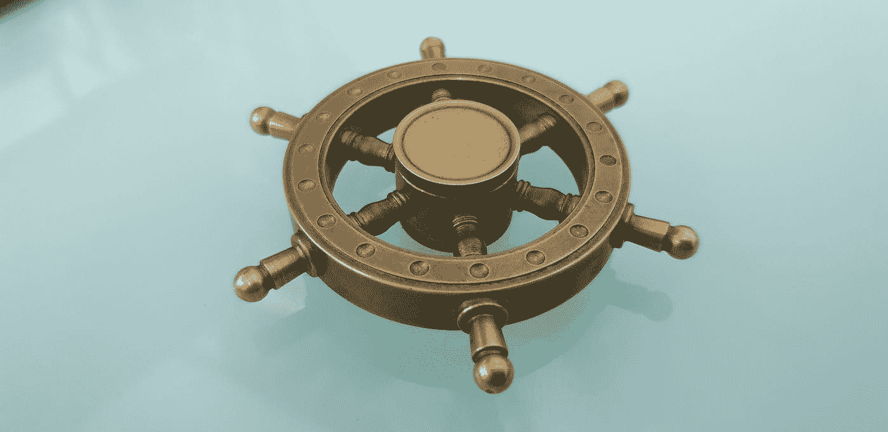

# Helm2 vs Helm3

> 原文：<https://itnext.io/helm2-vs-helm3-part-1-c76c29106e99?source=collection_archive---------0----------------------->



Syed Hussaini 在 [Unsplash](https://unsplash.com?utm_source=medium&utm_medium=referral) 上拍摄的照片

## 所以 Helm3 终于发布了。每个人都在和蒂勒说再见，但这并不是《头盔 3》的唯一变化。我们来讨论一下还有什么变化。

# **再见蒂勒**

是的，蒂勒已经被移除，这是一件好事，但要理解为什么我们需要了解一些背景知识。Tiller 是 Helm 的一个服务器端(运行在 Kubernetes 集群上)组件，它的主要目的是让多个不同的运营商能够使用同一套版本。Helm 2 开发时，Kubernetes 还没有基于角色的访问控制(RBAC ),因此要实现上述目标，Helm 必须自己解决。它必须跟踪允许谁在哪里安装什么。从 Kubernetes 1.6 开始，这种复杂性就不再需要了，RBAC 是默认启用的，所以没有必要让 Helm 去做 Kubernetes 本来就可以做的工作，这就是为什么在 Helm 3 中舵柄被完全移除了。

舵柄也被用作舵释放信息和保持舵状态的中心枢纽。在 Helm 3 中，相同的信息直接从 Kubernetes API 服务器获取，图表在客户端呈现，这使得 Helm 3 对 Kubernetes 来说更加“本地”和简单。

随着蒂勒的消失，头盔的安全模型也被简化了(RBAC 启用锁定蒂勒用于生产场景是很难管理的)。头盔权限现在可以用 kubeconfig 文件简单评估。因此，集群管理员可以将用户权限限制在他们想要的任何级别，而版本仍然记录在集群中，Helm 的其余功能保持不变。

# 好吧，让我们忘记蒂勒。还有什么变化？

正如我在开头提到的——去除分蘖是一件大事，但不是唯一的重大改变。再来看看其他:

*   **三向战略合并补丁**

头盔 2 使用了双向战略合并补丁。这意味着当你想要执行任何*掌舵*操作时，它会将最新的清单图表与建议的图表清单进行比较。它检查这两个图表之间的差异，以确定需要对 Kubernetes 中的资源进行哪些更改。听起来很聪明，对吧？问题是，如果更改被“手动”应用到集群中(例如通过 *kubectl edit* )，它们就不会被考虑。这导致资源无法回滚到其以前的状态，因为 Helm2 只检查了最后应用的图表清单作为其当前状态，并且由于图表状态没有变化(我们只更改了集群上的实时状态), Helm 认为没有必要执行回滚。

这就是三向战略合并补丁来拯救。Helm3 是怎么做到的？它也简单地考虑了活动状态(因此是 3 路而不是 2 路，因为现在我们有旧的清单、它的活动状态和新的清单)。例如，假设您部署了一个应用程序，它具有:

```
helm install very_important_app ./very_important_app
```

例如，此应用程序图表被设置为具有 3 个副本集。现在，如果有人误将执行 *kubectl 编辑*或:

```
kubectl scale -replicas=0 deployment/very_important_app
```

然后，您团队中的某个人会意识到，由于某种神秘的原因，very_important_app 关闭了，并会尝试执行:

```
helm rollback very_important_app
```

在头盔 2 中，它会生成一个补丁，将旧的清单与新的清单进行比较。因为这是一次回滚，并且某人只更改了实时状态(因此清单没有更改)，所以 Helm 会确定没有要回滚的内容，因为旧清单和新清单之间没有差异(两者都预期有 3 个副本)。此时不执行回滚，复制副本数继续保持为零。你现在开始恐慌…

另一方面，在 Helm 3 中，补丁是使用旧的清单、活动状态和新的清单生成的。Helm 认识到旧状态是 3，活动状态是 0，所以它确定新的清单意愿将它改回 3，所以它生成一个补丁来修复它。你现在不要恐慌了…

Helm 3 在执行升级时也会发生类似的过程。因为它现在考虑了活动状态，所以例如，如果一些基于控制器的应用程序(或类似服务网格的东西)向通过 Helm 部署的 kubernetes 对象中注入任何东西，它将在使用 Helm2 的 *helm 升级*过程中被移除。《头盔 3》没有做到这一点——同样，它考虑到了实时状态。假设我们想在集群上安装 Istio。Istio 将开始在任何部署中注入边车容器，所以假设你用 Helm 部署了一些东西，你的部署包括:

```
containers:
- name: server
  image: my_app:2.0.0
```

然后您安装了 Istio，所以您的容器定义现在看起来像这样:

```
containers:
- name: server
  image: my_app:2.0.0
- name: istio-sidecar
  image: istio-sidecar-proxy:1.0.0
```

如果您现在使用 Helm2 执行升级过程，您将得到以下结果:

```
containers:
- name: server
  image: my_app:2.1.0
```

Istio sidecar 被删除，因为它不在图表中。然而，Helm 3 在旧清单、活动状态和新清单之间生成容器对象的补丁。它注意到新的清单将 image 标签更改为 2.1.0，但是 live state 包含一些额外的内容。所以用头盔 3 升级会如你所料:

```
containers:
- name: server
  image: my_app:2.1.0
- name: istio-sidecar
  image: istio-sidecar-proxy:1.0.0
```

三路战略合并补丁使掌舵方式更可预测和更安全。你再也不用担心事情会变糟。


乔治·特罗瓦托在 [Unsplash](https://unsplash.com?utm_source=medium&utm_medium=referral) 上的照片

**秘密作为默认存储驱动**

Helm 2 使用配置图来存储发布信息。在《头盔 3》中，秘密被用作默认的存储驱动(秘密类型为*helm.sh/release*)。这带来了一些好处，极大地简化了 Helm 的功能。为了获取(并应用)配置，Helm2 必须执行相当多的操作，因为配置本身被加密存储并存档在一个密钥或 ConfigMap 中。Helm3 将配置直接存储在秘密中，因此无需执行多个操作来获取它，它可以简单地取出秘密，解密并应用。另一个优点是发布名称在集群中不再是唯一的。包含版本的机密存储在安装版本的名称空间中。因此，只要它们位于不同的名称空间中，您就可以拥有多个同名的版本。

**JSON 模式图表验证**

现在可以对图表值强制进行 JSON 模式验证。使用该功能，您可以确保用户提供的值遵循图表维护者创建的模式。这为 OPS 和 DEV 的合作创造了更多的可能性(OPS 团队可以给 DEV 更多的自由),并在用户试图为图表使用一组不正确的值时提供更好的错误报告。

**现在需要发布名称**

在头盔 2 中，如果没有提供名字，将会产生一个随机的名字。如果 helm install 没有提供名称，Helm 3 将会抛出一个错误(如果您仍然想使用随机名称，最终您可以使用 *— generate-name* 标志)

***掌舵发球*撤下**

没有多少人使用 *helm serve (* 用于在你的机器上运行本地图表库用于开发目的 *)* ，但是对于那些使用过的人来说——它现在被移除了。尽管你仍然可以把它作为一个插件来使用。

**不再自动创建名称空间**

当在一个不存在的名称空间中创建一个版本时，Helm 2 会自动创建它。Helm 3 遵循其他 Kubernetes 工具的行为，如果名称空间不存在，则返回一个错误。

这是掌舵中最重要的变化，还有更多。如果你有兴趣，请查看官方文件。在第 2 部分中，我将向您展示如何从 Helm2 迁移到 Helm3。