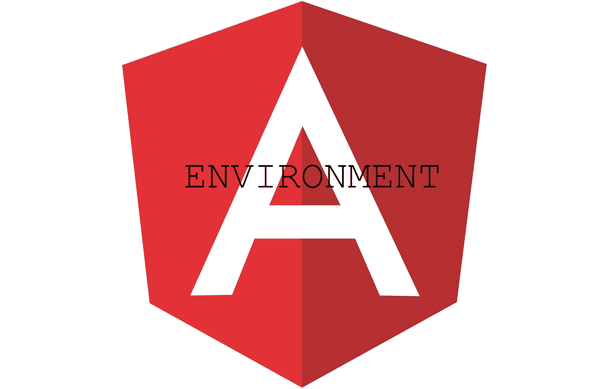

# 救命，我已经从 environment.prod 导入了环境！

> 原文：<https://itnext.io/help-ive-imported-environment-from-environment-prod-e60aefab71ee?source=collection_archive---------6----------------------->

即在构建时被替换的角度环境文件。



当人们错误地导入环境时，如何自动执行“不再从环境导入环境”和保持警惕和愤怒？因为 VS 代码和现代 Typescript 使得犯这个错误变得非常简单。只需将`Ctrl + .`和`Enter`放在带下划线的`environment`上面，我们就能得到环境。通常，我们会得到

`import{environment} from ‘../environments/environment’;`

但是有时候我们会

`import{environment} from ‘../environments/environment.prod’;`

你可能会问,**和**有什么不同？在**第二种情况**中，我们希望使用**环境**来做出逻辑决策的模块/组件，我们总是选择`prod`——无论是在生产、暂存还是开发/质量保证阶段。更糟糕的是，到了`from ‘../environments/environment.qa’`的时候，这个问题只会在生产中表现出来！不酷！

好吧，所以答案是——进口时要小心——是吗？嗯，这可能在 99%的情况下有效。而当有人忘记、遗漏了那 1%的时候，就会带来悲伤和愤怒。

那么——我们如何实现自动化呢？

答案是`[**tslint**](https://palantir.github.io/tslint/)` **。如果你还没有使用它，这可能是开始的时候了。它对您的代码进行静态分析，并可以帮助自动化各种检查。包括[黑名单进口](https://palantir.github.io/tslint/rules/import-blacklist/)。**

Then we can do 【 and we’ll get an error:

```
ERROR: c:/Users/myUser/test/src/app/core/core.module.ts:1:30 - This import is blacklisted by /\/.*environment\.(prod|staging|demo|local)/
```

If we do this as part of our CI, then no more code with this import will be allowed in production. And the best part is — it’s automated and we won’t rely on everyone being **进口时小心**。

对于旧的`tslint`版本，升级不是一个选项，可以根据导入的深度列出许多导入的排列:

```
"../environment/environment.prod",
"../../environment/environment.prod",
"../../../environment/environment.prod",
"../../../../environment/environment.prod",
and so on
```