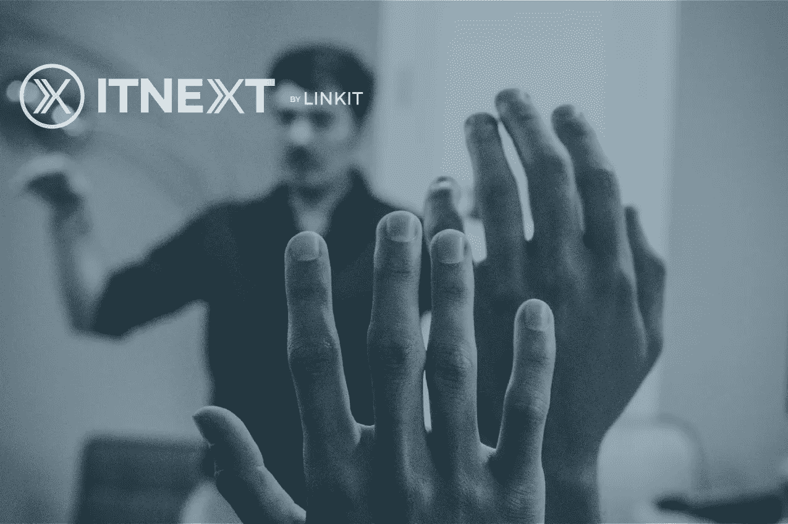

# 帮助塑造 it 的未来 NEXT！

> 原文：<https://itnext.io/help-shape-the-future-of-itnext-7fb2f714faa6?source=collection_archive---------3----------------------->

曾几何时，ITNEXT 最初是 LINKIT 网站上的一个页面，我们的同事在那里分享他们的技术知识。三年前，我们把它移到了媒体旁边，并邀请不同的作者与我们分享他们的文章。如今，ITNEXT 拥有超过 36 000 名热心读者。感谢大家让它成为现在的样子！

现在，我们想再迈出一步，比以往任何时候都更加团结我们的社区。因此，我们想更多地了解我们的读者、作者和他们的期望。通过回答以下调查中的问题，您可以帮助我们改进它，并为该社区提供更多服务。

不要忘记在调查中留下您的电子邮件。这样做的人将有机会赢得一整年的媒体订阅！

您可以在此处找到该调查:👉[https://bit.ly/2YE1xRO](https://bit.ly/2YE1xRO)👈

我们提前感谢您抽出时间填写调查。