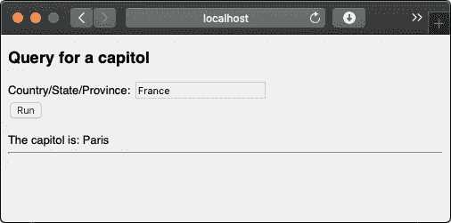
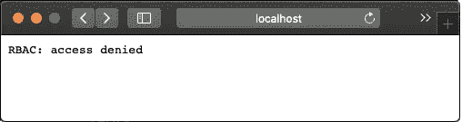
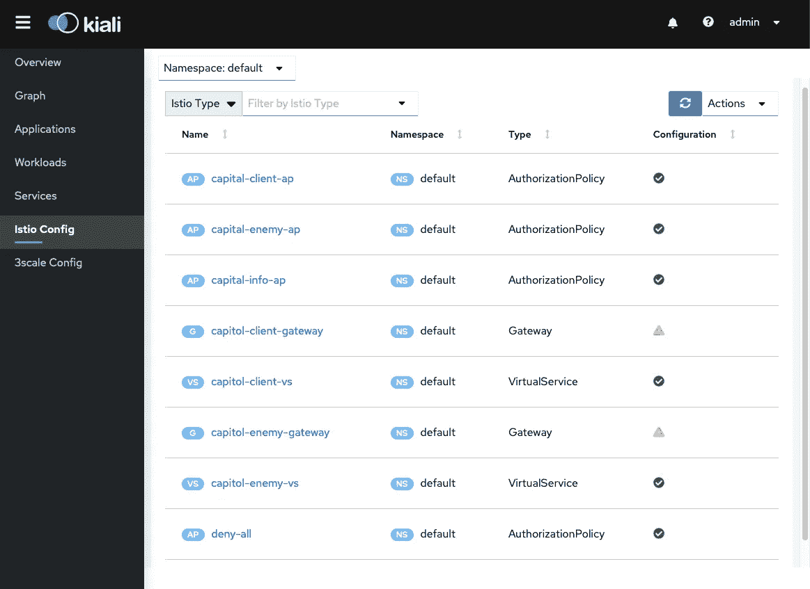
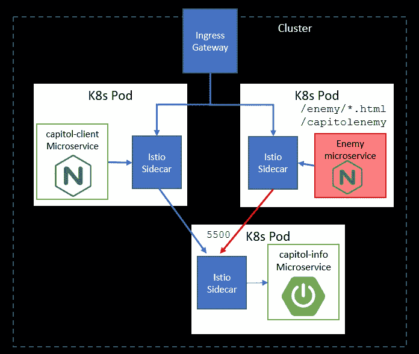
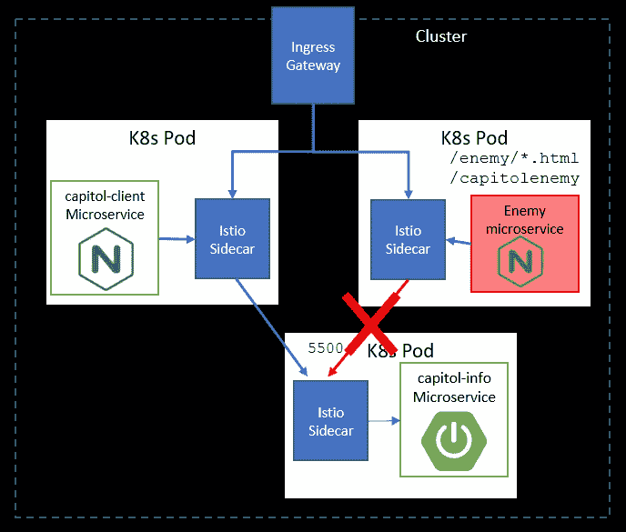

# 使用 Istio 服务网格帮助实现零信任网络

> 原文：<https://itnext.io/helping-reach-a-zero-trust-network-using-an-istio-service-mesh-ca4865d46e61?source=collection_archive---------3----------------------->

最近，我把大一的女儿送到了她的大学宿舍，准备秋季学期开学——在新冠肺炎时代，宿舍是开放的，但课程都是在线的。像许多宿舍一样，大厅的入口和单独的宿舍一样都有锁。你能进宿舍，不代表你能进每个房间。这个设置让我想到了在 Kubernetes 上运行的微服务的零信任和服务网格。

微服务提供了许多好处，包括独立扩展、业务逻辑隔离、独立的生命周期管理和更容易的分布式开发。然而，这些好处是有代价的，因为微服务会增加您的安全漏洞，所以会有更多的攻击面——每个微服务都是一个目标。如果入侵者进入了您的网络，他们可能会肆无忌惮地攻击单个微服务。因此，仅仅保护网络边界是不够的，还必须保护网络内部。这就是零信任的由来。

零信任是由约翰·金德瓦格(John Kindervag)提出的概念，即无论你的网络边界内外，没有任何东西是绝对可信的。它要求显式验证，并使用最小特权原则来限制对资源的访问。在本文中，我展示了将 Istio 服务网格配置为零信任网络的步骤。具体来说，我给出了一个简单的示例微服务架构，然后通过移除隐式的服务到服务信任，用 Istio 锁定它。

试图用自主开发的解决方案来保护微服务网络既困难又令人困惑。在这种情况下，服务网格(如 Istio)会有所帮助。它保障了南北交通和东西交通。南北流量是进入(入口)和离开(出口)服务网格的流量。东西向流量是网格内的流量，通常是服务到服务的流量。Istio 通过入口和出口网关处理南北流量，流量路由由虚拟服务管理。Istio 的特使代理管理东西向的流量，在它所保护的服务的 Kubernetes pod 中作为边车运行。现在让我们看一个应用于小型服务网格的例子。

# 在服务网格之外公开服务

在这个例子中，我们将从两个微服务开始——一个运行在 NGINX web 服务器上的 web 客户端和一个 Java/Spring Boot 后端 REST 服务。我在早先一篇关于 [Istio Performance](https://medium.com/@pklinker/performance-impacts-of-an-istio-service-mesh-63957a0000b) 的文章中详细描述了这些服务。

该客户端是一个“友好”的客户端，我们将允许它访问后端服务。稍后，我们将向网格中添加第三个微服务——一个恶意的“敌人”web 客户端，它将被拒绝访问后端微服务。称为“capitol-info”的后端微服务具有查询和插入国家首都数据库的能力。这些微服务公开的端点如下图所示。此图显示了一个开放的、无保护的服务网状架构。

在 Istio 服务网格中运行的 Capitol-client 微服务和 capitol-info 微服务

因为我们试图保护服务网格的微服务，所以我们不想将来自客户端网站的调用重定向到后端微服务。相反，我们希望创建一个 API 网关，并允许网关代表我们调用服务，从而实现服务到服务的调用。NGINX 在 web 客户端的 */capitolservice* 路径下提供了一个 API 网关。当通过这个路径调用 web 客户端时，NGINX 网关代理对 capitol-info 服务的调用。

对于 Istio 配置，我们首先为客户端和数据提供微服务入口网关和虚拟服务。入口网关是标准的端口 80 (web)网关，因此我们将关注 Istio 虚拟服务来处理流量路由。我们从 capitol-info 服务开始，如下面的虚拟服务定义所示:

Capitol Service 虚拟服务定义

capitol-info 服务虚拟服务表明，我们只向入站流量开放了 *getCapitol* REST 操作，而不是由 *addCapitol* REST 操作定义的插入功能。因此 *addCapitol* REST 操作受到保护，不会受到外部(南北)调用的影响，但不会受到服务网格内其他微服务的调用(东西调用)的影响。getCapitol 呼叫目前对南北和东西呼叫完全开放。

capitol-客户端虚拟服务定义

capitol-client 虚拟服务显示，我们正在打开位于 */capitolservice* 下的 API 网关，以及位于 */info* 路径*下的 HTML 页面。*

# 锁定微服务

现在我们已经介绍了基本的架构，我们使用授权策略来锁定它。这是迈向零信任网络的重要一步——我们不再隐式信任网格中的其他服务。

为了锁定微服务，我们首先使用 [deny-all](https://istio.io/pt-br/docs/concepts/security/#allow-all-and-deny-all) 策略，并将其应用于我们的名称空间(**默认**)，阻止所有访问。我们现在创建一个 Istio *授权策略*来开始开放我们的端点。在第一个示例中，我们应用了一个策略，允许任何调用者访问我们之前创建的资源:

您可以看到，我们允许基于 HTTP 操作(GET、POST)和 URI 路径访问微服务。请注意，我们必须将 NGINX API 网关 */capitolservice* 添加到授权策略中，以允许它可到达。如果它丢失了，网页会显示出来，但是调用后端 capitol-info 微服务的功能会被阻塞。

一旦应用了这个授权策略，我们就能够访问我们的 web 页面和 REST 端点。请注意，即使我们允许任何人访问*/add capital*，外部世界仍然无法访问它，因为我们没有在虚拟服务中创建路由。如果我们导航到 web 客户端来查询国会大厦，[http://localhost/info/querycapitol . html，](http://localhost/info/QueryCapitol.html,)我们将能够到达该站点并运行查询:

客户端微服务—查询国会网页

既然我们已经使用宽松的授权策略打开了流量备份，那么让我们来看看一些选择性的锁定策略。如果我们通过删除允许 web ( */info* )和 API ( */capitolservice* )访问的条目来关闭对 web 客户端的访问，那么我们就阻止了流量进入 capitol-client。例如，查看下面的客户端和服务器授权策略，如果我们要应用只允许访问 capitol 数据服务的策略，它将阻止对网站的访问。南北向入站流量唯一可用的资源是 */getCapitol* REST 呼叫，而 */appCapito* l 仍然由于缺乏虚拟服务路由而被阻塞。

因为 capitol-client 也在默认的名称空间中运行，所以它是不可访问的。由于我们没有明确授予特权，因此 deny all 策略对这些资源有效。现在，当我们导航到网页[http://localhost/info/get capitol . html](http://localhost/info/GetCapital.html)时，我们得到一个拒绝访问。

封锁网页是一件奇怪的事情，相反，我们希望保护后端 API 不被外界访问，并打开网站。现在，假设我们决定不希望任何人直接从 capitol-info 服务获取数据，而是只通过 capitol-client。我们可以移除入口，阻止外部流量，但服务网格中的其他实体仍然可以访问它。我们不是通过仅阻止外部流量来实现零信任，我们还需要阻止未经批准的内部服务对服务流量。

上述授权策略的一个问题是它对于名称空间是全局的(**默认**)。这意味着规则适用于名称空间内的所有服务。我们知道 capitol-info 微服务和 capitol-client 微服务具有不同的端点，因此让我们为适当的服务配置设置。

## **客户授权政策**

上述客户端策略开放了来自服务网格外部以及内部客户端的入站流量，因为它没有指定从开始的*规则，而只指定了从*到*的规则。*

## **服务器授权策略**

应用上述策略为 capitol-client 和 capitol-info 微服务提供了它们自己的授权策略。查看 Istio 的 Kiali 服务网格仪表板，我们能够看到我们应用的授权策略。

Kiala 仪表板显示 Istio 网关、虚拟服务和授权策略。

这些特定策略的含义意味着，作为微服务的所有者，我可以控制谁可以访问它们。

随着授权策略的分离，我们能够锁定 capitol-info 服务，仅用于可信的东西向流量。

更新后的 capitol-info 授权策略将流量限制为仅来自默认域内的 capitol-client 微服务的呼叫。这是因为我们在来自规则的*中指定了主体。为了测试这一点，让我们在网格中添加一个“敌人”微服务。如前所述，零信任意味着不隐式地信任其他参与者，所以仅仅因为一个微服务存在于服务网格中，并不意味着我们信任它。我们的数据服务维护自己的安全配置，所以它决定谁和谁不可信。*

假设恶意的内部人员将敌人的服务部署到服务网格中。该敌方服务模仿有效友好客户端的 URIs 和 API 网关，如下图所示:

如果没有东西方安全控制，恶意微服务会造成严重破坏

如果我们不指定限制性的 capitol-info 授权策略，敌人的微服务将能够直接调用 capitol-info 微服务。假设敌方服务更进一步，声明自己的授权策略来覆盖*拒绝所有*策略，并将其部署到集群中:

如果你看看敌人微服务的配置，它正试图通过添加自己的 *ALLOW* 语句来覆盖 capitol-info 服务策略。另一个 *ALLOW* 语句(/enemy*和/capitolone *)覆盖了 *deny-all* 策略。允许对/ *getCapitol* API 进行 HTTP GET 和 POST 操作的最后一条规则不会被覆盖和忽略。当我们试图从敌方客户端调用 *getCapitol* 或 *addCapitol* REST 操作时，调用被阻塞，数据服务受到保护。

在零信任网络中，敌人的微服务被阻止到达其他微服务

为了进一步保护我们的数据服务，现在我们已经通过授权策略保护了服务到服务的通信，我们可以删除 capitol-info 入口网关和虚拟服务，只允许通过 capitol-client 网页和 API 网关进行访问。

# 结论

在本文中，我展示了如何应用零信任原则，将服务网格锁定为仅来自可信来源的流量。使用 Istio，您有许多资源来限制对微服务的访问，包括限制虚拟服务和基于流量的来源和目的地实施授权策略。