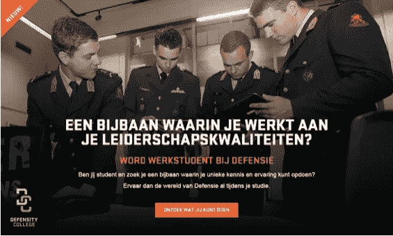

# 把国防网络和数字安全联系起来！

> 原文：<https://itnext.io/henk-ras-over-het-defensie-cyber-commando-en-de-digitale-veiligheid-dbddeebf7e24?source=collection_archive---------1----------------------->

这是对 Henk Ras 副指挥官和国防网络司令部的一个采访的一部分。这个访谈的第二部分是:

> [#2:超越国防网络指挥和数字安全的种族](https://www.linkit.nl/knowledge-base/265/Henk_Ras_over_het_Defensie_Cyber_Commando_en_de_digitale_veiligheid_deel_2)

几周前我们有机会采访了国防网络司令部的 Henk Ras 上校和参谋长。[it 2016](https://www.itnext2016.nl/)的参与者可能还记得他介绍了当前网络安全的威胁和发展。Henk Ras 告诉我荷兰网络安全的发展以及这些对政府和国防的意义。当然，在这个精彩的介绍之后，我们想知道还能说些什么。

访问期间，我们询问了他在 DCC 中的确切角色和职责，并了解了任务、操作模式和相关组织。此次采访由亨克尔、IT 研究人员和内容营销人员主持，账户安全经理蒂姆·多斯(tim doets)在左翼。

## **亨克，你能告诉我们更多关于你在 DCC 中的作用以及这一倡议是如何产生的吗？**

在 DCC，除了总参谋部，我也是副司令，当我观察到汉斯·福尔默准将，DCC 指挥官。在 DCC 中，我们有三个主要任务:

1.  为部队的部署提供综合军事行动网络能力(包括进攻能力)；
2.  协调和匹配网络活动和国防能力及其合作伙伴；
3.  获得、传播和提供网络专业知识。

DCC 在管理上属于皇家国家权力，操作支持命令(OOCL)支持我们从 aperture，这些功能我们自己没有。除此之外，在苏尔特堡的杜穆兰军营有一所学校或网络专家中心。这是一个有意识的选择因为在海牙的碧翠丝军营会成为一个安全的地方。苏思婷是我们与企业和大学的合作伙伴。

## **您是否有意识地选择像 IT Next2016 那样以 DCC 的身份参加访谈和活动？因为你想展示 DCC 的功能？**

我之所以在 IT Next2016 年和其他事件上发言是因为我认为这很重要以最广义的角度来说我们是在网络防御。另外，我认为重要的是要强调，我们不能独自做到这一点。荷兰的数字安全关乎我们所有人军事和公民所以我们都是其中的一员。荷兰的公司自己也要为自己的网络安全负责。当我这么说的时候，人们经常会感到惊讶，而这个想法通常是这样的:“我们不是有一个防御网络命令吗？”不 DCC 主要用于支持网络功能任务。而先遣队是为了我们自己的系统安全。因此，保护我们的关键基础架构是企业自身的责任。我认为大公司和 IT 行业能够很好地保护自己免受网络攻击，他们也有足够的资金。但是，在中小型企业内部，有些公司的规模已经足够大，可以很有意思，但规模太小，无法拥有自己的 IT 部门来抵御更大的网络攻击。有多少人没有？从商业的角度来看，它与国家网络安全中心(NCSC)是安全和司法部(MINV&J)的合作伙伴。NCSC 与对社会至关重要的“关键”公司合作。根据 NSCS 的“T0”网站“我们建立专业知识，提供建议，应对威胁和事件，并加强危机管理。我们还向公民、政府和企业提供有关数字安全和预防的信息和建议。”

## **你能告诉我们任务是如何进行的吗？或者你有任务，你在其中扮演什么角色？**

从 DCC 来看，我们基本上只能为一个任务而战，例如阿富汗或马里，如果政府决定采取行动，并通过所谓的第 100 条信证实这一点。信的第 100 条是政府决定支持一项国际任务。它还描述了我们的任务。

2016 年 12 月，我们与 38 个国家一起参加了一个国际演习，网络联盟 16 号演习。作为荷兰，我们是唯一一个邀请工业国加入的国家。在这次演习中，共有 15 人象征性地建立了一个新的企业:EPIC consortium。你可以在实践中看到人们对网络安全的合作非常兴奋。

与北约合作，你可以被部署在非常不同的地区，我们称之为*为【任务授权】*。所以我们按任务来看我们是否需要在那里进行体能训练。有时，这是不必要的，您可以使用所谓的“响应能力”从这里执行必要的操作。因此，我们会在每一个任务中寻找网络操作团队的组成，规模，我们可以在这里做什么，以及我们需要在现场做什么。我们希望我们的占地面积尽可能小；有限的预算或允许的最大工作人员容量限制了您的投资，因此您必须充分利用您的能力和资源。

我们不可能控制所有现有的市场认知。你需要彼此，如果你能提供这种形式和内容的交流，那就太好了。我们可以，所以我们想和公司合作。如果一家公司问我们你想测试我们的基础设施你需要相互信任。但这也是我们一方面练习滑雪的机会。对企业来说，一个成熟的工具就是网络备份。他或她可以参加我们的练习，这样我们就可以建立与一家公司的关系。我们有 50 个网络备件，到目前为止我们已经完成了 17 个功能。

## **除了进攻，DCC 还执行其他任务或角色吗？**

DCC 具有攻击性网络能力，但要想成功攻击，还必须具备防御能力和情报意识。因此，当社会需要帮助时，我们也可以得到帮助。

为了澄清国防部的网络设施 Henk Ras 给了我一份声明：

4 个负责 Henk Ras 网络安全的部门

在右边，你可以看到我们，进攻 DCC。左边是国防、国防、安全、国防、国防、国防联合签名网(JSCU)的情报和皇家 maresau 的执法部门。防御任务每天都在发生:监控、监控、保护、保护。那就是"每日生意"和"支持军事行动"的第 100 条之间的区别。

## **国防部如何开发和维护 DCC 内的知识？**

作为 DCC，我们与 paul ducheine 准将合作，他在荷兰国防学院工作，是阿姆斯特丹大学的教授。此外，我们还与福克斯公司合作开展网络培训计划。有了 Certified Secure 公司，我们组织了一个由 10 个模块组成的网络挑战，最终有 800 人参加。我们申请了 9 到 10 个月的 fox-it 培训。

*国防高等专科学校 [*国防部*](https://werkenbijdefensie.nl/werkstudent)*

我们最近还发起了另一个新的倡议:国防学院。通过管理和共享，已有 125 个注册。最棒的是，除了他们目前的教育之外，他们还能找到工作学习的地方。多样性也很惊人，一半的参与者是女性。我们可以用另一种方式来实现这一点，这是很酷的。我也很高兴我们能敞开心胸接纳新的想法和新的年轻人。我们为 DCC 做了初步的内部收购当然有一天池塘会干涸。因此，重要的是向前看，并保持与新知识的持续交流。

## **到目前为止…**

简而言之，这是我们采访的第一部分我们和亨克 ras 谈过了关于 DCC 的建立，他在里面的角色，任务，任务，培训，以及其他角色。

此外，我们还可以将采访总结为几个重要的任务:

*   DCC 不负责保护荷兰海牙国际刑事法庭及其同伙主要负责支持军事行动。
*   DCC 还在他的童鞋里所以相对较小。但是，我们可以在这次访问中了解到网络现在和将来的重要性，并且 DCC 希望不断学习。
*   NCSC 负责公司内部的业务支持和网络安全事件。但是，这是支持，因此不是替代。
*   有兴趣加入 DCC 吗？今后，该部门可能还会进行外部招募，目前，您仍需遵循传统的方法，请参阅“t8”【https://work defence . nl/work student”或“T10”【https://work defence . com”

在第二部分，也就是这个访谈的最后一部分，我们将深入了解 Henk Ras 和 DCC 的其他部分。