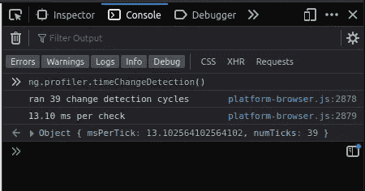

# 以下是如何在您的应用程序中找到变化检测瓶颈的方法。

> 原文：<https://itnext.io/heres-how-to-find-the-change-detection-bottle-necks-in-your-angular-application-333a71758477?source=collection_archive---------1----------------------->


[本多·金](https://unsplash.com/@bundo?utm_source=medium&utm_medium=referral)在 [Unsplash](https://unsplash.com?utm_source=medium&utm_medium=referral) 上的照片

## 并探索让您的角度应用充满活力的方法。

您知道角度变化检测有局限性吗？

如果你不明智，它会变得迟钝和酸涩，让你看起来像一个糟糕的开发者。

我们打开 Angular 引擎的引擎盖怎么样？

并了解如何检测和修复变更检测问题？

[](https://school.danielk.tech/course/unleash-your-angular-testing-skills?utm_source=medium&utm_medium=banner&utm_campaign=unleash_testing_skills)

# 角度变化检测是如何工作的？

Angular 使用一个广为人知的库 Zone.js 来检测 DOM 事件。这些 DOM 事件是鼠标点击、键盘按压等等。

当 Zone.js 检测到一个 DOM 事件时，它会检查数据绑定并更新不正确的绑定，这样向用户显示的数据总是最新的。

简而言之，这就是变化检测。这可能是一个很酷的功能，但它有局限性…而且…如果你滥用角度变化检测，它会变得暴躁。

那么我们如何挖掘变更检测性能问题呢？

# 启用 Angular 的调试工具

打开`main.ts`文件(用于引导您的 Angular 应用程序)并编辑这些代码行...

```
platformBrowserDynamic().bootstrapModule(AppModule) 
   .catch(err => console.error(err));
```

…看起来像这样。

```
platformBrowserDynamic().bootstrapModule(AppModule) 
   .then(module => enableDebugTools(module.injector.get(ApplicationRef).components[0]))      .catch(err => console.error(err));
```

# 分析更改检测时间

现在我们已经启用了调试工具，我们可以使用它们来发现变更检测需要多长时间。

我们将使用`ng serve --open`运行我们的角度应用程序。

一旦它在您的浏览器中启动，就在开发人员工具中打开控制台，并键入以下命令来测量上一个变更检测周期持续了多长时间。

```
ng.profiler.timeChangeDetection()
```

对于非常基本的角度应用，变化检测周期预计为 0.01–0.05 毫秒。尽管意见不一，我还是建议你永远不要让你的变更检测周期超过 10ms。

# 那么，如何修复糟糕的变更检测性能呢？

假设我们有一个显示 5000 个随机数的角度组件。

```
import { Component, OnInit } from '@angular/core'; @Component({ 
   selector: 'app-number-list', 
   template: ` 
   <ul> 
      <li *ngFor="let number of numbers">{{ number }}</li> 
   </ul> 
  `, 
  styleUrls: ['./number-list.component.css'] 
}) export class NumberListComponent implements OnInit {    numbers: number[] = [];    constructor() { }    ngOnInit(): void { 
      this.generateNumbers(); 
   }    generateNumbers(): void { 
      for(let i = 0; i < 5000; i++) { 
         let number = Math.random(); 
         this.numbers.push(number); 
      } 
   } 
}
```

你认为它的性能会有多好？

当我检查变更检测周期时，至少需要 12-14 毫秒。😮



这是一个性能不佳组件的简单示例。列表是长变化检测周期的罪魁祸首，修复长列表的好方法是使用虚拟滚动策略。棱角分明的材质 CDK 有一个很棒的[虚拟滚动包](https://material.angular.io/cdk/scrolling/overview)值得一试。

# 结论

现在你明白了，我的朋友。您已经了解了如何快速启用变化检测调试，并找出角度变化检测需要多长时间。

现在，我的棱角忍者伙伴，如果你喜欢这篇文章，并发现它很有用，请务必点击它👏按钮，关注我，获取更多类似本文的精彩文章。

**关注我:** [GitHub](https://github.com/dkreider) ，[中型](https://dkreider.medium.com/)，[个人博客](https://danielk.tech)

[](https://school.danielk.tech/course/unleash-your-angular-testing-skills?utm_source=medium&utm_medium=banner&utm_campaign=unleash_testing_skills)[](https://dkreider.medium.com/add-feature-toggling-to-your-angular-app-the-ultimate-guide-2020-4548e01df07b) [## 为您的 Angular 应用程序添加切换功能(2020 年终极指南)

### 在角度应用中实现特征标志功能的终极指南

dkreider.medium.com](https://dkreider.medium.com/add-feature-toggling-to-your-angular-app-the-ultimate-guide-2020-4548e01df07b) [](https://dkreider.medium.com/how-to-add-a-spinner-to-an-angular-material-button-the-simplest-way-ever-69e2f7005f29) [## 如何将微调器添加到有角度的材质按钮。

### 呃…如果角状材料有一个带装载旋转器的按钮不是很好吗？

dkreider.medium.com](https://dkreider.medium.com/how-to-add-a-spinner-to-an-angular-material-button-the-simplest-way-ever-69e2f7005f29) [](https://dkreider.medium.com/why-i-choose-angular-instead-of-react-and-why-you-should-to-aef005c6d145) [## 为什么我选择有角度的…而不是反应。以及为什么你应该这么做。

### 那么…为什么那么多 React 粉丝认为 Angular 是一个要避免的很深很黑的框架？还是说太难学了？或者…

dkreider.medium.com](https://dkreider.medium.com/why-i-choose-angular-instead-of-react-and-why-you-should-to-aef005c6d145) 

*最初发布于*[*https://danielk . tech*](https://danielk.tech/home/heres-how-you-can-improve-angular-change-detection-performance)*。*