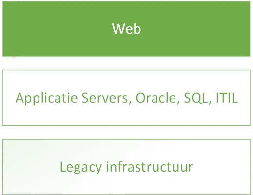
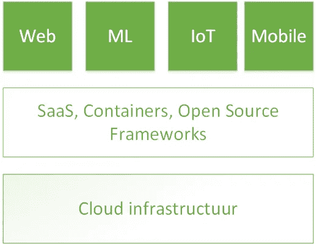

# 云计算对应用程序的影响

> 原文：<https://itnext.io/het-effect-van-cloud-computing-op-applicaties-3fa02c1a7e4f?source=collection_archive---------3----------------------->

云计算是任何腐败 IT 创新的驱动力。然而，云本身并不是目标，而是一个条件，因为它可以通过应用程序赚钱。云技术的不断发展对应用程序的发展有着不可逆转的影响。

## 历史记录

仅在 5 年前，IT 创新主要是由 IT 人员发起的，企业只使用 Web 或客户端服务器应用程序。ITIL 流程主要通过官僚变革咨询委员会来确保稳定性。随着企业的发展，客户几乎总是被迫购买额外的硬件和软件。高度可靠但可扩展的组织。

## 云革命

目前的云和应用程序开发已不再由 IT 组织推动，而是由业务驱动。应用程序必须在一天甚至一小时内完成，而不是在长时间的过程中完成。今后，开发人员越来越多地将其程序发送到[结构引擎](http://techcrunch.com/2016/03/31/microsofts-azure-service-fabric-microservice-platform-hits-general-availability/)，然后通过[作为服务的容器](https://blog.docker.com/2016/02/containers-as-a-service-caas/)进行超快速地清除。所有主要供应商都已提供此类[持续部署](http://electric-cloud.com/wiki/display/releasemanagement/Continuous+Deployment)功能，并在此处进行部署。

## 效果不可逆转

云计算的影响改变了应用程序的性质。web 浏览器以前是一个单一管理器，现在除了在 rap 中的移动应用程序之外，还在开发基于以下内容的应用程序:

*   机器学习(ML)
*   Google Cloud 机器学习平台
*   Microsoft Azure 机器学习工作室
*   IBM 华生
*   网际网路或物联网
*   Amazon IoT 平台
*   谷歌把我们的眼镜

特别是 SaaS 解决方案和企业云存储服务(Onedrive，Box)的使用已经彻底改变了常规应用程序的应用程序范围。您最近购买了多少免费软件？

Bernard Golden 被 Wired.com 评为云计算领域最有影响力的人之一，他对上述影响的描述非常清晰。请参阅他的文章“T6”【您的应用程序的云计算平均值】T7