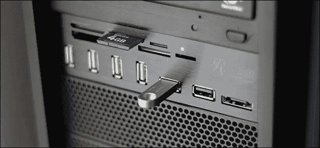
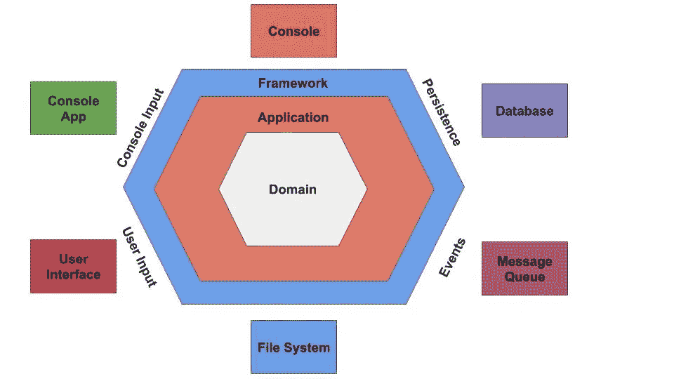
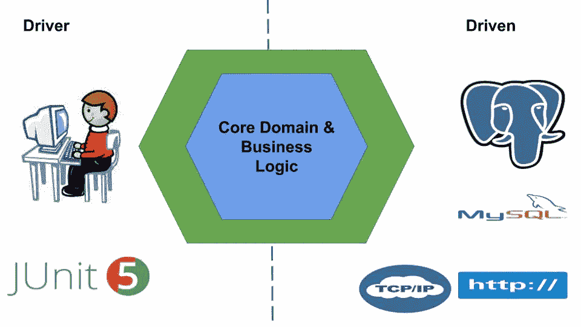
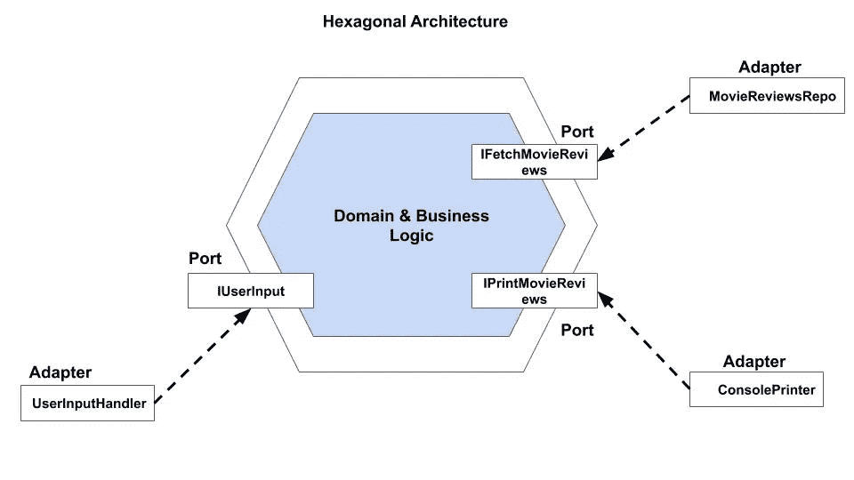

# 六边形体系结构 Java 中的原理和实例

> 原文：<https://itnext.io/hexagonal-architecture-principles-practical-example-in-java-364bb2e50075?source=collection_archive---------1----------------------->

实施六边形架构或端口和适配器架构

# **背景**

作为开发人员，在某个时候，您已经在没有很好维护的遗留软件上工作过。你知道理解用复杂代码块编写的简单逻辑的痛苦。此外，引入增强功能或新特性会给开发人员带来噩梦。

可维护性是优秀软件设计的核心。维护不好的代码库变得难以管理。它们不仅变得难以扩展，而且给新的开发者带来了一段艰难的时间来适应和进入状态。

在科技世界里，一切都在快速发展。假设您拥有一个遗留项目。如果企业要求您尽快推出新功能，或者您想从 RDBMS 迁移到 NoSQL，您的第一反应会是什么？

**痛打你的机器？**

高测试覆盖率增强了开发人员无缝部署新版本的信心。然而，如果您的应用程序和基础设施逻辑交织在一起，是否有可能单独测试您的业务逻辑？那只会加重你的挫败感。

**为什么是我？**

夸夸其谈到此为止，让我们带着插图参观一下六边形建筑。采用这种模式将帮助您提高代码库的可维护性、可测试性以及许多其他好处。

# **六角形建筑介绍**

2006 年，阿利斯泰尔·考克伯恩创造了术语*六角形建筑*。这种架构也被称为*端口和适配器*架构。简而言之，这个想法就是在软件中公开多个端点来进行通信。只要您的端口有合适的适配器，您的请求就会得到处理。

这类似于在一台机器上暴露多个 USB 端口。如果你有合适的适配器(移动充电器，或 Pendrive)适合你的机器的端口，你就能达到你的目标。

**适配器**

软件用六边形的形式来表示&应用程序业务逻辑构成了它的核心。它被与之通信的实体所包围&通过提供输入来驱动它的组件。

在现实世界中，不同的实体，如用户操作、API 调用、自动化脚本和单元测试，都与您的软件交互，并提供各种输入。如果您的业务逻辑与用户界面代码纠缠在一起，您会发现许多困难。例如:-从用户驱动的输入切换到单元测试驱动的输入会变得很麻烦。

类似地，应用程序通过 HTTP API 调用与外部实体(如数据库、消息队列、web 服务器等)进行交互。如果您想迁移数据库或将数据转储到文件系统，您应该能够在不影响业务逻辑的情况下实现这一点。

正如名称' **Ports And Adapter** '所暗示的，它定义了端口，端口是进行通信的手段。适配器是在核心中处理用户输入并将其转换为特定于语言的消息调用的组件。同样，适配器封装了与外部系统(如数据库、消息队列等)交互的逻辑，并促进了核心和外部对象之间的通信。

# **工作**

让我们深入研究一下这个模式。下图显示了应用程序划分的不同层

**六角形建筑**

六角形架构将应用程序分为三层——域、应用程序和框架。以下是对这三层的简要描述

*   **域** —这一层包含核心业务逻辑。它不应该知道外层的实现细节
*   **应用** —这一层充当领域和框架之间的粘合剂
*   **框架** —它实现了域如何与外部世界交互。内层充当该层的黑盒

根据该架构，两个角色(主要和次要)与应用程序交互。主要参与者发送请求或驱动应用程序。例如——用户或自动化测试套件。次要角色为域提供基础设施，以便与外部实体进行通信。例如，数据库适配器、TCP 或 HTTP 客户端。

让我们在下面的图表中表示参与者

**六角形建筑**

六边形的左侧由驱动器(为内核提供输入)组成，而右侧代表由我们的应用驱动的所有组件。

# **插图**

让我们设计一个存储电影评论的应用程序。用户可以用电影名称查询应用程序。该应用程序会为给定的电影随机返回五条评论。

为了简单起见，我们假设它是一个控制台应用程序。电影评论数据存储在内存中。用户响应打印在控制台上。

我们有向应用程序发送请求的用户。这样，用户就变成了司机。该应用程序可以从任何数据存储中获取数据。应用程序可以将响应写在控制台或文件上。因此，数据获取器和响应打印机成为被驱动的实体。

下图解释了驱动和从动部件:-

**电影评论 App 的六边形架构**

在左边，我们有驱动程序，它为应用程序提供输入。驱动组件位于右侧，使应用程序能够与数据库和控制台通信。

让我们快速浏览一下上面的应用程序。

## **驱动端口**

**驱动端口**

## 驱动端口

**从动端口**

## 驱动端口适配器

电影提取器将从电影报告中提取电影。我们将有一台控制台打印机，它将在控制台上打印电影评论。让我们实现上面的两个接口。

**控制台打印和电影查看报告**

## 领域

我们的核心域处理用户请求。核心将获取电影，处理它们，并将结果传递给打印机。目前，我们只有一个请求，即搜索电影。我们将使用标准的 Java *消费者*接口来处理用户请求。

让我们看看我们的核心域类，即 MovieApp。

**电影 App**

我们现在将定义一个命令映射器，它将命令与特定的处理程序进行映射。

**命令映射器**

## 驱动适配器

用户将通过 *IUserInput* 界面与我们的系统进行交互。让我们实现这个接口。该实现将构建一个用例模型。它将使用模型跑步者并委派动作。

## 主要演员

现在，我们将看看我们的主要参与者用户，它将使用上述接口进行通信。

**电影用户**

## 电影应用程序

我们现在将创建控制台应用程序。我们将在应用程序中添加驱动适配器作为依赖项。用户将创建并向应用程序发送请求。应用程序将获取数据，处理并在控制台上打印响应。

**电影应用**

**新功能/变化**

*   在上面的示例中，您可以轻松地从一个数据存储切换到另一个数据存储，只需进行最小的更改。可以在不改变现有业务逻辑的情况下将数据存储依赖注入到代码中。例如，您可以将内存中的数据移动到数据库，在应用程序中编写并注入数据库适配器
*   类似地，除了控制台打印机之外，您还可以拥有一台可以写入文件系统的打印机。在这样一个分层的应用程序中引入新功能和修复错误变得很简单
*   您可以编写全面的测试来测试您的业务逻辑。适配器可以单独测试。因此，应用程序的整体测试覆盖率可以得到提高

# **结论**

我们已经了解了采用六边形架构的以下好处

*   **可维护性** —我们构建松散耦合且独立的层。在一个层中添加新功能而不影响其他层变得很容易。
*   可测试性 —单元测试写起来便宜，运行起来也快。我们可以为每一层编写测试。我们可以在测试时模拟依赖关系。例如:-我们可以通过添加内存中的数据存储来模拟数据库依赖性。
*   适应性——我们的核心领域变得独立于外部实体的变化。例如:-如果我们计划使用不同的数据库，我们不需要改变域。我们可以引入适当的数据库适配器。

# **参考文献**

*   [阿利斯泰尔·考克伯恩的六角形建筑](https://alistair.cockburn.us/hexagonal-architecture/)
*   [六角形建筑-维基](https://wiki.c2.com/?HexagonalArchitecture)
*   [端口和适配器架构](https://softwarecampament.wordpress.com/portsadapters/)
*   [吉菲](https://giphy.com/)