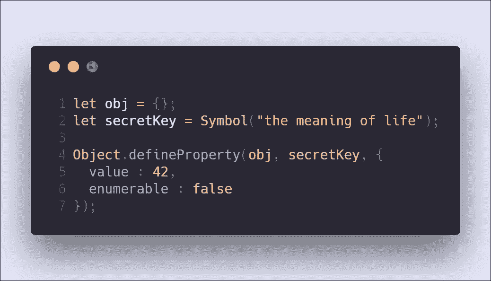

# 在 JavaScript 中隐藏属性

> 原文：<https://itnext.io/hidden-properties-in-javascript-73b52def1589?source=collection_archive---------6----------------------->

## 有时候，你想在一个对象上定义一个属性，这个属性不容易被你没有写的代码访问。

有几种方法可以创建所谓的“隐藏属性”，而不需要查看由闭包封闭的变量之类的东西，这些东西受到范围规则的限制。

# Now-classic，不可枚举属性

您可以使用`Object.defineProperty`来创建未标记为`enumerable`的属性。这使得当你用某些方法枚举对象的属性时，比如`for ... in`循环和`Object.keys`函数，这个属性不会显示出来。

然而，您仍然可以使用`Object.getOwnPropertyNames`函数找到它，该函数甚至返回不可枚举的属性。当然，你仍然可以通过它的键访问属性，理论上，它只是一个任何人都可以构建的字符串。

## 笔记

1.  属性实际上并没有隐藏，只是没有出现在某些属性列表中。
2.  对于哪些属性应该是不可枚举的，哪些不应该是不可枚举的，并没有真正的约定。
3.  在运行时检查期间看到该属性的人不一定知道它应该是隐藏的或者是不可枚举的。

# `symbol`一个(不可枚举)属性

在 ES6 中，可以使用一种新的原始类型的键来创建属性。Javascript 本身使用这种类型通过一个`for ... of`循环来枚举一个对象，库编写者也使用这种类型来做其他各种事情。

`Symbols`具有描述性文本，但它们是具有唯一标识的引用类型。它们不像字符串，如果它们有相同的值，它们就是相等的。要使两个符号相等，它们必须是对同一事物的两个引用。

使用`Symbol`函数创建一个`symbol`:

您可以使用`Object.defineProperty`功能定义以符号为关键字的属性。

除非有人获得对该符号对象的引用，否则他们无法通过键来查找属性值。

但是您也可以使用常规语法:

具有这种键类型的属性永远不会出现在`for ... in`循环或类似的循环中，但仍然可以是可枚举的和不可枚举的，因为像`Object.assign`这样的函数对于不可枚举的属性有不同的工作方式。

`Object.getOwnPropertyNames`不会给你对象的`symbol`键，但是名字相似的`Object.getOwnPropertySymbols`会给你。

## 笔记

1.  财产没有完全隐藏。您仍然可以使用专门的方法获得符号密钥。
2.  在运行时检查对象的人将能够知道该属性应该是隐藏的。符号属性通常保留给人们不应该接触的实现细节。
3.  需要支持 ES2015 才能工作。

# 弱映射

隐藏对象上的属性的最强方法是根本不在对象上存储它。在 ES6 之前，这有点棘手，但现在我们有弱地图。

弱映射基本上是一个`Map`，即一个键值存储，它不保存对键的(强)引用，所以它们可以被垃圾收集。弱映射是非常有限的，并且不允许您枚举它的键(这是由设计决定的)。但是，如果您获得了对映射的一个键的引用，您就可以获得与之相关的值。

它们主要被设计成允许扩展对象而不实际修改它们。

基本思想是创建一个弱映射:

并使用想要扩展的对象作为键。那么这些值将是属性集，或者是以`{}`对象的形式，或者是以`Map`数据结构的形式。

这种方法的优点是，有人需要获得对您的`weakMap`实例**和**键的引用，以便获取值，或者甚至知道它们的存在，这是无法避免的。所以是 100%，保证安全。以这种方式隐藏属性可以确保没有用户会发现它们，您的 web 应用程序也不会被黑客攻击。*

## 笔记

1.  完全隐藏。您需要引用弱映射来恢复属性值。
2.  不是实际属性，所以不参与原型链之类的。
3.  需要 ES2015 才能工作。

(*)这是骗人的。