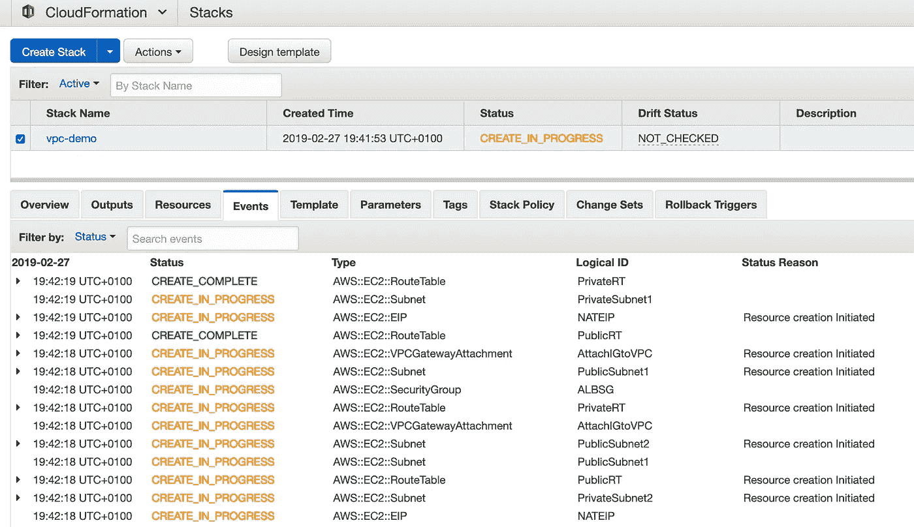
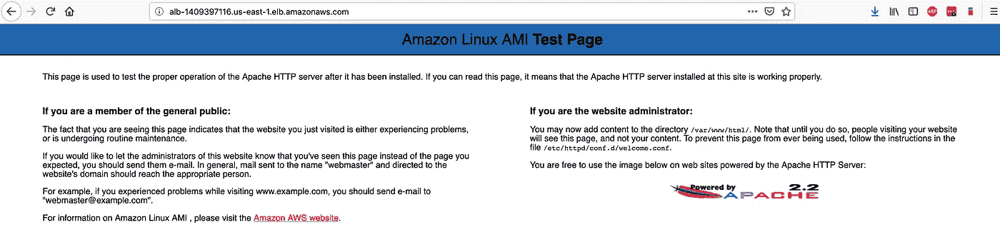

# 云形成中的高可用 VPC 架构

> 原文：<https://itnext.io/high-available-vpc-architecture-in-cloudformation-2f4d8a86f4d2?source=collection_archive---------3----------------------->

> 在本教程中，我将解释如何设置一个安全和高可用性的虚拟私有云架构，并使用 CloudFormation 自动设置。我们将在这个 VPC 中托管一个基本的高可用性应用程序。
> 我们还会考虑成本，这意味着我们不会让非关键资源高度可用。

# AWS 中的高可用性

在 AWS 中，您可以在不同的地区部署资源和使用服务，如 eu-west-1 (EU Ireland)、us-east-1 (US N. Virgina)等。[每个 AWS 区域由多个可用区域组成](https://docs.aws.amazon.com/AWSEC2/latest/UserGuide/using-regions-availability-zones.html)。可用性区域(AZ)由一个或多个高度安全的数据中心组成。可用性区域彼此相距数十/数百英里。由于 AZ 之间的距离，两个区域几乎不可能因为地震、海啸、攻击等灾难而同时停机。
在 AWS 的世界中,“高可用性”一词意味着当一个 AZ 关闭时，您的基础架构将保持可用。


# VPC 建筑

让我们看看我们的架构，并讨论每个组件。


## 基础设施方面

*   **VPC** :亚马逊虚拟私有云让你可以提供亚马逊网络服务(AWS)云的一个逻辑隔离部分，你可以在那里启动 AWS 资源。您必须以 CIDR 块的形式为 VPC 指定一个 IPv4 地址范围(如 10.0.0.0/16)。VPC 跨越一个区域中的所有可用性区域。我们的设置需要 1 个 VPC。
*   **子网**:一个 VPC 包含多个子网。子网可以是公共的，也可以是私有的，并且跨越一个可用性区域。子网也有一个 CIDR 块，它是 VPC CIDR 的子集。
    →我们的设置需要四个子网。我们将使用两个公共子网和两个私有子网，每个子网位于不同的可用性区域。如果一个区域发生故障，我们仍有公共和私有子网可用。
*   **IGW** :互联网网关是一种资源，可让您的 VPC 接入互联网。每个通过 IGW 通向 internet (0.0.0.0/0)的子网都是公共子网。该子网中的资源可以与 internet 通信。
    →我们只需要部署一个 IGW，因为它本身具有高可用性，并且没有带宽限制。
*   **NAT 网关**:在公共 VPC 子网中使用 NAT 网关，以支持来自私有子网实例的出站互联网流量。私有子网需要一条通过 NAT 网关到达互联网的路由。
    →出于成本考虑，我们将只部署一个 NAT 网关。其结果是，当部署 NAT 的可用区域出现故障时，私有子网中的实例将无法访问互联网。
    这对我们的应用程序来说并不重要，应用程序将继续工作。这就是为什么我们更喜欢手动启动新的 NAT 网关，而不是使其高度可用，但是当然可以在每个可用性区域部署一个 NAT 网关。
*   **堡垒主机**:堡垒主机是一个安全的公共实例，充当 SSH 网关。我们可以通过 SSH 连接到这个公共实例，从这个实例内部，我们可以使用私有 IP 通过 SSH 连接到私有实例。bastion 主机由一个安全组保护，该安全组可以限制对实例的 SSH 访问。
    →我们将部署一台堡垒主机。同样，当运行该实例的可用性区域关闭时，该实例也将关闭。但是就像 NAT 网关一样，我们的应用程序不会受到影响，我们决定让 bastion 主机不具有高可用性。在可用性区域中断的情况下，我们可以在工作 AZ 的公共子网内启动 EC2。
    您可以使用自动扩展使您的 bastion 主机高度可用。
*   **路由表**:路由表包含一组称为路由的规则，用于确定网络流量的流向。VPC 中的每个子网必须与一个路由表相关联；该表控制子网的路由。一个子网一次只能与一个路由表相关联，但是您可以将多个子网与同一个路由表相关联。
    →路由表是替代路由器的 AWS 提供的高可用服务。我们需要对它们进行配置，但不一定要让它们高度可用。
*   **安全组**:安全组包含允许谁可以访问该安全组所属资源的规则。在我们的例子中，我们为 ALB(每个人都可以在端口 80 上访问)、bastion 主机(每个人都可以在端口 22 上 SSH)和 EC2 实例(只有 ALB 可以在端口 80 上访问实例)设置了一个安全组。
    →安全组是高可用性资源。我们不需要考虑让它们在我们的环境中高度可用。

## 应用程序端

*   **EC2** :我们的应用程序，一个基本的 Apache web 服务器托管在一个 EC2 实例上。
    →我们将在不同的子网中部署两个 EC2 实例，因为当部署 EC2 的 AZ(以及相应的子网)关闭时，EC2 将不可用。
*   **应用负载均衡器**:ALB 将对我们的两个 EC2 实例的流量进行负载均衡。如果其中一个出现故障，ALB 会将所有流量路由到健康的实例。我们可以通过为我们的实例实现自动缩放来使这变得更高级，但是这超出了本教程的范围。
    →我们只需要部署一个 ALB。在底层，ALB 由多个子网中的多个 ec2 和 AZ 组成。如果一个 AZ 关闭，ALB 不会受到影响。由于 AWS 的智能实现，该服务具有高可用性。

# 云的形成

设置整个环境的 CloudFormation 模板在我的 GitHub 上有[。随意叉/星模板。](https://github.com/lvthillo/aws-private-ha-app-setup)

模板将创建我们在前一章中讨论过的资源。在这里，您还可以检查路由表的配置是如何实现的。GitHub 自述文件还包含了一个完整的列表，列出了哪些资源将在你的亚马逊账户中创建。

1.  [安装 AWS CLI](https://docs.aws.amazon.com/cli/latest/userguide/cli-chap-install.html)
2.  [配置 AWS CLI](https://docs.aws.amazon.com/cli/latest/userguide/cli-chap-configure.html)
3.  [创建一个 AWS 密钥对](https://docs.aws.amazon.com/AWSEC2/latest/UserGuide/ec2-key-pairs.html)
4.  [派生/克隆存储库](https://github.com/lvthillo/aws-private-ha-app-setup)
5.  用您的个人值更新 [parameters.json](https://github.com/lvthillo/aws-private-ha-app-setup/blob/master/parameters.json)
6.  部署堆栈:

```
$ aws cloudformation create-stack --stack-name vpc-demo --template-body file://template.yaml --parameters file://parameters.json
```



检查访问 ALB 的 URL，并检查您是否可以访问该应用程序。你也可以检查你是否能使用堡垒主机。



ALB 将我们路由到两个 EC2 实例中的一个

*备注:模板在欧盟-西方-1 和美国-东方-1 地区进行测试。如果某个映射包含问题。请随意打开一个拉取请求。*

# 结论

我们已经了解了高可用性在 AWS 领域意味着什么。
之后，我们检查了一个成本优化的高可用性 AWS 环境，其中包含一个应用程序负载平衡器和两个 EC2 来托管 web 应用程序。我希望你喜欢这个教程！

[](https://www.buymeacoffee.com/dZb8fLN)

如果真的对你有帮助…:)