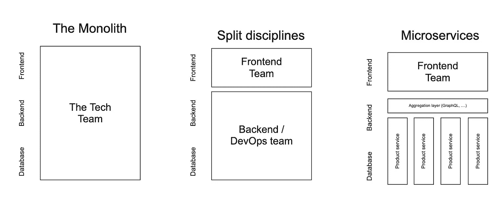
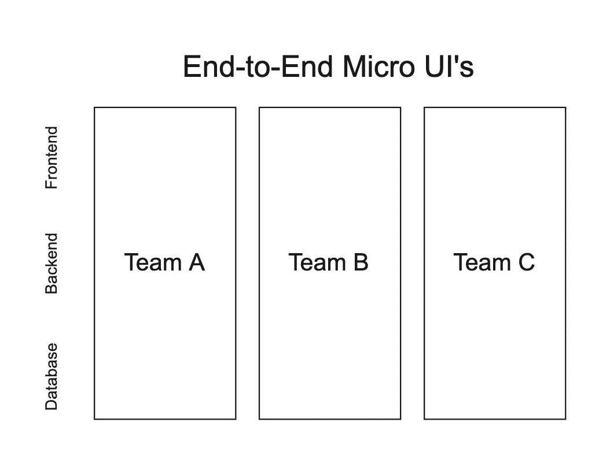
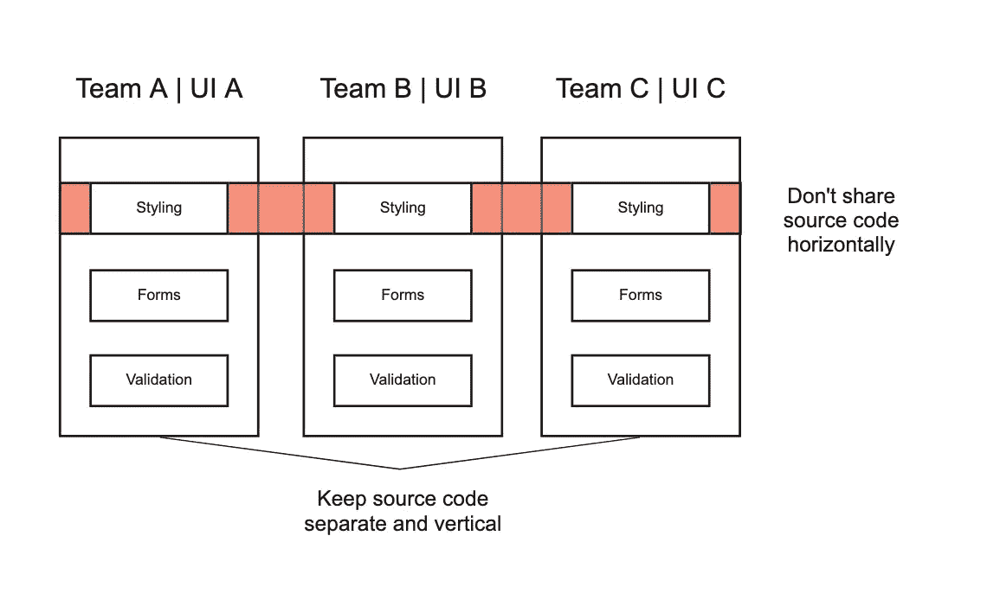
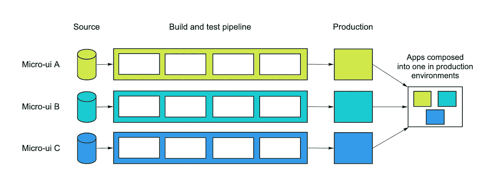
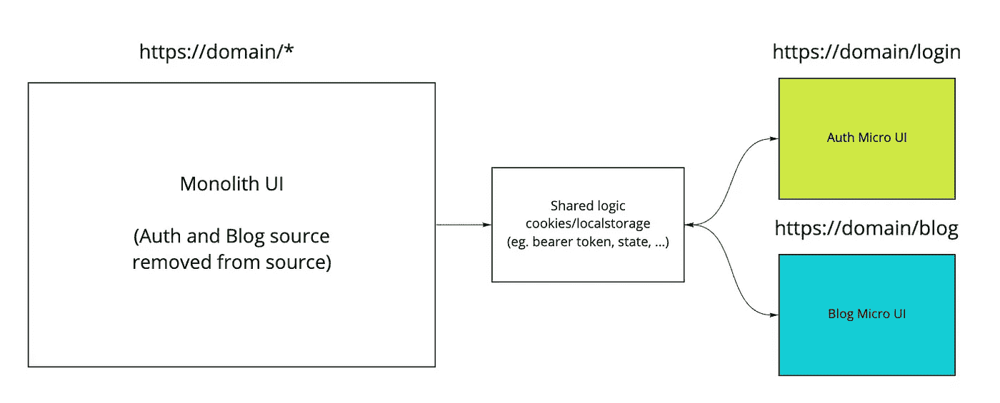

# 高级微 ui 架构

> 原文：<https://itnext.io/high-level-micro-ui-architecture-a033bc8e87a8?source=collection_archive---------1----------------------->

> “好的前端开发很难。扩展前端开发，让许多团队可以同时开发一个大型复杂的产品就更难了。”— **卡姆·杰克逊**

# 这只是另一种时尚吗？

当前技术社区的趋势是构建功能丰富和强大的 SPA，它们通常由微服务架构驱动。我们已经看到，随着时间的推移，前端层变得庞大、臃肿和重复。不同的团队通常会维护不同的特性。

一个代码库，几个团队一起工作需要大量的协调工作，并且会因为阻碍、官僚主义和围绕技术团队范围标准的几十次会议而削弱一个团队。



总体应用程序结构化的高级方法

在不同的行业中，自主团队有很多好处，在我们的特定行业中，我们已经看到，自主可以带来创新思维、复杂问题的简单解决方案和更好的工作满意度——如果成功的话。

微 ui 或微前端方法努力将自主权交还给团队，让他们完全控制自己的功能或产品，而不必在具体细节上保持一致，这些细节可以由每个团队或小组决定。



高级微 ui 结构

# 微型用户界面背后的核心思想

**成为技术不可知者**

每个团队应该能够选择和升级他们的堆栈，而不必与其他团队协调。这使得技术团队可以通过技术无关的方法更快地扩展。 [Web 组件](https://developer.mozilla.org/en-US/docs/Web/Web_Components)是向他人提供中立界面的好方法

*例如*

```
<notification-bell>{notificationCount}</notification-bell>
```

*vs*

```
<div class=”notification-bell”>{notificationCount}</div>
```

**隔离团队代码**

如果所有的团队共享相同的技术栈，标准等就不能共享相同的运行时。构建独立的、自包含的应用程序，不依赖于特定的共享状态或全局变量，但是也有例外，我稍后会提到。

**建立弹性网站**

并非所有的浏览器都是一样的，它们使用 JavaScript 的方式不同，并且许多特性并不被所有的浏览器所支持。尽最大努力使用所有浏览器中都有的 API，否则使用 polyfill 在不支持它们的浏览器上实现这些 API。

使用[通用渲染技术](https://github.com/brillout/awesome-universal-rendering)(SSR/SSG/预渲染)和[渐进式增强](https://www.webfx.com/blog/web-design/progressive-enhancement/)(首先强调核心网页内容)来提高感知性能。我将在本文后面讨论几种性能改进策略。



自主团队

# 这看起来像什么？

从开发的角度来看，我们看到独立运行和构建的独立应用程序，它们可能有不同的技术堆栈，但最终结果是一个 web 应用程序或网站可以在您的浏览器上运行，并按照定义的方式运行。

从用户的角度来看，他们看到一个链接或导航不同微 ui 的 web 应用程序——然而他们没有看到或注意到这一点(或者说，不应该看到或注意到)。



微用户界面的端到端交付

每个微 ui 都有自己的源代码，包含在某个地方的 repo 中(理想情况下)。这些项目中的每一个都是在他们自己的管道中构建和测试的，一旦完成，它们就被部署到网络上的某个地方。最后，我们开始将所有这些产品或功能整合到一个应用程序中。我们可以通过使用不同的路由方法来实现这一点，如 route 53、nginx、ingress 等。

# 公共源和逻辑

我们希望在这些不同的应用程序之间共享的最常见的东西是样式，可能还有几个在您的应用程序中常用的助手函数(例如解析不记名令牌)。

通常使用的技术是创建单独的 NPM 库，并把它们放入每个微型用户界面中。这些应该被设计，以便他们的客户端(微用户界面)可以在这些共享组件上扩展，这样，如果不同的主题，填充等。需要很容易做到这一点。


公共共享库

在许多情况下，micro-ui 需要验证状态，简单的方法是将您的验证令牌存储在跨域工作的 LocalStorage 中。如果您要使用预渲染渐进式增强方法，将使用这种方法。我们都有 cookie 方法，如果你使用服务器端渲染(SSR)方法，你需要使用这个方法。

共享身份验证状态只是一个例子，您可以共享几个状态位，但请小心使用，因为这可能会暴露敏感信息。

# 表演技巧

您可能遇到的最大问题是加载大量编译后的代码。加载多个包时，有几种方法可以提高性能，我将介绍其中的一些。

**为静态资产使用内容交付网络**

使用 CDN 将允许您的所有资产更快地加载，因为大多数 CDN 将知道用户从哪里请求内容。除了性能，这还将降低您的带宽和基础设施成本。

**“预浏览”**

如果你的浏览器预测到了用户需要的请求会怎样？你完全可以指示它这样做。简而言之，预浏览会告诉浏览器在用户浏览时获取并缓存用户浏览器中的资源。有几个[预浏览](https://css-tricks.com/prefetching-preloading-prebrowsing/) API，我将讨论两个与我们的问题最相关的。

*   **Preconnect**
    我们希望在 HTTP 请求实际发送到服务器之前，尽可能早地加载特定的内容。Preconnect 解析 DNS 并进行 TCP 握手，如果需要 TLS，它还会进行协商。预连接可以将请求延迟减少几百毫秒，有时甚至几千毫秒。
    `<link rel="preconnect" href="(url)">`
*   **预取** 我们知道将来会加载某些微 ui，因此我们可以同时请求浏览器获取该资源，并将其存储在缓存中以备后用。例如，您可以通过预取加载图像，也可以加载浏览器可缓存的任何资源。
    `<link rel="preconnect" href="(url)">`

# 迁移方法

如果你想开始将你的前端 monolith 移植到更易于维护和分离的微 ui 应用程序中，你可以立即开始。首先，我鼓励你定义你的应用程序的哪些部分应该被分离，例如你的认证或登录模块。这样，当模块仍在 monolith 上使用时，您可以开始孤立地迁移模块。

对于你需要在应用程序中加入的每一个新特性，我建议立即创建微型用户界面，比如一个新的博客。



将您的 monolith 迁移到 micro-ui 中

一旦使用这种方法迁移了所有的模块，您基本上就拥有了一个路由应用程序。

# TLDR；

总之，通过使用微 ui 驱动的架构方法，您将获得几个好处。这包括真正的团队自治，更少的故障点——如果引入一个关键错误，您的整个应用程序可能不会崩溃，这为我们提供了一个类似于我们在微服务架构中看到的隔离环境。这只是冰山一角当涉及到微 ui 或者微前端架构的时候，一定要在评论区提问或者留下想法！