# 高性能 Web 应用

> 原文：<https://itnext.io/high-performance-web-apps-2a469cfd3550?source=collection_archive---------1----------------------->


> 更重并不意味着更多的等待— [@scottjehl](https://twitter.com/scottjehl)

当我们为 web 构建时，我们都意识到我们应该多小心，不要给我们的用户提供太多的 JavaScript 和 CSS。我们发送的越多，我们的网络应用程序可能会越慢。

所以思维模式通常是“总是发送尽可能少的代码”。这很好，代码越少越好。更少的下载时间，更少的处理时间，更少的绘画时间，更少的在屏幕上显示内容的时间！

但是，比尽可能将我们的网络应用压缩为一个整体更重要的是，理解我们的浏览器从消费 HTML、CSS 和 JavaScript 并将其转化为屏幕上的像素的旅程——这是**的关键呈现路径( *CRP* )。**

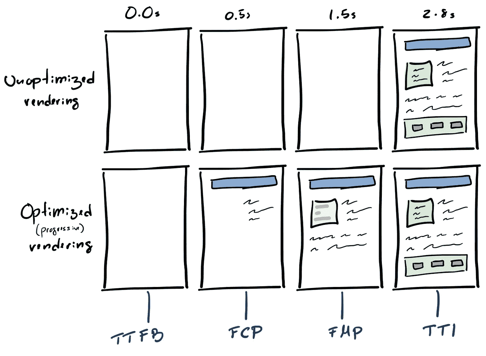

渲染与渐进式渲染

优化 ***CRP*** 与减少关键资源和以非阻塞方式下载非关键资源息息相关，以便获得更好的页面加载时间。

由于加载不是一个单一的时刻，加载过程中有多个阶段需要跟踪，以便我们衡量我们的 web 应用程序有多快或多慢。这些是:

*   用户第一次在屏幕上看到**什么东西**是什么时候？— [FCP](https://developers.google.com/web/tools/lighthouse/audits/first-contentful-paint)
*   用户什么时候第一次在屏幕上看到有意义的东西？— [FMP](https://developers.google.com/web/tools/lighthouse/audits/first-meaningful-paint?utm_source=lighthouse&utm_medium=devtools)
*   用户何时能够与**交互**？— [TTI](https://developers.google.com/web/tools/lighthouse/audits/time-to-interactive)

有几种不同的策略来改进这些时间表指标，但由于没有“一刀切”的解决方案，因此理解 ***CRP*** 是定义更适合我们问题的策略的基础。

# 关键渲染路径

下图包含了 ***CRP*** 的所有要点。从执行请求的那一刻起，我们收到第一个字节( [TTFB](https://developers.google.com/web/tools/chrome-devtools/network/understanding-resource-timing) ):

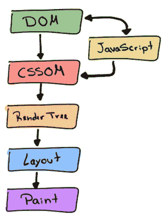

关键渲染路径

1.  首先，抓取 HTML 并开始构建 [DOM](https://developers.google.com/web/fundamentals/performance/critical-rendering-path/constructing-the-object-model#document_object_model_dom) ，包含关于**要呈现什么**内容的所有信息；
2.  接下来，一旦获取了 CSS，就构建 [CSSOM](https://developers.google.com/web/fundamentals/performance/critical-rendering-path/constructing-the-object-model#css_object_model_cssom) ，保存与**如何在屏幕上呈现内容相关的所有内容；**
3.  然后，将这两者结合起来，构建包含内容和样式信息的[渲染树](https://developers.google.com/web/fundamentals/performance/critical-rendering-path/render-tree-construction)。
4.  然后，是布局。在这个阶段，我们知道了内容和样式，但是还缺少一样东西，计算每个元素在设备的[视窗](https://developers.google.com/web/fundamentals/design-and-ux/responsive/#set-the-viewport)中的准确位置和大小——这是[布局](https://developers.google.com/web/fundamentals/performance/critical-rendering-path/render-tree-construction)的职责。
5.  最后，当布局完成时， [Paint](https://developers.google.com/web/fundamentals/performance/critical-rendering-path/render-tree-construction) 事件被触发，将渲染树转换成屏幕上的像素。

注意，我们没有涉及 JavaScript。在此之前，让我们只考虑 HTML 和 CSS 来练习一下。

## CSS 和 CRP

在下面的代码片段中，我们有一个 HTML 文档，其中包含一些带有页面框架的标记、一个 CSS 资源和一些文本。

当用户第一次导航到 URL 并收到响应时，DOM 开始逐步构建**。然后，找到`<link>`标签，执行新的 HTTP 请求，同时 DOM 仍继续构建，然后，当带有 CSS 的 HTTP 响应到达时，构建 CSSOM，直到它完成**，屏幕上没有呈现**。一旦完成，我们就有了渲染树，布局，最后是屏幕上的像素！**

**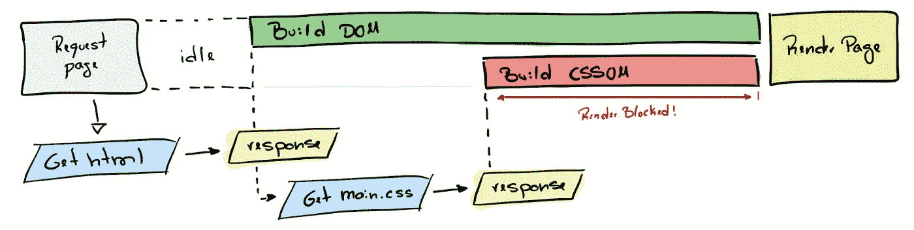**

**CRP 步骤**

**这就是为什么我们把 CSS 定义为一个**渲染阻塞资源**，因为没有 CSSOM 就没有渲染树，没有渲染树就没有渲染。**

**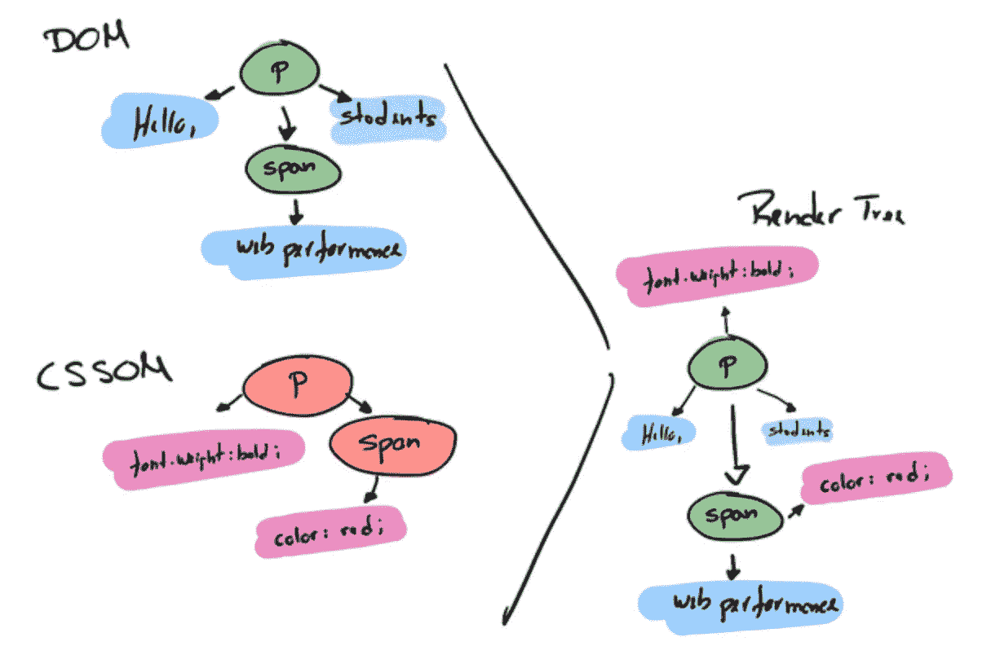**

**渲染树**

**但是为什么 CSS 渲染是阻塞的而 HTML 不是呢？基本上是因为 DOM 可以渐进地构建，而 CSSOM 不能，这是由于 CSS 的“级联”性质。虽然在 DOM 中没有节点可以影响其他节点，但在 CSS 中，规则可以影响其他节点，例如:**

```
span { color: yellow; }
...
p span { color: ; red } // thousands of lines below
```

**假设 CSSOM 是逐步构建的，因此是以非阻塞的方式构建的。一种可能的情况是:**

**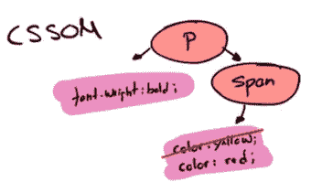**

**CSSOM**

*   **第一次渲染—仍然没有 CSS，所以让我们渲染没有样式的内容；**
*   **第二次渲染 CSS 的第一部分到达(`span { color: yellow; }`)，所以让我们把所有的`span`都涂成黄色；**
*   **第三次渲染——块 n X 到达(`p span { color: red; }`——层叠发生)，所以让我们把所有的`span`重新涂成红色；**

**除了由于多次重画元素而导致的一些性能问题之外，这些元素甚至可能不在页面上(由于像`display: "none"`这样的规则)，这将给用户提供非常差的体验。**

**这就是为什么 CSS 是渲染阻塞的原因，所以一定要保证 **CSS 倾斜**，尽可能快地交付，使用`[media](https://developer.mozilla.org/en-US/docs/Web/HTML/Element/link)` [**属性**](https://developer.mozilla.org/en-US/docs/Web/HTML/Element/link) 和**查询**来解除阻塞渲染。**

```
<link href="desktop.css" media="screen and (min-width: 600px)"  rel="stylesheet">
```

**至于 HTML，由于 DOM 是增量构建的，我们可以使用 [**SSR**](https://developers.google.com/web/updates/2019/02/rendering-on-the-web) 技术以及**渐进式渲染**尽可能快地以**块**的形式交付 **HTML** ，提供类似谷歌搜索引擎的体验:**

****

**谷歌搜索渐进式渲染**

## **JavaScript 和 CRP**

**现在，在这个片段中，我们有一个包含一些内联 JavaScript 而没有 CSS 资源的文档。一个简单的页面，脚本标记将更改应用到屏幕上显示的内容。**

**在这种情况下，DOM 开始逐步构建，直到找到`<script>`标签。一旦完成， **DOM 构造被暂停**，以便 **JavaScript** 运行**，修改 DOM。之后， **DOM** 构造**恢复**并且屏幕上有渲染。****

**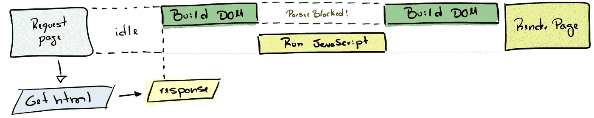**

**CRP 步骤—带 JS**

**JavaScript 执行得相当快，看起来这并没有对 **CRP** 造成太大影响。在处理如上所示的非常简单的内联脚本时，这可能是正确的。但是对于外部依赖，DOM 构造将被阻塞，直到 HTTP 请求被解析并且产生的 JS 运行，并且该请求可能需要一段时间…**

**因此，内联 CSS 和 JS 是改善页面加载时间的一个好策略，但也只能达到足够的程度。这将有助于减少 HTTP 请求，但另一方面，如果在不同的页面上重复使用，您可能会多次下载相同的代码块。这将是一个很好的机会来提取和下载它作为一个外部资源，受益于缓存。记住，最快的请求，是永远不会实现的请求。**

**一个好的做法是避免内联 1kb 以上的资源[并从那里开始提取，引入缓存策略。](https://v8.dev/blog/cost-of-javascript-2019)**

## **JavaScript、CSS 和 CRP**

**现在，一个既有 CSS 又有 JavaScript 的网页。作为外部资源的 CSS 和修改某些内容和样式的内嵌`script`标签。**

**这一次，在 DOM 构造过程中，发现了`<link>`标记，并触发了一个 HTTP 请求，同时 DOM 构造仍在继续。然后找到了`<script>`标签，但是这一次浏览器**还不能执行 JavaScript】，因为它可以操作 DOM 和/或 CSSOM(在这种情况下，它两者都操作),所以浏览器需要**首先等待 CSSOM 被构建**,这将取决于 HTTP 响应。一旦获取了 CSS 并构建了 CSSOM，浏览器就会执行 JavaScript，并且不再阻塞 **DOM** 构造**。然后恢复，最后在屏幕上有一个渲染。******

****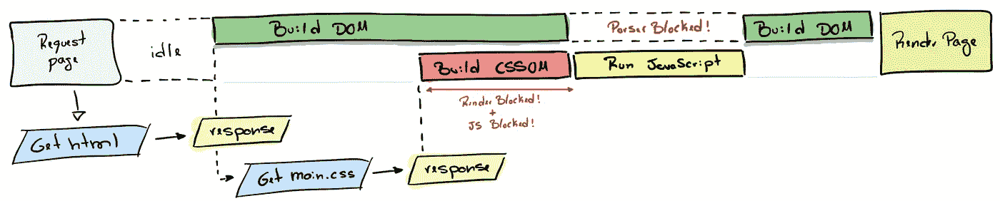****

****CRP 步骤—同时考虑 JS 和 CSS****

******CSS 不仅会阻止渲染，还会阻止脚本执行**，这就是优化 CSS 如此重要的原因。****

****有些脚本既不改变 DOM 也不改变 CSSOM，其中大部分可能不会被阻塞。非阻塞脚本的一个很好的例子是分析。一旦页面被加载，分析脚本是异步加载的很好的候选者，我们可以使用`[async](https://developer.mozilla.org/en-US/docs/Web/API/HTMLScriptElement#Properties)` [和](https://developer.mozilla.org/en-US/docs/Web/API/HTMLScriptElement#Properties) `[defer](https://developer.mozilla.org/en-US/docs/Web/API/HTMLScriptElement#Properties)` [标签](https://developer.mozilla.org/en-US/docs/Web/API/HTMLScriptElement#Properties)来实现。****

```
**<script src="/analytics.js" async />**
```

****稍后会详细介绍。****

## ****包裹****

****我们刚刚讨论了**关键渲染路径**以及 JS 和 CSS 资源如何影响页面负载。我们略微涉及了一些提高页面加载性能的基本策略，但是在讨论页面加载性能时，还需要记住更多的东西。****

****既然我们已经记住了浏览器从使用 HTML、CSS 和 JavaScript 到在屏幕上呈现内容的基本步骤，我们应该更清楚地了解什么技术最适合我们的问题以及如何应用。****

# ****优化关键渲染路径****

****如前所述，关于优化策略没有金科玉律。但是我们应该记住一些优化 CRP 的一般策略。****

****这些被称为 **3 个优化桶**:****

****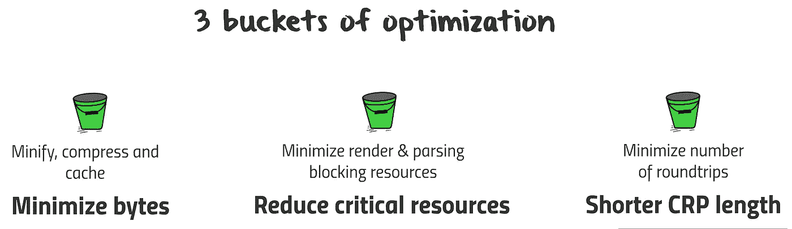****

****大量的优化****

*   ******最小化字节**:最小化、压缩和缓存 JS、CSS 和 HTML****
*   ******减少关键资源**:最小化渲染和解析器阻塞资源的使用****
*   ******缩短 CRP 长度**:最大限度减少往返次数——CRP 长度是关键资源与其字节大小之间的依赖关系图的函数:某些资源下载只能在处理完之前的资源后启动，资源越大，下载的往返次数就越多。([由](https://developers.google.com/web/fundamentals/performance/critical-rendering-path/optimizing-critical-rendering-path)[伊利亚·格里戈利克](https://medium.com/u/2578f746f852?source=post_page-----2a469cfd3550--------------------------------)优化关键渲染路径****

## ******最小化字节******

****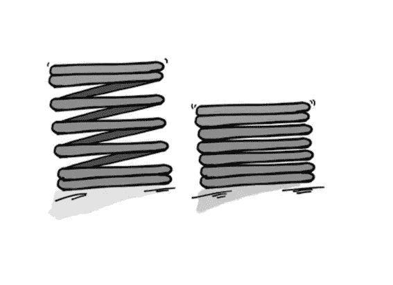****

****文件和 HTTP 响应压缩****

*   ****尽可能发布不太重要的代码，并且总是缩小、压缩和缓存它们。****
*   ****使用像 [webpack](https://webpack.js.org/) 这样的工具在[生产模式](https://webpack.js.org/configuration/mode/#mode-production)中缩小你的包，并应用[代码分割](https://webpack.js.org/guides/code-splitting/#root)，这样你就可以以阻塞的方式下载关键的程序块，并推迟非关键的程序块。****
*   ****利用现代浏览器的模块(`<script type="module" src="/module.js">`)来下载包含更紧凑或优化语法的包，从而减少字节数。****
*   ****使用来自 [babel](https://babeljs.io/) 的 [browserslist](https://github.com/browserslist/browserslist) [、](https://github.com/browserslist/browserslist) [core-js](https://github.com/zloirock/core-js/blob/master/docs/2019-03-19-core-js-3-babel-and-a-look-into-the-future.md) 和 [usebuiltIns](https://babeljs.io/docs/en/babel-preset-env#usebuiltins) 等工具，使用特定于每个浏览器的 transpiled bundles 和 polyffills。****
*   ****使用像 Brotli 或 Gzip 这样的算法在你的网络服务器中应用文件压缩。****

## ******减少关键资源******

****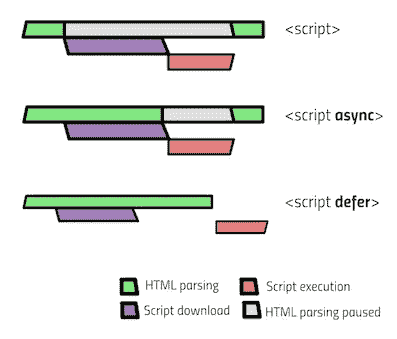****

****阻塞与非阻塞脚本****

*   ****内联关键 CSS，最大限度地减少阻塞渲染和脚本执行。****
*   ****使用对`link`标签的媒体查询来推迟不适合您的目标的 CSS([媒体类型或尺寸](https://developer.mozilla.org/pt-BR/docs/Web/Guide/CSS/CSS_Media_queries))。****
*   ****使用`script`标签上的`async`和`defer`属性，以非阻塞方式下载非关键资源。****
*   ****`preload`、`prefetch`和`preconnect`脚本，您的用户在应用程序内的旅程中可能需要这些脚本。这将防止您的用户在需要时等待这些资源(当[延迟加载](https://webpack.js.org/guides/lazy-loading/)时尤其有用)。****

## ******缩短** [**CRP 长度**](https://developers.google.com/web/fundamentals/performance/critical-rendering-path/optimizing-critical-rendering-path)****

****这在很大程度上取决于你的应用程序所使用的 HTTP 版本。****

> ****“HTTP/2 通过支持请求和响应多路复用、报头压缩和优先级排序，能够更有效地利用网络资源并减少延迟”——[高性能浏览器网络](https://hpbn.co/)****

****也就是说，始终支持 HTTP/2 来交付您的应用程序。但是如果你不能，在使用 HTTP/1 时有一些“变通方法”可以应用。****

****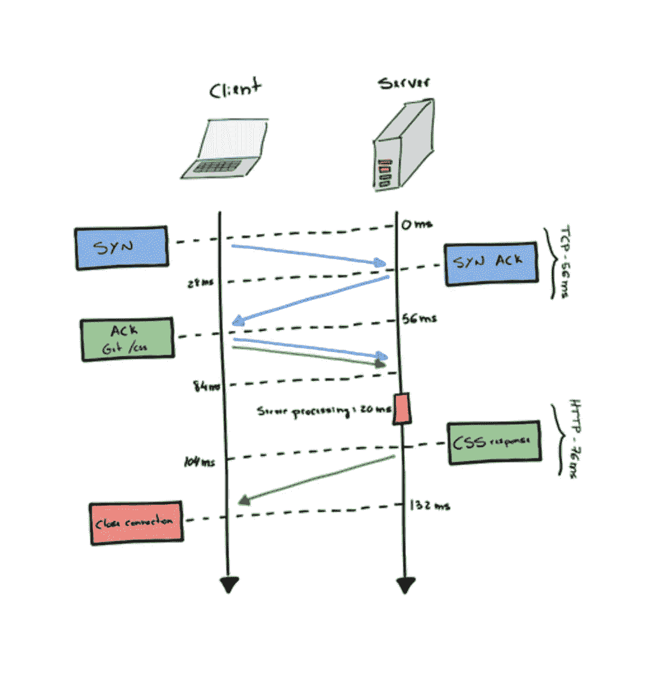****

****网络请求往返****

****[**为 HTTP/1.x 优化**](https://hpbn.co/optimizing-application-delivery/#optimizing-for-http1x) **:******

*   ****应用[域分片](https://hpbn.co/http1x/#domain-sharding)。****
*   ****[捆绑资源](https://hpbn.co/http1x/#concatenation-and-spriting)以减少 HTTP 请求并避免与有限的[并行性](https://hpbn.co/http1x/#using-multiple-tcp-connections)相关的问题。****
*   ****[内联小型资源](https://hpbn.co/http1x/#resource-inlining)(高达 1kb)以最大限度地减少请求数量****

****[**为 HTTP/2 优化**](https://hpbn.co/optimizing-application-delivery/#optimizing-for-http2) **:******

*   ****消除域分片，减少来源数量— [多路复用](https://hpbn.co/http2/#request-and-response-multiplexing)。****
*   ****[最小化拼接和图像显示](https://hpbn.co/optimizing-application-delivery/#minimize-concatenation-and-image-spriting)****
*   ****[通过服务器推送消除往返](https://hpbn.co/optimizing-application-delivery/#eliminate-roundtrips-with-server-push)****

# ****你不能优化你不能测量的东西****

****没有度量，就很难知道你的 web 应用程序的主要痛点是什么，以及如何解决它们。****

****所以，正如 [Addy Osmani](https://medium.com/u/2508e4c7a8ec?source=post_page-----2a469cfd3550--------------------------------) 在《[2018 年 JavaScript 的成本](https://medium.com/@addyosmani/the-cost-of-javascript-in-2018-7d8950fbb5d4)》中提到的:****

> ****测量、优化、监控和重复****

## ****开始绩效预算****

****衡量 CI/CD 管道的性能，根据里程碑、数量和规则定义预算— **实验室测试**。****

****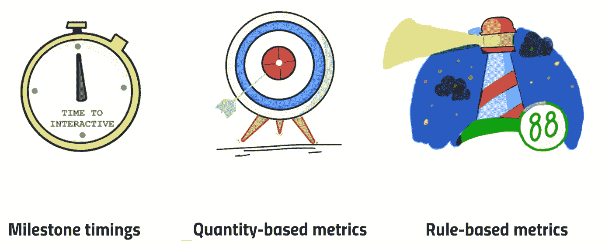****

****实验室测试—绩效预算****

****使用性能预算来防止您的站点性能随着时间的推移而退化。这将有助于你在早期阶段，在它到达你的用户之前，对你的 web 应用性能有一个清晰的认识。****

****预算可以基于:****

*   ******里程碑计时:**基于用户加载页面体验的计时(例如 [TTI](https://developers.google.com/web/tools/lighthouse/audits/time-to-interactive) 、 [FCP](https://developers.google.com/web/tools/lighthouse/audits/first-contentful-paint) 和 [FMP](https://developers.google.com/web/tools/lighthouse/audits/first-meaningful-paint?utm_source=lighthouse&utm_medium=devtools) )。****
*   ******数量指标:**基于原始值(例如，JavaScript 的权重(KB/MB)，HTTP 请求的数量)****
*   ******基于规则的度量:**由 Lighthouse 或 WebPageTest 等工具生成的分数。通常，一个单一的数字或系列来评分你的网站****

****有几个工具可以帮你做这个预算，比如 [webpack](https://webpack.js.org) 的 [Performance API](https://webpack.js.org/configuration/performance/) 、 [bundlesize](https://www.npmjs.com/package/bundlesize) 、 [Lighthouse](https://developers.google.com/web/tools/lighthouse/) 、 [WebPageTest](https://webpagetest.org/) 等等。****

## ****开始性能监控****

****绩效预算将帮助您跟踪和执行您的绩效限制。您可以应用最适合实际使用场景的节流来执行这些测量。
但是为了跟踪你的 web app 在现实世界中的影响，你应该实现**真实使用监控** ( **RUM** )。****

****一些可以帮助你获得这些实际使用指标的服务有 [Calibre](https://calibreapp.com/) 、 [Treo](https://treo.sh/a/addyosmani/3) 、 [Webdash](https://webdash.xyz/) 、 [SpeedCurve](https://speedcurve.com/about/) 等等。****

****希望您现在对浏览器如何处理您的 web 应用程序资产以及它如何影响页面加载时间有了更好的理解。优化性能的一般“经验法则”是什么，如何确保团队满足您的性能预算，以及它如何通过 RUM 影响现实世界中的用户。****

****这是一个非常简单的概述，因为根据项目状态和目标，这些主题会变得非常密集。根据这一点，并根据您的目标受众，确定您的绩效战略，开始实施，测量，完善和始终监测。****

****表演更多时候是一种文化挑战，而不是技术挑战。****

# ****参考****

****[关键渲染路径](https://developers.google.com/web/fundamentals/performance/critical-rendering-path/)
[灯塔](https://developers.google.com/web/tools/lighthouse/)
[JavaScript 的成本](https://medium.com/@addyosmani/the-cost-of-javascript-in-2018-7d8950fbb5d4)
[以用户为中心的性能指标](https://developers.google.com/web/fundamentals/performance/user-centric-performance-metrics#time_to_interactive)
[更重不代表更等](https://www.filamentgroup.com/lab/weight-wait.html)
[2019 年 JavaScript 的成本](https://v8.dev/blog/cost-of-javascript-2019)
[高性能浏览器联网](https://hpbn.co)****