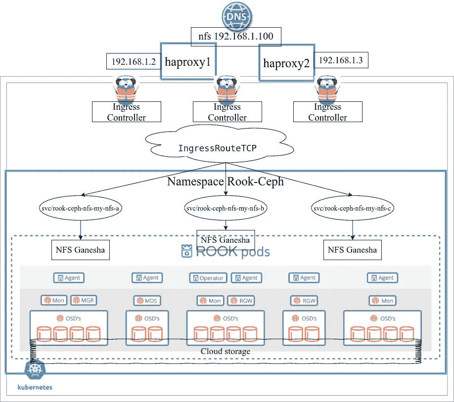
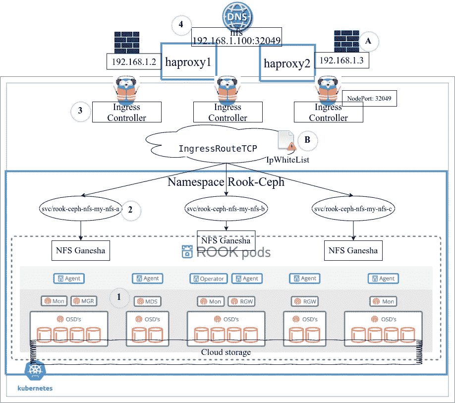
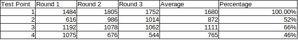

# Kubernetes 中的高可用性 NFS 集群，这是一个独立于云供应商的存储解决方案

> 原文：<https://itnext.io/highly-available-nfs-cluster-in-kubernetes-a-cloud-vendor-independent-storage-solution-f9a314cfdfcc?source=collection_archive---------0----------------------->

当我在为 Kubernetes 寻找一个[存储解决方案](https://kubernetes.io/docs/concepts/storage/persistent-volumes/#types-of-persistent-volumes)时，我认为我可能需要随时迁移到不同的云供应商，我发现大多数存储解决方案都是特定于供应商的。

# 鲁克-Ceph

在过去的几年里，我一直使用 [Rook-Ceph](https://rook.io/) 解决方案。它抽象了云/本地提供的底层存储，并提供了 rbd/cephfs 卷(等等)。它非常容易使用，非常稳定。我的一个最老的集群已经运行了 3 年，没有出现任何问题。 [Github](https://github.com/rook/rook) 和 [Slack](https://slack.rook.io/) 中的 Rook 社区非常有帮助。

除了与供应商无关之外，我还在 Rook Slack channel 上发现了使用 Rook-Ceph 优于云提供的存储的优势。即使独立于供应商不是目标，使用 Rook-Ceph 也是有价值的。报价:

> 相同的存储解决方案(如果在本地和云上安装 rook ceph)，允许混合云设置，更具可配置性，读写很多，无需使用 NFS
> 
> 克服每个节点的卷数限制。ceph 的容量没有限制。
> 
> 如果您有许多小型 PV，它们将会从云提供商那里获得较低的性能。使用 Ceph，您可以用具有更好性能特征的大卷来支持它
> 
> Ceph 不受 AZs 的限制
> 
> 使用高级 ceph 功能，如集群之间的复制(rbd/cephfs 镜像、rgw 多站点)

# 文件存储服务

我一直在 Kubernetes 集群中使用 Rook-Ceph 解决方案，例如，在一个 k8s 集群中，有存储节点并向同一个集群提供存储。在某些情况下，这可能是一个问题。

*   由于 Rook-Ceph 存储只能由同一集群中的工作负载使用，独立服务(不在任何集群中)必须使用云供应商的存储。
*   当创建新的 k8s 集群来替换旧的集群时，数据迁移是一件痛苦的事情。我发现的最好的方法是从备份中恢复，但是必须仔细计划。
*   当使用多个 Kubernetes 策略来隔离不同的服务时，每个集群都需要自己的存储节点。如果集群的总规模很小，有时这是一种资源浪费。
*   总是需要进行备份，这需要群集外存储。

因此，我在寻找一种升级，为多个 Kubernetes 集群和/或集群外的服务提供存储。通过查看[这个列表](https://kubernetes.io/docs/concepts/storage/persistent-volumes/#types-of-persistent-volumes)，nfs 是一个厂商中立的协议，由 Kubernetes 通过 [NFS provisioner](https://github.com/kubernetes-sigs/nfs-subdir-external-provisioner) 很好地支持，也由大多数类似 Linux 的系统广泛支持。看看是否可以扩展 Rook-Ceph 解决方案来满足需求是一个简单的想法。

在得出我的解决方案之前，我四处搜索，看看是否已经有了什么。一个是“[在 Kubernetes](https://www.adaltas.com/en/2020/04/16/expose-ceph-from-rook-kubernetes/) 外部暴露一个基于 Rook 的 Ceph 集群”，通过主机网络对外暴露 Rook 创建的 Ceph 集群。必须做大量额外的工作来保护网络。另一个是 GlusterFS，但似乎 K8S 上的 [GlusterFS 项目已经被搁置了。可以通过基于虚拟机的方式来实现，比如“](https://github.com/gluster/gluster-kubernetes) [GlusterFS:配置和设置一个高可用性 NFS 集群的 NFS-甘尼萨”。](https://microdevsys.com/wp/glusterfs-configuration-and-setup-w-nfs-ganesha-for-an-ha-nfs-cluster/)

# NFS 集群

经过一些实验，这是解决方案，如下图所示。



系统结构

有两个 Haproxy 实例共享一个虚拟 IP 地址，作为端口 32049 上的 NFS 集群的入口点。Haproxy 还充当高可用性集群的 apiserver 负载平衡器。3 个 [Traefik](https://github.com/traefik/traefik) 实例是入口控制器集群，将节点端口 32049 暴露给 haproxy。 [IngressRouteTCP](https://doc.traefik.io/traefik/routing/providers/kubernetes-crd/#kind-ingressroutetcp) 用于将流量路由到 3 个 NFS 甘尼萨服务，由鲁克 Ceph [NFS CRD](https://rook.github.io/docs/rook/v1.7/ceph-nfs-crd.html) 提供。在 NFS 甘尼萨后面是由 Rook-Ceph 提供的 Ceph 文件系统。底层存储可以是由云/本地提供的满足 Ceph [要求](https://rook.github.io/docs/rook/v1.7/pre-reqs.html#ceph-prerequisites)的任何东西。

当客户端通过 Haproxy 的虚拟 IP 地址挂载时，这个 NFS 集群是高度可用的。如果其中一个 Haproxy 实例已关闭，或者其中一个 Traefik 实例已关闭，或者其中一个 Ganesha 实例已关闭，或者 Ceph 群集已降级但仍在运行，则 NFS 装载仍在运行。

github 链接中共享了集群的一些配置。

```
[Github Link](https://gist.github.com/liejuntao001/88ec87dff82ab0cc1f741a2fa4ee35ce)
```

# 表演

在我的设置中，NFS 集群的设计目的是提供一个可扩展、高可用性、低成本的标准 HDD 层存储，因为我使用的底层存储有 500 IOPS 的限制。因此，我无法测试这种架构的性能极限。

与 Ceph 文件系统的性能相比，3 个增加的层，例如 NFS 甘尼萨、入口控制器和 Haproxy，将影响最终 NFS 文件系统的性能。与本地网络相比，公共云网络中的网络延迟要高得多，因此我认为每个额外的网络跳增加的网络延迟也会影响性能。

我做了一个非常粗略的 4k 随机读写性能测试，以比较体系结构中 4 个点的平均 iops。

测试命令

```
fio --randrepeat=1 --ioengine=libaio --direct=1 --numjobs=2 --nrfiles=4 --gtod_reduce=1 --name=test --filename=random_read_write.fio --bs=4k --iodepth=64 --size=1G --readwrite=randrw --rwmixread=75 --ramp_time=30 --runtime=30 --time_based --group_reporting --stonewall
```

测试结果示例

```
fio-3.19read: IOPS=1098, BW=4406KiB/s (4511kB/s)(131MiB/30434msec)bw (  KiB/s): min=  753, max= 6360, per=100.00%, avg=4462.34, stdev=528.48, samples=118iops        : min=  187, max= 1590, **avg=1115.19**, stdev=132.19, samples=118write: IOPS=365, BW=1468KiB/s (1503kB/s)(43.6MiB/30434msec); 0 zone resetsbw (  KiB/s): min=   82, max= 2088, per=100.00%, avg=1481.05, stdev=189.45, samples=118iops        : min=   20, max=  522, **avg=369.92**, stdev=47.47, samples=118
```

在本例中，我将“读取 iops 平均值 1115”和“写入 iops 平均值 369”相加，得出总 iops 为 1484。



性能和安全性

如图所示，4 个测试点是:

1.  将 Ceph 文件系统直接挂载到集群中，作为基线
2.  为每个 nfs svc 在集群中装载 NFS
3.  对于每个 Traefik 实例，从入口控制器挂载 NFS
4.  从哈普洛克西登上 NFS

Ceph 群集有 3 个 4CPU/8G RAM 节点，每个节点有 2 个 500IOPS 磁盘。SSD 磁盘用于 OSD 的元数据。我收集的数据如下。



在我的设置中，通过将 Ceph 文件系统转换为 HA NFS 集群，性能损失超过了 50%。我不明白为什么测试点 2 比测试点 3 慢。

# 安全性

安全有许多方面，这里的特殊部分是保护 NFS 港，以避免意外的访问。当然，所有的服务都将在私有 IP 地址上运行。

1.  安全点 a .使用 iptables 来保护 2 个 Haproxy 实例。因为它们不在 K8s 集群中，所以很容易只允许已识别的 IP。
2.  安全点 b。3 个入口控制器为 Haproxy 暴露端口 32049。在 Kubernetes 中，如果同一个数据中心中有其他邻居主机可以访问私有 IP，那么保护通过 NodePort 暴露的端口并不容易。我还没有掌握使用[Calico GlobalNetworkPolicy](https://docs.projectcalico.org/reference/resources/globalnetworkpolicy)的方法，所以这里我使用 Traefik 的 IPWhiteList 中间件，只允许识别的 IP。为了实现这一点，Haproxy 和 Traefik 都启用了[代理协议](https://www.haproxy.org/download/1.8/doc/proxy-protocol.txt)来传递客户端的 IP 地址。
3.  从 NFS 甘尼萨的角度来看，所有连接都来自入口控制器的集群内 IP 地址。而且我没有发现它支持代理协议，所以 NFS 不可能知道实际客户的 IP 地址。所有基于 IP 地址的权限控制都无法使用。

# 供选择的

还有另一个 [Rook-NFS](https://github.com/rook/nfs) 项目，它将一个文件系统(K8s 中的任何 PV)转换成一个 NFS 集群。因此，另一种结构是在入口控制器后面使用 Rook-NFS，并使用 Rook-Ceph 中的 Ceph 文件系统作为后端存储。据我测试，它工作正常，我觉得它更像是云原生的，但目前鲁克-NFS 还处于 alpha 阶段，缺乏一些重要的产品特性。

感谢阅读。

> 2021 年 11 月 16 日更新

NFS 集群由 Ceph 文件系统提供支持。我们需要为存储的数据制定一个备份计划。这可以从 NFS 客户端完成，也可以从服务器端集中完成。我开发了一种备份 Ceph 文件系统的方法，在这里共享。