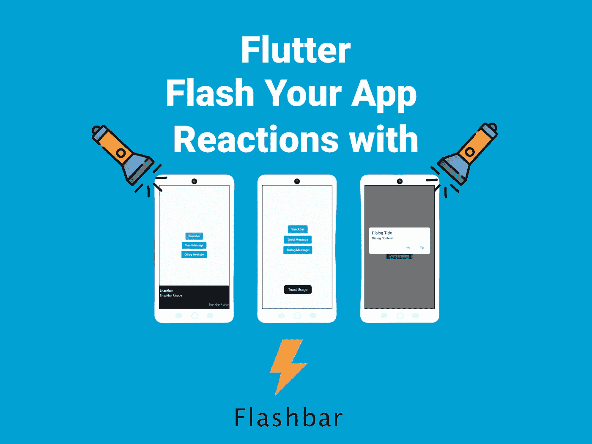
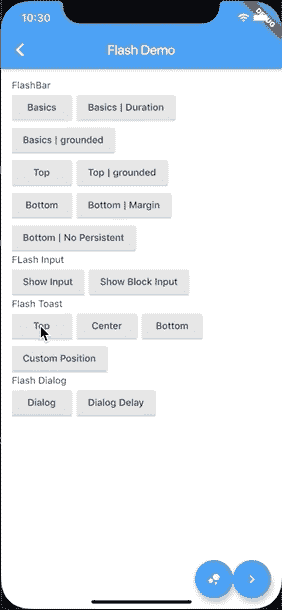
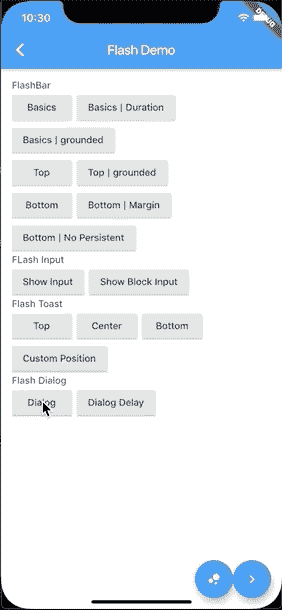

# 高度可定制的吐司，对话框，在颤动的小吃吧

> 原文：<https://itnext.io/highly-customizable-toast-dialog-snackbar-in-flutter-2c27e533dd63?source=collection_archive---------3----------------------->

## 闪现你的应用反应



在移动开发中，向用户显示消息和警告是很常见的。有了这个包，你就可以展示给他们看了。它高度可定制，功能强大，易于使用。你可以用它来代替`Snackbar`或`Toast`或`Dialog` 。

[](https://pub.dev/packages/flash) [## flash | Flutter 包

### ⚡️A 高度可定制，功能强大，易于使用的颤振警报库。网站…

公共开发](https://pub.dev/packages/flash) 

# 入门指南

首先，让我们将包添加到`pubspec.yaml`

```
dependencies:
  ...
  flash: ^2.0.3
```

## 祝酒词

为了通知用户，您可以显示一个带有提示信息的通知。当用户关闭应用程序时，您可以展示以下内容。

**敬酒用法**



这里有一些直观的例子:)

## Snackbar 消息

为了通知用户，您还可以使用 snackbar 显示通知。但是 toast message 和 snackbar 之间的区别在于，您还可以使用 snackbar 进行快速操作。比如添加按钮或者使其永久化。当用户的互联网断开时，您可以展示以下内容。

**Snackbar 用法**


这里有一些直观的例子:)

## 对话消息

您可以创建各种类型的对话框，并对其进行自定义。这里有一些简单的提示对话框在出错时显示。

**对话框用法**



这里有一些直观的例子:)

你可以在这里看到一个 Android 的例子。👇 👇

[](https://github.com/SncOne/Flutter-Flash) [## GitHub — SncOne/Flutter-Flash

### 一个新的颤振项目。这个项目是颤振应用的起点。一些帮助您入门的资源…

github.com](https://github.com/SncOne/Flutter-Flash) 

感谢您的阅读。

如果你有任何问题，请随时评论。👏👏👏