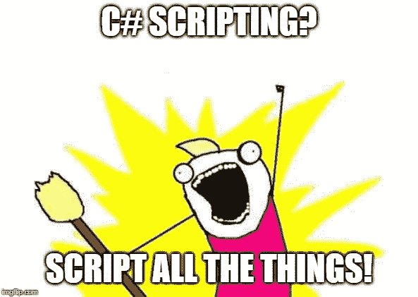
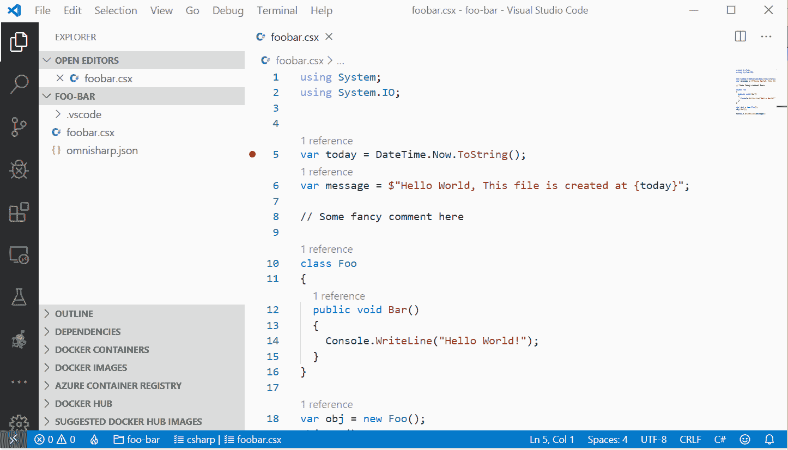

# C#脚本的搭便车指南

> 原文：<https://itnext.io/hitchhikers-guide-to-the-c-scripting-13e45f753af9?source=collection_archive---------0----------------------->

## 我们知道 C#是一种编程语言，但是我们已经有几年没有用我们喜爱的语言 CSharp 编写脚本了！让我们开始旅程吧。



# 背景

> C#脚本被引入到。NET 社区与罗斯林 CTP 早在 2011 年 10 月。C#脚本背后的主要思想是允许在运行时动态评估代码。虽然过去有其他技术允许这样做(反射。Emit、CodeDOM 等。)，Roslyn 通过引入脚本将这一概念推向了新的高度——使用的不是常规的严格 C#，而是 C#语言语义的宽松版本。
> 
> 参考:
> [https://blogs . msdn . Microsoft . com/cdn devs/2015/12/01/adding-c-scripting-to-your-development-阿森纳-part-1/](https://blogs.msdn.microsoft.com/cdndevs/2015/12/01/adding-c-scripting-to-your-development-arsenal-part-1/)

你用 C# 写脚本了吗？有些人可能不同意用 C#编写脚本，因为还有其他面向脚本的工具，比如 bash、power-shell，有时还有 Python。

**然而，**

想象一下，你有一些在后台运行良好的库或代码，你需要写一些脚本来自动化大量的工作。为此，您不必学习 PowerShell 或任何其他脚本语言！

*   ✔与所有好的图书馆合作。JSON、安全性和所有程序集)
*   ✔你不需要学习一门新的语言
*   ✔跨平台(Mac，Linux，Windows，Raspberry Pi …)

# C#脚本编写入门

在 CSharp 中编写脚本没什么大不了的；这与您每天在强健的应用程序中使用的`C#`相同。

## C#脚本文件的结构

1.  C#脚本文件只是扩展名为`.csx`的纯文本文件
2.  使用`#r "path of a DLL assembly"`预处理器指令，你可以将每个 DLL 引用到脚本中
3.  从实现类到使用命名空间，每个 C#代码都在文件内部工作

下面是一个简单的 CRX 文件的例子:

只需浏览一下代码，就可以看到你可以做任何事情！

不过是`csx`档。你打算如何执行它？要编写脚本，你需要一个特定的工具。有几个这样的例子:

*   **罗斯林 Mono CSI** (如果你安装了 Visual Studio 或 Mono SDK，你的操作系统上就会有)
*   [**点网-脚本**](https://github.com/filipw/dotnet-script) 全局点网工具
*   [](https://www.cs-script.net/)

**我将解释我上面提到的所有工具，最后，我们将对它们进行比较。**

## **使用 Mono/Roslyn CSI 运行脚本**

**我已经在我的操作系统上安装了 **Mono SDK** ，所以我可以通过命令行直接访问`csi.exe`！您可以使用所在的**或**所在的**命令**来检查它是否在路径上。******

```
C:\>where csi
C:\Program Files\Mono\bin\csi
C:\Program Files\Mono\bin\csi.bat
```

**CSI 命令的第一个参数是`csx`文件。**

```
> csi sample-job1.csxHello World!
Hello World, This file is created at 19/12/2019 11:40:37
```

**因为它在解释器模式下运行文件，所以需要一秒钟。现在让我们引用一些汇编到 CSX 文件中。**

**我下载了 **Newtonsoft 的`Assembly dll`。并把它放在我的 CSX 文件旁边。****

```
> csi sample-job2.csx{"Id":"5611f423-9819-4f02-887e-4d39e9a9b0b8","Name":"FooBar","Enabled":true}
```

**我用的是 **JsonConvert。序列化虚拟对象的 SerializeObject** 方法。**

**💡*如果你只是打开* `*csi*` *app，它会在终端执行 repl，你可以逐行执行 C#代码。***

```
C:\>csi
Microsoft (R) Visual C# Interactive Compiler version 3.3.1-beta4-19462-11 ()
Copyright (C) Microsoft Corporation. All rights reserved.Type "#help" for more information.
> var message= "Hello World";
> Console.WriteLine(message);
Hello World
>
```

## **参考 NuGet 包怎么样？**

**可惜 CSI 不支持 NuGet。因此，您必须手动下载 DLL 程序集并将其放在脚本旁边。但是正如我已经提到的，还有其他工具也支持 NuGet。**

**📒*确保你的平台上安装了*[***dotnet runtime/SDK***](https://dotnet.microsoft.com/)**。****

## ***dot net-脚本全局工具***

***关于 **dotnet core CLI** 最好的事情之一是它的全球工具。你可以在这里读到它们[。简而言之，它们只是一个包含控制台应用程序的特殊 NuGet 包。全局工具可以安装在计算机上 PATH 环境变量中包含的默认位置或自定义位置。](https://docs.microsoft.com/en-us/dotnet/core/tools/global-tools)***

***该工具可以这样安装:***

```
*> dotnet tool install -g dotnet-scriptYou can invoke the tool using the following command: dotnet-script
Tool 'dotnet-script' (version '0.50.1') was successfully installed.*
```

*****dotnet-script 工具**内置了 NuGet 支持！所以您可以很容易地使用这个指令来引用您喜欢的任何 NuGet 包。***

```
*#r “nuget: PackageId, version”// for e.g:
// #r “nuget: Newtonsoft.Json, 12.0.3”*
```

***请确保您设置了版本，因为 **dotnet-script** 将为下次执行缓存包，这将使脚本运行得更快！***

***第一次启动有点慢，因为它要下载 NuGet 包及其依赖项！***

```
*> dotnet script sample-job3.csx{"Id":"5f14b3be-d634-414d-95e2-b015fda6d383","Name":"FooBar","Enabled":true}*
```

***结果还是一样的吧？***

***dotnet-script 的一个很大的优点就是搭建了一个框架，可以帮助你为你的脚本创建一个文件夹，并为你心爱的 VSCode 设置启动设置！***

```
*> dotnet-script initCreating VS Code launch configuration file
...'\path\.vscode\launch.json' [Created]
Creating OmniSharp configuration file
...'\path\omnisharp.json' [Created]
Creating default script file 'main.csx'
Creating 'main.csx'
...'\path\main.csx' [Created]*
```

***通过这种配置，您可以在 VSCode 中运行和调试您的代码！***

## ***Script-CS-使用简单的文本编辑器轻松编写和执行 C#。***

******

***与`dotnet-script`和`CSI`相比，Script-CS 有点不同。安装它的唯一方法是通过 Chocolaty，这是一个 windows 软件包安装程序。***

```
*# install it with chocolatycinst scriptcs*
```

***安装后，您可以访问 CMD 中的**脚本**命令。通过在 cmd 中键入`scripts`,将运行 **scriptcs-repl** ,这允许您逐行输入 C#代码:***

```
*C:\>scriptcs
Moving directory '.cache' to '.scriptcs_cache'...
scriptcs (ctrl-c to exit or :help for help)> var message = "Hello World";
> Console.WriteLine(message);
Hello World
>*
```

***对于安装 NuGet 包，可以使用`**-install**`参数。**这应该在您的脚本文件夹中执行。*****

```
*C:\>scriptcs -install Newtonsoft.JsonInstalling packages...
Installed: Newtonsoft.Json
Package installation succeeded.
Saving packages in scriptcs_packages.config...
Creating scriptcs_packages.config...
Added Newtonsoft.Json (v9.0.1, .NET 4.5) to scriptcs_packages.config
Successfully updated scriptcs_packages.config.*
```

***用 ScriptCs 编写代码与其他代码没有什么不同，下面是一个例子:***

***并像这样执行它:***

```
*C:\>scriptcs sample-job2.csx{"Id":"e3a9d76e-d558-46d1-8d1a-b831c8013e16","Name":"FooBar","Enabled":true}*
```

***引用组件和其他与`#r`指令相同。***

## ***排除故障***

> ***可惜文章没有提到如何在实际的 IDE 中在需要的时候调试这样一个脚本……
> —[https://www . Reddit . com/r/cs harp/comments/ectt1v/hitchligers _ guide _ to _ the _ c _ scripting/FBE 2 l1g？UTM _ source = share&UTM _ medium = web2x](https://www.reddit.com/r/csharp/comments/ectt1v/hitchhikers_guide_to_the_c_scripting/fbe2l1g?utm_source=share&utm_medium=web2x)***

***你不能用 CSI **调试你的脚本，但是** *Script-CS* 和 *Dotnet-Script* 提供调试，尽管 [Script-CS 调试很棘手，需要 Visual Studio](https://marketplace.visualstudio.com/items?itemName=IgalTabachnik.AnyScriptCS) 和一个与最新的 Visual Studio 不是 100%兼容的扩展。在这一节中，我只讨论 **dotnet-script** 调试。***

1.  ***用 dotnet-script scaffolder 初始化新脚本***

```
*> mkdir foo-bar> cd foo-bar> dotnet-script init foobar
Creating VS Code launch configuration file
...'\foo-bar\.vscode\launch.json' [Created]
Creating OmniSharp configuration file
...'\foo-bar\omnisharp.json' [Created]
Creating 'foobar'
...'\foo-bar\foobar.csx' [Created]*
```

***安装 [VSCode](https://code.visualstudio.com/download) 如果你还没有安装它，那么像这样打开脚本的文件夹:***

```
*code .*
```

***如果这是你第一次打开任何`.cs`或`.csx`文件，VSCode 将安装 [C#扩展](https://code.visualstudio.com/docs/languages/csharp)和 [Omnisharp](http://www.omnisharp.net/) 它需要不到一分钟的时间。现在你可以轻松地设置断点并按下 **F5** 来运行和调试你的脚本！***

******

***VSCode 中的调试示例***

## ***用哪个？***

```
*.-----------------.------.-------.----------------.--------.
|      Name       | Repl | Nuget | Cross-Platform |  Debug |
:-----------------+------+-------+----------------+--------:
| Mono/Roslyn CSI | Yes  | No    | Yes            | No     |
:-----------------+------+-------+----------------+--------:
| Script-CS       | Yes  | Yes   | No             | Yes(1) |
:-----------------+------+-------+----------------+--------:
| Dotnet-Script   | Yes  | Yes   | Yes            | Yes    |
'-----------------'------'-------'----------------'--------'1\. Script-CS supports debugging but it requies complete Visual Studio and it's not easy to do*
```

***依我拙见， **dotnet-script** 是最好的选择，它有许多其他功能，如编译成 **exe** 但这只是我的拙见，它总是取决于你和你的需求，你需要看看哪个工具更好地解决你的问题。***

## ***参考***

*****这是我用来了解 C#脚本背景的一些参考资料。*****

1.  ***[介绍微软“罗斯林”CTP](https://devblogs.microsoft.com/visualstudio/introducing-the-microsoft-roslyn-ctp/)***
2.  ***[将 C#脚本添加到您的开发工具中](https://blogs.msdn.microsoft.com/cdndevs/2015/12/01/adding-c-scripting-to-your-development-arsenal-part-1/)***

## ***如果你喜欢我的文章，请多看看我关于 C#的其他文章***

*   ***[使用 mono-wasm 通过 web 程序集在浏览器中本地运行 C#](/run-c-natively-in-the-browser-through-the-web-assembly-via-mono-wasm-60f3d55dd05a)***