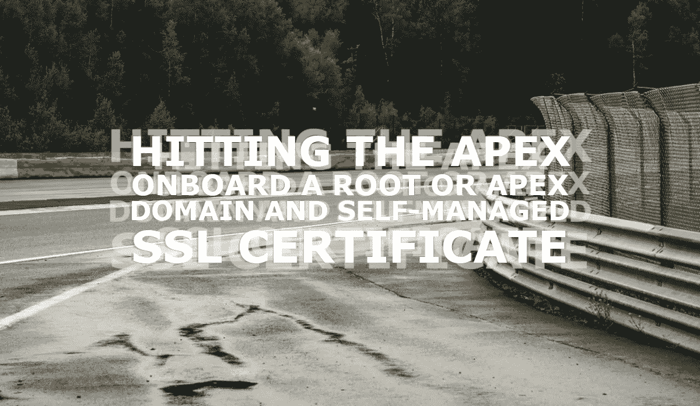
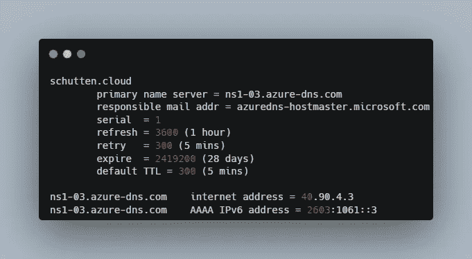

# 访问 apex:在根域或 Apex 域中添加自我管理的 SSL 证书

> 原文：<https://itnext.io/hitting-the-apex-onboard-a-root-or-apex-domain-and-a-self-managed-ssl-certificate-e1a6cf5d90f9?source=collection_archive---------1----------------------->



在本文中，我们将介绍如何将根域或 apex 域添加到 CDN 端点，并添加自我管理的 SSL 证书。我们还将介绍如何在您的 CDN 端点上实施 HTTPS 流量。

如果你正在阅读这篇文章，很可能你想创建自己的静态网站，想了解更多关于静态站点生成器的信息，想知道如何使用 Azure 服务托管你的静态网站，或者想知道如何自动化你的 web 代码的完全集成和你的站点构建的部署。不管怎样，下面的一系列博客文章可能对你有帮助！

本文是一个系列的后续文章，该系列包括:

*   对于 Azure 中的静态网站，你需要的唯一指南是:第 1 部分:创建一个静态网站。在这篇文章中，我介绍了什么是静态网站，有什么可供选择，以及如何创建一个(本地)静态网站。
*   [Azure 静态网站的唯一指南——第 2 部分:使用 Azure Blob 存储托管你的站点](/the-only-guide-you-need-for-a-static-website-in-azure-part-2-host-your-static-site-in-azure-9114b7069db2)。在这篇文章中，我介绍了如何在 Azure Blob 存储中托管静态网站，有什么可供选择，以及一些关于内容交付网络(CDN)的基础知识。
*   [Azure 静态网站的唯一指南——第 3 部分:使用 Azure DevOps 管道实现自动化](/the-only-guide-you-need-for-a-static-website-in-azure-part-3-automate-using-azure-devops-e53aa65c1fba)。在本文中，我将介绍什么是 Azure DevOps 服务，以及如何将静态网站的构建和部署自动化到 Azure storage。

让我们开始吧。

# 什么是 Azure DNS？

Azure DNS 是 DNS 域的托管服务，通过使用 Microsoft Azure 基础架构提供名称解析。通过在 Azure 中托管您的域，您可以使用与其他 Azure 服务相同的凭据、API、工具和计费来管理您的 DNS 记录。不能用 Azure DNS 买域名。

如果你想了解更多关于 Azure DNS 的知识，请查看微软的官方文档。

# 什么是 Azure Key Vault？

Azure Key Vault 是一个云服务，用于安全地存储和访问机密、API 密钥、密码、证书和加密密钥，因此您可以保持它们的私密性。

如果你想了解更多关于 Azure Key Vault 的信息，请查看微软的官方文档。

# 先决条件

要开始将 apex 或根域加入 CDN 端点并添加自我管理的 SSL 证书，请确保您满足以下先决条件。

## Azure 订阅

对于本指南，您需要一个 Azure 订阅，[一个本地用户帐户，有权](https://docs.microsoft.com/en-us/azure/role-based-access-control/built-in-roles)创建和编辑 Azure 存储帐户，并将静态网站版本上传到此帐户。

## Azure 托管的网站

对于这个指南，你需要一个 Azure 托管的网站。本指南以 Azure Blob 存储中的一个静态网站为起点。您还需要一个带有静态网站端点的 CDN 配置文件。如果你还没有准备好这些东西，按照我的*“Azure 静态网站的唯一指南”*博客系列的[第一篇](/the-only-guide-you-need-for-a-static-website-in-azure-part-1-create-a-static-website-da00ddc85f2d)和[第二篇](/the-only-guide-you-need-for-a-static-website-in-azure-part-2-host-your-static-site-in-azure-9114b7069db2)创建你的静态网站。

## 自我管理的 SSL 证书

如果您打算按照完整的指南学习，并带上您自己的 SSL 证书，那么您将需要一个 SSL 证书来学习本指南。不可能为 apex 或根域选择 Azure 管理的证书。您可以从最常见的域提供商那里购买 SSL 证书，例如 [Cloudflare](https://www.cloudflare.com/ssl/dedicated-certificates/) 、 [Namecheap](https://www.namecheap.com/security/ssl-certificates/) ，或者像荷兰的 [TransIP](https://www.transip.nl/ssl-certificaten/) 这样的本地提供商。

## Azure CLI

在本指南中，您将为 Azure CLI 使用 Azure 云外壳。然而，如果你喜欢在本地工作站工作，你可以[在本地安装 Azure CLI](https://docs.microsoft.com/en-us/cli/azure/install-azure-cli)。

# 加入您的根或 apex 域

apex 是您的域的“根”级别，例如 *schutten.cloud* 。域顶点是域名层次结构的“根”。这个(例如 *www.schutten.cloud* 的每个子域都不是域顶点，而是 *schutten.cloud* 的一个子域。
让我们将 apex 域装载到 Azure CDN 端点。

## 创建 DNS 区域

登录 [Azure 门户](https://portal.azure.com/)后，使用链接或点击图标打开 [Azure 云外壳](https://shell.azure.com/)。


*图片由 Rolf Schutten 于*[*Schutten . cloud*](https://www.schutten.cloud/)

如果你在本地使用 Azure CLI，你首先需要使用`az login`命令登录以使用任何 CLI 命令。

现在创建一个包含 DNS 区域的资源组。在下面的例子中，我在西欧地区创建了一个名为 rg-p-weu-schuttencloud 的资源组。使用示例，通过用您自己的值替换值来创建您自己的资源组:

```
az group create \
    --name rg-p-weu-schuttencloud \
    --location westeurope
```

现在创建一个 DNS 区域。在下面的例子中，我在资源组 *rg-p-weu-schuttencloud* 中创建了一个名为 *schutten.cloud* 的 DNS 区域。使用示例，通过用您自己的值替换这些值来创建您自己的 DNS 区域:

```
az network dns zone create \
    --name schutten.cloud \ 
    --resource-group rg-p-weu-schuttencloud
```

## 为区域 apex 创建别名记录

现在在区域的顶点创建一个记录集。在下面的例子中，我在 *schutten.cloud* 区域的顶点创建了一个记录集，TTL(生存时间)为 60 秒，我的 CDN 端点作为目标资源。使用示例，通过用您自己的值替换这些值来创建您自己的 DNS 区域:

```
az network dns record-set a create \
    --name "@" \
    --resource-group rg-p-weu-schuttencloud \
    --zone-name schutten.cloud \
    --target-resource YourCDNEndpoint \
    --ttl 60
```

这将创建一个指向您的 CDN 资源的 zone apex 记录，该记录使用 CNAME 记录映射 *cdnverify* 在您的 CDN 配置文件中加入域。在我的情况下，cdnverify.schuttencloud.com。

## 委派域

下一步要做的是向域名注册商更新域名的 NS(域名服务器)记录。

在将您的 DNS 区域委派给 Azure DNS 之前，您需要知道您的区域的名称服务器。在下面的示例中，我检索了早期 DNS 区域 *schutten.cloud* 所需的信息。使用示例检索您自己的 DNS 区域信息，方法是将这些值替换为您自己的值:

```
az network dns zone show \
    --resource-group rg-p-weu-schuttencloud \
    --name schutten.cloud
```

返回的答案应该如下图所示，其中*“名称服务器”*后面的四行是我们下一步需要的。把这些写下来。


*图片由 Rolf Schutten 上传于*[*Schutten . cloud*](https://www.schutten.cloud/)

由于每个注册服务商都有自己的 DNS 管理工具来更改域名的域名服务器记录，因此不可能在本手册中包含这些内容。您的域注册商可能有更新 NS 记录的文档。如果没有，请联系您的域名注册商。

要验证 NS 记录是否正确更新，您可以使用`nslookup`命令。使用下面的示例，并用您自己的值替换这些值:

`nslookup -type=SOA schutten.cloud`

您的响应应该类似于下面的`nslookup`输出:



*图片由 Rolf Schutten 上传*[*Schutten . cloud*](https://www.schutten.cloud/)

## 在您的 CDN 上装载自定义域

既然我们已经注册了 apex 域，我们可以将其添加到 CDN 端点。在下面的例子中，我将域 *schutten.cloud* 添加到我的 cdn 端点 *ep-cdn-schuttencloud* 中，这是 CDN 配置文件 *cdn-schuttencloud* 的一部分。使用示例将您自己的自定义域添加到 CDN 端点，方法是用您自己的值替换这些值:

```
az cdn custom-domain create \
    --name schuttenclouddomain \
    --resource-group rg-p-weu-schuttencloud \
    --hostname schutten.cloud \
    --endpoint-name ep-cdn-schuttencloud \
    --profile-name cdn-schuttencloud
```

Azure 会验证您输入的自定义域名的 CNAME 记录是否存在。如果 CNAME 是正确的，您的自定义域将被验证。

您现在已经将 apex/根域添加到 CDN 端点，并且应该能够在 web 浏览器中访问您的 Azure (Blob)存储帐户中托管的静态网站。

# 使用自我管理的 SSL 证书

在[这篇博客](/the-only-guide-you-need-for-a-static-website-in-azure-part-2-host-your-static-site-in-azure-9114b7069db2)中，我们为[*www . schutten . cloud*](https://schutten.cloud/)子域创建了一个带有 CDN 托管证书的 CDN 端点。遗憾的是，无法将 CDN 管理的证书用于 apex/根域。因此，你有义务提交你自己的证明。Azure Key Vault 是存储证书的明显选择。让我们开始吧。

## 创建 Azure 密钥库

现在创建一个 Azure Key Vault 来存储您的证书。在下面的例子中，我在与 Azure DNS 区域相同的资源组内创建了一个 Azure Key Vault，该资源组是 *rg-p-weu-schuttencloud* ，同样位于 w *est-europe* 区域。使用下面的示例，通过用您自己的值替换这些值来创建您的密钥库。

```
az keyvault create \
    --name "kv-p-weu-schuttencloud" \
    --resource-group "rg-p-weu-schuttencloud" \
    --location westeurope
```

## 注册 CDN/前门的服务主体

为了使 CDN 端点能够访问密钥库中的证书，我们注册了一个服务主体。在下面的例子中，我在 Azure Active Directory 中注册了一个服务主体作为 app。执行以下命令:

```
az ad sp create --id 205478c0-bd83-4e1b-a9d6-db63a3e1e1c8
```

在这之后，我们必须给予服务主体访问权，以便能够请求证书。在下面的例子中，我将密钥库中的秘密和证书的权限授予服务主体。使用下面的示例，并用您自己的值替换这些值:

```
az keyvault set-policy \
    --name "kv-p-weu-schuttencloud" \
    --certificate-permissions get \
    --secret-permissions get \
    --application-id 205478c0-bd83-4e1b-a9d6-db63a3e1e1c8
```

服务主体现在可以访问这个密钥库及其包含的证书。

## 准备您的证书(可选)

Azure Key Vault 只接受 [PKCS12](https://en.wikipedia.org/wiki/PKCS_12) 和 [PEM](https://en.wikipedia.org/wiki/Privacy-Enhanced_Mail) 证书，但有时 SSL 证书供应商会以不同的格式提供证书。在我的案例中，我的供应商以 [CRT 格式](https://en.wikipedia.org/wiki/X.509#Certificate_filename_extensions)提供证书。使用`openssl`我们可以解决这个问题，并从。CRT 证书。你可以从他们的网站下载 [OpenSSL，或者执行`choco install openssl`命令，如果你像我一样使用 Chocolatey 的话。](https://www.openssl.org/)

在您下载的证书的文件夹中运行以下命令，其中密钥文件应该只是一个包含您的私有文件的文本文件，该文件是从您的 SSL 证书提供商处获得的:

```
openssl pkcs12 -export -out schutten.cloud.pfx -inkey certificate.key -in certificate.crt -in rootca.crt
```

您现在有一个证书，可以导入到 Azure Key Vault 中。

## 将证书导入 Azure 密钥库

现在将您的证书导入到 Azure Key Vault。在下面的例子中，我将证书命名为 *SchuttenCloud* ，并将*certificate . pfx*PKCS12-文件导入到之前创建的密钥库。使用下面的示例，通过用您自己的值替换您自己的值，将您自己的证书导入到您的密钥库中。

```
az keyvault certificate import \
    --name "SchuttenCloud" \
    --file "certificate.pfx" \
    --vault-name "kv-p-weu-schuttencloud"
```

## 在 CDN 端点上启用 HTTPS

现在，通过使用下面的示例并用您自己的值替换这些值，在自定义域上为 Azure CDN 启用 HTTPS:

```
az cdn custom-domain enable-https \
    --name schuttenclouddomain \
    --resource-group rg-p-weu-schuttencloud \
    --endpoint-name ep-cdn-schuttencloud \
    --profile-name cdn-schuttencloud \
    --min-tls-version 1.2 \
    --user-cert-grou-name rg-p-weu-schuttencloud \
    --user-cert-secret-name SchuttenCloud \
    --user-cert-vault-name kv-p-weu-schuttencloud
```

您现在已经在您的 CDN 端点上启用了 HTTPS，应该能够通过 HTTPS 在您的 web 浏览器中访问您的 Azure (Blob)存储帐户中托管的静态网站。

# 将 HTTP 请求重定向到 HTTPS

显然，我们希望将所有 HTTP 请求重定向到 HTTPS。如果你不知道这为什么重要，我建议你看一下[这篇博客文章](/monitor-ssl-tls-certificates-with-azure-application-insights-4f55c792786b)。

在下面的示例中，添加了一个 CDN 引擎规则，将所有通过 HTTP 进入的流量转发到 HTTPS 协议。关于 CDN 引擎规则中的参数和字段的更多信息可以在微软的官方文档网站上找到。使用下面的示例，通过用您自己的值替换这些值来自己创建规则:

```
az cdn endpoint rule add \
    --name ep-cdn-schuttencloud \
    --resource-group group rg-p-weu-schuttencloud \
    --profile-name cdn-schuttencloud \ 
    --order 1 \
    --rule-name "EnforceHTTPS" \
    --match-variable RequestScheme \
    --operator Equal \
    --match-values HTTP \
    --action-name "UrlRedirect" \
    --redirect-protocol Https \
    --redirect-type Moved
```

所有通过 HTTP 请求进入的流量现在都被重定向到 HTTPS。

# 结论

在本文中，您已经了解了什么是 Azure DNS，什么是 Azure Key Vault，如何将 apex 或根域加载到 CDN 端点，如何使用存储在 Azure Key Vault 中的自我管理 SSL 证书，以及如何在 CDN 端点上实施 HTTPS 流量。不要忘记，监视您的 SSL 证书是非常重要的。当证书过期时，Azure 不会通知您，也不会自动续订，因为它们会为您提供 Azure 管理的证书。在这篇博客文章中，我解释了如何使用 Azure Application Insights 来监控 SSL 证书。