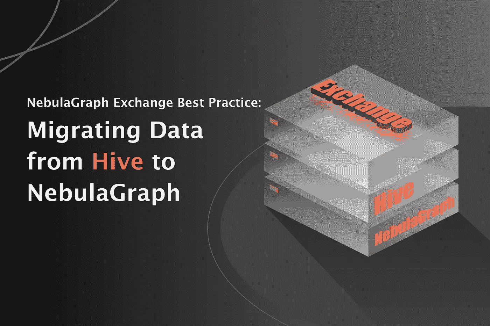
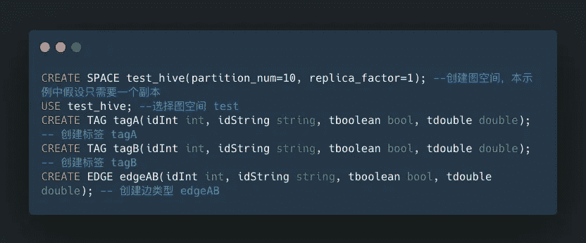
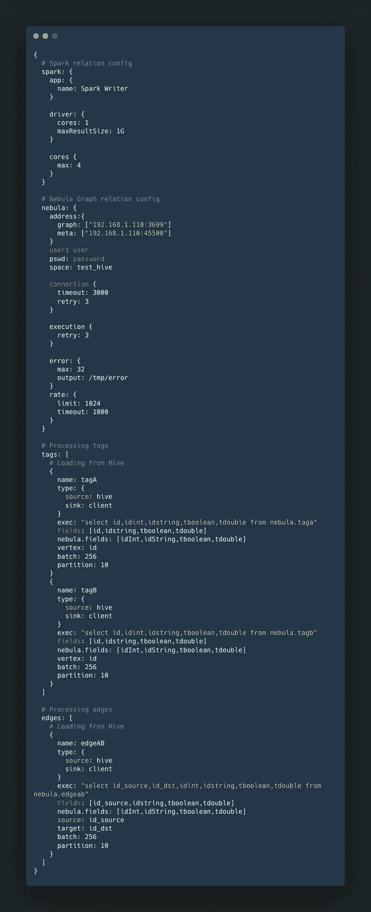
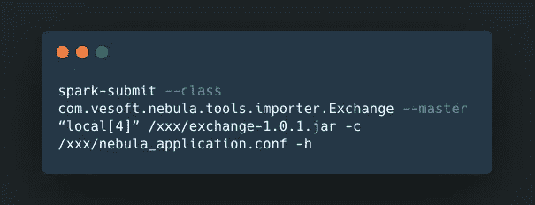
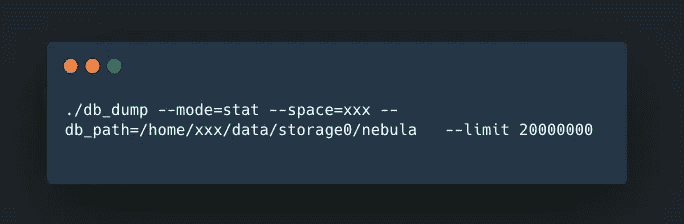
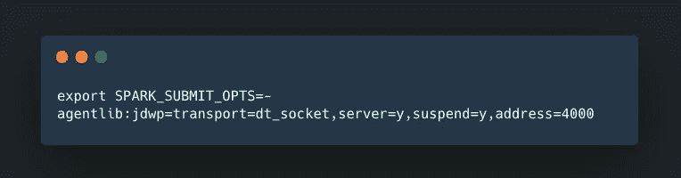
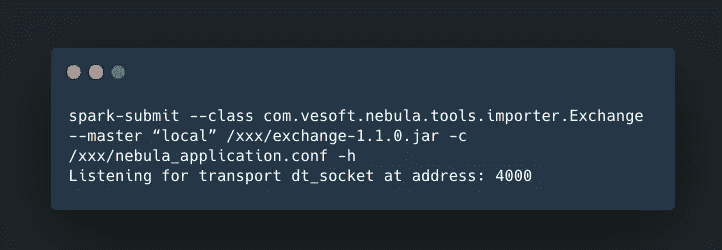
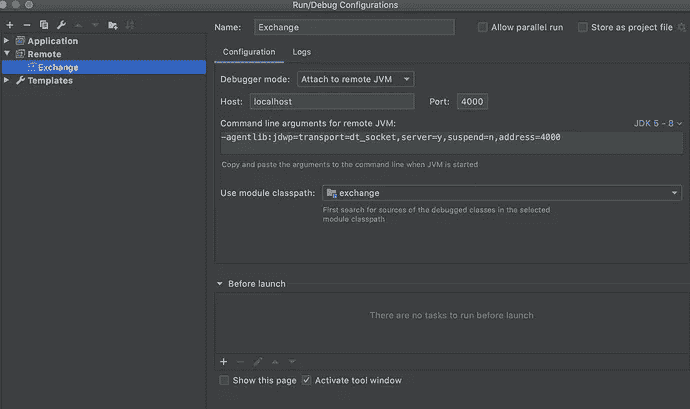
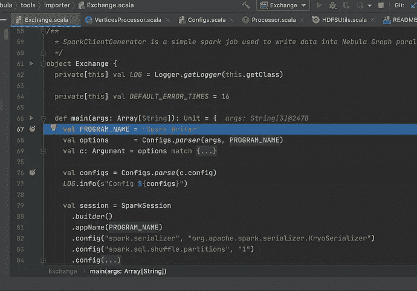

# 在实践中用云图交换导入 Hive 数据

> 原文：<https://itnext.io/hive-data-import-with-nebulagraph-exchange-in-practice-c21ff373d2ad?source=collection_archive---------0----------------------->

StoneWise 公司内部需要使用图形数据库，通过技术选择确定使用 NebulaGraph 数据库。我们仍然需要在真实的业务场景中验证 NebulaGraph 数据库的查询性能。因此，我们迫切需要将数据导入 NebulaGraph 并验证性能。我们发现需要完成将数据从 Hive 用 Exchange 导入 NebulaGraph 的文档，所以我决定记录我们在这个过程中遇到的陷阱，以避免走弯路和陷阱。

本文是基于 NebulaGraph 文档编写的:[从 Hive 导入数据](https://docs.nebula-graph.io/3.3.0/nebula-exchange/use-exchange/ex-ug-import-from-hive/)

# 环境

*   星云图:每夜
*   部署:Mac 上的 Docker
*   硬件:
*   磁盘:固态硬盘
*   CPU、内存:16 G
*   数据仓库环境(Mac 上的本地数据仓库)
*   蜂巢 3.1.2
*   Hadoop 3.2.1
*   交换:[https://github . com/ve soft-Inc/nebula-Java/tree/v 1.0/tools/exchange](https://github.com/vesoft-inc/nebula-java/tree/v1.0/tools/exchange)(编译生成一个 JAR 包)
*   spark:spark-2 . 4 . 7-bin-Hadoop 2.7(在`$HADOOP_HOME/etc/hadoop`目录配置`core-site.xml`、`hdfs-site.xml`、`hive-site.xml`，在`$SPARK_HOME/conf`目录配置`spark-env.sh`。)
*   Scala code runner 版本 2.13.3 —版权所有 2002–2020，LAMP/EPFL 和 Lightbend，Inc .

# 配置

1.  星云图 DDL

2.配置单元 DDL

3.最新的`nebula_application.conf`文件。注意这些字段映射:`exec`、`fields`、`nebula.fields`、`vertex`、`source`和`target`。

# 开始导入

1.  确保 NebulaGraph 服务已启动。
2.  确保配置单元表和数据准备就绪。
3.  运行`spark-sql cli`查看配置单元表和数据是否准备好，以确保 Spark 环境正常。

4.配置就绪后，执行 Spark 命令。

5.成功导入后，您可以使用 db_dump 工具检查导入的数据量。

# 陷阱和注意事项

*   第一个缺陷是 spark-submit 命令没有添加`-h`选项。
*   NebulaGraph 中的标记名区分大小写。标签配置中的名称应该是 NebulaGraph 的标签名称。
*   Hive 数据类型`int`和 NebulaGraph `int`不一致。蜂巢`bigint`对应于星云图`int`。

# 其他注释

*   INSERT 操作比 UPDATE 有更好的性能，因为 NebulaGraph 的底层存储是 KV Store。重复插入会覆盖数据。
*   除了文档中的信息，我还阅读了源代码并在论坛上发表了帖子。

我验证了以下两个场景:

*   使用 Spark 2.4 将数据从 Hive 2 (Hadoop 2)导入 NebulaGraph
*   使用 Spark 2.4 将数据从 Hive 3 (Hadoop 3)导入 NebulaGraph

注意:Exchange 还不支持 Spark 3，编译后报错，所以很难验证 Spark 3 的环境。

还有一些疑问。

*   如何设置`nebula_application.conf`文件中的参数`batch`和`rate.limit`？
*   使用 Exchange 从 Hive 导入数据的原理(最近开始学 Spark。)

# Exchange 源代码调试

有关 Spark 调试的信息，请参见[https://dzone . com/articles/how-to-attach-a-debugger-to-Apache-Spark](https://dzone.com/articles/how-to-attach-a-debugger-to-apache-spark)。

通过 Exchange 源代码学习和调试，我发现只有结合源代码才能理解文档中关于导入 SST 文件和下载摄取的描述。

调试源代码也帮我发现了一些配置问题。

第一步:

第二步:

第三步:创意配置

第四步:点击创意中的`Debug`

> 你对图形数据库和图形技术有热情吗？加入 NebulaGraph 开源社区，与专家交流思想，学习实用技能。[加入松弛度](https://bit.ly/3SmvFu2)
> 
> *NebulaGraph 开源:*[*https://github.com/vesoft-inc/nebula*](https://github.com/vesoft-inc/nebula)*我们高度赞赏每一位观星者，如果你喜欢 NebulaGraph 数据库，请告诉我们。*