# 智能家居和外部系统家庭自动化

> 原文：<https://itnext.io/home-automation-with-smartthings-and-outsystems-e6eb0fdb8f1b?source=collection_archive---------1----------------------->

各位家庭自动化爱好者，你们好！

在过去的几个月里，我一直在设置我的智能家居。我决定用 SmartThings，因为在易用性和可扩展性之间有一个很好的平衡。如果你在用 HomeAssistant，请不要评价我:)

我想拥有的东西之一是一个壁挂式平板电脑，它是一个专用的控制面板，可以在一个地方管理设备，而不必使用我们手机中的不同应用程序。

一段时间以来，我使用一个名为 SharpTools 的第三方平台来构建我的控制面板，但我想要比它所能提供的更多一些。因为我已经在使用 SmartThings API 构建一些定制的小部件，所以我决定全力以赴，在 OutSystems 中构建一切。

[刚接触外部系统？免费试用！](https://www.outsystems.com/home/GetStartedForFree.aspx)

[下载 smart things Integration for out systems。](https://www.outsystems.com/forge/Component_Overview.aspx?ProjectId=13032&ProjectName=smartthings-integration)

# 从结尾开始

我首先确定了控制面板的主要用例，并设计了界面和交互以获得最佳体验(至少以我的技能来说)。

总的想法是非常常见的家庭自动化爱好者有，我见过几个这样的控制面板，我决定做我自己的了:公寓的 3d 渲染和它上面的控制。

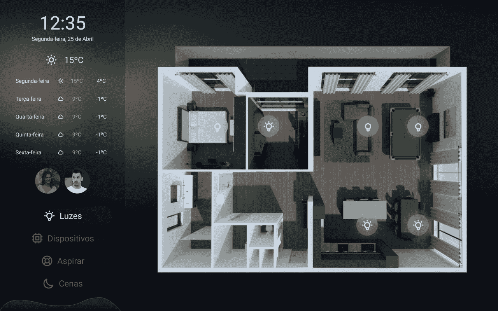

Figma 中的初始 UI 设计

# 应用程序设置

我首先创建了一个服务模块来处理所有的 API 调用、服务器动作和数据。然后，一个示例应用程序列出设备及其详细信息，最后另一个应用程序为我的个人控制面板。

让我们看一下每个应用程序的更多细节。

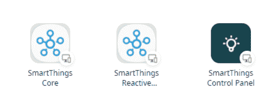

我的外部系统个人环境中的 SmartThings 应用

# 智能事物核心

这是一个服务模块，处理与 [SmartThings API](https://developer-preview.smartthings.com/docs/devices/device-basics) 的所有通信，还存储服务器动作，以执行由小部件或动作触发的特定动作。

我不是后端开发人员，我使用 REST 的知识非常有限，并且依赖于从互联网上复制粘贴。使用 OutSystems 添加这些方法并在结构中表示它们对我来说非常有用，节省了时间。

## 方法

我只添加了我觉得我实际上需要的方法，主要是列出东西、修改东西和获取关于东西的信息。

我仍然不知道如何在不 ping 设备的情况下监听设备上的变化，但对于我的用例来说，当平板电脑屏幕醒来时刷新数据已经足够了。稍后，我将更好地了解这个“postEvents”方法。

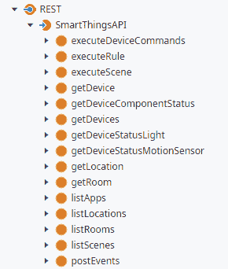

我添加的初始方法集

## 行动

在这些方法之上，我还创建了一些动作来抽象一些常见场景的复杂性，比如开灯或关灯、设置级别等。

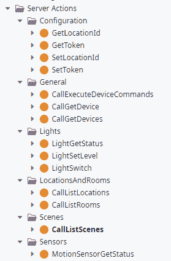

为获取或发布数据而创建的一组初始操作

## 设备同步

为了更容易地组织房间和设备，我创建了一个计时器，将信息同步到外部系统，这样我就可以更容易地创建集合和显示信息。同样，后端真的不是我的领域，所以如果云中的设备数量与 OutSystems 表中的设备数量不同，我就删除所有设备并重新存储它们。

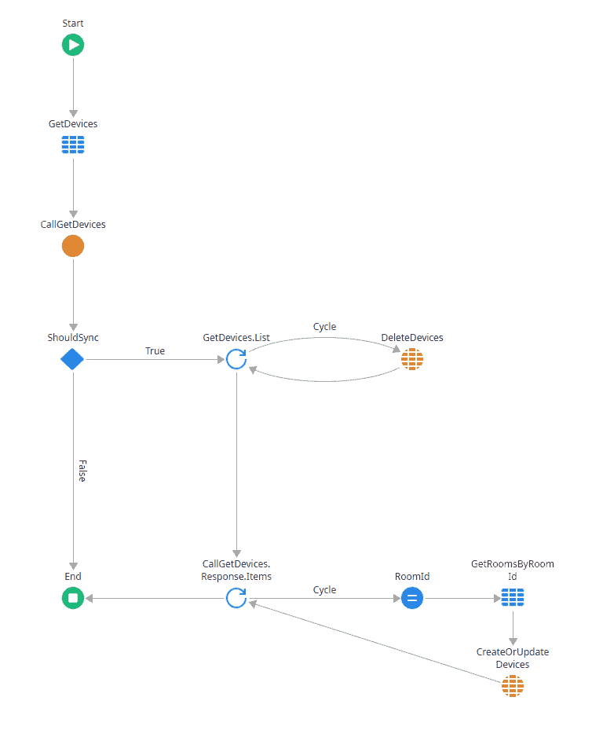

如果它看起来很蠢，但却有效，那它就不蠢

# SmartThings 示例应用

这实际上是前端，我们可以看到集成提供了什么。第一个版本能够列出场景、房间、设备，获取设备信息和状态，还能执行开灯或关灯等命令。

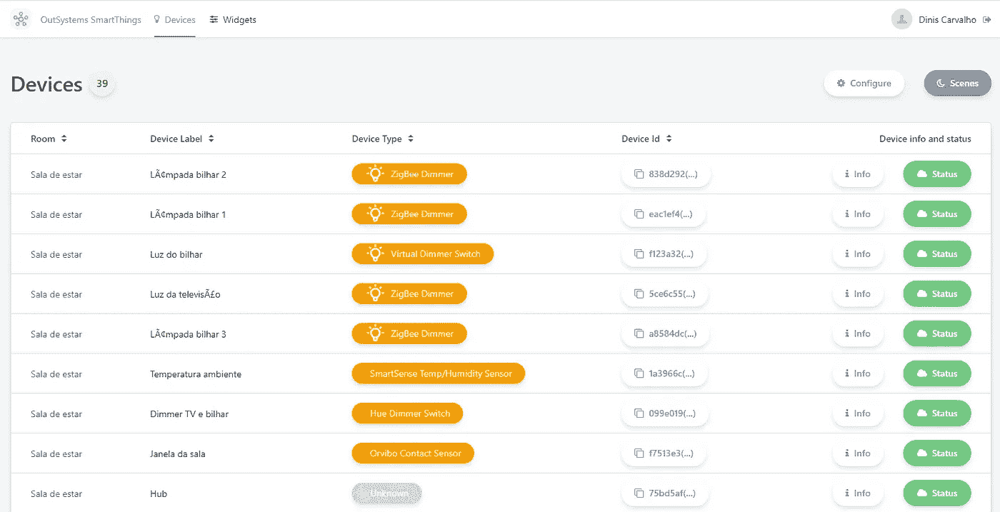

设备屏幕，列出了所有设备以及可以对其执行的操作

## 小部件示例:灯开关

这是一个非常基本的灯开关，包含在示例应用程序中。

当用户单击小部件时，带有状态的局部变量被切换，其值被传递给调用 API 的操作，该 API 带有在给定设备或设备列表上执行的命令。

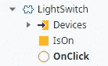

小部件块在 ServiceStudio 中的样子

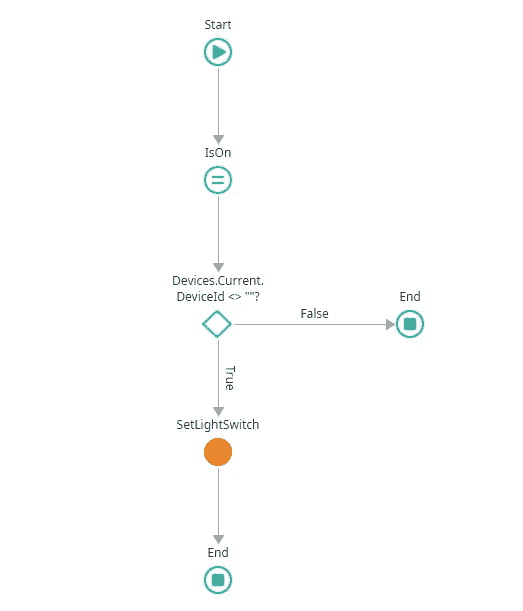

按下开关时运行的动作

# 控制面板

因此，使用上面看到的组件，是时候让实际的控制面板启动并运行了！

虽然我们 90%的时间都在使用墙上的灯开关，但控制面板是用来改变各个灯的亮度水平，在出门前检查天气和控制 Roomba，而不需要我妻子安装另一个应用程序(她甚至没有安装 SmartThings)。

看起来很酷，不是吗？

## 3d 视图

我见过许多基于 3d 渲染的控制面板的例子，它们看起来很酷，并且在寻找设备时拥有蓝图的实际上下文要高效得多。

我已经有了 3d 模型，因为我们在装修公寓之前使用了一个名为 Planner5D 的软件，所以这个项目有点“免费”。导出渲染后，我用它做了控制面板背景，并导入到外部系统。

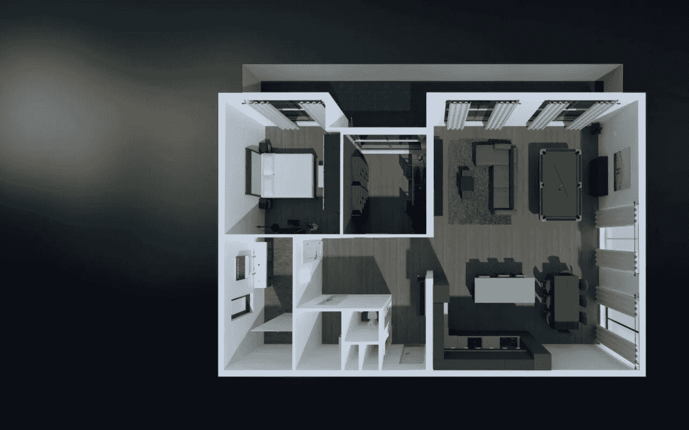

渲染已经很好地放置在背景图像中

## 自定义小部件

我为这个控制面板构建了几个定制的小部件，一个时钟、一个天气小部件、一个室温图表和其他小部件来处理诸如灯和传感器之类的设备。

其中最重要的是灯开关和调光器部件。SmartThings 在管理智能灯组方面很糟糕，他们通过他们的应用程序允许这一点，但他们实际上并没有将灯组作为一个设备或我们可以通过 API 控制的任何东西公开，所以我必须构建能够同时控制多个灯的定制开关，确保它们在状态和亮度级别方面总是同步的。

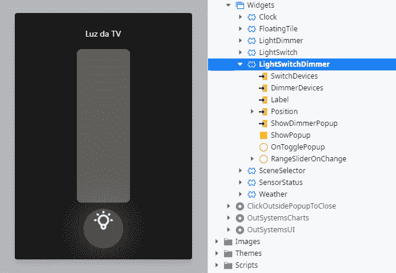

具有开关和调光功能的部件

## 与 Roomba 集成

这个还没完成，但是可以用。

为了与 Roomba 集成，我必须在 SmartThings IDE 中创建虚拟开关，并通过 IFTTT 自动控制它们来控制 Roomba。不幸的是，IFTTT 不支持 Roomba 最喜欢的多区域任务，所以这种集成迫使我为每个房间创建单独的开关和/或为整个公寓创建一个开关。我想我可以通过使用语音助手触发器来执行 Roomba 最喜欢的任务来解决这个问题，我稍后会这样做。

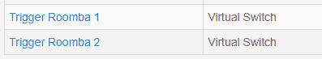

SmartThings IDE 中的虚拟交换机

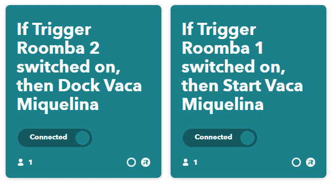

如果 TTT 小应用程序或其他任何名称，它们会根据交换机的状态连接到 Roomba

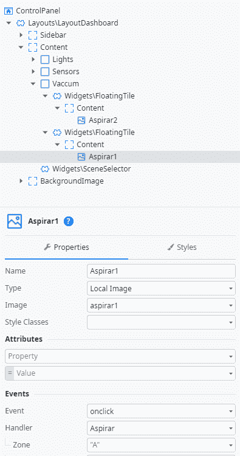

每个区域都有一个覆盖图像，带有一个触发虚拟开关打开或关闭的点击处理程序

## 背景随着昼夜循环平稳变化

我说过我用控制面板上的渲染创建了一个背景，但实际上我创建了两个。一个版本用于白天，另一个版本用于晚上。

时钟小部件调用一个动作来定义一天图像的透明度级别，这样背景随着一天中的时间循环，从早上 8 点到下午 2 点到晚上 8 点。它很微妙，但我喜欢它的样子。

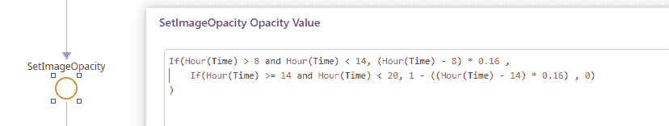

伟大的数学，这样的计算，哇

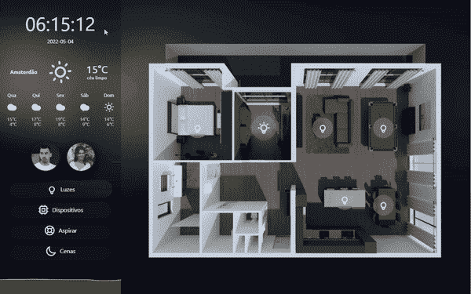

我点击 AddHours()来记录这张 GIF 的时间

# 结束语

虽然我的控制面板已经基本完成，但实际的集成、方法、动作和示例应用程序还有很多需要改进的地方，我会继续这样做，但我想尽可能早地与社区分享尽可能多的内容。

感谢一些帮助出主意的亲密朋友，感谢我的妻子容忍这种胡说八道。

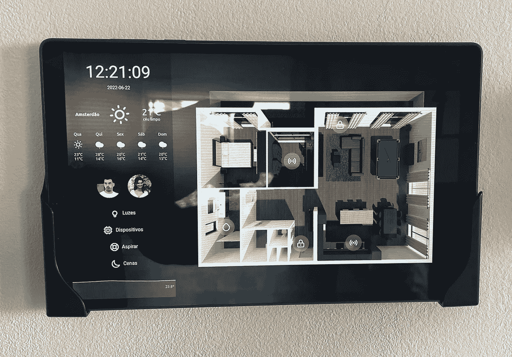

这就是了，一台便宜的安卓平板电脑，安装在墙上，运行我的控制面板，质量很成问题