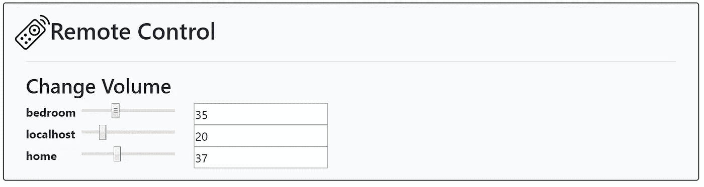

# 家庭音量控制:Go+VueJS = R&R

> 原文：<https://itnext.io/home-volume-control-go-vuejs-r-r-151ff030ffa8?source=collection_archive---------2----------------------->

Golang & Vue 中的一个自我发现的无配置家庭音量控制系统。射流研究…


如今，在大多数家庭中，我们都有一些供孩子使用的家用电脑、一些笔记本电脑和几部平板电脑/手机。现在，当你想休息的时候，试着让他们都按下音量降低按钮……一个自我发现的分布式服务来控制房间的音量怎么样？…我是否听到有人说:“给我们一些时髦的用户界面来遥控我们的孩子”？你的愿望就是我的命令。

时不时地，我会渴望编写一个代码项目，它将作为新技术的试验场，并让我接触到我不会探索的问题和想法。我真的很喜欢 Golang 呈现小型自包含服务的能力，它在一个小的 exe 文件中包含了 REST 后端和 Web 服务器(以及 html/js 的公共目录)，我也很喜欢 VueJS 同样的简单性，它没有任何问题，只需要一个 html 文件就可以完成所有事情。我想通过构建一个小型的家庭项目来测试这个想法，我还探索了网络服务发现，只是为了增加趣味。我以后可能会把这个实验应用到手机或渐进式网络应用中。

这个项目的完整源代码可以在[我的 github](https://github.com/amitbet/kid-control) 页面找到。

## 服务发现选项:

*   SSDP: [简单服务发现协议](https://en.wikipedia.org/wiki/Simple_Service_Discovery_Protocol) ( [go-ssdp](https://github.com/koron/go-ssdp) )
*   Zeroconf:使用[多播 DNS](https://en.wikipedia.org/wiki/Multicast_DNS)(golang[zeroconf](https://github.com/grandcat/zeroconf))

**SSDP** :与互联网一起发明的原始“简单”协议之一，基于 UDP 组播，非常容易实现并整合到 upnp 中，但使用过度，可能会被家庭路由器配置阻止。go 实现只有 15 颗星，嗯..

**ZeroConf** : zconf 使用多播 DNS，[go 实现](https://github.com/grandcat/zeroconf)有 140 颗星， [go-mdns](https://github.com/hashicorp/mdns) (hashicorp)有 450 颗星，这在我听起来更像是主流代码。mDNS 也基于 UDP 组播(这次是双向的)，据说它对常见的家庭网络错误配置更有弹性。两者都同样不安全，但我们谈论的是家庭网络...

我本来会用 zeroconf，但是在玩了它之后( [guide](https://sosedoff.com/2017/09/07/zeroconf.html) )，它似乎需要[安装一个 Bonjour 客户端](https://stackoverflow.com/questions/23624525/standard-mdns-service-on-windows)，或者应用一些 reg hack 来禁用一个监听 mDNS 默认端口的服务。我天真地认为 zeroconf 的整个想法是零配置。所以我最终选择了一些**SSDP**简约。

```
import (
    ssdp "github.com/koron/go-ssdp"
)hname, err := os.Hostname()//advertizing the service
ad, err := ssdp.Advertise(
  "urn:schemas-upnp-org:service:KidControl:1", // send as "ST"
  "id:"+hname,                                 // send as "USN"
  "http://"+myIp+":7777/",                     // send as "LOCATION"
  "ssdp for KidControl",                       // send as "SERVER"
  3600) // send as "maxAge" in "CACHE-CONTROL"
 if err != nil {
  logger.Error("Error advertising ssdp: ", err)
 }//searching for instances on the network
svcList,err := ssdp.Search("urn:schemas-upnp-org:service:KidControl:1", 5, "")
```

解决了这个争论之后，让我们继续编写实际的服务。我们将使用 go-volume 来控制跨操作系统的卷，在 windows 上，我们应该确保我们不在远程会话中(这不起作用)。为 get/set vol REST API 编写一些样板服务器代码，并提供一个公共 web 根目录:

```
import (
    gmux "github.com/gorilla/mux"
)

mux := gmux.NewRouter()**//restfull API:**
mux.HandleFunc("/set-volume", setVolumeOnMachine).Queries("machine", "{machine}")
mux.HandleFunc("/set-volume", setVolume)
mux.HandleFunc("/get-volume", getVolumeOnMachine).Queries("machine", "{machine}")
mux.HandleFunc("/get-volume", getVolume)
mux.HandleFunc("/configuration", sendConfig)**//web server:**
mux.PathPrefix("/").Handler(http.FileServer(http.Dir("./public")))**//run the Http listener:**
err := http.ListenAndServe(":8080", mux)
if err != nil {
    fmt.Print("lisgtening error: ", err)
}
```

现在来看看 JS 方面的一个漂亮的 web UI。因为我不是一个网页设计师，也没有成为一个网页设计师的愿望，我只是选择了一些不错的 css 套件(例如:bootstrap)来为我处理响应表和圆形按钮。

```
<link rel="stylesheet" href="https://stackpath.bootstrapcdn.com/bootstrap/4.1.0/css/bootstrap.min.css" >
```

## 古老的 Vue / Angular / React 辩论:

由于我们将有一个动态重复部分，用于控制每台发现的机器中的音量，我们需要一些框架来生成动态 HTML 标签，并将它们绑定到我们从服务器获得的数据。

这就是 VueJS 发挥作用的地方，现在你会说:“它可以是任何其他的 JS 框架，为什么选择 vue 呢？为什么不是 Angular v1.5/v6、ReactJS 等……”嗯，这些其他框架通常需要大量的安装，以及一些 UI 构建过程和一些花费在学习它们不太直观的操作细节上的时间。在网络上寻找最小角度/反应演示时，我确实找到了一些，但它们要么是旧的，要么是粗糙的，不推荐用于生产。Vue 非常容易集成，就像 bootstrap 一样，你将一个" s*script src "*链接放到项目中，你就可以开始用 Vue 编码，而不需要构建链(没有 webpack、预编译步骤、插件等)。)而且这是官方的，在他们的[主页面](https://vuejs.org/v2/guide/index.html)上推荐。“那好吧，这个 Vue 听起来很有趣。给我报名！”

**让有 Vue:**

```
<script src="https://unpkg.com/vue"></script><div class="form-group m-3" id="vueApp">
<h3>Change Volume</h3>**<!--we start using vue, and attach it to the 'vueApp' ID later-->**
<div **v-for="m in machines"** class="row">
<div class="col-md-1">
    <b>**{{m.name}}**</b>
</div>
<div class="col-md-2">
    <input type="range" **v-on:change**="changeVolume(m.volume,m.name)" min="0" max="100" **v-model**="m.volume" id="volumeSlider"></input>
</div>
<div class="col-md-1">
    <input type="text" **v-on:change**="changeVolume(m.volume,m.name)" id="volumeText" **v-model**="m.volume"></input>
</div>
</div>
```

一些 JQuery ajax 函数将 VueJS 连接到我们的 REST API:

```
<script src="https://ajax.googleapis.com/ajax/libs/jquery/3.3.1/jquery.min.js"></script><script>
        **//the JS part of vue, this is where we attach to the tags**
        var appData = new Vue({
            el: **'#vueApp'**,
            data: {
                machines: [{
                        name: "localhost",
                        volume: 100
                    },
                ]
            },
            mounted: function () {
               **//the "on document ready" function**
                var self = this;
                $.get("http://" + window.location.host + "/configuration", function (data) {
                    let d = JSON.parse(data)
                    self.machines = d.machines;
                });
            },
            methods: {
                **changeVolume**: function (slideValue, machine) {
                    let url = "http://" + window.location.host + "/set-volume?machine=" + machine$.ajax({
                        url: url,
                        data: JSON.stringify({
                            "volume": slideValue,
                        }),
                        dataType: 'json',
                        type: 'POST',
                        contentType: 'application/json',
                        success: response => console.log(response),
                        error: e => console.log(e)
                    });
                }
            }
        })</script>
```

转眼间。在家里的多台计算机上运行它(Win/Linux/Mac)，然后连接到其中任何一台计算机，都会显示如下内容:



在房子周围摆弄音量从来没有这么容易过！！

现在有了一个闪亮的新网络应用程序，可以让孩子的 youtube 视频安静下来。编写应用程序也是一件非常有趣的事情……我喜欢代码的简单性，我想大多数程序员都是这样，这也是 Node、JSON 和 JS 如此成功的原因之一。从简单开始有一种神奇的感觉，只有在被要求时才会变得复杂，这让它看起来像一个儿童建筑游戏。在我看来，具有陡峭的学习曲线的框架很少是合理的，这种对简单性的驱动就是为什么开发人员不断从头开始重建应用程序和框架，总是想:“必须有更简单的方法来完成任务”。