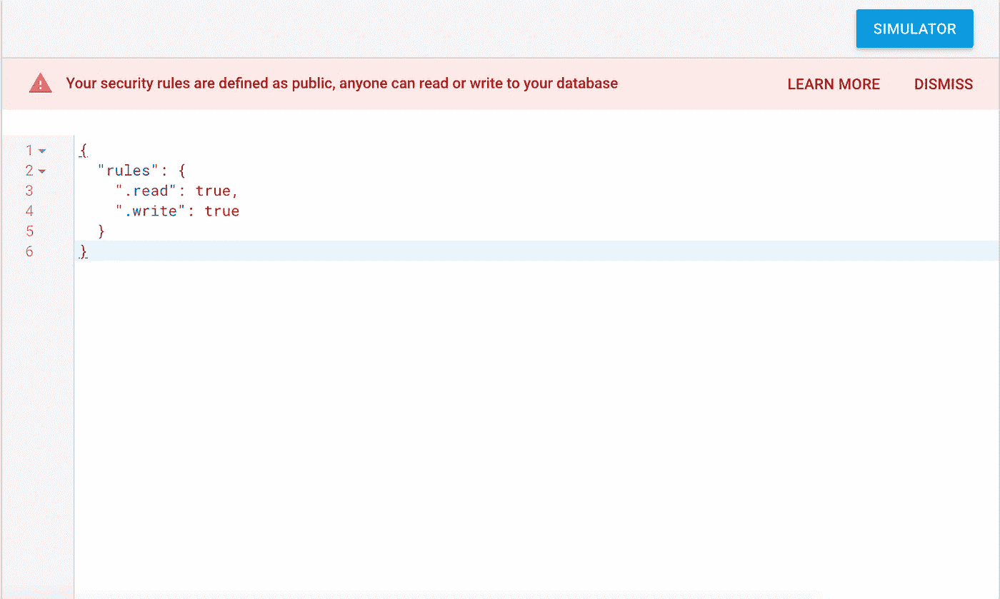
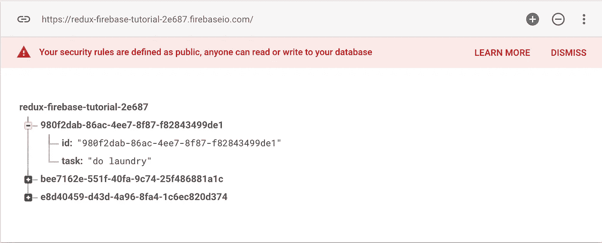

# 将 Firebase 连接到您的 Redux 商店

> 原文：<https://itnext.io/hooking-up-firebase-to-your-redux-store-a5e799cf84c4?source=collection_archive---------0----------------------->


> [点击这里在 LinkedIn 上分享这篇文章](/hooking-up-firebase-to-your-redux-store-a5e799cf84c4?utm_source=medium_sharelink&utm_medium=social&utm_campaign=buffer)

Firebase 是谷歌人开发的一个非常棒的实时数据库。它允许你在不依赖任何服务器端数据库的情况下持久化数据，并且实时更新！在本教程中，我将向您展示如何在制作 ToDo 应用程序时使用 React-Redux。是的，我知道，我很有创意。请在 https://github.com/wickard/redux-firebase-tutorial 的[下载完整的回购协议。](https://github.com/wickard/redux-firebase-tutorial)

首先，让我们作弊，并从我们在脸书的朋友那里得到一些帮助。Npm 安装创建-反应-应用程序。Create-react-app 是一个很棒的工具，它可以让你快速地运行一个 react 项目。继续在您的终端中运行 create-react-app *您的项目名称*来创建您的新项目文件夹。Cd 到您的项目中，并运行命令 npm install。Npm start 将运行您的项目，花一分钟来欣赏旋转的 react 徽标。

欢迎回来！在我们开始之前，让我们添加一些需求。在您的控制台中键入以下命令:NPM install firebase redux react-redux redux-thunk。随着我们的环境准备就绪，是时候建立我们的 firebase 了。前往 https://firebase.google.com/[创建一个账户/项目。回到您的项目，让我们在 src 文件夹中创建 firebase 文件。我将文件顶部的 mine firebase.js 称为 import firebase，如下所示:](https://firebase.google.com/)

```
import firebase from ‘firebase’
```

回到网络！在你的 firebase 家庭控制台中，点击“将 firebase 添加到你的 web 应用程序”按钮。结果应该是这样的。

```
<script src="https://www.gstatic.com/firebasejs/4.11.0/firebase.js"></script>
<script>
  // Initialize Firebase
  var config = {
    apiKey: "YOUR API KEY",
    authDomain: "YOUR DOMAIN",
    databaseURL: "YOUR DATABASE URL",
    projectId: "etc",
    storageBucket: "etc",
    messagingSenderId: "etc"
  };
  firebase.initializeApp(config);
</script>
```

让我们去掉那些脚本标签，我们不需要它们。复制中间的所有内容，让我们初始化数据库。您的 firebase.js 文件应该如下所示:

```
import firebase from ‘firebase’
import uuid from 'uuid/v4'const config = {authDomain: “YOUR DOMAIN”,databaseURL: “YOUR URL",projectId: “YOUR ID”,storageBucket: “YOUR BUCKET”,messagingSenderId: “YOUR ID”};firebase.initializeApp(config);const database = firebase.database()export default database
```

现在我们只需要添加和删除任务的几个函数。在上面，我们还导入了 node 提供的 uuid 库。我们将使用它给我们的任务唯一的 id。

```
export const addTaskToFirebase = (task) => { const id = uuid() database.ref(`/${id}`).set({ task, id })}export const removeTaskFromFirebase = (id) => {database.ref(`/${id}`).remove()}
```

为了向我们新创建的 firebase 添加一些东西，我们将在我们创建的惟一 id 处向数据库的根目录添加一个子节点。要删除，我们只需在相同的路径上调用 remove。比我能提供的更好的文件生活在这里:[https://firebase.google.com/docs/web/setup](https://firebase.google.com/docs/web/setup)。

好吧！我们的火力基地终于建成了。让我们想办法把任务添加到我们的列表中。我们可以创建一个简单的表单来向列表中添加条目。提交按钮会将任务推送到我们的 firebase。转到 App.js 文件，添加以下内容:

```
import {addTaskToFirebase, removeTaskFromFirebase}  from './firebase'export default class App extends Component {render() {return (
<div>
  <div className="App">
  <header className="App-header">
    
    <h1 className="App-title">Welcome to React</h1>
  </header>
  <p className="App-intro">
  To get started, edit <code>src/App.js</code> and save to reload.                 </p> 
 </div>
 <div>
   <form onSubmit={(e) => {
     e.preventDefault()
     addTaskToFirebase(e.target.task.value)}}>
     <input type="text" name="task" />
     <input type="submit" name="add task" />
   </form>
 </div>
  <div>
    <h2> Todo:</h2>
    <ul>
      we will map over our store later!
    </ul>
  </div>
</div>
  );
 }
}
```

太好了！

回到 firebase 项目页面，单击左侧菜单栏中的数据库项目。在顶部选项卡上，单击规则。将读写规则设置为 true，这样我们就可以开始将任务添加到 todo 列表中。不要担心我们现在面临的大量安全问题，我们可以在以后改变规则。



现在，我们从任务栏运行 npm start，我们可以将任务添加到待办事项列表中。单击页面上的添加任务后，没有任何反应。但是，如果我们回到 firebase 项目中的 database 选项卡，您添加的任务应该会显示在您的实时数据库中。



这是伟大的，但我们可能希望他们出现在页面上。去商店！在教程中，我将掩饰实现 redux 商店的细节，如果你想了解更多信息，请查看[https://egghead.io/courses/getting-started-with-redux](https://egghead.io/courses/getting-started-with-redux)。在 src 目录 store.js 中创建一个新文件。在顶部，我们将处理我们的导入:

```
import { createStore, applyMiddleware } from 'redux'
import database from './firebase'
import thunkMiddleware from 'redux-thunk'
```

首先，我们将从 firebase 中获取所有任务。它的代码看起来会像这样。

```
/**
* ACTION TYPES
*/
const GET_TASKS = 'get tasks'/**
* ACTION CREATORS
*/
export const getTasks = (tasks) => ({type: GET_TASKS, tasks})/**
* THUNKS
*/
export function getTasksThunk() {
 return dispatch => {
 const tasks = [];
 database.ref(`/`).once('value', snap => {
  snap.forEach(data => {
  let task = data.val();
  tasks.push(task)
  })
 })
 .then(() => dispatch(getTasks(tasks)))
 }
}
```

动作常量和动作创建器对于任何 redux 存储来说都是非常标准的，所以让我们来讨论一下 Thunk。Thunk 只是一个有趣的词，它允许我们将异步函数分派给存储，而不仅仅是对象。这可以通过 thunk 中间件来实现。我们在这里使用它对我们的 firebase 进行异步调用，获取其中的所有任务，然后将所有任务分派给我们的 redux 存储。这将通过我们在此处创建的减速器来实现:

```
/**
* REDUCER
*/
function Reducer (state = [], action) {
 switch (action.type) {
  case GET_TASKS:
   return action.tasks
  default:
   return state
  }
}export default createStore(Reducer, applyMiddleware(thunkMiddleware))
```

最后一行用我们的减速器创建了我们的商店。我们导出它，这样我们就可以在应用程序的其余部分使用它。打开我们的主索引文件，向其中添加几行内容，以便从 react-redux 导入 Provider。我们使用 provider 让所有组件访问我们的 redux 存储(并通过它访问我们的 firebase)。

```
...
import store from './store'
import { Provider } from 'react-redux'ReactDOM.render(
 <Provider store={store}>
  <App />
 </Provider>,
 document.getElementById('root'));
...
```

再次打开应用程序组件，让我们连接我们的商店。在文件的顶部导入存储和我们的 getTaskThunk。我们将使用连接功能将我们的应用程序连接到商店。更多关于 connect 的信息可以在这里找到[https://medium . com/mofed/reduxs-mystery-connect-function-526 EFE 1122 E4](https://medium.com/mofed/reduxs-mysterious-connect-function-526efe1122e4)。

```
import { connect } from 'react-redux'
import { getTasksThunk } from './store'
```

在组件的 jsx 中添加这一行来显示我们所有的任务。

```
...
<div>
 <h2> Todo:</h2>
 <ul>
  {this.props.tasks.map(item => <li key={item.id}>{item.task}<button
  onClick={() => removeTaskFromFirebase(item.id)}>x</button></li>)}  </ul>
</div>
...
```

这些任务来自哪里？很高兴你问我们通过连接功能从商店获得它们，它看起来像这样:

```
const mapState = state => ({
 tasks: state
 })
const mapDispatch = dispatch => {
 dispatch(getTasksThunk())
 return {
 }
}
export default connect(mapState, mapDispatch)(App);
```

我们所有的状态都是我们的任务，所以我们可以将任务道具映射到我们的整个状态。mapDispatch 函数为我们的组件函数提供了向商店发送信息的能力。因为我们希望这个函数在加载时执行，所以我们把它放在返回的对象之外。最后，我们将组件与最后一行中的商店连接起来，并将其导出为默认值。此时，您的 linter 应该会对您大喊大叫，确保删除文件顶部附近的类声明前面的当前导出默认值。

运行另一个 npm 启动和 wallah！您之前添加到 firebase 中的任务应该会出现。尝试添加另一个。没什么>。>，但在刷新时，它会按预期显示。让我们用 firebase 提供的一些漂亮的事件监听器来解决这个问题。

打开 store.js 文件并添加以下内容:

```
/**
* ACTION TYPES
*/
...
const ADD_TASK = 'add task'
const REMOVE_TASK = 'remove task'/**
* ACTION CREATORS
*/
...
export const addTask = (task) => ({type: ADD_TASK, task})
export const removeTask = (task) => ({type: REMOVE_TASK, task})/**
* LISTENERS
*/
export function watchTaskAddedEvent(dispatch) {
 database.ref(`/`).on('child_added', (snap) => {    dispatch(addTask(snap.val()));
 });
}export function watchTaskRemovedEvent(dispatch) {
 database.ref(`/`).on('child_removed', (snap) => {
 dispatch(removeTask(snap.val()));
 });
}
```

Firebase 允许您的应用程序监听事件，并在事件触发时执行回调。关于监听器的完整列表，请查看这里的文档[https://firebase . Google . com/docs/database/admin/retrieve-data](https://firebase.google.com/docs/database/admin/retrieve-data)。我们将使用 child_added 和 child_removed 事件。每当一个项目被添加到我们的 firebase 时，它将使用实时数据库刚刚收到的数据调度 addTask 函数。同样，每当删除一个项目时，它将调度 removeTask。

更新缩减器以处理这些新动作:

```
/**
* REDUCER
*/
function Reducer (state = [], action) {
 switch (action.type) {
  case GET_TASKS:
   return action.tasks
  case ADD_TASK:
   return [...state, action.task]
  case REMOVE_TASK:
   return state.filter(task => task.id !== action.task.id)
  default:
   return state
 }
}
```

剩下的就是把我们的新侦听器连接到应用程序组件。打开 App.js 并添加导入两个新函数。

```
import { getTasksThunk, watchTaskAddedEvent, watchTaskRemovedEvent } from './store'
```

将它们添加到您的地图调度中，您就万事俱备了！

```
const mapDispatch = dispatch => {
 dispatch(getTasksThunk())
 watchTaskAddedEvent(dispatch)
 watchTaskRemovedEvent(dispatch)
 return {
  }
}
```

再次运行 npm start，然后嘭！我们的应用程序根据命令添加和删除任务。但你可以在 firebase 之前这么做。在同一个地址打开另一个标签，当你添加或删除任务时，你会惊奇地发现每个页面是如何更新的！

感谢阅读！