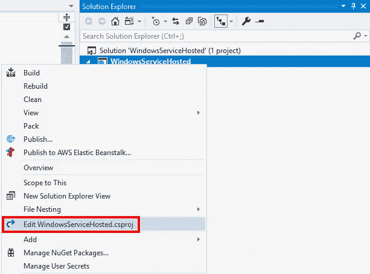

# 将 ASP.NET 核心应用程序托管为 Windows 服务

> 原文：<https://itnext.io/host-asp-net-core-application-as-a-windows-service-306f638ca9e6?source=collection_archive---------3----------------------->

。NET Core 2.1 里面有很多很酷的东西。大卫·福勒(David Fowler)不久前在推特上发布了一系列关于这个版本中隐藏的宝石的消息，其中一个真正引起我注意的是在 Windows 服务中托管 ASP.NET 核心应用的[能力](https://twitter.com/davidfowl/status/1004233944085118976)。这篇文章将介绍如何创建一个新的 ASP.NET 核心应用程序，然后对其进行必要的修改，使其作为 Windows 服务运行。我从官方[文件](https://docs.microsoft.com/en-us/aspnet/core/host-and-deploy/windows-service?view=aspnetcore-2.1)中获取了大部分我需要的信息。

## 项目创建

我们将使用。NET CLI 来创建项目，但是如果您愿意，也可以使用 Visual Studio。在要创建项目的目录中打开命令提示符，并运行以下命令。

```
dotnet new razor --no-https
dotnet new sln
dotnet sln add WindowsServiceHosted.csproj
```

在 Visual Studio 中打开新的解决方案。

## 项目文件更改

右键单击您的项目字段并选择**编辑**。



第一步是添加一个[运行时标识符](https://docs.microsoft.com/en-us/dotnet/core/rid-catalog)。文档使用的是 **win7-x64** ，所以我们将使用相同的。我确实尝试过使用 **win** 和 **win7** ，但是它们无法工作，因为没有与它们相关联的特定运行时。在同一步骤中，我们将添加对[微软的引用。AspNetCore . hosting . window services](https://www.nuget.org/packages/Microsoft.AspNetCore.Hosting.WindowsServices/)n 获取包。

```
Before:
<Project Sdk="Microsoft.NET.Sdk.Web">

  <PropertyGroup>
    <TargetFramework>netcoreapp2.1</TargetFramework>
  </PropertyGroup>

  <ItemGroup>
    <PackageReference Include="Microsoft.AspNetCore.App" />
  </ItemGroup>

</Project>

After:
<Project Sdk="Microsoft.NET.Sdk.Web">

  <PropertyGroup>
    <TargetFramework>netcoreapp2.1</TargetFramework>
    <RuntimeIdentifier>win7-x64</RuntimeIdentifier>
  </PropertyGroup>

  <ItemGroup>
    <PackageReference Include="Microsoft.AspNetCore.App" />
    <PackageReference Include="Microsoft.AspNetCore.Hosting.WindowsServices" Version="2.1.1" />
  </ItemGroup>

</Project>
```

## 程序类别更改

打开项目的程序类。在 Main 函数中，Web 主机上的 Run call 需要改为 RunAsService。

```
Before:
CreateWebHostBuilder(args).Build().Run();

After:
CreateWebHostBuilder(args).Build().RunAsService();
```

接下来，在 CreateWebHostBuilder 函数中，我们需要将内容根目录更改为应用程序的目录。我们使用 Process 类来提取文件名，并使用它来获取进程正在运行的目录。

```
Before:
public static IWebHostBuilder CreateWebHostBuilder(string[] args) =>
    WebHost.CreateDefaultBuilder(args)
        .UseStartup<Startup>();

After:
public static IWebHostBuilder CreateWebHostBuilder(string[] args) =>
    WebHost.CreateDefaultBuilder(args)
        .UseContentRoot(Path
                        .GetDirectoryName(Process
                                          .GetCurrentProcess()
                                          .MainModule
                                          .FileName))
        .UseStartup<Startup>();
```

## 出版

在核心之前的版本中，本可以跳过这一步，但对于。从项目中获取可以安装的实际 exe 文件的唯一方法是发布应用程序。您可以使用。NET CLI 或 Visual Studio 来发布应用程序。我将使用以下内容。NET CLI 命令从与项目文件相同的目录运行。

```
dotnet publish
```

因为我没有指定一个配置值，所以这个项目是在 debug 中构建的，并在**bin \ Debug \ netcoreapp2.1 \ win 7-x64 \ publish**目录中结束。

## 装置

在管理模式下打开命令提示符，并运行以下命令来创建 windows 服务。 **binPath** 需要是 exe 的完整路径，否则即使成功创建，服务也无法启动。

```
sc create WindowsServiceHosted binPath= "C:\WindowsServiceHosted\bin\Debug\netcoreapp2.1\win7-x64\publish\WindowsServiceHosted.exe"
```

另外，注意在 **binPath=** 之后和 exe 名称之前的空格是必需的。

## 服务管理

现在服务已经安装完毕，运行下面的命令来启动它。

```
sc start WindowsServiceHosted
```

服务启动后，你可以打开浏览器，进入 [http://localhost:5000/](http://localhost:5000/) ，查看你的应用程序运行情况。

要检查服务的状态，请使用以下命令。

```
sc query WindowsServiceHosted
```

要停止服务，请使用以下命令。

```
sc stop WindowsServiceHosted
```

最后，使用下面的命令卸载您的服务。

```
sc delete WindowsServiceHosted
```

## 排除故障

虽然可以调试 Windows 服务，但这是一件痛苦的事情。幸运的是，如果应用程序是在调试模式下运行的，文档会引导我们正常运行应用程序，但是这确实需要对程序类进行更多的修改。

首先，将 CreateWebHostBuilder 更改回其原始状态。

```
public static IWebHostBuilder CreateWebHostBuilder(string[] args) =>
    WebHost.CreateDefaultBuilder(args)
        .UseStartup<Startup>();
```

接下来，在 Main 函数中，我们必须决定我们是否作为服务运行，如果是，切换我们如何启动应用程序。

```
public static void Main(string[] args)
{
    var runAsService = !Debugger.IsAttached;
    var builder = CreateWebHostBuilder(args);

    if (runAsService)
    {
        builder.UseContentRoot(Path
                               .GetDirectoryName(Process
                                                 .GetCurrentProcess()
                                                 .MainModule.FileName));
    }

    var host = builder.Build();

    if (runAsService)
    {
        host.RunAsService();
    }
    else
    {
        host.Run();
    }
}
```

对于这个例子，我们将只在没有附加调试器的情况下作为服务运行。您可以看到其余的代码是如何使用这个 runAsService 布尔值在服务所需的设置和普通 web 应用程序主机的设置之间进行转换的。

## 包扎

我很高兴能够以窗口服务的形式托管 ASP.NET 核心应用。这似乎是一个我遇到的比人们想象的要多得多的案例。

我希望看到简化 Windows 服务的东西，比如为。NET Core 2.1 ( [这个](https://github.com/Topshelf/Topshelf/issues/455)问题有与 2.1 相关的所有问题的链接，如果你想查看进度的话)。这将是很好的。NET 核心 Windows 服务，支持级别与以前版本的. NET 相同。

*最初发表于* [*埃里克·安德森*](https://elanderson.net/2018/09/host-asp-net-core-application-as-a-windows-service/) *。*