# 免费托管您的 Alexa 技能

> 原文：<https://itnext.io/host-your-alexa-skills-for-free-2927ada55a5b?source=collection_archive---------3----------------------->

使用 Alexa 托管的技能，无需支付任何云资源！


# 介绍

几年前，我发表了一篇文章，解释了如何使用 AWS 产品如 API Gateway、Lambda 和 S3 创建一个基本的 Alexa 技能。如上所述，结果是一个无限可扩展的解决方案，无论我们有一个用户还是同时有数千个用户，它都可以顺利工作。

听起来很棒，不是吗？不过，有一个问题，那就是这种方法的成本:拥有 Alexa 技能的 AWS 账户(*你*，可能)将不得不支付**任何使用该技能的 Echo 设备**发出的呼叫。

我知道…你们中的大多数人可能会认为“*不，像 Lambda 和 S3 这样的产品并不贵，而且有永远免费的层级*”。但是，如果我们的 Alexa 技能在互联网上真正流行起来，并超越了λ、S3 或 API 网关限制，会发生什么呢？会觉得不公平的昂贵。相信我……你会花钱买一些你甚至不用🫠的东西

亚马逊来拯救我们了🚀提供使用他们提供的免费 AWS 帐户托管我们技能的选项。正如在 [Alexa 托管的技能](https://developer.amazon.com/en-US/docs/alexa/hosted-skills/build-a-skill-end-to-end-using-an-alexa-hosted-skill.html)文档中所描述的，亚马逊负责供应:

*   三个区域中的λ端点，
*   如果需要，可以用一个 S3 桶来存放介质，
*   一个 DynamoDB 表，用于保存数据(如果需要)
*   一个 CodeCommit git 存储库，带有预构建的 CI/CD 管道。

这意味着您不必指定 AWS 帐户来部署您的技能。他们每个人都将使用亚马逊赞助的不同 AWS 账户。

**⚠️重要提示**:请记住，这些服务并不是无限的。有[使用限制](https://developer.amazon.com/en-US/docs/alexa/hosted-skills/usage-limits.html#usage)，这比 AWS 免费层大得多，足以服务于生产级 Alexa 技能(特别是每月无限数量的 Lambda 请求)。

# 创建 Alexa 托管的技能

正如在 [Alexa 托管的技能](https://developer.amazon.com/en-US/docs/alexa/hosted-skills/build-a-skill-end-to-end-using-an-alexa-hosted-skill.html#create-options)文档中所记录的，有多种方法来创建它们:使用[开发者控制台](https://developer.amazon.com/en-US/docs/alexa/hosted-skills/alexa-hosted-skills-create.html#create-console) UI，从[公共 git 库](https://developer.amazon.com/en-US/docs/alexa/hosted-skills/alexa-hosted-skills-git-import.html)导入技能项目，或者使用 [Alexa 技能工具包(ASK) CLI](https://developer.amazon.com/en-US/docs/alexa/hosted-skills/alexa-hosted-skills-ask-cli.html) 。

在本文中，我们将使用 ASK CLI 来运行一些任务，然后使用开发人员控制台 UI 来确认我们的配置。第一步是安装 ASK CLI:

```
# macos
brew install ask-cli# others
npm install -g ask-cli
```

然后，将 ASK CLI 与我们的 Alexa 开发者账户相关联将是一个好主意(如何创建开发者账户:[链接](https://developer.amazon.com/en-US/docs/alexa/ask-overviews/create-developer-account.html)):

```
ask configure
```

这将弹出一个 web 浏览器来登录并授权 CLI 使用我们的 Amazon 帐户:

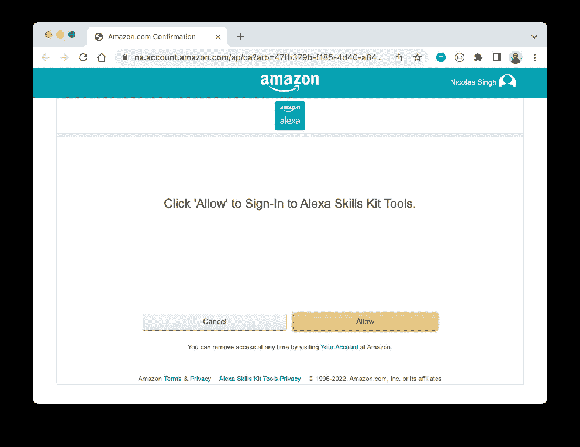

点击“允许”后，我们将返回终端完成设置，选择**不链接**您的 AWS 帐户(如果您有):

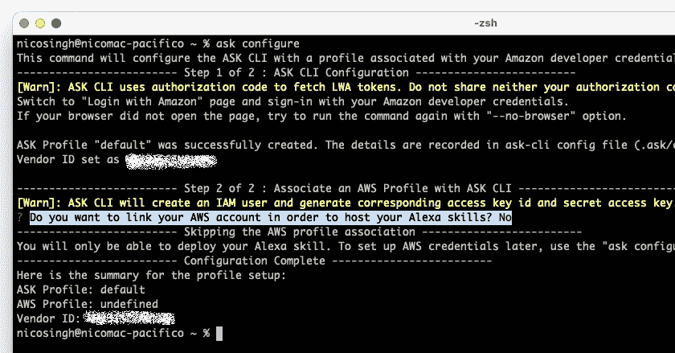

现在，我们的 ASK CLI 已准备就绪，可以投入使用了！让我们从使用 CLI 从头创建一个新的 Alexa 技能开始:

```
ask init
```

在这里，我们将提示我们选择 Lambda 函数的编程语言。在我的例子中，它将是 Python:


然后，选择使用 Alexa 托管的技能:


之后，选择 Alexa 托管技能的任何可用区域:

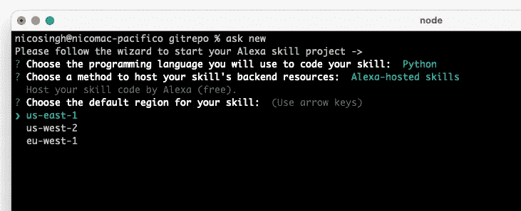

给我们的新技能起个名字:

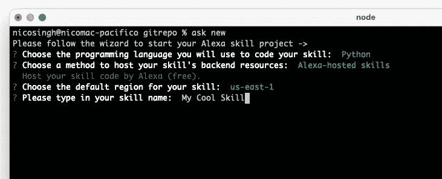

最后，我们将设置要创建的新本地存储库的名称:

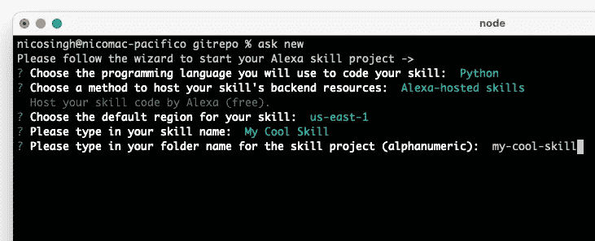

就是这样！一分钟后，我们的新 Alexa 技能将被创建:

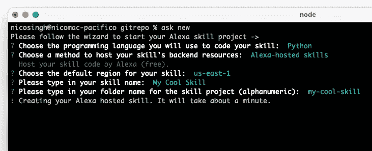

我们将能够看到技能 ID:

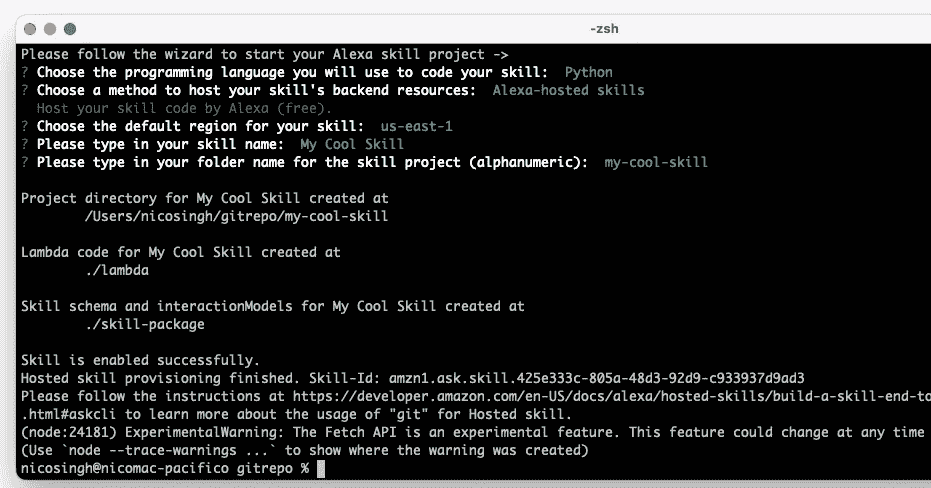

从 Alexa 开发者控制台，我们应该也能看到它😃

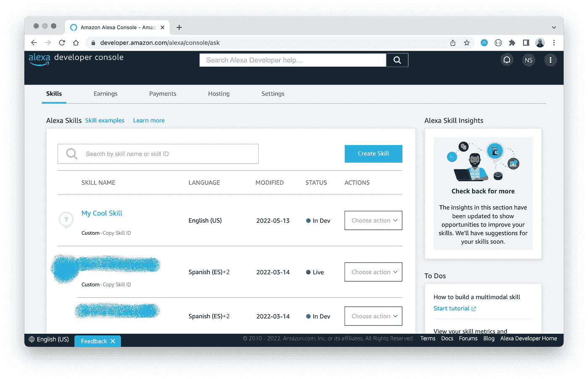

现在我们准备编码了🤓我们将看看仓库结构，以及 Alexa 托管技能所需的每个文件。

# 代码 Alexa 托管的技能

让我们来看看通过 *ask init* 命令生成的文件。文件夹 *my-cool-skill/* 包含以下文件:

*   **Skill-package/Skill . JSON**:我们技能的基本定义，比如发布信息、支持的地区、类别和 Lambda 端点。
*   **lambda/*** :我们 lambda 函数需要的任何文件(比如 *lambda_function.py* 和 *requirements.txt* )。
*   **技能包/互动模型/自定义/*。json** :所有交互模型文件，由我们技能支持的每个[地区](https://developer.amazon.com/en-US/docs/alexa/custom-skills/develop-skills-in-multiple-languages.html#h2-code-changes)分开。

在带有 Amazon 托管的 CI/CD 管道的 git repo 中拥有这些定义的一件很酷的事情是，我们技能中的任何变化都可以应用到我们技能代码中的*git push*(ASK CLI 负责 git 凭证)，而 CodePipeline 会自动处理其余的事情。在幕后，管道更新 Lambda 函数，并更新与技能相关的任何信息(基于 *skill.json* 值)。

作为参考，您可以查看一下这个库，它包含了上述文件的一些模板值，以及一个使用 Python 和 decorators 的示例 Lambda 函数。

我不会深究如何创建一个 Alexa 技能，因为它已经在我的[上一篇文章](https://medium.com/@nicosingh/how-i-built-a-serverless-joke-machine-for-alexa-3dfa2e4e1a8c)中描述过，并且有很多关于 Python、NodeJS 和 Java 的[例子](https://github.com/orgs/alexa-samples/repositories)。相反，我们将继续设置这个新的 Alexa 托管技能，并为认证&发布做准备。

# 测试 Alexa 托管的技能

在将我们的技能代码推送到 git 存储库并等待几秒钟将其部署到 Lambda 之后，Alexa 开发人员控制台的底部将显示一个绿色弹出窗口，指示部署准备就绪:

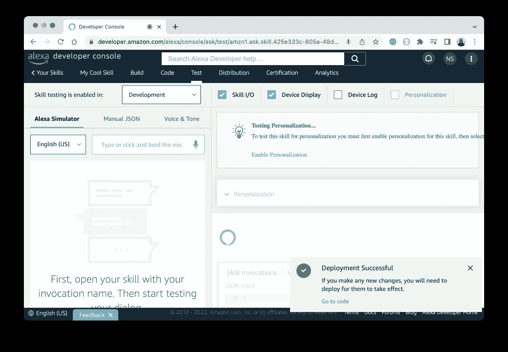

从这一刻起，我们将能够在“测试”标签中使用来自浏览器的**语音或文本**消息来测试技能，这将直接与我们的新技能进行交互。

由于这项技术现在已经部署在*开发*阶段，它也将在我们自己的 Echo 设备中可用。这非常有帮助，因为我们将能够使用官方设备在真实的场景下测试它。

# 发布 Alexa 托管的技能

如果我们想冒险，想把我们的技能发布到 Alexa Marketplace，让全世界都能看到，我们可以去 Alexa 开发者控制台的“分发”标签。

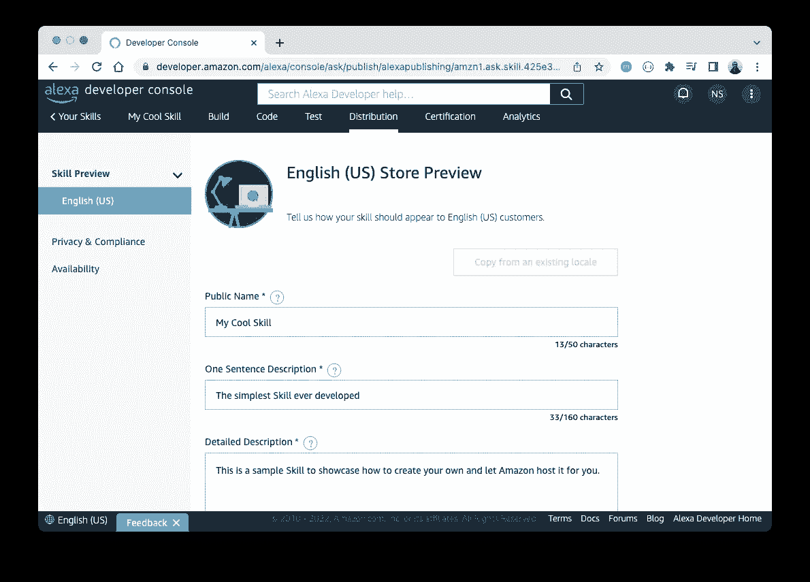

在此页面中，我们将检查并设置所有将描述市场中技能的字段，如技能的公共名称、图标、描述、短语……在*Skill-package/Skill . JSON*文件中为我们定义的每个区域设置:

```
"publishingInformation": {
  "locales": {
    "en-US": {
      "name": "My Cool Skill",
      "summary": "The simplest Skill ever developed",
      "description": "This is a sample Skill to showcase how to create your own and let Amazon host it for you.",
      "smallIconUri": "file://assets/images/smallIcon.png",
      "largeIconUri": "file://assets/images/largeIcon.png",
      "examplePhrases": ["Alexa, open my cool skill"],
      "keywords": ["cool", "skill"]
    }
  },
  "isAvailableWorldwide": true,
  "testingInstructions": "Testing Instructions.",
  "category": "NEWS",
  "distributionCountries": []
}
```

如上面的截图所示，我们还可以通过控制台直接编辑这些字段。这实际上是第一次发布时最好的想法，检查所有可用的选项，并上传尽可能多的信息，以便在亚马逊市场上向公众展示我们的技能。

在此之后，“认证”选项卡开始运行技能验证(检查我们是否遗漏了任何必需的信息):

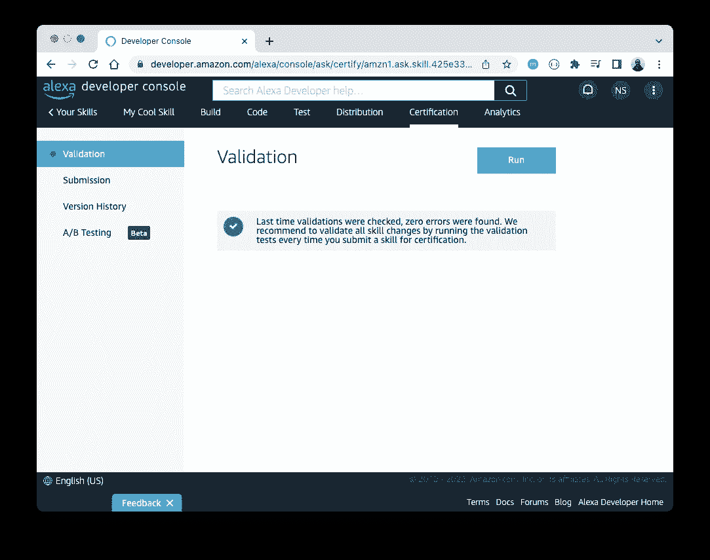

我们准备好展示我们的技能了🚀点击屏幕左侧的“提交”,我们将看到一些选项，要求立即发布我们的新技能或稍后设置一些发布说明:

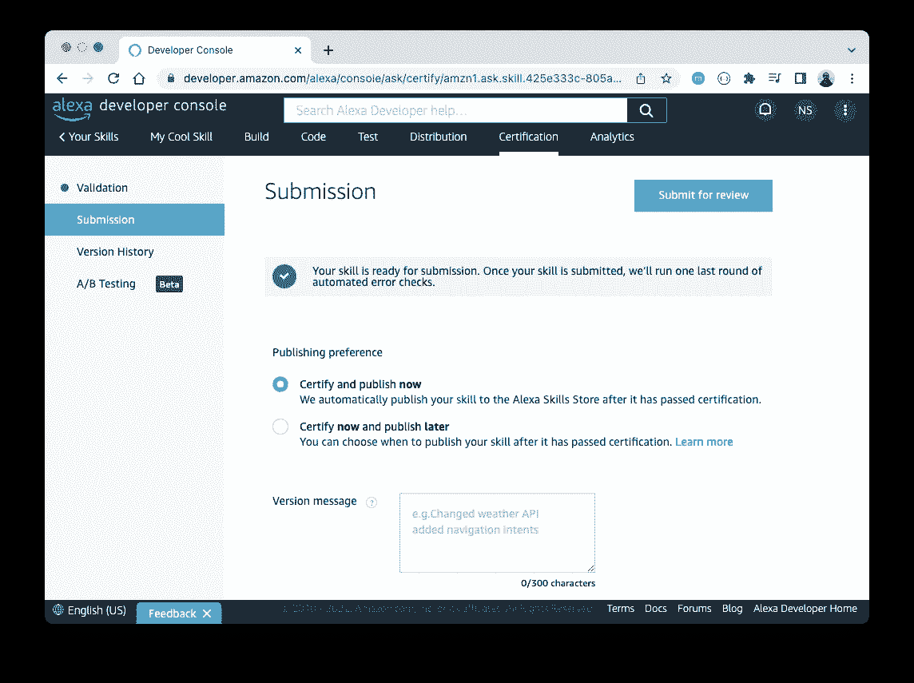

最后，我们的技能准备出版。现在，是时候耐心等待，直到亚马逊 Alexa 运行包括自动和手动检查在内的认证过程，这些检查将通过电子邮件尽快更新:

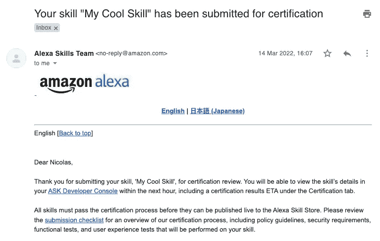

以我个人的经验，这个过程大约需要 10 天，包括失败的验证、亚马逊工程师的反馈邮件和重新提交🙈

完成这一阶段后，我们的技能将在亚马逊市场上可用！我们将能够按照新版本的相同步骤(推送代码、测试、分发和认证)重新认证技能的新版本。

暂时就这样吧！如果您对代码结构有任何疑问或问题，请记得查看[示例报告](https://gitlab.com/nicosingh/alexa-hosted-skill-python-skeleton)。

如果你对这篇文章有任何疑问，请[告诉我](https://www.linkedin.com/in/nicosingh)。我真的很感激任何改进它的反馈🙏

[](https://github.com/sponsors/nicosingh) [## GitHub 赞助商上的赞助商@nicosingh

### 非常感谢你的支持😊我感谢你对做开源软件和分享知识的认可…

github.com](https://github.com/sponsors/nicosingh)