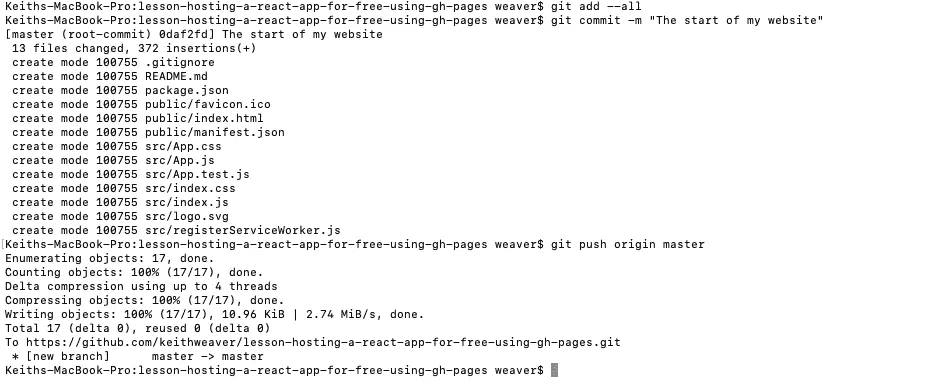
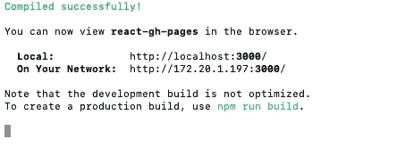
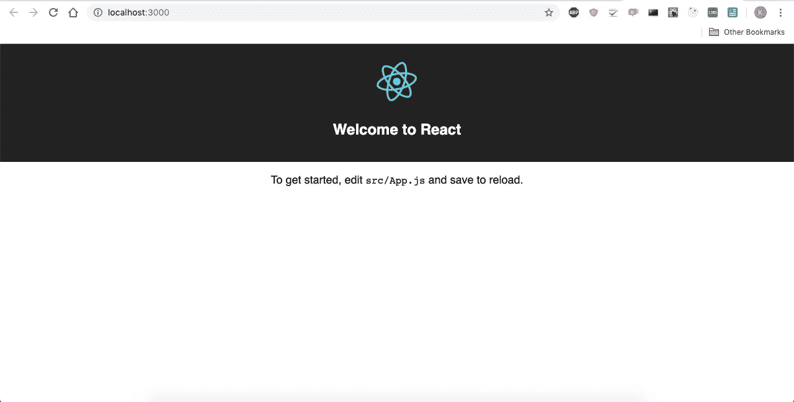
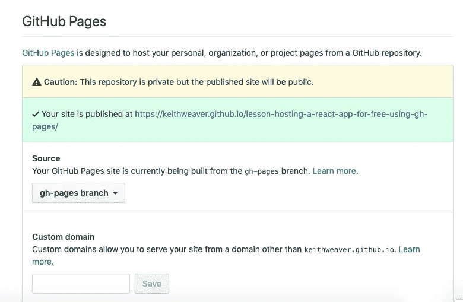
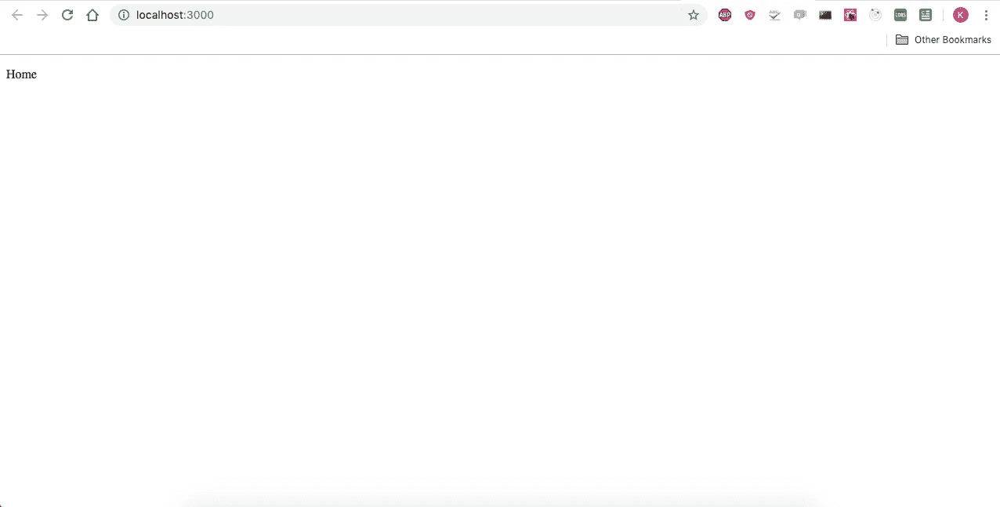
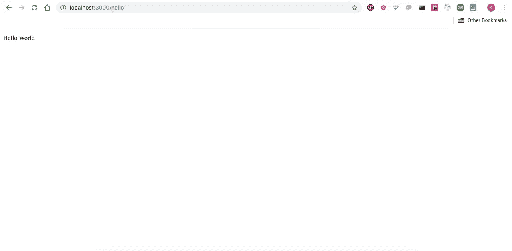

# 使用 Github 页面免费托管 React 应用程序

> 原文：<https://itnext.io/hosting-a-react-app-for-free-using-github-pages-7328ea04b11c?source=collection_archive---------3----------------------->

这篇文章最初是[在我的个人网站](https://keithweaver.ca/lesson/hosting-a-react-app-for-free-using-gh-pages?s=mit)上发布的，然后[在我的媒体页面](https://medium.com/@Keithweaver_/hosting-a-react-app-for-free-using-github-pages-57bc049580d8)上发布的。我还整理了一个 Youtube 教程[和](https://youtu.be/8P8cJk6defs)。

在本教程中，我将带您建立一个简单的 React.js 应用程序，它可以托管在 Github 页面上。我真的很喜欢在这里托管，因为对我个人来说是免费的，Github 处理“服务器管理”。一旦我部署了我的 React 应用程序并验证它已经启动，Github 就会处理流量激增、更新等问题。

我通常使用[这个 MERN 样板库](https://github.com/keithweaver/mern-boilerplate)库，但是它有太多额外的东西专门用于节点服务器。我找到了[这个资源库](https://github.com/keithweaver/react-gh-pages)。这是一个简单得多的样板代码库，只关注 React。请明星，我的叉子，所以我知道人们仍然在使用它。我还建议将文件复制到您的存储库中。

# 最初的

第一步是验证我们有一个完整的项目，它可以运行。我假设您的计算机上有 Node.js，并且以前使用过这个环境。如果没有，就去 Node.js 网站下载。对我来说(你可以在不同的版本上，但至少尽量晚一点):

```
node --versionv10.16.1
```

我将我的文件复制到一个新的空存储库中，所以我首先要提交它们。 [GH-Pages](https://github.com/tschaub/gh-pages) 是发送到 build to Github 页面的 npm 包。**GH-Pages 来自母版**。

```
git add --all
git commit -m "The start of my website"
git push origin master
```



下一步是在本地运行它。我们需要安装所有依赖项，包括:

```
npm install
```

我们可以在本地计算机上运行它，使用:

```
npm run start
```

它将打开一个浏览器，或者您可以打开`[http://localhost:3000](http://localhost:3000./)` [。](http://localhost:3000./)



我们的应用程序正在运行，我们已经完成了环境设置。

# 运送至 GH-页面

现在，我们将把这个非常简单的应用程序发送到 GH-Pages。运行:

```
npm run deploy
```


你可以在 Github 存储库设置下找到更多关于你的应用的信息。



# CNAME

正如您可能看到的，有一种方法可以将自定义域添加到项目中。如果没有，请跳过这一步。你想在项目的路径中创建一个名为`CNAME`的文件。只放域名，不放`http`和`https`。对我来说是:

```
keithweaver.ca
```

前往设置标签中的 Github 页面设置。第一次也把它加在那里。您可能需要验证域所有权。你也应该强迫 HTTPS。在您的 DNS 记录上，您只需添加以下记录:

```
Type	Name	Value	           TTL	Actions
A	    @	    185.199.108.153	 600 seconds
A	    @	    185.199.109.153	 600 seconds
A	    @	    185.199.110.153	 600 seconds
A	    @	    185.199.111.153	 600 seconds
```

在使用 CNAME 时，我对这段代码有一个问题。每次我部署它都会移除 CNAME。我在我的`package.json`中添加了以下内容。我有这样的剧本:

```
"predeploy": "npm run build",
```

我把它改成了:

```
"predeploy": "npm run build && cp CNAME build/CNAME",
```

这将把 CNAME 文件移动到构建中。这解决了问题。

# 多条路线

我将再次切换到本地开发，但是同样的情况也适用于部署到 Github 页面。另一个不能开箱即用的方面是用于处理多条路由的 React 路由器。

我们将设置应用程序来处理多个路由。第一个是移动文件:

```
public/
src/
  containers/
    App/
      App.js
    Home/
      Home.js
    HelloWorld/
      HelloWorld.js
  index.js
```

我已经删除了一些本课不需要的文件。我已经将`App.js`移动到多个子目录中。

将`index.js`更改为:

```
import React from 'react';
import ReactDOM from 'react-dom';import { Route, Switch } from 'react-router';
import { BrowserRouter } from 'react-router-dom';import App from './containers/App/App';
import Home from './containers/Home/Home';
import HelloWorld from './containers/HelloWorld/HelloWorld';import registerServiceWorker from './registerServiceWorker';
ReactDOM.render((
  BrowserRouter>
    App>
      Switch>
        Route exact path="/" component={Home} />
        Route path="/hello" component={HelloWorld} />
      /Switch>
    /App>
  /BrowserRouter>
), document.getElementById('root'));
registerServiceWorker();
```

将`App.js`更改为:

```
import React from 'react';const App = ({ children }) => (
  div>
    {children}
  /div>
);export default App;
```

添加`Home.js`为:

```
import React from 'react';const Home = () => (
  div>
    p>Home/p>
  /div>
);export default Home;
```

添加`HelloWorld.js`为:

```
import React from 'react';const HelloWorld = () => (
  div>
    p>Hello World/p>
  /div>
);export default HelloWorld;
```

我们少了几个包裹。我们需要反应路由器。运行:

```
npm install react-router --save
npm install react-router-dom --save
```

现在，您可以使用以下命令来测试它:

```
npm run start
```



两条路线都行得通。如果这在 Github 页面上失败了，您可以添加以下内容(我为自己的站点添加了这些内容):

```
"build": "react-scripts build && cp build/index.html build/404.html",
```

# 结论

Github Pages 是托管网页的绝佳方式。现在，您可以使用 React 非常容易地做到这一点。

感谢阅读！更多信息请关注我的简介。