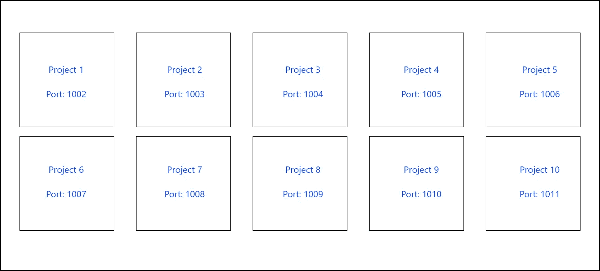
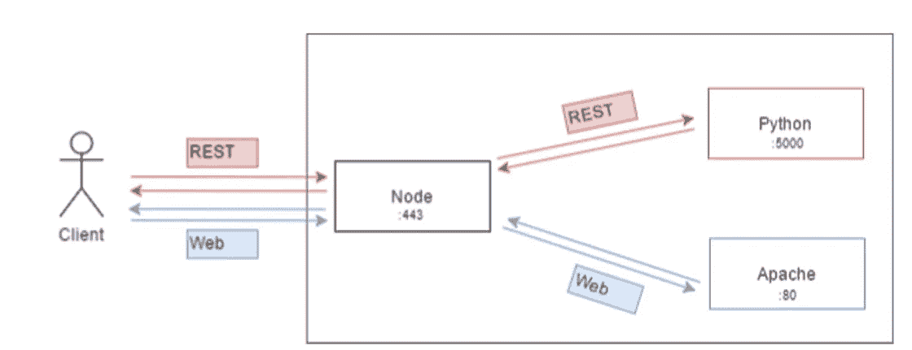

# 在同一服务器上托管多个应用程序—使用节点实施反向代理

> 原文：<https://itnext.io/hosting-multiple-apps-on-the-same-server-implement-a-reverse-proxy-with-node-a4e213497345?source=collection_archive---------0----------------------->

[马里恩·米歇尔](https://unsplash.com/@marion_michele?utm_source=medium&utm_medium=referral)在 [Unsplash](https://unsplash.com?utm_source=medium&utm_medium=referral) 拍摄的《威尼斯海滩彩色墙前拿着塑料咖啡杯的人》

每当我选择一个新的云托管计划，以便为我的开发提供一个远程服务器时，我经常会在上面运行多个应用程序。

这有许多原因，例如:

*   它允许我保持我的电脑干净，远离下载和安装大量 ide、库、包等带来的垃圾。
*   它允许我拥有一台 24/7 运行的服务器，这样我的客户就可以随时关注我的进展。
*   它消除了配置我的盒子以允许公众访问我的项目的麻烦。
*   **基本上，物理服务器就是一台计算机，就像其他任何计算机一样，那么为什么我每台服务器只托管一个应用程序呢？**

现在到了实现部分，如果您尝试过这个练习，您会知道它通常是这样结束的:

多个项目，每个项目都在特定的端口上运行

这里需要注意的是，一旦你在运行一个项目，它会监听一个特定的端口，如果你不想遇到致命的错误，你必须保留一个使用端口的列表:

> EADDRINUSE:这个端口已经被使用了

另一个棘手的问题是，当您与您的程序交互时，您的请求看起来会像这样:

`http(s)://domain.ext:port/route`

其中`port`是您的项目监听的端口。

**这篇文章的目标是教你如何创建一个反向代理，以便最终你能够为你的项目使用有意义的 URL。**

就这样:

`http(s)://domain.ext/nameOfYourProject/route`

而不是必须记住你的应用在监听哪个端口。

# 首先，什么是反向代理？

一幅画胜过千言万语。

归功于我自己😆

简而言之，反向代理将传入的请求与其组件相匹配。

它只是一个请求组织者。它的作用是根据标准(URL 部分、请求体，基本上任何东西都可以作为标准)重定向请求，并从请求被重定向到的组件返回响应。

在这个例子中，在端口 443 上运行的反向代理将把 REST 请求代理给在端口 5000 上监听的 Python REST API，并且它将把网站请求代理给在端口 80 上监听的 Apache 服务器。

对于这种特殊情况(我处理的一个真实用例)，标准是域名后面的 URL 部分，如下所示:

`https://website.com/rest` - > Python REST API

`https://website.com/web` - >阿帕奇网络服务器

# **如何实现一个？**

开始之前，请确保您具备以下条件:

*   **节点:**https://nodejs.org/en/
*   **快递:** `npm install express`
*   **HTTP 代理中间件:**

Express 将允许您运行服务器，HTTP 代理中间件将把请求代理到您配置的端点。

最后，我们将使用一个 JSON 配置文件，该文件将包含如下映射:

这意味着一旦`/project1`被请求，该请求就被代理到`http://localhost:1001`。

假设您创建了一个 JSON 文件和一个 JS 文件来运行服务器，那么您应该以下面的内容结束:

`/project
app.js
config.json`

这是你必须插入到`app.js`中的代码:

对此的解释是:

*   `Line 6`:通过`require`将 JSON 文件转化为 JS 对象
*   `Line 10`:逐一迭代所有路线
*   `Line 11`:使用`app.use(route,handler)`意味着无论请求中使用什么 HTTP 方法，当`route`被请求时，服务器都会使用`handler`。
*   `Line 12`:创建一个匿名处理程序来代理请求([文档在这里](https://github.com/chimurai/http-proxy-middleware))
*   `Line 13`:目标是请求将被发送到的地方
*   `Line 14` : `pathRewrite`可以是函数。我们定义了我们的，所以它去掉了糖的部分。让我解释一下。

要访问`project1`，您将打开浏览器并键入:`[http://domain.ext/project1/route/parameters/blabla](http://domain.ext/project1/route/parameters/blabla)`

当被调用时，`pathRewrite`将用域部分后面的内容填充`path`参数。

在我们的例子中，`path`将等于:`/project1/route/parameters/blabla`

但实际上你的 app 只需要`/project1`之后的东西。

这就是你如何摆脱它:

*   `path.split('/')` = `['','project1','route','parameters','blabla']`
*   `.slice(2)` = `['route','parameters','blabla']`
*   `.join('/')` = `route/parameters/blabla`(不需要`route` 前的`/`)

*   运行服务器，你就可以开始了😃

**我建议使用类似** `pm2` **或任何其他实用程序的防崩溃启动程序来运行您的反向代理，这样，如果它崩溃了，它会自动重启，而不会影响它重定向到的项目。**

例如:

`pm2 start app.js`

**您现在应该能够使用有意义的 URL 来访问同一服务器上的不同项目，而不必为每个请求手动指定端口。**

注意，这个反向代理也可以使用`https`(这是我个人的想法)。

# 作者说明

这篇文章带来了一个我在日常开发生活中经常用到的有用技巧。

您可能会想“嗯，我不必再键入端口，但我仍然必须键入关键字”。**哪个对你更有意义？**

像往常一样，你可以自由选择。

# 感谢阅读

我的上一篇文章可以在这里找到: [Node + Express + LetsEncrypt:生成一个免费的 SSL 证书并在 5 分钟或更短时间内运行一个 HTTPS 服务器](/node-express-letsencrypt-generate-a-free-ssl-certificate-and-run-an-https-server-in-5-minutes-a730fbe528ca)

我欣赏评论、建议和辩论。

请随时联系 **david.mellul@outlook.fr😃☕️**

[吴仪](https://unsplash.com/@takeshi2?utm_source=medium&utm_medium=referral)在 [Unsplash](https://unsplash.com?utm_source=medium&utm_medium=referral) 上的《白色马克杯里的卡布奇诺，白色泡沫艺术在木桌上》