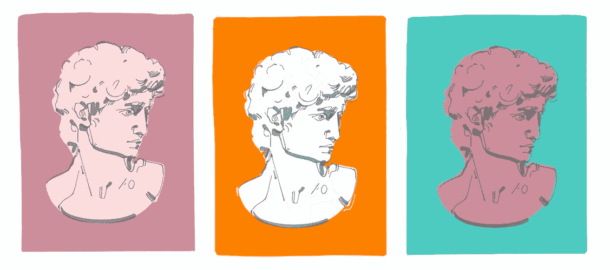

# A/B 测试如何帮助提高移动应用用户保持率

> 原文：<https://itnext.io/how-a-b-testing-helps-to-improve-mobile-app-user-retention-fc2122e686a4?source=collection_archive---------6----------------------->

为了在竞争激烈的移动应用领域取得成功，你应该不断为你的产品带来创新。然而，一个问题出现了:如何确保新的解决方案留住而不是分散你的应用程序用户？这是对移动应用的 A/B 测试——一个数据驱动决策的完美工具。

# 什么是手机 app A/B 测试？

产品更新一直是移动应用开发者的议程。有时会发生这样的情况，一个产品团队对未来的更新有不同甚至冲突的意见。例如，你可能会争论改变布局、导航项目、颜色、图像等等。在这种情况下，你不应该凭直觉去预测用户的行为，而应该依靠数据驱动的洞察力。

首先，在每次更新时制定一个适当的测试假设很重要，例如:如果你改变了导航项目，用户会更关注应用程序，转化率也会上升。然后，您运行一个实验来证明或拒绝测试假设。之后，您已经可以决定是否启动更新。

基本上，A/B 测试(也称为“双样本假设测试”)是用单个可变元素(如菜单、按钮、副本和其他项目)对产品更新的两个变量进行比较。A/B 测试有助于你找出用户最喜欢哪种变化。

例如，如果你想改变应用程序中一个按钮的颜色，你可以比较两种变体——一种是现有按钮，另一种是新按钮。然后，你向一半的观众展示每个版本。之后，A/B 测试会告诉你哪个颜色版本在用户转换或其他标准方面得分更高。

# A/B 测试如何提高用户留存率？

用户留存仍然是绝大多数移动应用的最大问题之一。这是一个常见的故事，用户下载应用程序，并使用他们只是一对夫妇的时间。更糟糕的是，人们甚至可能下载应用程序，然后立即删除它们，因为这些应用程序不符合他们的期望。要增加用户留存，你应该让人们清楚地了解你的应用程序是关于什么的，以及如何正确使用它。

虽然 A/B 测试肯定不是留住用户的灵丹妙药，但它仍然很有帮助。随着每一个新的测试，你可能会发现你的应用程序的功能非常令人惊讶的事情。你认为完美的产品可能会分散用户的注意力。

一个正确的应用程序 A/B 测试应该经历用户与你的移动应用程序交互的所有阶段，从第一次接触到点击“购买”按钮。我们建议进行以下基本类型的 A/B 测试，以提高 app 用户留存率:

## 按钮、图像、文本

这样的测试将帮助你了解应用程序是否符合用户的期望，以及人们如何与之互动。

## 应用程序的内容(通常是各种教程)

内容测试将向你展示用户对文本信息的反应。虽然他们中的一些人可能乐于阅读冗长的教程，但其他人会变得心烦意乱和愤怒。

## 注册选项

这是 A/B 测试的敏感区域。虽然一些用户更喜欢注册脸书，但其他人可能会使用个人电子邮件或其他社交媒体帐户。

## 注册时间

主要问题来了:什么时候是让用户注册的最佳时机？你应该从一开始就启动一面墙，还是允许用户在没有帐户的情况下探索应用程序的功能？显然，这取决于移动应用程序的独特功能。然而，理清注册的时间可能会大大提高用户保留率。

一旦你增加留成，股息将立即随之而来。例如，你的移动广告将变得更加有效，即使保持率只有 15-20%的适度增长。这将允许你用同样的营销预算瞄准更多的用户。

# 手机 app A/B 测试的工具有哪些？

目前支持多平台的手机 app A/B 测试工具有很多。在这里，我们简要介绍了最受欢迎的几种:

## 优化

[Apptimize](https://apptimize.com) 是一个跨平台的 A/B 测试工具，可以帮助跟踪每个用户在所有渠道的旅程，包括移动、web、移动 web，甚至在 app store 中。

## 优化地

[Optimizely](https://www.optimizely.com) 是顶级 A/B 测试工具之一，允许实时改变你的应用程序的行为。您可以快速删除奇怪的功能并添加可用的功能。

## Taplytics

[Taplytics](https://taplytics.com) 是我们最喜欢的 A/B 测试工具。好在 Taplytics 允许你在应用内部做测试，比如测试按钮和图片。在这里，我们还测试了菜单、导航项等等。此外，我们可以使用发布控制标记工具跟踪新功能发布的影响。

## 分裂力

SplitForce 也是领先的多平台 A/B 测试工具。它提供了基于一系列标准对用户进行细分的绝佳选择。

## 浮华

[Vanity](https://vanity.labnotes.org/ab_testing.html) 最简单，是免费的 A/B 测试工具，适合新手。它提供非常基本的用户行为报告。

# 如何进行 A/B 测试？

根据我们的经验，我们建议采取以下基本步骤来进行适当的移动应用程序 A/B 测试:

## 1.每次测试只关注一个元素

例如，只测试一个特定的图标，或者一个行动号召按钮，或者一个教程文本。

## 2.设置测试目标

目标应该清晰明确。例如，增加来自特定渠道的新用户。

## 3.建立假设

假设也应该是准确的。例如，如果我们将按钮的文本从“添加到购物车”替换为“立即购买”，应用程序的转化率将会增加。

## 4.使用提议的变更创建变体

通常，变式 A 代表当前版本，变式 B 代表提议的变更。

## 5.选择 A/B 测试工具

它应该基于你的具体需求，从 Optimizely 或 Taplytics 到虚荣

## 6.在选定的测试工具中设置测试参数

例如，您希望测试运行多长时间，从哪个通道收集数据，等等。

## 7.设置测试的 KPI 并分析结果

您根据预设的 KPI 分析测试结果。有几个 KPI 来评估 A/B 测试并确定获胜的变体。它们包括转换率、平均会话数、滚动深度或与应用页面不同元素的互动时间等。

每次测试前的任务是不要让它的 KPI 太笼统或太具体。

## 8.根据测试结果进行更改

有时 A/B 测试可能会显示获胜者和亚军之间的转化率差异非常小，从 1%到 5%。在这种情况下，提议的更改不会对您的受众产生重大影响。另一方面，如果转换差异达到 10%或更高，那么您肯定应该考虑尽快实现新特性。

## 9.为移动应用程序准备新的 A/B 测试

由于转换优化几乎是一个永无止境的过程，开始考虑后续测试，以试验其他应用程序的功能。一个好主意是定期召开 A/B 测试团队会议来讨论计划和优先级。

# 最后的想法

A/B 测试你的应用程序是一个很好的工具，可以根据数据来决定是否推出新功能。您可以根据图标、描述、标题、屏幕截图等的有效性进行更改。

此外，移动应用的 A/B 测试回答了两个非常重要的问题:

*   为什么这个 app/app 的功能不行(作为替代，没有带来足够的客户)？
*   如何改善？

通过做一系列的 A/B 测试，你可以选择最好的应用程序的功能，从而增加其转化率，显然，收入。最重要的是不断测试，以提供对应用程序的市场成功至关重要的定期产品更新。

*原载于*[*https://yellow . systems*](https://yellow.systems/blog/how-to-improve-in-app-user-retention-with-mobile-app-a-b-testing)*。*