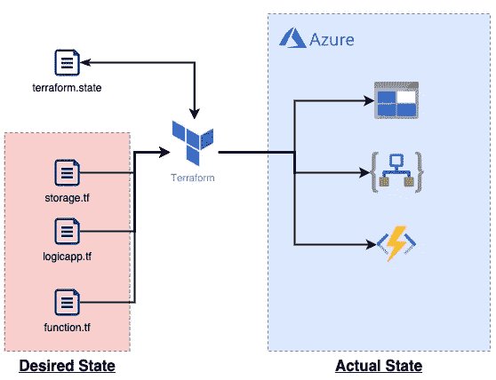
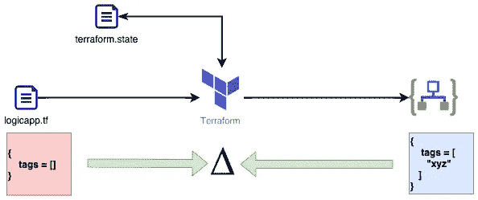
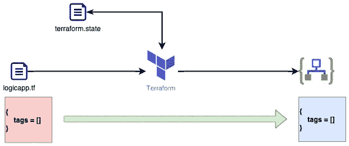
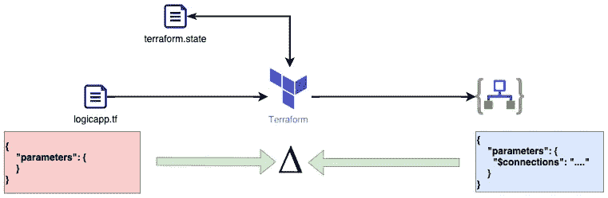

# 如何以及何时忽略 Terraform 中的生命周期变化

> 原文：<https://itnext.io/how-and-when-to-ignore-lifecycle-changes-in-terraform-ed5bfb46e7ae?source=collection_archive---------0----------------------->


# 介绍

Terraform 是一个非常有用的工具，用于将[基础设施管理为代码(IaC)](https://stackify.com/what-is-infrastructure-as-code-how-it-works-best-practices-tutorials/) ，它允许我们通过一种通用语言( [HCL](https://www.terraform.io/docs/language/syntax/configuration.html) 或 JSON)轻松定义我们想要的状态，然后使用 Terraform 引擎，解析这个想要的状态，将其与实际状态进行比较，并对我们的环境进行必要的更新。很明显，Terraform 的最大好处是这种基于增量的方法，通过这种方法，我们只需更新/创建/销毁最少量的必要内容，并保持我们的环境一致。

但是，如果 Terraform 的工作方式与您预期的不太一样，会发生什么呢？为什么 Terraform 有时会导致你的环境破坏？更重要的是，你何时/如何告诉 Terraform 忽略你知道是安全的东西。

和我所有的博客帖子一样，如果你很急，想要 TL；这个博客的博士版本，然后你会发现标题在底部，为您提供方便🙂

# 这都是关于国家的

好的，所以在我们继续之前，我只想确保我们涵盖了 Terraform 如何工作以及它如何决定做什么(和不做什么)的基础知识。

简单来说，Terraform 是一个基于状态的引擎。当 terraform 运行时，它首先会查看您想要的内容(期望的状态)并扫描您的云平台中的内容(实际状态)。一旦知道了期望状态和实际状态，Terraform 接下来要做的就是计算一个简单的增量:

*   如果某样东西存在于你想要的状态，但不存在于实际状态——**它会被创建**。
*   如果某个东西存在，并且处于期望状态和实际状态，但是配置不同— **它会得到更新**。
*   如果某个东西存在于实际状态，但不在期望状态— **它会被删除**。

原则上似乎很简单，对吗？但遗憾的是，有时正是 Terraform 采用的这种简单的基于状态的机制会给我们带来一些大麻烦。

# 什么时候改变不是改变？

好的，让我们假设我们有一个假想的场景，我们编写一些 Terraform 并部署它:



这是一个非常简化的图，但是我想表达的意思是，通常你会在`.tf`文件中定义你想要的状态。Terraform 也知道它上次部署了什么，因为它将这些信息保存在一个`.state`文件中。如果这是您的第一次部署，那么该文件将不存在，Terraform 会创建它。然后我们的云提供商(Azure)就有了实际的状态——理想状态的真实表现。

现在让我们放大这一薄片，并进一步探索。下面是我们的`logicapp.tf`文件的一个假设示例:

这个 HCL 理论上将部署我们假设的逻辑应用程序。我添加了一些智能来将 Logic 应用程序的 ARM 模板加载到一个本地变量中，然后使用文件的 MD5 作为模板部署的名称。现在这个文件足够简单了，但是让我们检查第 9 行:

```
tags = ["test"]
```

那么，我为什么要求你考虑这条线呢？这是因为这个属性很可能是一个潜在的例子，可以手动更改或在 Azure 中自动设置，而无需 Terraform，对此一无所知。

# 我正在经历变化🎶

让我们假设我们已经部署了上面显示的 Terraform，并且我们的 Logic 应用程序已经部署完毕，并且正在按照我们预期的方式工作。接下来是一些自动过程或者说是 Azure 策略，它给我们的逻辑应用添加了一些标签。[标签](https://docs.microsoft.com/en-us/azure/azure-resource-manager/management/tag-resources)只是元数据，所以它们并不真正影响资源本身，但是它们使管理变得更加容易。但是不幸的是，当我们下一次部署代码时会发生什么呢？



首先发生的是 Terraform 试图找出我们拥有的和我们想要的之间的差距。记住:我们的本地配置说我们不想要任何标签，但是 Azure 中资源的状态说它有标签！那么 terraform 是做什么的呢？



原来 Terraform 会做它认为我们想要的事情。我们说过我们不想要标签，所以它会删除标签。哎呦！


Terraform 为什么要这么做？！？！？！？！

# 这有什么大不了的？！？！？只是标签而已

好吧，我承认我上面举的例子很做作，但是当 Terraform 可能带来的潜在变化更具破坏性时呢？

事实证明，逻辑应用程序及其 ARM 模板实际上非常复杂。Azure 在幕后为我们神奇地处理了许多自动生成的参数。一个主要的例子是当你使用 [**安全连接参数**](https://docs.microsoft.com/en-us/azure/logic-apps/logic-apps-azure-resource-manager-templates-overview#secure-connection-parameters) **时。**在本例中，请考虑以下片段:

取自示例页面的片段[显示了安全连接参数如何作为名为`$connections`的属性嵌入到 ARM 中。](https://docs.microsoft.com/en-us/azure/logic-apps/logic-apps-azure-resource-manager-templates-overview#secure-connection-parameters)

因此，我们通过 Terraform 部署了逻辑应用程序，并对模式进行了更新…当我们尝试协调状态时，现在会发生什么？在我们去那里之前，让我们看一下我们的 Terraform `tfstate`文件:

等一下！第 20 线**那个`parameters`的东西是哪里来的？而且为什么包含设置为空字符串的`$connections`？！？！**

这是 Terraform 的众多怪癖之一，你使用这项技术的次数越多，就越有可能遇到这种怪癖。记得我之前说过，在部署期间的状态协调步骤中；Terraform 将收回它创建的已配置对象的状态，并将它们存储在其状态文件中。为了回答我们的问题，这是我们部署的逻辑应用程序的实际状态表示。无论我们是否要求，这种资源都有一些属性。现在的问题是，我们在 Azure 中运行的逻辑应用程序需要这些连接才能工作(假设它使用这些连接来连接到另一个服务，如 blob store)，但现在我们有一个问题:



和以前一样，Terraform 将协调状态，决定我们不再需要那些`$connections`并清除它们…所以突然砰的一声，我们以前工作的逻辑应用程序通过没有我们自己的错误！！！

# 那么我该如何避免这种情况呢？？？？

幸运的是，亲爱的读者，帮助就在眼前，它是一个鲜为人知的 Terraform 特性，名为“[生命周期元参数](https://www.terraform.io/docs/language/meta-arguments/lifecycle.html)”。很吸引人的名字对吗？？？？)

使用这个元参数允许我们以多种方式覆盖 Terraform 的默认行为，但是我们感兴趣的主要方式是这里的`[ignore_changes](https://www.terraform.io/docs/language/meta-arguments/lifecycle.html#ignore_changes)`属性:

> `ignore_changes`功能旨在当创建的资源引用的数据可能在未来发生变化时使用，但不应在创建后影响所述资源。在极少数情况下，远程对象的设置被 Terraform 之外的进程修改，Terraform 将在下次运行时尝试“修复”

那么这在我们的代码中是什么样子的呢？嗯，如果我们对我们的示例 Terraform HCL 进行必要的更改，我们应该会得到如下结果:

正如您所看到的，通过将`lifecycle`参数添加到我们的资源定义中，我们基本上可以防止 Terraform 对与逻辑应用程序相关的参数或标签进行进一步的更改。你现在可以认为这是“一次且只有一次”的行动。我们第一次执行 Terraform `apply`动作时，逻辑应用程序被创建，Terraform 会给我们想要的东西，并像往常一样更新与逻辑应用程序相关的所有内容，但如果标签或参数发生变化，它们将被忽略。

## **重要的**

我想在这里明确几点:

1.  这里提到的`parameters`与传递到 ARM 模板部署中的并不相同，所以您可以安全地更改它们，它们将被部署。
2.  **这不是一个理想的情况**，这似乎是平台行为和一些资源/提供者如何运作之间的一个奇怪的怪癖。
3.  在何时何地使用这个生命周期参数要小心；我强烈建议将它视为防止重大变更的最后手段。

# 另一个例子

到目前为止，我已经展示了当 Terraform 意外地让我们的工作基础设施处于崩溃状态时会发生什么。但是，当 Terraform 可能意外地引起变化，从而导致间歇性停机和性能问题时，会发生什么情况呢？

以下列 Terraform HCL 为例:

这是我最近参与的一个项目的真实例子。我已经包含了必要的`ignore_changes`指令，所以它应该开始给你一个提示，告诉你问题是什么。

上面的配置片段旨在在 VNet 中提供一些子网，我们需要划分子网的一个东西是一个 [Azure 容器实例](https://docs.microsoft.com/en-gb/azure/container-instances/container-instances-overview)，它充当一个[自托管 AzDO 构建代理](https://docs.microsoft.com/en-us/azure/devops/pipelines/agents/agents?view=azure-devops&tabs=browser#install)。为了让我们的 ACI 正确地加入到我们的 VNet 中，并且有必要的权限访问东西，我们授予它一些`service_delegation`属性。

然而，与我们的逻辑应用程序类似，一旦创建了这个资源，Azure 就会在幕后更改这些委托。这意味着，当我们再次运行 Terraform 部署时，我们的子网每次都会发生变化，从而导致我们的 ACI 在子网配置更新的短暂时间内失去 VNet 集成。

这是一个由 Terraform 进行意外更改而导致的瞬态问题的完美例子，这可能会让我们感到很困惑，因为我们会想为什么我们的构建代理突然告诉我们它无法访问我们的任何网络资源，如存储等。


# TL；速度三角形定位法(dead reckoning)

*   有时，虽然不是我们自己的错，Terraform 可以破坏我们的基础设施。
*   Terraform 尽最大努力协调我们的期望状态和我们的云提供商的实际状态，有时这可能会产生不利影响。
*   部署资源时，云资源提供商可以在我们不知情的情况下，在幕后添加额外的属性/特性。
*   这些附加属性/特性中的大部分都是完全良性的，但是其他的可能会影响正常运行的基础架构或开发运维流程。
*   当你想让 Terraform 忽略后续`apply`命令之间的变化时，你可以使用`lifecycle` `ignore_changes`元参数。
*   `ignore_changes`参数意味着 Terraform 将在首次部署资源时设置值，然后永远忽略对它的任何更改。
*   除了`ignore_changes`之外，`lifecycle`元参数还有很多有趣的功能，我强烈推荐你尝试一下。
*   检查您的 Terraform `plan`和`apply`输出，查看您是否只更新/更改了您期望看到的内容。

# 进一步阅读

*   [Terraform 破坏 Azure Logic 应用程序连接—堆栈溢出](https://stackoverflow.com/questions/55217929/terraform-breaking-azure-logic-app-connections) —这篇 Stack Overflow 帖子是帮助我发现这个问题和修复的最初线索
*   [https://www . terra form . io/docs/language/meta-arguments/life cycle . html](https://www.terraform.io/docs/language/meta-arguments/lifecycle.html)—terra form 生命周期文档，一个非常好的开始阅读的地方
*   [概述— Azure Logic 应用的自动化部署—Azure Logic 应用| Microsoft 文档](https://docs.microsoft.com/en-us/azure/logic-apps/logic-apps-azure-resource-manager-templates-overview) —如果您计划通过 IaC 部署 Azure Logic 应用，那么这是*您需要阅读的页面*