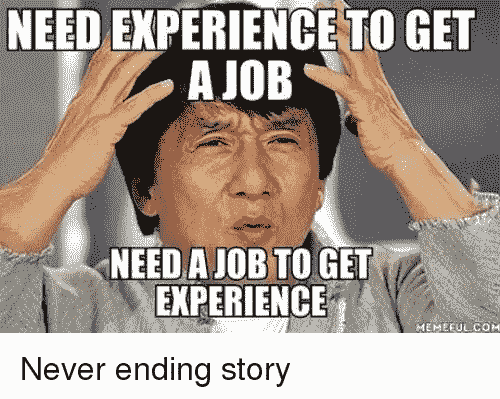

# 如何以及在哪里建立一个成功的软件职业生涯。

> 原文：<https://itnext.io/how-and-where-to-build-a-successful-software-career-7338e2a87bdb?source=collection_archive---------2----------------------->

最近，很多人联系我，向我寻求职业建议。问题的范围通常从特定领域，如如何在低级系统编程中取得成功，到更一般的，如如何达到员工工程师的水平。

我对此感到非常高兴，因为它给了我机会进行深入而有意义的对话，也让我回顾了自己的职业生涯，反思了自己的主题。在这篇文章中，我将尝试讨论一些带有个人故事的思考，集中在我认为相关的两个方面:*你应该做什么*以及是否有比其他公司更好的公司让你推进你的职业生涯。

# 你应该做什么

我目前是 Datadog 的一名员工工程师。在那之前，我是 ScyllaDB 的副总裁和杰出的工程师。在我最近与一位工程师同事的一次谈话中，他问我，要成为一名员工工程师，他应该做些什么。

这是一个有趣的问题，因为在我加入 Datadog 之前，我甚至不知道这个头衔的存在。不同的公司有不同的名称，但我后来知道这是许多现代公司的通用名称。

在这种背景下，许多人独立地向我推荐了一篇[的文章](https://staffeng.com/faq)，讨论了参谋工程师的角色:他们做什么，如何成为一名参谋工程师，等等。这篇文章甚至链接到一个[有用的工程师原型列表](https://staffeng.com/guides/staff-archetypes):技术领导、架构师、解决者和得力助手。但是这些有什么共同点吗？

从广义上来说，其中的共同点是，一个工程师可以影响组织的方向。我的目标不是去争论或确认这些原型。相反，我想邀请您思考以下问题:有许多人确实精通软件工程，以及在我们的行业中通常被吹捧为重要的许多其他软技能。在所有这些人当中，究竟为什么会有组织信任你来设定它的方向呢？技能重要吗？如果重要，有多重要？

最有可能的原因是，任何人都必须信任你去做，因为你以前做过，并创造了一个记录。在这种意义上，我发现术语 D *区别工程师*更容易理解:与其说是关于你做了什么，不如说是关于你做了什么，显然假设你会继续做下去。一些公司也同时拥有这两个头衔，而其他公司则拥有完全不同的流程。

起初，这似乎提出了一个悖论,“需要经验才能获得经验”这句古老的格言经常在互联网上被嘲笑。但是有一种方法可以解决这个难题:冒险。找到偏离预定脚本的好机会，并充分利用它们。

在理解这一点时，将员工工程师比作*创始人*，而不是*雇员*是有帮助的。看看创始人和他们做的事情:作为一名创始人肯定没有职业发展，虽然你(通常)需要投资者给你开支票是事实，但如果你建立了一个有足够动力的企业，相信我:你不会有任何问题。

成功的创始人通过创立成功的公司成为成功的创始人。你成为一个组织可以信任的人，通过成功地引导公司向正确的方向发展来设定它的技术方向。你不应该指望任何人确切地告诉你*该怎么做，就像一个创始人不应该指望被确切地告知该建立哪家公司，或者如何运营它一样。*

创始人会发现一个机会，抓住它，并希望通过做他们擅长的事情来为他们的公司做出贡献，并让自己周围的人与他们互补。成为一名参谋工程师也没什么不同。技能很重要。但最重要的是，一旦你想出了一个计划，你将需要某种形式的技能来执行它。

但是计划有多种形式和规模。正如有许多方法可以建立一个成功的公司一样，也有许多方法可以产生足够的影响，创造信任度，从而让你能够引领公司的技术方向。也许还有更多传播这种影响的方式。最适合你的是那些能发挥你长处的。

例如，在更高的层次上，软件工程师将被要求连接一个组织的不同部门，指导其他工程师，在公共场合讲话，等等。如果你完全不擅长这些，那么达到最低基线可能是个好主意。但同样重要的是要认识到，也许通过这些来追求影响力可能不是你的最佳选择。

用一个个人的例子来说明这一点是有帮助的。虽然我肯定不是一个糟糕的程序员，但我也从未认为自己特别强。事实上，如果我可以利用这个空间来分享我的一点灵魂，多年来我确实患有通常所说的冒名顶替综合症，据我所知，这种不适在我们的行业中太普遍了。我不是心理学家，所以我不会冒险讨论这是不是真的，或者该怎么做，但我会注意到，当我开始追求那些影响较少依赖于我的原始编码能力，而更多依赖于其他东西，如指导、沟通、管理士气和期望等的项目时，我在职业生涯中取得了更多的成功。

当 ScyllaDB 开始签署第一批合同时，这个产品——像大多数早期创业产品一样——有许多粗糙的边缘。面向客户的团队没有足够的技术深度来面对接踵而至的复杂问题，工程师们既没有软技能也没有兴趣与客户交流。我看到这是一个找到自己定位的机会，于是就这样做了。

就像创建一家公司一样，把你的目标设定为你认为可以实现的事情，找到一个发挥你优势的计划，并追求它。

# 让自己看得见

我经常被问到的另一个问题是:为了追求我的目标，我应该跳槽到这家或那家公司吗？回答这个问题的关键是*能见度。如果没人知道你的影响力，影响力有什么用？*

尽管公司在寻找人才时可能会否认这一点，但*你的专长肯定会影响你的知名度。*

这并不是说，某些专业化在本质上比其他专业化更明显。理解这一点的关键是要认识到，在任何组织中，都有人挣钱，也有人花钱。你是哪一个，要看你的公司是做什么的。

举个例子，我的职业生涯始于 Red Hat 的 Linux 内核工程师，当时 Red Hat 直接通过制作企业级 Linux 内核赚钱。自那以后，该公司的排名上升了很多，我不敢说现在就是这样，但那时候确实是这样。在任何其他公司，像我这样的人会让他们付出代价。当然，在管理良好的组织中，可能是公司乐意花的钱，甚至可能是对业务至关重要的钱，或者是重要的战略投资。但在 Red Hat，我在资产负债表的收入部分。

这不是引导你做出决定的唯一因素。作为一名基础设施工程师，你更有可能在一家规模较大的公司产生影响，而不是在一家本地企业，即使这家大公司只有一个大型基础设施作为达到目的的手段。此外，如果你是成本方，显然仍有可能产生影响。事实上，我仍然有许多 Linux 内核时代的朋友在脸书、谷歌和其他公司工作。但这是一场碰运气的游戏，那些公司本质上是在做吸引眼球的生意。我确信，一个做了*和*的工程师，在所有条件相同的情况下，更有可能在内部产生广泛的影响。

然而，这个行业比任何一个组织都要大。即使你的能力有限，无法让自己的影响力在公司得到认可，你仍然可以在整个行业产生影响。回到我之前的例子，对于像脸书这样的公司，有许多人直接处于资产负债表的成本方，他们是极其重要的开源项目中的绝对明星。

我多次听说开源是推进职业发展的一个很好的方式，这当然是真的。但是，从影响的角度来考虑仍然有助于确定如何去做。与很多人认为的相反，肯定不是因为人们能看到你写的代码或者你有多活跃。但它给了你一个额外的途径来展示你能够产生的影响和你成功设定方向的能力。

# 综上？

这可能是一颗难以下咽的药丸，但你不太可能通过谨慎行事和达到里程碑来度过职业生涯中的某个点。你最好的选择是承担风险，并拥有成功产生影响的良好记录。

有很多方法可以做到，不要绝望。找到与你擅长的相匹配的方法，想出一个计划，然后去追求它。确保你的工作是可见的。开源是让您的工作在组织之外可见的一个很好的方式，但远不是唯一的策略。

然而，在一个组织的范围内，你离收入流越近，你的影响被注意到的机会就越多。如果可以的话，试着为那些收入和你的工作直接挂钩的公司工作。