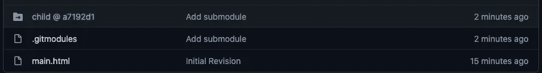

# 如何以及为什么使用 Git 子模块

> 原文：<https://itnext.io/how-and-why-to-use-git-submodules-44a452b42a08?source=collection_archive---------2----------------------->


有时我们需要在一个 Git 仓库中使用另一个的内容。一个典型的例子是在多个应用程序中使用共享库的源代码。使用 Git 子模块，我们可以配置一个或多个其他存储库来作为子存储库签出。

使用 Git 子模块会增加项目的复杂性。在走这条路之前，你应该确定结果是值得复杂的。正如他们所说:

> *一个程序员遇到了版本控制问题，他说:“我知道，我会使用子模块。”现在他们有两个问题。*

这是一个关于正则表达式的著名笑话。正则表达式非常有用，您必须确定它们是正确的解决方案。类似地，Git 子模块非常有用，您必须确定它们是您的问题的正确解决方案。

通过子模块特性，您可以有效地将子 Git 存储库嵌入到父存储库中。子存储库的文件出现在父存储库的文件树中。但是子存储库中的更改是由子存储库而不是父存储库跟踪的。父存储库中的唯一记录是要在子存储库中使用的提交的 SHA 提交标识符。

对于包含或嵌入一个或多个其他存储库的 Git 存储库，您能做什么？

在其核心，子模块允许您构建一个包含来自多个位置的数据(源文件)的目录层次结构。这个层次结构的子部分(也称为子模块)是独立管理的，每个子部分都有自己的版本。每个子模块可以被多个父项目使用。每个父项目都可以控制每个子项目所使用的版本，并且每个父项目都可以将变更推送到子项目。

这些属性是对优势的粗略总结。但是，如前所述，这增加了复杂性。两个例子是:

1.  任何克隆父存储库的人都必须记住运行 Git 命令，以使子模块存储库也被检出。
2.  如果子模块的存储库中有提交，则子模块 SHA 提交引用将不会更新，除非您必须为此运行 Git 命令。

# 为什么要使用 Git 子模块？

我使用 Git 很多年了，不需要了解子模块。我确信我们大多数人可能会在整个软件开发生涯中不使用像子模块这样的东西。使用它们会增加复杂性，所以最好值得你花时间。

为什么我决定研究使用子模块？这是一个关于 [AkashaCMS 网站](https://github.com/akashacms/akashacms-website)的源代码库的问题。

该网站记录了 AkashaCMS 系列工具，一个静态网站生成器平台。AkashaCMS 涉及许多模块，每个模块在相应的存储库中都有文档。`akashacms/akashacms-website`存储库保存了出现在`akashacms.com`上的一部分内容，其余的内容分布在各个 AkashaCMS 包的存储库中。因此，每个包的文档随着它的变化而被跟踪。但是，让所有的文档都显示在`akashacms.com`上需要将所有的东西放在一个源代码树中。

换句话说，构建`akashacms.com`网站需要将十几个或更多 Git 存储库的内容组装到一个目录树中。

过去，这是通过将文档嵌入每个 npm 包中来处理的。这意味着文档可以在`node_modules`目录树中找到。但是当我决定从 npm 包中删除文档文件，以减小包的大小时，这意味着要找到另一个解决方案。这个问题引出了 Git 子模块，现在我们来了。

使用 Git 子模块的一个更典型的原因是一组应用程序的开发人员需要在这些应用程序中包含相同的库。例如，有人可能已经创建了一个非常好的 MP3 库，用于多个音频播放器应用程序。应用程序开发人员可能会选择将 MP3 库直接嵌入到他们编译的应用程序中，而不是依赖于作为共享库安装在任何安装了该应用程序的计算机上。

一般来说，一个或多个应用程序作者可能会在他们的应用程序中直接嵌入一个给定的库。

这样的应用程序作者可以很容易地同时在共享库中和应用程序中处理代码。他们可能会发现将共享库存储库配置为子模块最方便，因此它都在同一个托管源代码树中，并且每个开发应用程序的开发人员都在同一个页面上。

有充分的理由使用子模块。确保你理解他们，确保他们是你所需要的。接下来是使用 Git 子模块的教程。

记住这一点，让我们开始了解如何使用 Git 子模块。

# 使用子模块添加子 Git 存储库

请记住，Git 子模块是对另一个 Git 存储库的引用。该引用存储在父存储库中。

要将 Git 子模块引用添加到父 Git 存储库，请使用以下命令:

```
$ git submodule add GIT-URL-FOR-REPOSITORY path/to/submodule
```

GIT-URL 可以是本地文件系统引用，或者 GIT 支持的任何其他 URL。典型的选择是在 HTTPS 和 SSH URLs 之间。

`path/to/submodule`是可选的，指定子模块将要登陆的目录。如果省略，则选择 URL 的*规范*部分。例如，如果 URL 是`git@github.com:akashacms/akashacms-external-links.git`，那么默认的模块目录名是`akashacms-external-links`。指定`path/to/module`会用您喜欢的任何目录名覆盖缺省值。

为了在实践中使用这个特性，让我们在 GitHub、GitLab 或您喜欢的 Git 服务上创建一对存储库。创建一个`parent`和另一个`child`。这将有助于您初始化每个自述文件。

```
$ git clone git@github.com:robogeek/parent.git
Cloning into 'parent'... 
... 
$ cd parent 
$ git checkout -b main 
$ touch main.html 
$ git add . 
$ git commit -a -m 'Initial revision' 
$ git push
...
```

从父存储库开始。为您创建的存储库使用正确的 URL。注意，我使用了 SSH URL，因为这是能够将更改推送到存储库的最简单的方法。我们还确保有一个名为`main`的分支，以及一个提交到存储库的文件，并且该文件被推送到存储库。最后几个步骤确保存储库中至少有一个文件，并且主分支被命名为`main`。

对于子存储库，在同级目录中执行相同的步骤。在子存储库中，不要创建`main.html`，而是创建`child.html`，这样我们就可以快速区分它们。这为我们提供了两个存储库，每个存储库中都有一些文件。

接下来，将您的目录更改为`parent`目录，并运行以下命令:

```
$ cd ../parent 
$ git submodule add git@github.com:robogeek/child.git
```

这将向父存储库添加一个新的子模块。子模块引用指定 URL 处的存储库。注意，我再次使用了 SSH URL，您应该为您的子存储库使用正确的 URL。我们稍后将讨论为什么这里使用 SSH URLs，以及何时应该使用 HTTPS URL。

该命令创建一个名为`.gitmodules`的文件。

```
$ cat .gitmodules 
[submodule "child"]
   path = child
   url = git@github.com:robogeek/child.git
```

您将看到这是一个简单的数据文件，给出了添加的子模块的详细信息。`.git/config`支持子模块中也有条目。创建了一个目录`child`，该目录中包含了该存储库的内容。

我们可以检查状态:

```
$ git submodule status
 a7192d1b027f624fe250aa53a746b194f88ec72b child (heads/main)
```

第一部分是子模块的当前签出提交的 SHA-1。第二部分是模块的路径。记住这个 SHA-1 标识符，因为我们会在后面的例子中多次看到它。

需要注意的最后一件有趣的事情是在`.git/modules`中，您会发现一个新目录`child`。进入该目录，您会发现它是`child` Git 库的克隆。运行`git log`，你会发现这个库的头就是刚才显示的提交。

# 将 Git 子模块配置提交到存储库

我们创建了一个父存储库，子存储库作为子模块。我们可以多次重复这个过程，引入其他子模块库。但是，现在怎么办？特别是，我们如何与团队的其他成员共享这个子模块配置？

`git submodule`命令将子模块的数据记录在一个名为`.gitmodules`的文件中。这个文件需要被添加到您的工作空间，以及由`git status -s`命令列出的其他文件。`.gitmodules`和`child`的状态都处于`A`状态，这意味着它们是新添加的。

这意味着这两个文件已经准备好提交并推送到父存储库。这正是将子模块配置共享给原始存储库，并从那里与其他团队成员共享所需要的。

```
$ git commit -a -m 'Add submodule' 
$ git push
...
```

这将添加文件`.gitmodules`和`child`，并将它们推送到存储库。回到您的浏览器并检查`parent`库。您会发现有一个`.gitmodules`文件和一个名为`child`的目录。但是，与 Git 存储库中的常规目录不同，它看起来像这样:



注意，它显示的是`@ a7192d1`。这个十六进制字符串是`child`存储库中提交的 SHA-1 代码。请注意，该代码与前面显示的 SHA-1 的前导数字相匹配。它表示`child`目录实际上是对`child`存储库中特定提交的引用。

# 克隆包含子模块的 Git 存储库

我们已经向我们的存储库添加了一个子模块，并将子模块配置共享给 Git 服务器。我们的开发伙伴应该能够克隆存储库并准备好，对吗？抱歉，没有。

要查看这一点，请尝试以下命令:

```
$ git clone git@github.com:robogeek/parent.git parent2 ... 
$ cd parent2 
$ ls
child    main.html
$ ls child
```

也就是说，将存储库克隆为一个新名称，以模仿同事克隆存储库。您会发现主存储库中的文件被检出，但不是针对`child`存储库的。

最简单的解决方法是，在执行初始`git clone`时添加这个选项， `--recurse-submodules`，像这样:

```
$ git clone --recurse-submodules git@github.com:robogeek/parent.git parent3 
Cloning into 'parent3'... 
remote: Enumerating objects: 6, done. 
remote: Counting objects: 100% (6/6), done. 
remote: Compressing objects: 100% (4/4), done. 
Receiving objects: 100% (6/6), done. 
remote: Total 6 (delta 0), reused 6 (delta 0), pack-reused 0 
Submodule 'child' (git@github.com:robogeek/child.git) registered for path 'child' 
Cloning into '/Volumes/Extra/akasharender/t/parent3/child'... 
remote: Enumerating objects: 3, done.         
remote: Counting objects: 100% (3/3), done.         
remote: Total 3 (delta 0), reused 3 (delta 0), pack-reused 0         
Receiving objects: 100% (3/3), done. 
Submodule path 'child': checked out 'a7192d1b027f624fe250aa53a746b194f88ec72b'
```

这次`git clone`消息谈到了检查子模块。签入`parent3/child`，您会看到文件在那里，注意这里显示的 SHA-1 代码仍然与我们之前看到的相匹配。

注意这个命令被克隆到了`parent3`中。因此，`parent2`目录与我们离开时一样。有了它，我们可以考虑另一个场景，在这个场景中，您有一个工作区的现有克隆，并且需要更新它以包含已经添加的新的子模块。换句话说，如何在不重新运行`git clone`的情况下更新现有存储库中的子模块？

为了找到答案，让我们进入`parent2`(没有更新)并运行一个命令。

```
$ cd ../parent2 
$ git submodule update --init --recursive child 
Submodule 'child' (git@github.com:robogeek/child.git) registered for path 'child' 
Cloning into '/Volumes/Extra/akasharender/t/parent2/child'... 
Submodule path 'child': checked out 'a7192d1b027f624fe250aa53a746b194f88ec72b'
```

这是一种方法，使用带有这两个选项的`submodule update`命令。最后一个参数是子模块的路径。如果未指定子模块路径，则`update`操作将为每个子模块运行。

但是，那两个命令行选项呢？第一个是`--init`，确保子模块已经正确初始化。第二个是`--recursive`，确保检查所有子模块，包括子模块的子模块。

这两个选项是分别运行这两个命令的简写:

```
$ git submodule init
...
$ git submodule update --recursive
...
```

`submodule update`导致注册的子模块被更新以匹配父存储库中的期望。它通过克隆任何缺失的子模块并检查与 SHA-1 提交散列相关的文件来实现这一点。

# 子模块中 HTTPS 和 SSH URLs 的区别

到目前为止，我们已经对子模块库使用了 SSH URLs。这种 URL 需要对存储库的用户进行更多的身份验证。SSH URLs 的用户必须向远程 Git 服务器注册他们的 SSH 密钥，否则他们会得到错误消息。

```
$ git clone git@github.com:robogeek/parent.git 
Cloning into 'parent'... 
Could not create directory '/var/lib/jenkins/.ssh'. 
The authenticity of host 'github.com (192.30.255.113)' can't be established. 
ECDSA key fingerprint is SHA256:p2QAMXNIC1TJYWeIOttrVc98/R1BUFWu3/LiyKgUfQM. 
Are you sure you want to continue connecting (yes/no/[fingerprint])? yes 
Failed to add the host to the list of known hosts (/var/lib/jenkins/.ssh/known_hosts). 
git@github.com: Permission denied (publickey). 
fatal: Could not read from remote repository. Please make sure you have the correct access rights and the repository exists.
```

这是由一个没有 SSH 密钥的用户 ID 执行的，并且肯定没有在 Git 服务器上注册。这意味着它不存在的 SSH 密钥不能被验证，并且通常禁止该用户 ID 克隆存储库。这就是信息向我们展示的。

您的存储库可能只支持拥有 SSH 身份验证的开发人员，以及将变更提交到存储库的开发人员。如果是这样，要求 SSH 密钥认证是合适的。

但是如果要与公众共享存储库，而公众显然还没有向您的存储库注册他们的 SSH 密钥，那么您必须使用一个不同的 Git URL，它允许未经认证的克隆。最简单的是使用 HTTPS 网址。

```
$ git clone https://github.com/robogeek/parent.git 
Cloning into 'parent'... 
remote: Enumerating objects: 6, done. 
remote: Counting objects: 100% (6/6), done. 
remote: Compressing objects: 100% (4/4), done. 
remote: Total 6 (delta 0), reused 6 (delta 0), pack-reused 0 
Unpacking objects: 100% (6/6), 546 bytes | 182.00 KiB/s, done. 
$ cd parent/ 
$ ls 
child  main.html 
$ ls child/
```

但是，子模块没有被检出。如果我们尝试更新子模块:

```
$ git submodule update --init --recursive child 
... 
git@github.com: Permission denied (publickey). 
fatal: Could not read from remote repository. 
...
```

我们得到和以前一样的错误信息。问题在于子模块配置中使用的 SSH URL。

有些库，比如`akashacms/akashacms-website`，必须对任何人开放，以便在没有预先设置的情况下克隆这个库。因此，这类网站的子模块需要 HTTPS URL。

如果子模块是这样设置的:

```
$ git submodule add [https://github.com/robogeek/child.git](https://github.com/robogeek/child.git)
```

然后子模块配置改为具有 HTTPS URL，并且`submodule update`命令将正确执行。但是如果你想把提交从`child`库推到它的源头，这就产生了一个不同的问题。

当然，将提交推送到 Git 存储库需要认证。对于 SSH URL，身份验证是 SSH 密钥。使用 HTTPS URL 时，身份验证通过其他方式处理。

在过去的 GitHub 时代，我们会被提示输入用户名和密码，然后就万事大吉了。但是，安全需求决定了变革。今天，如果我们尝试这样做，我们会发现在 2021 年 8 月 13 日，GitHub 取消了对 HTTPS 网址密码认证的支持。发布公告的[博客帖子](https://github.blog/2020-12-15-token-authentication-requirements-for-git-operations/)说我们应该使用*个人访问令牌*来代替。做这件事的[文档很简单](https://docs.github.com/en/authentication/keeping-your-account-and-data-secure/creating-a-personal-access-token)。

幸运的是，获得这个令牌很容易，并且有很好的文档记录。一旦我们生成了个人访问令牌，这就起作用了。文档显示，令牌可以用来代替使用 HTTPS URL 时要求的密码。我们还被指示给令牌一个时间限制和有限的访问权限。

# 如何将子模块中的变更推送到它的存储库中

我们刚刚讨论了将提交推送到子模块仓库，但没有讨论如何做。愚蠢的我们，超越了自己。

在一个正确克隆的`parent`存储库中，其中的`child`存储库被正确检出，键入以下命令:

```
$ cd child 
$ touch about.html 
$ git add . 
$ git commit -a -m 'Add about page' 
$ git push 
fatal: You are not currently on a branch. 
To push the history leading to the current (detached HEAD) state now, use git push origin HEAD:<name-of-remote-branch>
```

最后一个失败了，给出了一个有点难以理解的信息。此消息告诉您子模块存储库处于分离状态。事实上，它没有当前签出的分支。

为了了解如何解决这个问题，让我们从一个新签出的存储库开始。

```
$ git clone --recurse-submodules git@github.com:robogeek/parent.git parent5
```

这将建立一个新的存储库克隆，所有子模块都被检出。

试试这个:

```
$ cd parent5/child 
$ git pull 
You are not currently on a branch.
```

这确认了新初始化的存储库不在分支上，并且处于分离的 head 状态。在 GitHub/GitLab/etc 存储库中，确定主分支的名称。这可能是`main`或`master`或别的什么。

```
$ git checkout main 
Previous HEAD position was a7192d1 Initial revision 
Switched to branch 'main' 
Your branch is up to date with 'origin/main'.
```

我们已经签出了`main`分支，它与 GitHub 存储库上的主分支相同。这更新了存储库的头，并表明它与`origin/main`一致。一切都好。

```
$ touch news.html 
$ git add . 
$ git commit -a -m 'Add news page' 
[main 6a1f930] Add news page 
 1 file changed, 0 insertions(+), 0 deletions(-)
 create mode 100644 news.html 
$ git push 
Enumerating objects: 3, done. 
Counting objects: 100% (3/3), done. 
Delta compression using up to 4 threads 
Compressing objects: 100% (2/2), done. 
Writing objects: 100% (2/2), 254 bytes | 254.00 KiB/s, done. 
Total 2 (delta 0), reused 0 (delta 0), pack-reused 0 
To github.com:robogeek/child.git
    001f8e0..6a1f930  main -> main
```

我们继续添加我们的新文件，我们可以简单地使用`git push`将更改发送到 GitHub 服务器。

# 如果子模块的存储库已经更改，如何更新子模块

在上一节中，我们将提交推送到子模块。难道我们不应该能够对存储库进行新的克隆，并看到这种变化吗？

```
$ git clone  --recurse-submodules  \
           git@github.com:robogeek/parent.git parent6
... 
$ cd parent6/child 
$ ls 
child.html
```

好吧，那没有像预期的那样起作用。我们期望`parent6/child`包含我们在上一步中推送到`child`存储库的文件。怎么了？这与父存储库中记录的 SHA-1 提交有关。如果您查看 GitHub 上的`parent`库，您会发现提交散列并没有改变。请记住，当我们克隆存储库时，子模块是相对于 SHA-1 提交散列来检出的。

解决方法是在`parent`存储库中运行这个命令:

```
$ cd .. 
$ git submodule update --recursive --remote 
Submodule path 'child': checked out '6a1f93010a657c3453ea82b9d69d41462402638c' 
$ ls child/ 
about.html child.html news.html
```

现在`child`存储库被更新为其存储库中的最新提交。请注意，SHA-1 已经发生了变化。

```
$ git status -s
  M child
```

此外，我们在`parent`存储库中提交了一个变更，这是更新后的 SHA-1 提交散列。

```
$ git commit -a -m 'Update submodule references' 
[main 1356324] Update submodule references 
 1 file changed, 1 insertion(+), 1 deletion(-) 
$ git push 
Enumerating objects: 3, done. 
Counting objects: 100% (3/3), done. 
Delta compression using up to 4 threads 
Compressing objects: 100% (2/2), done. 
Writing objects: 100% (2/2), 314 bytes | 314.00 KiB/s, done. 
Total 2 (delta 0), reused 0 (delta 0), pack-reused 0 
To github.com:robogeek/parent.git
    b5c3802..1356324  main -> main
```

这将更新 GitHub 存储库。让我们验证我们现在可以正确地克隆存储库了:

```
$ git clone --recurse-submodules git@github.com:robogeek/parent.git parent7 
Cloning into 'parent7'... 
... 
$ ls parent7/child/ 
about.html child.html news.html
```

事实上，这是正确的检查。

# 从 Git 储存库中删除子模块配置

对于要学习的最后一个任务，我们可能已经决定子模块比我们想要处理的要复杂得多。或者可能有删除子模块配置的其他原因。

无论您的理由是什么，让我们学习如何从 Git 存储库中删除子模块，然后将更改提交给 GitHub 存储库。

我们应该从检查存储子模块配置的跟踪开始:

```
$ cat .gitmodules  
[submodule "child"]
     path = child
     url = git@github.com:robogeek/child.git$ cat .git/config
[core]
     ...
[submodule]
     active = .
[remote "origin"]
     url = git@github.com:robogeek/parent.git
     fetch = +refs/heads/*:refs/remotes/origin/*
[branch "main"]
     remote = origin
     merge = refs/heads/main
[submodule "child"]
     url = git@github.com:robogeek/child.git$ ls .git/modules/
child
```

这里有三个东西，`.gitmodules`文件，`.git/config`文件，以及`.git/modules`中的一个目录。

```
$ git submodule deinit child 
Cleared directory 'child' 
Submodule 'child' (git@github.com:robogeek/child.git) unregistered for path 'child'
```

这将从`.git/config`中删除条目，并以其他方式确保`git submodule init`和其他命令不会作用于子节点。

```
$ git rm child/ 
rm 'child'
```

这将删除包含子模块的目录，并删除`.gitmodules`中的条目。

此时`.git/modules/child`仍然存在:

```
$ rm -rf .git/modules/child/
```

这是删除目录的老方法。不清楚为什么其他命令没有删除它。

```
$ git status -s 
M  .gitmodules 
D  child $ git commit -a -m 'Remove child submodule' 
[main 48380f1] 
Remove child submodule  2 files changed, 4 deletions(-)  
delete mode 160000 child  
$ git push 
Enumerating objects: 3, done. 
Counting objects: 100% (3/3), done. 
Delta compression using up to 4 threads 
Compressing objects: 100% (2/2), done. 
Writing objects: 100% (2/2), 258 bytes | 258.00 KiB/s, done. 
Total 2 (delta 0), reused 0 (delta 0), pack-reused 0 
To github.com:robogeek/parent.git
    1356324..48380f1  main -> main
```

我们要提交更改。我们提交这些变更，并将它们推送到存储库。而且，如果你去 GitHub 你会发现子模块参考不见了。

# 摘要

我们已经了解了 Git 的一个重要部分，我们大多数人都不会使用它。使用子模块，我们可以将一个存储库的内容嵌入到另一个存储库中。

这样做有几个可能的原因，我们前面讨论过。它是一个潜在的强大工具，但是像许多强大的工具一样，必须小心使用。

自动化管理流程总是最好的。在这种情况下，所需要的只是 shell 脚本(或类似的东西)。过程越复杂，自动化就越重要，以减少你在一系列晦涩难懂的命令中忘记一两步的可能性。

以下是一些有用的参考资料:

*   [https://git-scm.com/book/en/v2/Git-Tools-Submodules](https://git-scm.com/book/en/v2/Git-Tools-Submodules)
*   [https://Chris jean . com/git-sub modules-添加-使用-移除-更新/](https://chrisjean.com/git-submodules-adding-using-removing-and-updating/)
*   [https://github.blog/2016-02-01-working-with-submodules/](https://github.blog/2016-02-01-working-with-submodules/)
*   [https://gist.github.com/gitaarik/8735255](https://gist.github.com/gitaarik/8735255)

# 关于作者

[***大卫·赫伦***](https://davidherron.com) *:大卫·赫伦是一名作家和软件工程师，专注于技术的明智使用。他对太阳能、风能和电动汽车等清洁能源技术特别感兴趣。David 在硅谷从事了近 30 年的软件工作，从电子邮件系统到视频流，再到 Java 编程语言，他已经出版了几本关于 Node.js 编程和电动汽车的书籍。*

*原载于*[*https://techsparx.com*](https://techsparx.com/software-development/git/submodules.html)*。*