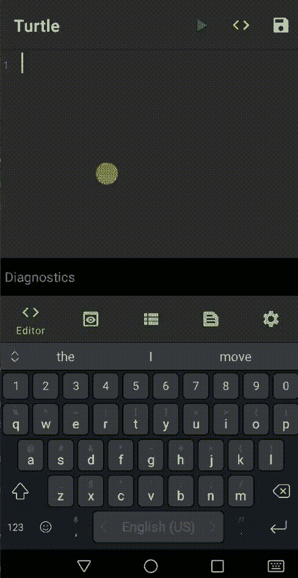
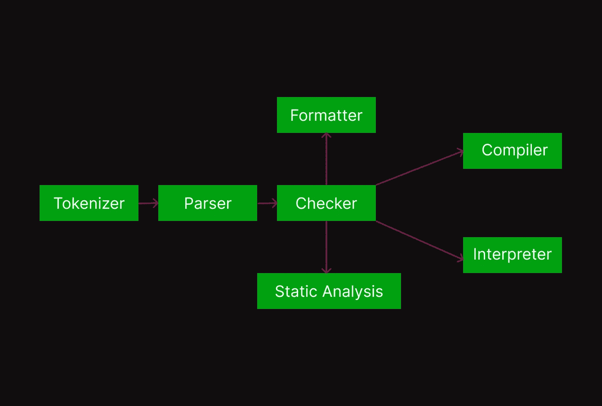

# 代码格式化程序如何在 Turtle 图形中实现

> 原文：<https://itnext.io/how-code-formatter-implemented-in-turtle-graphics-475e8e4cf611?source=collection_archive---------1----------------------->


大家好，在上一篇文章中，我介绍了 Turtle Graphics Android 应用程序项目的实现细节和关于脚本语言、编辑器、生成文档等的资源。在我发布该应用程序并获得 2000 多次下载以及良好的评级和反馈后，我决定添加对代码格式化的支持。在这篇文章中，我将详细讨论简单的代码格式化程序如何工作以及我如何在 Turtle Graphics 应用程序中实现



由于程序员代码格式化程序是我们日常工作中的一个重要工具，如果代码被格式化，它们会使代码更容易阅读，但是你有没有问问自己它是如何工作的？

在讨论代码格式化程序之前，让我们先讨论一下编译器如何将你的代码从文本表示成数据结构，以便对其进行处理，比如类型检查。

让我们从包含简单 hello world 示例的文件开始我们的故事

```
fun main() {
   print("Hello, World!")
}
```

第一步是读取这个文本文件，并将其转换成一个令牌列表，令牌是一个表示关键字、数字、括号、字符串等的类，例如在源代码中的这个位置

```
data class Token (
   val kind : TokenKind,
   val literal : String,
   val line : Int,
)
```

我们还可以保存文件名、列的开始和结束，这样当我们想要报告错误时，我们可以提供关于位置的有用信息

```
Error in File Main Line 10: Missing semicolon :D
```

这一步称为扫描器、词法分析器或记号化器，最后我们会以记号列表结束

```
{ FUN_KEYWORD, "fun", 1 }
{ IDENTIFIER, "main", 1 }
{ LEFT_PAREN, "(", 1 }
{ RRIGHT_PAREN, ")", 1 }
{ LEFT_BRACE, "{", 1 }
{ IDENTIFIER, "print", 2 }
{ LEFT_PAREN, "(", 2 }
{ STRING, "Hello, World!", 2 }
{ RRIGHT_PAREN, ")", 2 }
{ RIGHT_BRACE, "}", 3 }
```

结果是令牌列表

```
val tokens : List<Token> = tokenizer(input)
```

请注意，在这一步，我们可以检查一些错误，如未终止的字符串或字符，不支持的符号…等等

在这一步之后，你会忘记你的文本文件和处理这个令牌列表，现在我们应该根据我们的语言语法将一些令牌转换成节点，因为当我们看到 FUN_KEYWORD 时，这意味着我们将构建一个函数声明节点，我们需要名称、参数等

在这一步中，我们需要一个数据结构来表示程序，以便我们以后可以遍历和验证它，它被称为抽象语法树(AST)，AST 中的每个节点表示语句，如 If、While、函数声明、var 声明等，或表达式，如赋值、一元等，每个节点存储所需的信息，以便在后面的步骤中使用，例如

函数声明

```
data class Function (
   var name : String,
   var arguments : List<Argument>,
   var body : List<Statement>
)
```

变量声明

```
data class Var (
   var name : String
   var value : Expression
)
```

这一步被称为解析，我们将最终得到一个 AST 对象，我们可以用它来遍历所有节点。

```
var astNode = parse(tokens)
```

如果语言是静态类型，如 Java、C、Go…等，我们将转到类型检查器步骤，该步骤的目标是检查用户是否正确使用类型。例如，如果使用 int 类型声明一个变量，它应该只存储整数，如果条件必须是布尔类型或 C 语言中的整数，等等



在这一步之后，我们将得到相同的 AST 节点，但现在我们知道它是有效的，我们现在可以将它编译到任何目标或评估它，而且我们还可以进行格式化、静态分析、优化、检查代码样式等

例如，假设我们希望所有开发人员在声明变量时不要在名称中使用 _ 来检查我们是否会遍历 AST 节点以找到所有 Var 节点并检查它们

```
fun checkVarDeclaration(node : Var) {
   if (node.name.contains("_") {
      reportError("Ops your variable name ${node.name} contains _")
   }
}
```

但是现在我们需要格式化它，那么如何做呢？同样，我们遍历我们的 AST，对于每个节点，我们将它写回文本，但格式化为例如

```
fun formatVarDeclaration(node : Var) : String {
   var builder = StringBuilder()
   builder.append(indentation)
   builder.append("var ")
   builder.append(node.name)
   builder.append(" = ")
   builder.append(formatValue(node.value))
   builder.append("\n")   
   return builder.toString()
}
```

在这个简单的方法中，我们将节点重写为字符串，但使用正确的缩进，并在它后面添加一个新行，这样现在两个变量在同一行中声明，值也使用另一个函数格式化。您可以使用访问者设计模式来简化所有节点的处理。

在这一步的最后，我们得到了一个表示相同输入文件但经过格式化的字符串，然后我们把它写回到文件中。

这是代码格式化程序的基本实现，一个真正的产品代码格式化程序必须处理更多的情况，例如代码无效怎么办？，我应该只格式化有效的代码吗？我们是否应该在每次格式化或编译代码时阅读整个程序？

现在回到 Turtle graphics，在这个项目中，我已经完成了之前所有需要的步骤，并有一个现成的 AST，所以我只是用代码重写它，就像你在^_^上面看到的那样，我从 UI 读取它，格式化它，并在我的例子中写回 UI

如果你感兴趣并想读更多，我建议

*   至少读一本编译器的书，比如手工解释器
*   阅读关于语言服务器端口(LSP)的信息
*   观看作者安德斯·海尔斯伯格解释的 Typescript 编译器
*   想一想，如果你有一个和 AST 一样的程序，你还能用它做些什么

我希望你喜欢我的文章，你可以找到我

你可以在:[**GitHub**](https://github.com/amrdeveloper)[**LinkedIn**](https://www.linkedin.com/in/amrdeveloper/)[**Twitter**](https://twitter.com/amrdeveloper)上找到我。

享受编程😋。