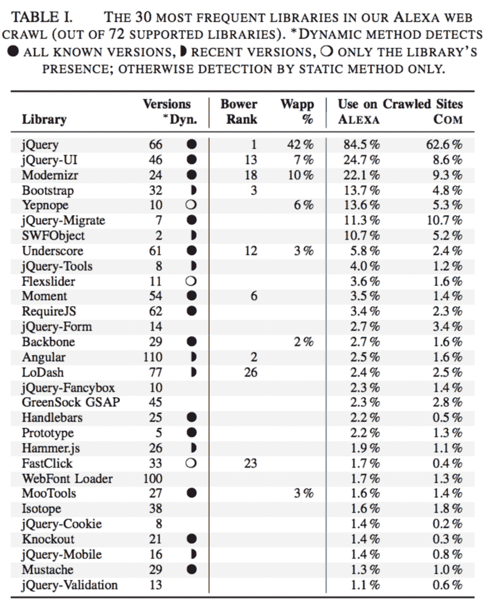
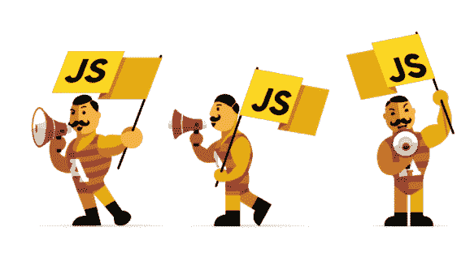
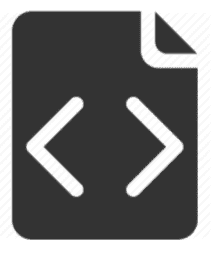

# 公司是如何通过恶意 Javascript 代码被黑的？

> 原文：<https://itnext.io/how-companies-are-hacked-via-malicious-javascript-code-12aa82560bdc?source=collection_archive---------1----------------------->

JavaScript 是危险的。也许这句话你之前已经听过好几遍了。实际上，危险或不危险在不同的情况下是真实的。如果不采取适当的预防措施，JavaScript 可能会很危险。它可以用来查看或窃取个人数据，即使你没有意识到发生了什么。由于 JavaScript 在网络上无处不在，我们都容易受到攻击。

[*点击这里在 LinkedIn* 上分享这篇文章](https://www.linkedin.com/cws/share?url=https%3A%2F%2Fitnext.io%2Fhow-companies-are-hacked-via-malicious-javascript-code-12aa82560bdc)

JavaScript 在很大程度上是好的，但它碰巧如此灵活和强大，以至于很难控制它。这一切最终都取决于 JavaScript 实际工作方式。

> *让我们快速看一下 JavaScript 的工作机制。*

Javascript 是什么？Javascript 被称为网络语言。就 JavaScript 执行速度而言，每个新版本的浏览器都将执行时间的速度栏推得更高。随着网站大量使用 JavaScript，这是一个重要的性能参数。JavaScript 用 AJAX 引领了 Web 2.0 革命。使用 JavaScript，网站可以在后台发送 HTTP 请求，并定制或更新网站的某些部分，以满足特定用户的需求。这消除了完全的页面刷新，使用户界面更加强大和用户友好。

浏览器获取一个可能嵌入了任何

JavaScript 代码，或者指单独的 JavaScript 文件，在这种情况下，该文件也由浏览器获取。之后，根据您希望 JavaScript 代码做什么以及您如何构建它，它要么在文件加载后立即执行，要么等待触发事件(比如点击或加载)。最后，当一切正常时，逐行执行代码。JavaScript 是一种解释语言，这意味着您不需要将代码编译成另一种形式来执行它。你所做的所有改变都会立即生效。

有些人认为，因为 JavaScript 的名字中有“Java ”,所以它们与 Java 有某种联系。似乎故意选择这个名字是为了制造混乱，而从混乱中产生误解。JavaScript 不应该被解释为 Java。JavaScript 是一种不同的语言。

JavaScript 代码存在于网页中，它或者为网页提供附加功能，或者在网页本身中创建应用程序。一些视频游戏是用 JavaScript 开发的，它们可以直接在互联网浏览器窗口上玩。Java 程序通常可以在服务器端或在最初应该下载的 Java applet 中执行计算和主要的“思考”过程。

JavaScript 库是一个预先编写的 JavaScript 库，它允许更容易地开发基于 JavaScript 的应用程序，尤其是 AJAX 和其他以 web 为中心的技术。

在 JavaScript 中，我们有效地使用它的方式是使用一个库。库是一个 JavaScript 文件，包含一系列函数，这些函数为你的网页完成一些有用的任务。

互联网上几乎每个网站都使用 JavaScript 库。在最近的一项学术研究中,显示了 JavaScript 库在整个网络中的使用情况。在本研究中，研究人员分别抓取了 Alexa top 75k 网站和位于*“COM”*顶级域名下的网站。结果如下图所示。

根据获得的结果，87.7%的 Alexa 网站和 46.5 %的。com 站点至少使用一个著名的 JavaScript 库，其中 jQuery 是大多数人最喜欢的。

> ***为什么？***

现在让我们考虑一下 JQuery 或其他广泛使用的库中的一个严重漏洞的危害。

> ***在这样的情况下效果会非常好。***

在本文的后续部分，我们解释了如何处理任何 JavaScript 库中的漏洞，以及如何为启用 JavaScript 的网站建立安全基础设施。

# 如何处理 JavaScript 库中的漏洞？

JavaScript 库。会被滥用，这种滥用会导致

这使得窥探你的互联网活动和侵犯你的隐私成为可能。残酷的是，即使你的网站足够安全，你的网站也可能被黑客攻击，因为你在网站中使用的 JavaScript 库中存在漏洞。我们从[这个来源](http://www.makeuseof.com/tag/3-ways-javascript-can-used-breach-privacy-security/)中受益，解释了 JavaScript 的以下三种恶意用法。

## 1.偷窥你输入的单词

攻击者可以跟踪文本框，用户可以在那里更新状态，写评论等等。使用一点嵌入的 JavaScript 代码。2012 年 7 月，两名研究人员从美国和英国的 500 万脸书用户中采集了数据。研究人员明确表示，他们只使用记录的内容，即“输入的文本是否存在”，而不是“按键或内容”。仍然有可能跟踪击键和内容。他们只是选择不这样做。可以肯定的是，攻击者不会以同样的方式行事。

这个想法很可怕。记录网页上的任何活动只需要少量的嵌入式 JavaScript 即使你实际上没有提交任何东西！网页滚动、鼠标移动、击键:所有这些都可以在违背你的意愿或你不知情的情况下被跟踪和记录。

## 2.跟踪您的浏览习惯

可以用 JavaScript 跟踪的东西不仅限于击键内容，一些嵌入的 JavaScript 代码可以跟踪你的浏览器 cookies。通过浏览器 cookies 的魔力，公司可以存储各种用户特定的信息:浏览器类型、偏好、位置等。许多网站已经在跟踪你的浏览器 cookies，以便提供更好的用户体验。出于任何目的，你可能会认为他们在你上网的时候一直在看着你(在我看来)。

## 3.恶意代码注入

JavaScript 最卑鄙的用途之一是跨站脚本(XSS)。简单地说，XSS 是一个漏洞，允许黑客将恶意 JavaScript 代码嵌入合法网站，最终在访问该网站的用户的浏览器中执行。

如果这发生在处理敏感用户信息(如财务数据)的网站上，恶意代码可能会窥探和窃取这些信息。更进一步说，XSS 可以被用来复制病毒和恶意软件，这就是 Twitter 被 StalkDaily 蠕虫病毒感染时发生的事情。

还有另一个漏洞叫做跨站请求伪造(CSRF)。这种恶意 JavaScript 代码可以利用用户的浏览器、cookies 和安全权限，以便在单独的网站上执行操作。

BeEF 是一个利用浏览器漏洞来控制目标计算机系统的项目。

BeEF 是一个类似于 Metasploit 的框架。BeEF 使用了一个 javascript， ***hook.js*** ，当这个 JavaScript 代码被浏览器执行时，它给出一个 ho

好的牛肉。有了一个挂钩的浏览器，您就可以拥有一个可使用的漏洞利用列表，就像在 metasploit 中一样。其中一些用于查看 cookies 或浏览历史记录，但最终，他们的目标是进行更复杂的攻击来获取外壳。

因此，攻击的工作原理如下，客户端访问一个恶意页面，其中包含 BeEF 的 hook.js 脚本，或者它可以通过 XSS 攻击来执行。攻击者可以使用相同的方式，利用 JavaScript 库上的漏洞来攻击目标计算机。当恶意代码被执行时，你可以在你的牛肉控制面板上看到一个浏览器与你挂钩，最后，漏洞被利用。

> ***我们来考虑一个可能的场景，如上表 I 所述，JQuery 在全球范围内被广泛使用(alexa 中占 86%，Com 中占 62%)。今天，JQuery 有 66 个不同的版本。这些版本中有一半以上至少有一个漏洞。如果攻击者可以利用任何漏洞向网站添加恶意代码(例如* hook.js *)，他们就可以获得对目标机器的完全访问权限。考虑到 JQuery 的使用如此广泛，这种情况可能会以一种不好的方式影响数百万人。(关于这些统计信息的详细信息解释如下。)***

您可能认为禁用 JavaScript 是防止这些不必要的黑客事件的正确解决方案。但是如果你这样做，你会失去很多很棒的网络功能，比如存在于许多博客、社交网络和新闻网站上的“无限滚动”功能。但更重要的是，即使您禁用了 JavaScript，一些浏览器漏洞仍然是可能的。出于安全考虑禁用 JavaScript 就像你每次出门都穿着泡泡服，因为你害怕受伤。它实际上不会保护你太多，但会让你的生活很痛苦。

如果是这样，我们需要采取一些**迷人的**预防措施，让我们的 JavaScript 支持的网站足够安全。

> ***但如何？有点复杂，有一些局限性。***

关于这个话题，有[最近发表的一篇学术论文](http://www.ccs.neu.edu/home/arshad/publications/ndss2017jslibs.pdf)。在这篇文章中，我们从这篇论文中受益匪浅。如果你想阅读更详细的信息，请阅读这篇参考论文。

在引用的研究中，分析了超过 133，000 个网站，它们显示其中 37%包含至少一个具有已知漏洞的库。虽然 JavaScript 是在 Web 上开发客户端代码的事实上的标准，但同时它也因安全漏洞而臭名昭著。

图 1 显示了包含漏洞信息的 11 个库的详细信息。对于每个库，我们显示目录中版本的总数以及版本的比例。最糟糕的是 Angular 1.2.0，它包含 5 个漏洞。总体而言，我们看到这些库版本中分别有 28.3%、6.7%和 6.1%包含一个、两个或三个已知漏洞。JQuery 一半以上的版本都有一个漏洞。(图片来源:[研究](http://www.ccs.neu.edu/home/arshad/publications/ndss2017jslibs.pdf))

第三方模块，如广告、追踪器、社交媒体或其他通常嵌入在网页中的小部件，通常用 JavaScript 实现。此外，这些脚本还可以在网站管理员不知情的情况下加载库。如果不在框架中隔离，这些库将在包含站点的上下文中获得全部权限。因此，即使 web 开发人员不断更新自己的库依赖项，过时的版本仍然可能来自维护不当的第三方内容。此外，一些 JavaScript 库和许多 web 框架包含它们所依赖的库的副本。因此，web 开发人员可能会不知不觉地依赖软件维护人员来更新 JavaScript 库。(来源:[研究](http://www.ccs.neu.edu/home/arshad/publications/ndss2017jslibs.pdf))

在参考的研究中，结果显示，在 ALEXA 中，36.7%的 jQuery 内含物是已知易受攻击的，而每个网站最多只统计一个特定库版本的内含物。Angular 有 40.1%的易损夹杂物，车把有 86.6 %，YUI 3 有 87.3 %(不再保养)。(来源:[研究](http://www.ccs.neu.edu/home/arshad/publications/ndss2017jslibs.pdf))

**首先，没有关于 JavaScript 库及其版本、发布日期和已知漏洞的元数据的集中存储库。**这一事实增加了漏洞管理的难度。没有可靠的漏洞数据库，没有由库供应商维护的安全邮件列表。他们在发行说明中几乎没有关于安全问题的细节。因此，很难确定哪个版本的库会受到特定报告漏洞的影响。

**其次，web 开发人员经常通过重新格式化、重组或追加代码来修改 JavaScript 库，这使得很难检测到库在野外的使用情况。**为了将一个库包含到他们的网站中，开发人员通常使用****HTML 标签，并指向库的外部托管版本或他们自己服务器上的副本。库供应商通常会提供一个最小化的版本，去掉空白，缩短注释和局部变量以减小文件的大小。开发人员还可以将多个库连接成一个文件，创建自定义的库构建，或者使用高级的最小化功能，如死代码删除。这是另一个复杂的原因。当开发人员修改并使用一个库时，对于自动化工具来说，检测哪个库及其版本在网站中被使用是非常困难的。

第三方模块，如广告、追踪器、社交媒体或其他通常嵌入在网页中的小部件，通常用 JavaScript 实现。此外，这些脚本还可以加载库，可能不需要站点维护人员的知识。如果不在框架中隔离，这些库将在包含站点的上下文中获得全部权限。

攻击者可以利用这些功能从用户的浏览会话中窃取数据，代表用户发起交易，或者在网站上放置虚假内容。因此，JavaScript 库不应该在使用它们的网站中引入任何攻击媒介。

一些库，如谷歌地图，广告和跟踪库，如谷歌分析，和社会部件通常不发布版本信息。幸运的是，绝大多数这样的库由它们的创建者托管在一个单一的、非版本化的 JavaScript 库中(例如， [GoogleAnalytics.js](https://www.google-analytics.com/analytics.js) )。这意味着所有客户端都自动包含最新版本的库。这对安全来说是非常好的事情。