# 将 LightSail 与 CloudFront 和 Route53 配合使用

> 原文：<https://itnext.io/how-configure-a-wordpress-site-with-lightsail-using-cloudfront-and-route-53-c52ce5719b82?source=collection_archive---------0----------------------->

在本教程中，我们将使用 CloudFront 和 Route 53 建立一个带有 LightSail 的 WordPress 站点。

顺便说一句，如果你是一名云工程师，你可能会有兴趣加入 topcloudops.com 网络。伟大的客户，伟大的项目，伟大的薪酬。

如果你只想孤立地做一个 WordPress 网站，使用 Lightsail 是很棒的。您可以配置一个域并将其指向您的网站，添加一个负载平衡器来分配负载，并添加分布以使用 AWS edges 网络高效缓存内容。看起来棒极了！但事实并非如此。

问题是当你使用 Lightsail 时，你已经有了一个 AWS 账户，这个账户有一个 route 53 来管理你的域名，有一个 CloudFront 来处理你的发布。在这种情况下，结合使用两者是很难设置的。

在本教程中，我将以 mydomain.com 域为例，向您展示如何配置 Route 53 和 Cloudfront。

所以还是言归正传吧。

1.  **创建一个 Lighsail WordPress 实例**
    转到 Lightsail，点击创建实例，选择正确的位置(与你现有堆栈的其余部分相同)一个操作系统(Linux 对我来说似乎是一个没有大脑的东西)，和 Bitnami WordPress 映像。

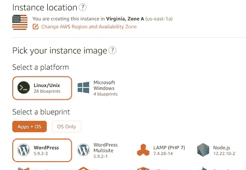

选择你的方案，我会选择最便宜的，考虑到大部分内容会由 CloudFront CDN 交付，只有 login 和 admin 没有缓存。

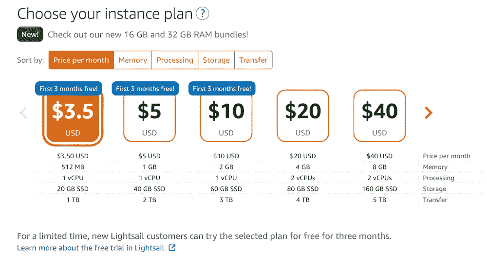

之后，选择实例的数量，我们就完成了。

对于本教程，我将只选择一个，因为我们将使用静态 IP 指向 origin.mydomain.com，如果我们决定有多个，我们将需要使用负载平衡器来分配负载或加权延迟路由 53 策略。如果您使用负载均衡器，每月会有 18 美元的额外费用

好了，现在单击 create，等待实例启动并运行。

2.**创建静态 Ip:**

正如我之前提到的，现在是时候给我们的 LightSail 实例分配一个静态 Ip 了，这样我们就可以将 origin.mydomain.com 指向它。如果我们不这样做，IP 可能会因不同的事件而改变，我们的路由将不再有效。为此，我们需要在新实例中单击->转到 Network 选项卡，然后单击 create static IP。

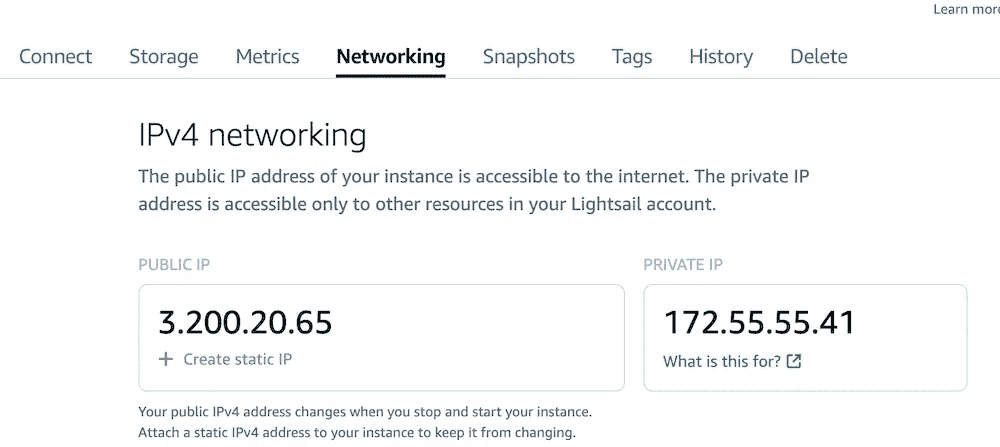

3.**创建一条指向 origin.mydomain.com 的记录:**

现在我们有了一个静态 IP，我们将转到 53 号路由，创建一个 A 记录，将 origin.mydomain.com 指向我们的静态 IP。

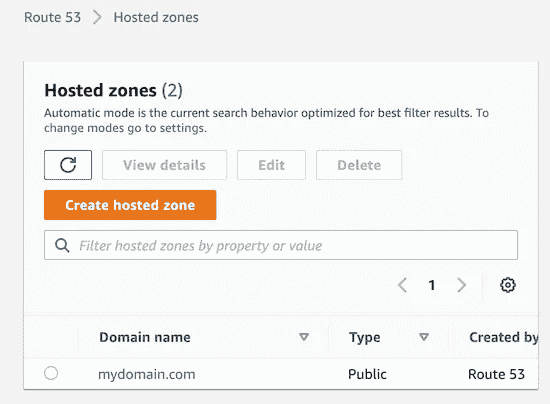

为此，请转到 Route53->打开您的托管区域->使用此配置创建一个 A 记录:

记录名称**origin.mydomain.com
记录类型**一条记录
值**我们的 LightSail 实例的静态 IP。**

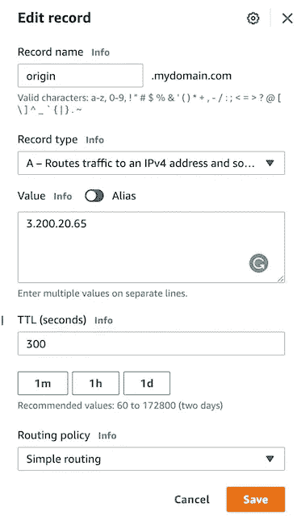

如果我们让 DNS 传播更改 5 分钟，键入 origin.mydomain.com 将把我们导向我们的实例。但是只支持 HTTP。

4. **LightSail 实例 SSL 证书。**

现在我们已经为 LightSail 实例完成了 Route 53 配置，我们需要安装 SSL 证书，以便能够在我们的实例和 Cloudfront 之间建立 SSL 连接。在我们可以生成证书之前，需要步骤 3。

为此，请转到 LightSail->打开您的实例->点击按钮使用 SSH 连接。

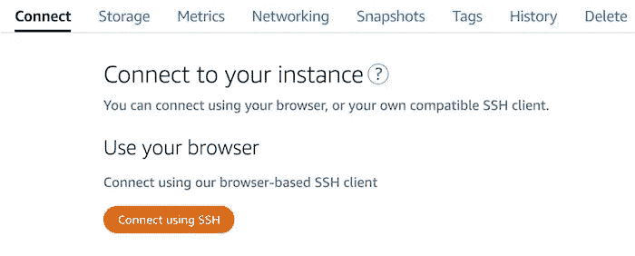

这将打开一个终端，我们接下来要做的是从 Bitnami 执行这个脚本，使用 L *etsencrypt 生成 SSL 证书。*

`sudo /opt/bitnami/bncert-tool`

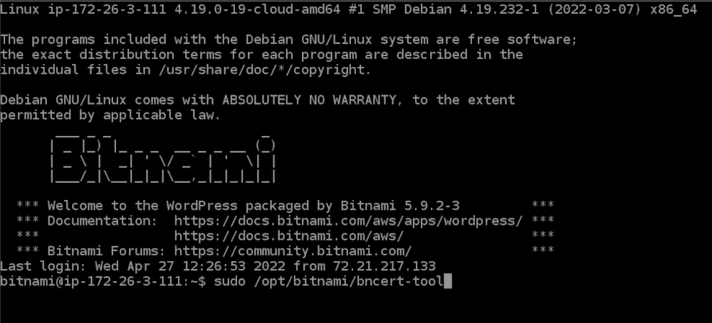

一旦我们执行，它将询问我们要生成证书的域:我们将在空格分隔的列表中键入以下内容

origin.mydomain.com[www.mydomain.com](http://www.mydomain.com)mydomain.com

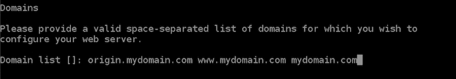

之后，将询问我们是否要在证书中包含[www.origin.mydomain.com](http://www.origin.mydomain.com)，我们将键入(n)

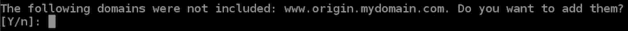

之后，它将询问我们是否要从 www-> origin 设置重定向，我们将为所有重定向问题键入(n)。

最后一个问题我们会回答是。

我们让脚本来完成这项工作，我们已经为 Lighsail 实例完成了 SSL 证书配置。

现在我们应该可以输入 https://origin.mydomain.com 了

**5。创建用于 CloudFront 的 SSL 证书。**

要完成这一部分，我们需要在 AWS 控制台上转到证书管理:

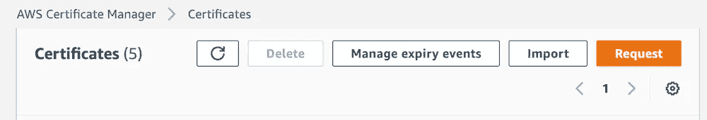

在那里，我们将单击申请新证书。

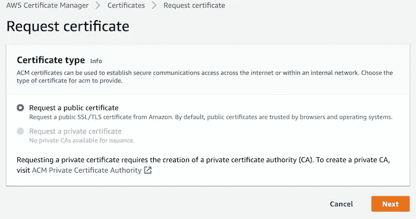

选择申请公共类型证书。

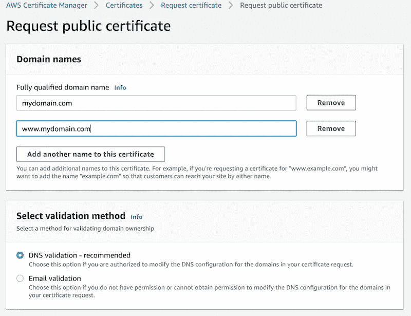

在完全限定的域中，我们将键入 mydomain.com，然后我们将单击“向此证书添加另一个名称”按钮，并添加[www.mydomain.com。](http://www.mydomain.com.)我们需要一个支持多个子域的证书，因为 CloudFront 只接受一个证书，我们希望我们的发行版同时服务于[https://mydomain.com](https://mydomain.com)和[https://www.mydomain.com](https://mydomain.com)

在验证上，方法选择 DNS 验证。

我们将单击“请求”按钮，然后转到“证书列表”窗口。单击刷新按钮，您将看到您的请求处于待定状态。

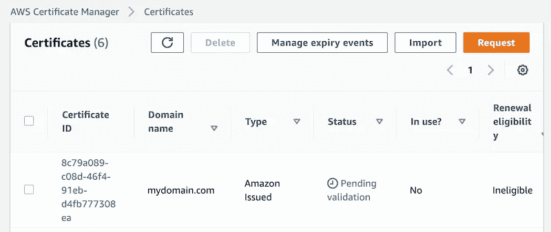

要进行验证，请单击证书 ID 链接转到详细信息页面。
你会看到这样一个页面。

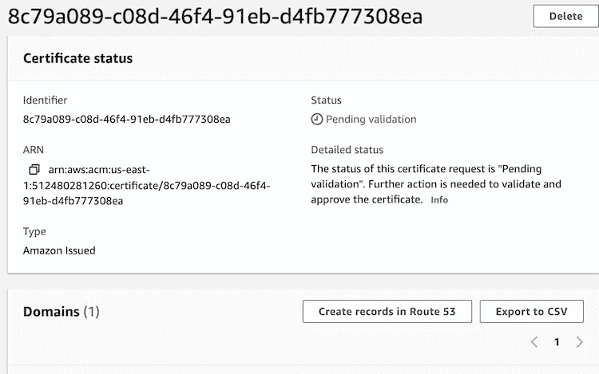

在这个页面上，我们需要单击 Create records in Route 53 按钮，这样就可以执行域所有权的验证。

如果您点击按钮，您将进入以下页面:

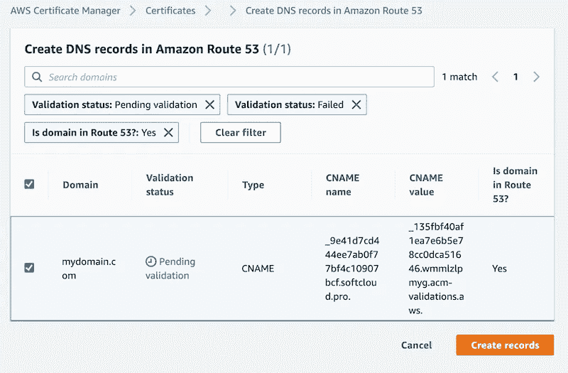

点击创建。等待几分钟并刷新您的证书列表页面。

您应该会看到您的证书的状态从待定变为已颁发。

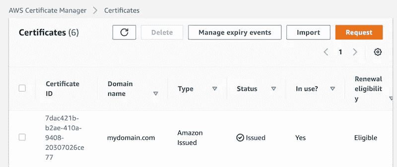

**6。创建一个以 origin.mydomain.com 为原点的 CloudFront 分布。**

要创建您的 CloudFront 发行版，您需要进入 AWS 控制台并搜索 CloudFront。主页是这样的。

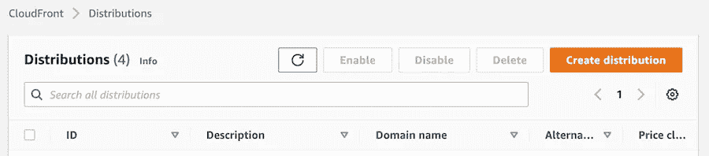

点击创建分销:

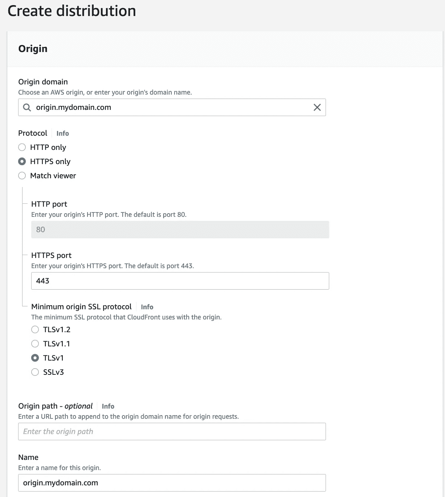

在 origin，domain 中输入您的源域(在我们的例子中是 origin.mydomain.com ),其余部分保留默认值。转到页面的设置部分。首先，在备选域名中添加[www.mydomain.com](http://www.mydomain.com,),这样分配将与 www 子域一起工作。
其次，添加我们在上一节中创建的自定义 SSL 证书，它应该在 Combobox 的一个选项中可用。这将允许发行版与 HTTPS 一起工作。

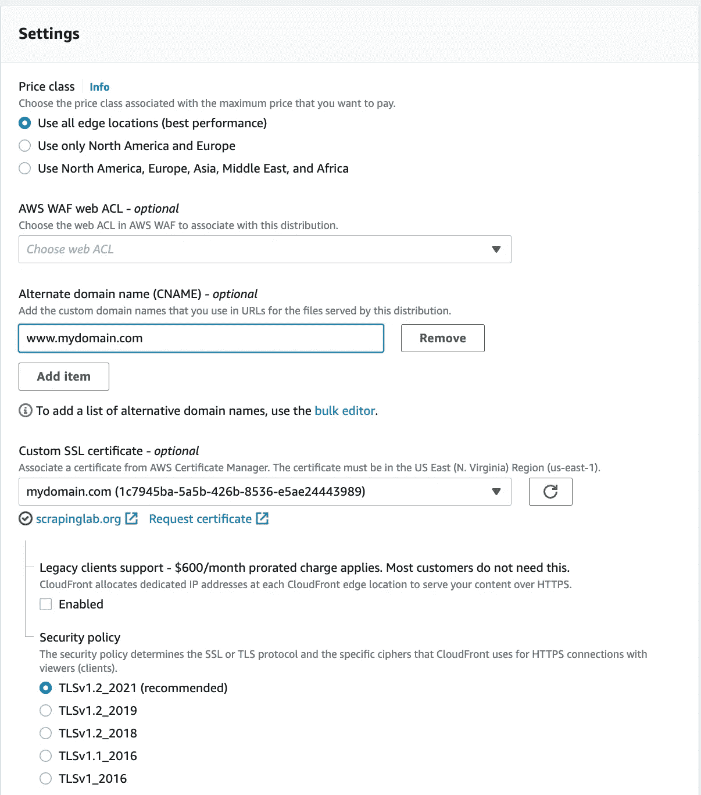

点击创建。这将创建一个具有原点和默认行为的分布。

**7。将 WordPress 推荐的行为添加到我们的发行版中。**

为了充分利用 Cloudfront 缓存并确保所有站点功能正常工作，我们需要使用 AWS 推荐的最佳实践来定制我们的分发行为(更多信息请访问[https://docs . AWS . Amazon . com/white papers/latest/best-practices-WordPress/Cloudfront-distribution-creation . html](https://docs.aws.amazon.com/whitepapers/latest/best-practices-wordpress/cloudfront-distribution-creation.html))

因此，我们将如下进行:

a.为静态内容添加行为

静态内容在 WordPress 中由这两条路径提供:
wp-content/*和 wp-includes/*
我们想要的是允许 Cloudfront 为我们缓存所有这些内容。为此，请转到您的发行版的详细信息页面，然后单击“行为”选项卡。一旦有你会看到一个创建行为按钮。

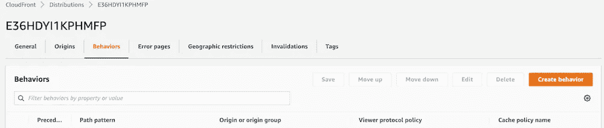

单击后，您将看到行为设置页面，我们需要在其中进行如下配置:

首先设置 wp-content/*的路径。

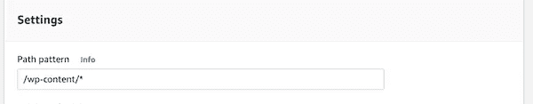

第二，设置 allow 方法，在本例中只是 GET 和 HEAD，我们允许 HTTP 和 HTTPS。

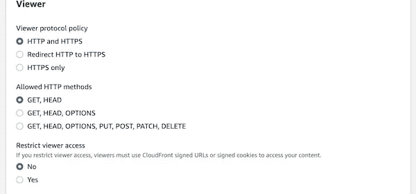

第三，使用传统的缓存设置来设置缓存头、cookies 和查询字符串。

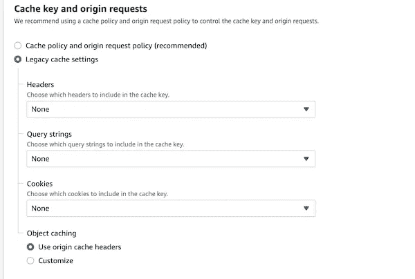

点击保存，我们需要为 wp-includes/*做同样的事情

b.为动态管理员页面添加行为

对于管理页面，WordPress 使用这两个路径提供内容:wp-admin/*和 wp-login.php

因此，让我们用下面的配置为这两条路径中的每一条创建一个行为。

首先设置 wp-admin/*的路径

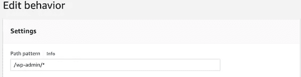

其次，设置 allow 方法，在本例中是所有的方法，我们需要将所有流量重定向到 HTTPS 以强制加密。

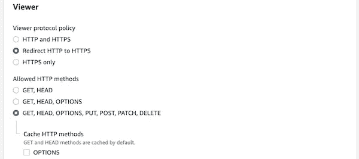

第三，使用传统缓存设置配置动态内容的缓存，并允许所有头、查询字符串和 cookies。

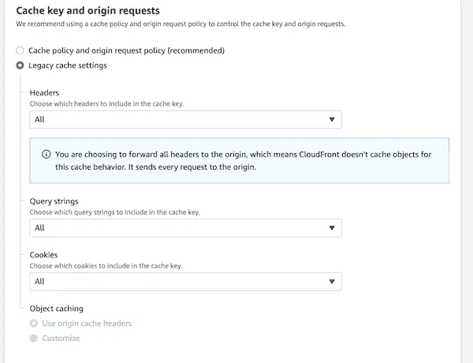

我们需要为 wp-login.php 之路做同样的事情。

c.为动态前端添加行为

这由分布的默认行为来管理。要进行配置，请选择默认行为，然后单击编辑。

首先设置 allow 方法，在本例中是所有方法，我们需要将所有流量重定向到 HTTPS 以强制加密。

对于缓存，这些是使用传统缓存设置的设置。
**头文件**:主机，CloudFront-Forwarded-Proto，CloudFront-Is-Mobile- **查看器**，CloudFront-Is-Tablet-Viewer，CloudFront-Is-Desktop-Viewer
**查询**:All
**Cookies**:comment _ *，wordpress_*，wp-settings-*

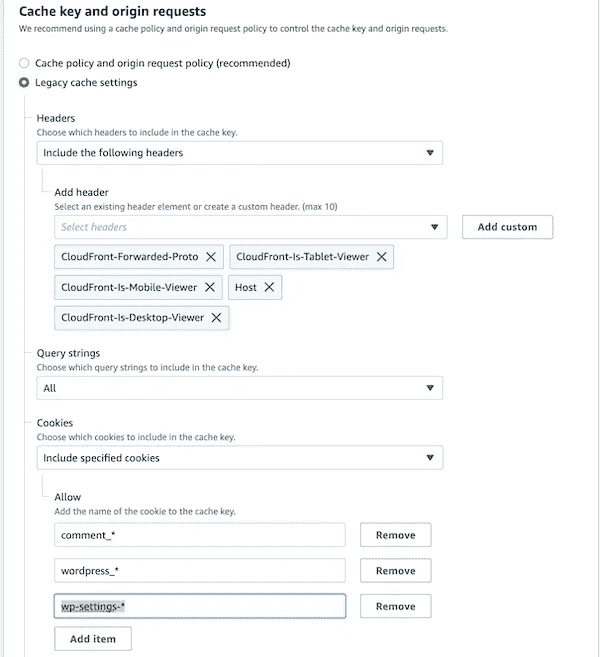

现在我们完成了发行。

这个表格总结了正确运行 WordPress 发行版所需的行为。

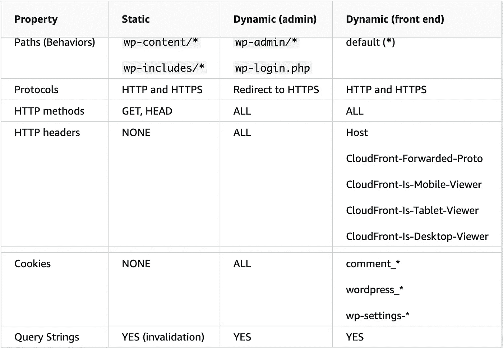

**8。设置 Route 53 裸域和 www 子域。**

最后一部分是将 Route 53 裸域配置为指向 CloudFront 分布，并为子域 www 创建一个 CNAME 条目，以将流量转发到裸域。

所以让我们去 53 号公路托管区。在我们的例子中是 mydomain.com。

点击创建新记录:

在这里，我们将为裸域键入以下配置:
**记录类型**
**将流量路由到**别名到 CloudFront 分发，选择您最近创建的分发，并确保您选择了正确的区域。将路由策略留给简单路由。

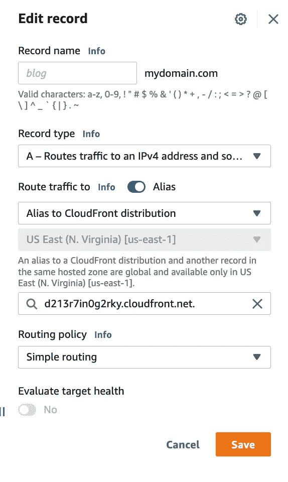

保存并为 www 转发创建新记录:

记录名称将为 [www.mydomain](http://www.mydomain) 。com
记录的类型是 CNAME
值将是 [mydomain](http://www.mydomain) 。com

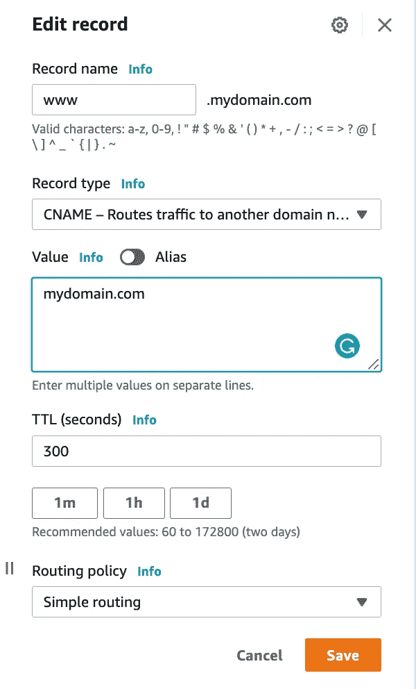

现在我们终于完成了！！！我们已经用 CloudFront 建立了一个 WordPress Lighsail 实例。给它几分钟来传播 DNS 的变化，我们应该有 mydomain.com 由 CloudFront 服务。