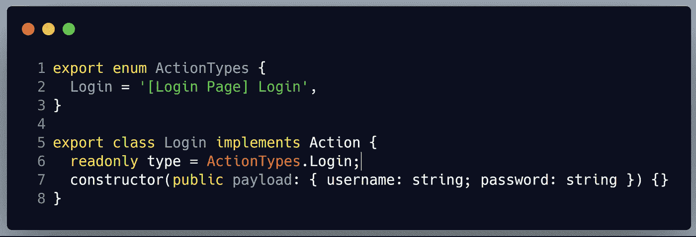
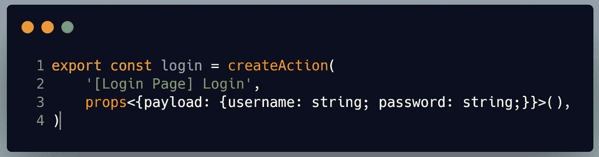
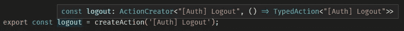
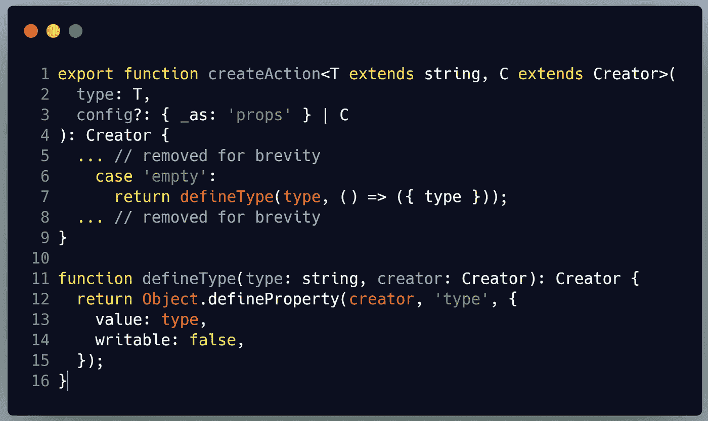
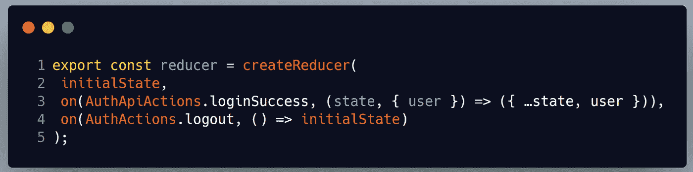
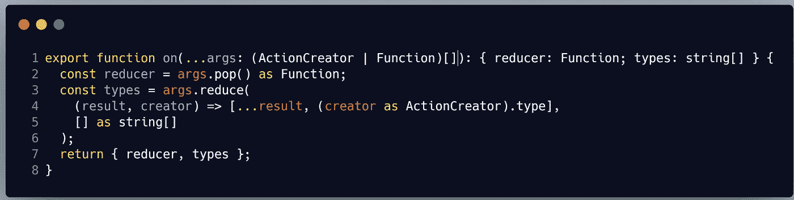
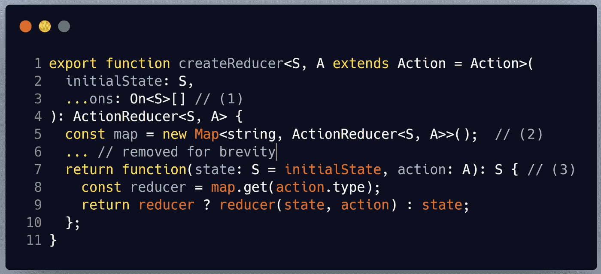

# NgRx 动作创作者是如何工作的？

> 原文：<https://itnext.io/how-do-ngrx-action-creators-work-bd8b17e02584?source=collection_archive---------1----------------------->


StackOverflow 是一个了不起的资源，每个开发人员每天都在使用它。此外，它可以激励学习新的东西。最近发现一个问题:[NgRx create action 方法的返回类型签名](https://stackoverflow.com/questions/58690209/meaning-of-ngrx-createaction-methods-return-type-signature)的含义。这激起了我的兴趣，因为我使用动作创建器已经有一段时间了，但我从来没有渴望了解它们实际上是如何工作的。

在版本 8 之前使用 NgRx 的用户可以通过以下方式创建操作:



我们都记得需要多少样板文件来支持我们的行动和减少。有了 NgRx 8，事情变得简单多了:



现在我们需要调用一个单独的函数`createAction`，而不是为每种类型的动作都有一个枚举和一个类。 [Alex Okrushko](https://medium.com/u/f7828ad40c7c?source=post_page-----bd8b17e02584--------------------------------) 有一篇很棒的文章，介绍了[新动作创作者的好处](https://blog.angularindepth.com/ngrx-action-creators-redesigned-d396960e46da)。

那么它们是如何工作的呢？

首先，让我们看看当鼠标悬停在`logout`动作上时，TypeScript 给出了什么:



我们的登录类型是`ActionCreator<T,() => TypedAction<T>>.` 第一个参数是泛型参数`T`，在我们的例子中是“[Auth] Logout”。第二个是返回`TypedAction<T>`的函数。TypedAction 通过添加`readonly type`字段来扩展动作:


现在，让我们来看看 [createAction](https://github.com/ngrx/platform/blob/90d06020d794034d326f01dbecef440be62cf7ce/modules/store/src/action_creator.ts#L100) 函数的实现:



我们传入`type`(在我们的例子中是‘Auth’Logout)并获取一个 Creator 函数— `() => ({type: '[Auth] Logout'})`。在第 7 行，我们用类型和我们的创建者调用`defineType`函数。`defineType`返回一个传入的 Creator 函数，并向其添加一个新的属性类型。所以，我们有一个带有类型属性的函数，它返回一个带有类型属性的对象😵😕。

通过这个技巧，我们可以调用`logout.type`和`logout().type`，它们都返回“[Auth] Logout”。

让我们看看我们的新减速器在做什么:



下面是[on 功能](https://github.com/ngrx/platform/blob/90d06020d794034d326f01dbecef440be62cf7ce/modules/store/src/reducer_creator.ts#L181)的实现:



它首先提取最后一个参数 reducer 函数(第 2 行)，获取我们的`ActionCreator`的类型(第 4 行)(这里使用了`defineType`的魔力)并返回一个包含 reducer 和相应动作类型的对象(第 7 行)。
稍后，在 [createReducers 函数](https://github.com/ngrx/platform/blob/90d06020d794034d326f01dbecef440be62cf7ce/modules/store/src/reducer_creator.ts#L227)中:



我们从`on`函数(第 3 行)中得到的减少器和动作被构建到动作类型和减少器(第 5 行)的映射中。返回一个新的 reducer 函数(第 7 行)。如果调度的动作在 map 中，那么它执行相关的 reducer，否则返回原始状态。

# 摘要

首先，我们定义动作创建者:

```
export const login = createAction(
    '[Login Page] Login',
    props<{payload: {username: string; password: string;}}>(),
)
```

然后我们定义一个 reducer，它执行`ons`函数并在内部构建一个动作类型和 reducer 函数的映射:

```
export const reducer = createReducer(
  initialState,
  on(AuthActions.login, (state, {username}) => 
     ({...state, user: username}))
);
```

然后我们调用我们的组件或服务:

```
this.store.dispatch(AuthActions.logout())
```

动作创建器函数`AuthActions.logout()`被执行，我们得到一个返回的`TypedAction`，其类型属性等于“*[登录页面]登录*”。

Reducer 然后遍历它的映射，试图为给定的类型找到一个 reducer 函数。当 reducer 被找到时，它被执行，否则返回状态对象。