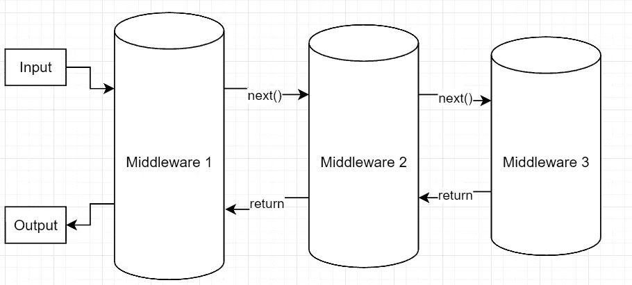

# 中间件管道实现看起来像什么？

> 原文：<https://itnext.io/how-does-a-middleware-pipeline-implementation-look-like-ceffc1129093?source=collection_archive---------4----------------------->


今天我通读了 Asp.Net 中间件管道文档，通读过程中，我对*如何*使用管道的解释感到满意，但另一方面，我真的很好奇这样一个管道的实现会是什么样子。

你知道，使用一些东西是等式的一部分，但是你自己建造它并正确理解正在发生的事情会更好地促进理解。

**什么是中间件管道？**

通过下图，中间件管道非常容易理解:



整个管道由 **n** 个中间件组成，通常有一个输入和一个输出。每个中间件可以对输入执行工作，或者基于输入执行工作，然后用相同的参数调用下一个中间件。

然而，中间件也可以决定不将调用委托给下一步。想象一下 Asp.Net 核心中间件，它处理模型绑定、路由、安全等等。如果路由中间件确定没有匹配的路由，它可能会使管道短路，并立即返回。

那么，这在代码中是什么样子的呢？

通常，如果你只是简单地使用一个中间件，例如在 Asp.Net 核心中，你会继续添加**应用。在你的启动中使用((ctx，next) = > …)** 。

然而，我们希望从头开始构建我们自己的“基本”中间件管道。

首先，让我们定义一个我们希望通过管道拖动的简单上下文:

```
public class Context
{
    public int CurrentUserId { get; set; }
    public string DynamicString { get; set; }
}
```

很简单。

接下来，我们已经进入正题了。我们需要定义一个委托，我们期望我们的中间件处理程序来完成这个委托。我们的委托应该返回一个任务，以允许实现者轻松地使用异步。对于参数，委托应该明确地接收上下文以在管道中拖动，以及在需要时调用的“ *next* ”回调。这也可以通过*功能<来完成。>* ，我决定定义一个合适的委托来增强最终产品的可读性。这是我们的代表:

```
public delegate Task MiddlewareDelegate(Context context, Func<Task> next);
```

太棒了。既然我们有了管道的粗略异常值，现在我们需要构建“管道”本身。为此，我们希望有一个小的 provider 类来存储所有的回调，并允许注册和最终执行整个设置。

```
public class BasicMiddlewareProvider
{
    private readonly Queue<MiddlewareDelegate> _middleWares = new(); public BasicMiddlewareProvider Use(MiddlewareDelegate step)
    {
        _middleWares.Enqueue(step);
        return this;
    } public async Task Run(Context context)
    {
        if (_middleWares.Any())
        {
            await RunInternal(context);
        }
    } private async Task RunInternal(Context context)
    {
        if (_middleWares.TryDequeue(out var middleware))
        {
            await middleware(context, () => RunInternal(context));
        }
    }
}
```

一点一点地看，我们有几个兴趣点。

1.  首先，我们有一个 MiddlewareDelegates 队列。这就是我前面提到的，我们需要将注册的代表存储在某个地方。队列在这里是一个很好的数据结构，因为中间件注册的自然流程是基于入队的顺序执行的。但是，如果应该重用提供程序，列表可能会更好，因为不会从列表中删除项目。
2.  接下来，我们的注册方法，叫做“使用”。这只是将中间件放入队列中，为了使它成为一个流畅的 API(稍后您将看到这一点)，我们返回 *this。*
3.  *Run* 方法是有趣的地方。这开始了我们管道的实际执行。显然，只有当至少注册了一个中间件时，才会出现这种情况。
4.  *RunInternal* 从将第一个中间件代理从队列中取出开始。我们现在调用这个中间件，向它传递上下文，以及一个回调，该回调再次递归调用 *RunInternal* 。现在，执行一个中间件步骤，一旦它调用回调，我们就让下一个中间件出队。这种情况一直发生，直到我们的队列为空，我们的管道完成——太好了！否则，如果没有调用回调，我们也将简单地到达方法的结尾，并停止执行。

这基本上就是所有的魔法了！使用它相当简单:

```
await new BasicMiddlewareProvider()
 .Use(async (ctx, next) =>
 {
  ctx.DynamicString = "Hello World";
  await next();
 })
 .Use(async (ctx, next) =>
 {
  if (ctx.DynamicString == "Hello World")
  {
   Console.WriteLine("Hello World indeed");
  }await next();
 })
 .Use((_, _) =>
 {
  Console.WriteLine("Let's stop here");
  return Task.CompletedTask;
 })
 .Use((_, _) =>
 {
  Console.WriteLine("Do I still live?");
  return Task.CompletedTask;
 })
 .Run(new Context());// Output:
Hello World indeed
Let's stop here
```

这就是流畅 API 的回报所在——我们可以在这里进行连锁注册。如您所见，第一步执行，并将属性设置为“Hello World”。由于该步骤调用了*下一个*回调，我们继续第二个回调(这是我们让下一个中间件出列的地方)。由于“Hello World really”打印出来，我们还可以验证传递的上下文确实是我们在前面的步骤中修改的那个。太好了！

在下一步中，我们决定只打印一些东西，然后返回一个完成的任务。如您所见，我们再次使用**而不是**调用 next，因此在这里停止了链——下一个打印没有发生。

毕竟，这是一个非常简单的管道，但它应该传达出正在发生的事情的大致想法。唯一神奇的步骤是传递一个回调来继续这个链。

**如果我需要更多的输入怎么办？**

委托回调很好，但有时您需要更严格的类型。幸运的是，将整个设置移植到一个界面非常容易。

```
public interface IMiddleware
{
    Task Execute(Context context, Func<Task> next);
}public class ConcreteMiddleware : IMiddleware
{
    private readonly int _newContextValue; public ConcreteMiddleware(int newContextValue) => _newContextValue = newContextValue; public async Task Execute(Context context, Func<Task> next)
    {
        if (context.CurrentUserId == _newContextValue)
        {
            Console.WriteLine($"Typed middleware hit its end - {context.CurrentUserId}");
            return;
        } Console.WriteLine($"Typed middleware CurrentUserId {context.CurrentUserId}");
        context.CurrentUserId = _newContextValue; await next();
    }
}public class TypedMiddlewareProvider
{
    private readonly Queue<IMiddleware> _middlewares = new(); public TypedMiddlewareProvider Use(IMiddleware middleware)
    {
        _middlewares.Enqueue(middleware);
        return this;
    } public async Task Run(Context context)
    {
        if (_middlewares.Any())
        {  
            await RunInternal(context);
        }
    } private async Task RunInternal(Context context)
    {
        if (_middlewares.TryDequeue(out var middleware))
        {
            await middleware!.Execute(context, () => RunInternal(context));
       }
    }
}
```

使用起来也非常简单明了:

```
await new TypedMiddlewareProvider()
 .Use(new ConcreteMiddleware(1))
 .Use(new ConcreteMiddleware(2))
 .Use(new ConcreteMiddleware(2))
 .Use(new ConcreteMiddleware(3))
 .Run(new Context());// Output
Typed middleware CurrentUserId 0
Typed middleware CurrentUserId 1
Typed middleware hit its end - 2
```

我们再一次看到管道的工作方式是一样的——我们也可以提前返回这里，并且上下文被适当地拖动

太棒了。这就是全部内容——理解的关键是深入了解回调设置，但一旦完成，一切就相当容易掌握了。

以下是用于示例的代码:[https://github.com/Sossenbinder/CSharpMiddleWareExample](https://github.com/Sossenbinder/CSharpMiddleWareExample)