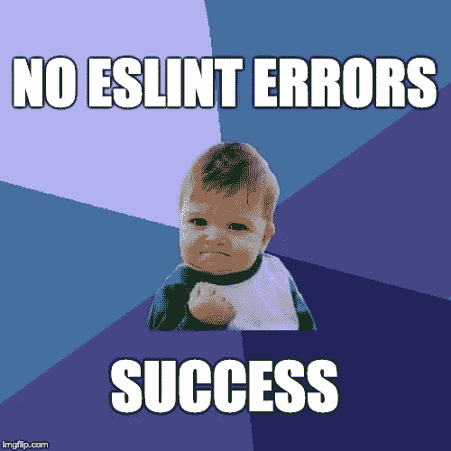
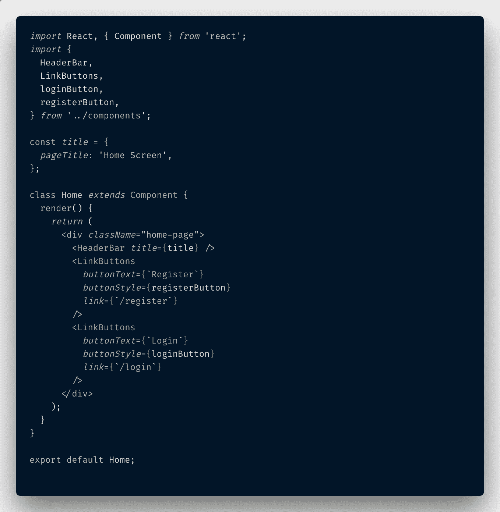
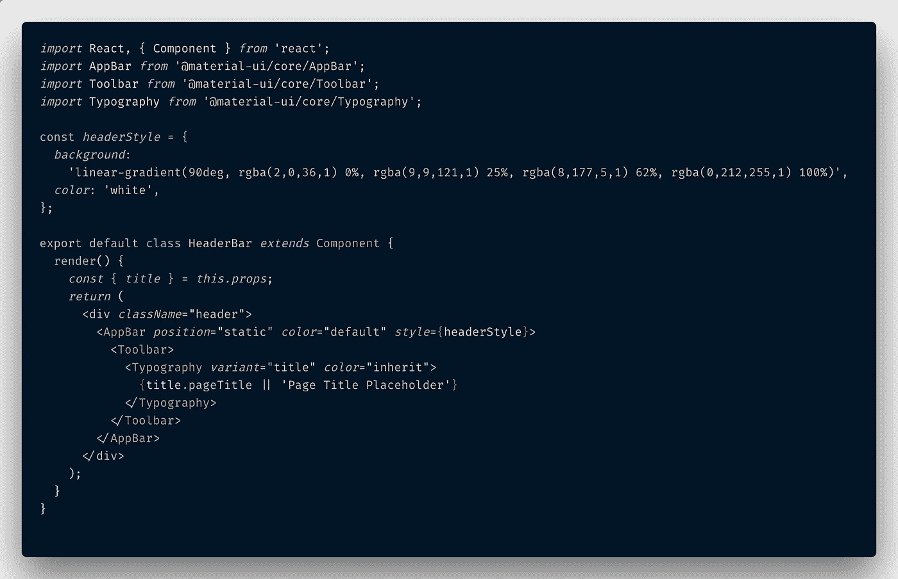
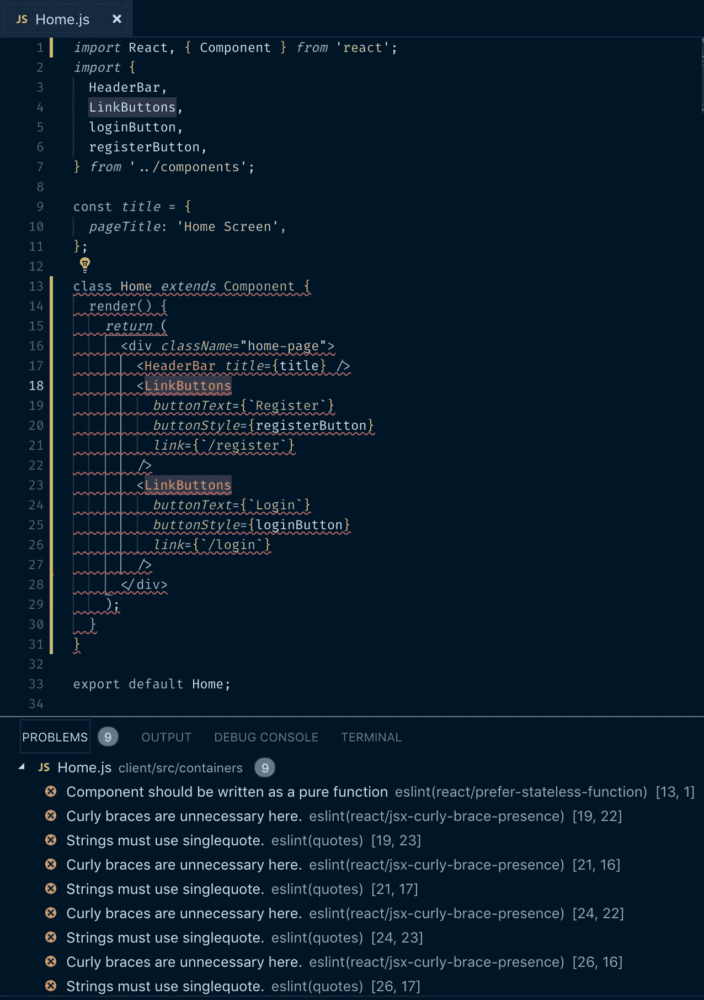
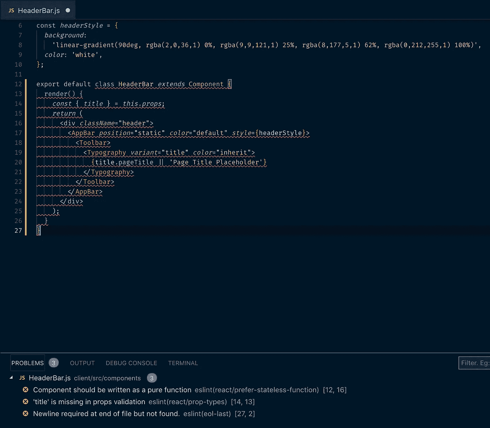
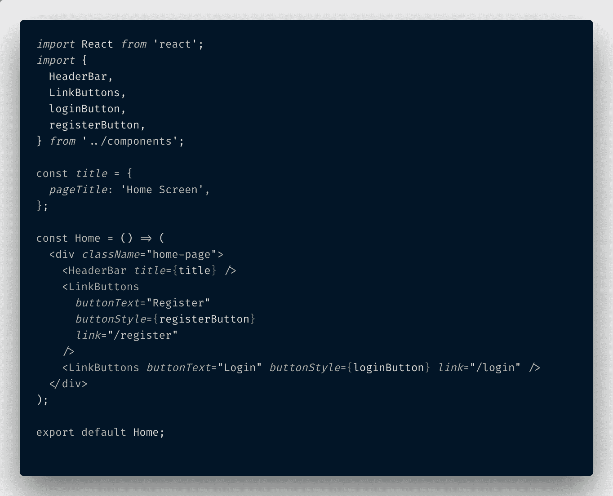
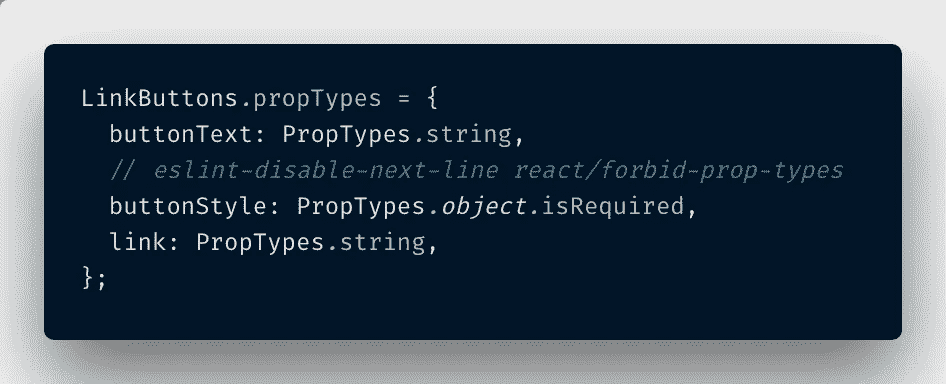
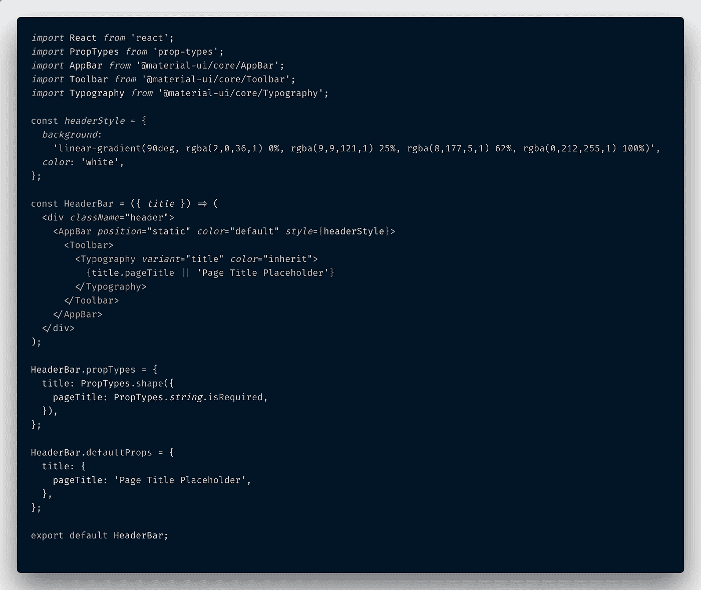

# ESLint 如何让我成为更好的 React 开发人员

> 原文：<https://itnext.io/how-eslint-makes-me-a-better-react-developer-237fb14c00ae?source=collection_archive---------0----------------------->

# JavaScript 的松散标准是福是祸



# 清洁者代码:唤醒电话

我对 React 党来说有点晚，我只是在大约 10 个月前才开始认真学习它。是的，我早就听说了。是的，我让同事、泛泛之交和两位开发人员发布了我选择的 web dev 播客， [Syntax FM](https://syntax.fm/) ，告诉我它有多棒。是的，我听说过脸书，那个时候它还没有揭露出它大部分不光彩的事情，它创造了它并不断改进它。

但是，任何从事 web 开发超过六个月的人都知道，有大量的 JavaScript 框架曾经风光一时，但在几周或几个月后就被新的热点所掩盖。所以我坐在我的手上，等着看 React 是否值得我花时间去学习，每当这个迷因出现在我的互联网订阅上时，我都笑了。


每当我看到这张照片时，我都会微笑。奥莱利模仿封面是最好的。

当 React 显然是新的 JavaScript 动力之选，而且不会很快消失时，我终于同意了，并开始自学。在过去的 10 个月左右的时间里，我在当前公司支持 AngularJS 1.5 应用程序的同时，也在学习 React。

在构建更小、更干净、单向的数据流时，必须使用那个充满业务逻辑的单片双向数据绑定 AngularJS 应用程序，React side 项目强化了其他人一直告诉我的东西。反应要好得多。

最近，我对自己的 React / JavaScript 知识和编码能力感觉非常好。我绝不是专家，也没有使用过 React 的一些最新进展，比如 hooks，但是我可以很有见地地谈论一下`state`和`props`。我可以讨论不同的生命周期渲染方法以及它们的优点。见鬼，我甚至可以讨论 Redux 和用于状态管理的上下文 API，以及为什么像定义的 prop 类型这样的东西是有益的。

我写了一个[全栈、用户注册](https://github.com/paigen11/mysql-registration-passport)的应用程序作为学习工具，我为此感到自豪。前端是 React 和 ES6，后端是 Node.js，还有一个 MySQL 数据库，用 [Sequelize ORM 处理数据库交互](https://medium.com/@paigen11/sequelize-the-orm-for-sql-databases-with-nodejs-daa7c6d5aca3)。我实现了用于 JWT 认证的 [Passport.js 中间件](/implementing-json-web-tokens-passport-js-in-a-javascript-application-with-react-b86b1f313436)和 Docker Compose[来立刻启动整个应用程序](https://medium.com/@paigen11/using-docker-docker-compose-to-improve-your-full-stack-application-development-1e41280748f4)。我还添加了[通过电子邮件重置密码](/password-reset-emails-in-your-react-app-made-easy-with-nodemailer-bb27968310d7)功能，以及 [Swagger API](/setting-up-swagger-in-a-node-js-application-d3c4d7aa56d4) 端点测试。

我用这个小应用做了很多事情，一路上学到了很多东西，写了很多关于我的学习的文章(以上都有链接)。但是后来，我在应用程序中实现了 ESLint，认为这是确保我的代码写得很好的好方法。

> 我再一次感到谦卑，学会了如何写出更好的 JavaScript 代码。这就是我今天要讲的。

# ESLint:ES6 JavaScript 的 21 世纪规则及超越


## 这是什么？

如果你不熟悉 ESLint，你可以看看我几个月前写的这篇文章。这篇文章更多的是关于在 Visual Studio 代码 IDE 中使用 ESLint 和 Prettier 来在开发团队中产生一致的、干净的代码，而开发人员只需付出很少的努力，但它仍然解释了 ESLint 是如何工作的。

简而言之:

> 像 ESLint 这样的林挺工具允许开发人员在不执行 JavaScript 代码的情况下发现问题。— ESLint 网站

ESLint 是一个名为`.eslintrc`的项目报告中的一个文件，它有一个林挺规则列表，该列表贯穿项目的 JavaScript 代码，并发现有问题的模式或不符合这些规则所规定的特定风格指南的代码。然后，它会提醒开发人员，以便他们可以修复错误。

它不会(通常)像 Prettier 一样重写或重新格式化代码。它也不会告诉你是否有糟糕的商业逻辑。但是它会告诉你是否缺少花括号，返回语句不可达，或者对象/数组可能被析构，等等。

## 为什么 ESLint 很棒

这太棒了，因为 ESLint 不仅找到了让代码变得更好的方法，而且如果您不需要或不同意某些规则，它们可以被更改或忽略(无论是对行、对整个文件还是对整个项目)。

没有一个规则是相互依赖的，它们都是独立运行的，有些规则甚至可以修复代码本身，使其符合规定的规则。

## [Airbnb 诚信通](https://github.com/airbnb/javascript/tree/master/packages/eslint-config-airbnb)

Airbnb 遵守的 ESLint 规则被许多人视为 React 的黄金标准。他们是严格的，他们是无情的，他们是彻底的。事实上，它们如此受欢迎，以至于 Airbnb 将它们的 ESLint 配置创建为一个 [NPM 包](https://www.npmjs.com/package/eslint-config-airbnb)，在我写这篇文章的时候，这个包的周下载量已经超过了 100 万次。

他们在 Github 上也有完整的 [JavaScript 风格指南](https://github.com/airbnb/javascript)，里面有一些关于编写代码的非常好的建议。但那是一个不同于我今天要去的兔子洞。

因为我觉得自己应该保持高标准(*作为一个受虐狂*)，所以我决定使用 Airbnb 的 ESLint 规则作为我自己的全栈 JavaScript 项目的`.eslintrc`文件的起点。好家伙，当我打开棉绒的时候，我学到了很多…

# 在埃斯林冷酷无情的林挺之前和之后

## 我的 ESLint 设置和开发依赖项

在我让 React 应用程序的林挺揭示我自己代码的缺点之前，我必须为我的`package.json`文件下载一些开发依赖项，并设置我的`.eslintrc`文件。

**开发依赖关系**

我使用`create-react-app`为我的全栈应用程序创建初始前端，所以我只需要将一些额外的依赖项添加到我的`package.json`文件中，以使 Airbnb 的 ESLint 配置工作。

```
npm install --save-dev eslint eslint-config-airbnb eslint-plugin-import eslint-plugin-jsx-a11y eslint-plugin-react
```

**。** `**eslintrc**` **文件**

然后，一旦所有的包都安装好了，我就这样建立我的`.eslintrc`文件。

```
{  
  "extends": "airbnb",  
  "parser": "babel-eslint",  
  "env": 
    {    
      "node": true,    
      "es6": true,    
      "browser": true  
    },  
  "rules": 
    {    
      "react/jsx-filename-extension": [1, { "extensions": [".js", ".jsx"] }],    
      "implicit-arrow-linebreak": "off",    
      "comma-dangle": "off",    
      "indent": "off",    
      "no-trailing-spaces": "off"  
    }
  }
```

这就是我所做的全部设置。我按照 Airbnb 文档的说明添加了`"extends": "airbnb"`，添加了我正在用 babel 传输我的 ES6 代码，列出了环境，并添加了一些额外的规则来覆盖 Airbnb 的设置。

这些规则中的大部分都被覆盖了，因为我在 VS 代码设置中也使用了 prettle 的代码格式，如果我不关闭 ESLint 中的规则，prettle 会在我每次保存文件时继续重新格式化代码并破坏规则。不过，有点小麻烦。

**我定的规则**

*   我扩展了`react/jsx-filename-extension`规则，使其适用于以`.js`和`.jsx`结尾的文件，因为我所有包含 JSX 的文件都以`.js`结尾。
*   我关闭了`implict-arrow-linebreak`,因为在保存时更漂亮地重新格式化了它。
*   我关了`comma-dangle`、`indent`、`no-trailing-spaces`也是因为同样的原因。

除此之外，还有 ESLint 强调的一次性规则，当我需要的时候，我通过文件或行来关闭它们(比如`console.log`)。我相信你也会遇到需要这种例外的情况。

## 不启用 ESLint

现在，让我们看看在我的项目中启用 ESLint 之前，我的代码是什么样子的。

这是我的两个 React 组件的例子。第一个是主页文件，第二个是标题栏，它是整个应用程序中可重用的组件。

`**Home.js**`文件**文件**



这段代码看起来很漂亮，很谦逊，对吗？没什么特别的毛病。

这个文件初看起来不错，看起来很干净，格式也很好。简单明了。传递给标题栏本身的一个道具，按钮的样式来自其他可重用组件。一切都不言自明。

`**HeaderBar.js**`文件**文件**



再说一遍，在我看来没问题…

标题栏文件基本相同。很好的，众所周知的 React 创建类组件结构，一些标题标题的道具，如果没有提供的话，这是一个默认设置。对我来说没问题。

## 启用 ESLint 后

然后，我在我的项目中打开了 ESLint(关于如何在 VS 代码中这样做的所有细节都在这里)，我在我的项目中的几乎每个文件上都看到了以下可怕的东西…

我欣赏 VS Code IDE 的一个地方是它有自己独立的“问题”标签，所有的 ESLint 错误都会在这里显示出来。当我将鼠标悬停在所有愤怒的红色曲线上或点击任何错误时，我会直接在代码中找到这些错误。大概是为了修复它们(或者在必要时忽略它们)。

单击出现在愤怒代码上的小灯泡将向您显示违反了什么 ESLint 规则，并让您选择忽略该行或整个文件的规则，或者转到 ESLint 规则文档以了解有关如何修复错误的更多信息。

`**Home.js**` **文件**



😱ESLint 对这段代码的感觉和我不一样。所有的事情都是错的。

嗯……这是怎么回事？为什么到处都是红色的花体字？！？！

`**HeaderBar.js**` **文件**



啊，看看那些红线…

😱这里也是吗？真的吗？！？这么简单的组件，这就是我看到的？什么给了 ESLint？？

在我克服了最初对 ESLint 非常残酷和无情的代码审查的震惊和愤怒之后，我开始修复错误，并学习如何在这个过程中写得更好。

我通过阅读 [ESLint 错误文档](https://eslint.org/docs/rules/)(VS Code 的 ESLint lightbulb 扩展将我直接链接到该文档)和检查堆栈溢出来查看如何根据被破坏的规则以正确的方式写东西的例子。

## ESLint 后修复

让我们看看对于相同的文件，新的 pro-ESLint-ed 代码是什么样子的。

`**Home.js**`文件**文件**



😆好多了。看——它是干净的，纯粹的，无状态的，更容易阅读。

以下是发生的变化。

*   ESLint 检测到这个 home 文件实际上是一个纯粹的无状态组件，不需要成为 React 类。相反，它可以写成一个`const`变量:`const Home`。
*   它还确定了`<LinkButtons>`不需要用花括号括住`buttonText`和`link`属性，因为这两个属性在`LinkButtons.js`组件文件中都被定义为字符串数据类型属性类型。这是它的样子。



下面是在 ESLint 出现之前没有定义的“LinkButtons”的道具类型。

*   您还会注意到，在上面的代码片段中，我禁用了关于 buttonStyle 的 ESLint 规则:`// eslint-disable-next-line react/forbid-prop-types`。我这样做是因为 ESLint 不喜欢只描述为`object`的道具类型(它需要更大的特异性)，但是因为我使用了由我的 React 材质样式依赖提供的按钮样式，所以我选择不在我自己的道具类型中定义超过`object`的道具类型。

令人高兴的是，有了这些改变，VS 代码中显示的问题和红色曲线都消失了。我不得不承认，这段代码看起来确实比我最初的 React 代码要干净。

`**HeaderBar.js**` **文件**



同样，看起来更好。定义了 Props 和默认 props，组件是无状态的，标题是从传入的 props 对象中析构的。

这是在 ESLint 之后重写的标题栏可重用组件。

*   这个组件也可以写成一个无状态的功能组件，而不是一个 React 类。它变成了`const HeaderBar`。
*   ESLint 指示我使用 ES6 object destructuring 从我传递给`headerBar`组件的对象中获取`title`属性。
*   我没有为组件定义`propTypes`或`defaultProps`，这种[类型检查](https://reactjs.org/docs/typechecking-with-proptypes.html)有助于防止错误不必要地输入代码，仅仅因为一个意外的 JavaScript 类型被作为属性传递。

在做了这些改变之后，我的代码被 ESLint 的严格标准认为是可以接受的。

现在，想象一下，在我的代码库中，几乎所有的文件中都有一系列类似的错误。但是这些错误帮助我学会了如何识别和编写更好的 JavaScript 和 React 代码，对此我很感激。

我的项目足够小，我可以一个文件一个文件地检查，并在几个会话中修复问题，但是如果要将 ESLint 实现到一个大型的、已经存在的代码库中，那么在实现新特性时，只修复当前正在处理的文件可能更有意义，直到所有文件都被修复以遵守新的 ESLint 规则。而不是试图一次性解决所有问题。

# 结论

JavaScript 是一种解释型语言，它允许开发人员有很多像 Java 这样的强类型语言无法忍受的回旋余地。大多数时候，我很欣赏这种灵活性，但它也为强类型语言不必处理的错误提供了机会。

像往常一样，当我开始对自己的 JavaScript 能力过于自信时，ESLint 出现了，把我拉下了几级。但是我认为 Airbnb 的苛刻是一件好事。

它教会了我如何更好地识别 React 类并将其重构为无状态组件，如何利用 ES6 的特性，如对象析构，以及如何定义适当的类型来防止不必要的错误发生。它改进了我的代码和我的编码，并将在未来继续这样做。

过几周再来看看，我会写一些关于 React 或者其他与 web 开发相关的东西，所以请关注我，这样你就不会错过。

感谢您的阅读，我希望这有助于说服您尝试使用您自己的 React 和 JavaScript 项目，并提高您自己的项目和编码能力。非常感谢鼓掌和分享！

如果你喜欢读这篇文章，你可能也会喜欢我的其他一些博客:

*   [调试 Node.js 最简单的方法——用 VS 代码](/the-absolute-easiest-way-to-debug-node-js-with-vscode-2e02ef5b1bad)
*   [使用 Node.js 读取非常非常大的文件(Pt 1)](/using-node-js-to-read-really-really-large-files-pt-1-d2057fe76b33)
*   用最简单的方法保持开发者代码的一致性——用更漂亮的 ESLint

**参考资料和更多资源:**

*   https://github.com/paigen11/mysql-registration-passport MERN github 回购应用:
*   ESLint 文档:[https://eslint.org/](https://eslint.org/)
*   https://www.npmjs.com/package/eslint-config-airbnb NPM Airbnb ESLint:
*   Airbnb ESLint，Github:[https://Github . com/Airbnb/JavaScript/tree/master/packages/ESLint-config-Airbnb](https://github.com/airbnb/javascript/tree/master/packages/eslint-config-airbnb)
*   Airbnb JavaScript 风格指南，Github:[https://github.com/airbnb/javascript](https://github.com/airbnb/javascript)
*   语法 FM 播客:[https://syntax.fm/](https://syntax.fm/)