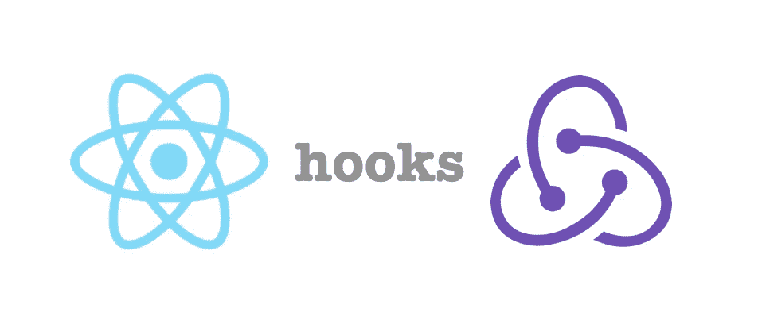
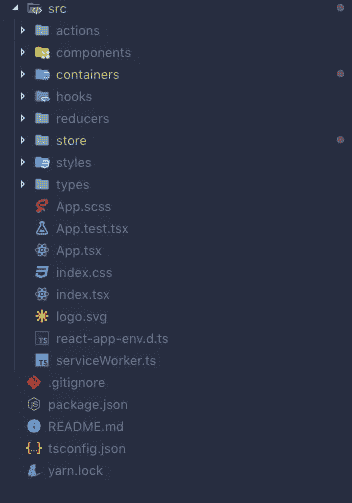
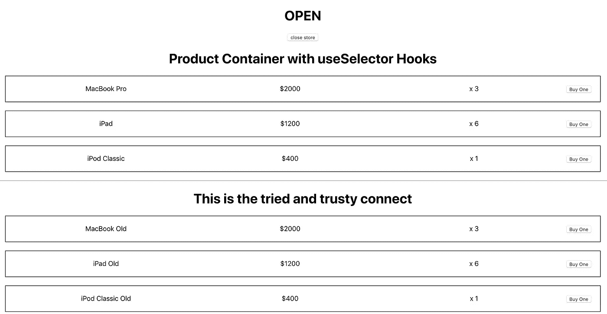
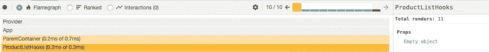
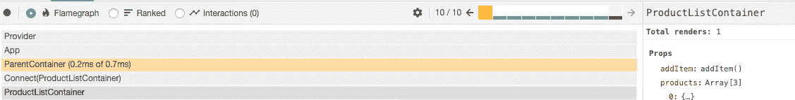
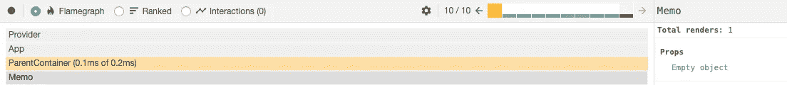
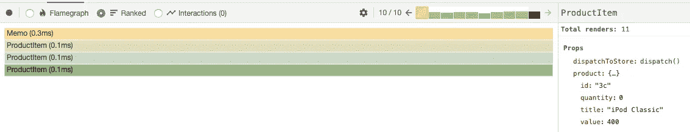
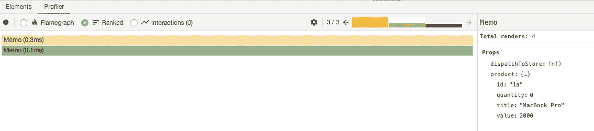

# Redux Connect 与新的 Redux 挂钩的比较。

> 原文：<https://itnext.io/how-existing-redux-patterns-compare-to-the-new-redux-hooks-b56134c650d2?source=collection_archive---------1----------------------->

Redux 钩子！

因此，自从 React 发布了他们的 hooks API 以来，这是一个热门的重新加载分钟，我认为公平地说，社区的大多数人都在玩新的 API。如果你还没有看过，我绝对推荐它，因为它们很棒。

随着钩子风靡一时，许多流行的库也加入进来，并发布了它们自己的钩子来替代它们当前的方法。一些值得注意的例子包括 mobX、react-spring、formik、final-form 等等。

Redux 可能是 React 最流行的状态管理库，也不例外。最近他们发布了新的 7.1.0 版本的 Hook API，作为`connect()`高阶组件(HOC)的替代，我很想尝试一下，看看有什么优缺点！

基本上，这些新的 API 允许您订阅 Redux 存储和调度操作，而不必将组件包装在`connect()`中

**这些新挂钩是:**

1.  使用选择器
2.  使用显示器
3.  使用商店

**在本文中，我们将构建:**

*   一辆购物车(因为这是前所未有的……)同时使用了传统的`connect` HOC 和新的 Redux 挂钩。
*   带有 Redux 挂钩的购物车和重新选择库的概要。

## **这篇文章的目的是向你展示:**

1.  React 组件连接到 redux 存储的传统方式。
2.  我们如何使用新的 redux 挂钩连接到 Redux 商店。
3.  使用这些钩子的好处和缺点。

## 可以在此处找到该存储库

[https://github.com/terencejeong/redux-hooks-api-play](https://github.com/terencejeong/redux-hooks-api-play)

请注意，本文并不是要说明哪种方法更好，而是要强调两者之间的区别，并帮助您更好地理解这些新钩子将如何工作。

# 项目设置

我使用 create-react-app 设置了项目，并启用了 typescript 标志。如果你不想在 typescript 中编码，你可以忽略这个标志。

`yarn create react-app my-store --typescript`

然后，我添加了以下库，因为它们是我们将重点关注的关键库。

`yarn i redux reselect`

# 文件结构

文件结构如下所示

# 设置 Redux 商店和产品减少器

现在让我们继续创建我们的 Redux 存储和产品 Redux。我假设读者会理解 Redux 是如何工作的，所以我就不赘述了。

> ***请不要纠结于这里的细节，我只是想让你知道我们的商店会是什么样子，以及我们的组件正在消耗的数据。***

在`store`文件夹中，我们将添加一个`index.ts`文件。

在`reducer`文件夹中，我们将添加 4 个文件。

1.  `index.ts`
2.  `products.ts`
3.  `productsOld.ts`
4.  `storeHours.ts`

`products.ts`文件将是我们的钩子产品列表组件的缩减器，而`productsOld.ts`文件将是我们的`connect`特设产品列表组件的缩减器。

index.ts

产品. ts

productsOld.ts

# 给我看看 Redux 钩子！！

快到了！我们首先需要创建我们的`ParentContainer.tsx`文件，它将呈现`ProductListHooks.tsx`文件和`ProductListContainer.tsx`文件。

我们的`ParentContainer.tsx`文件将只是简单地呈现 ProductList 钩子和 ProductListContainer 以及打开和关闭状态。

该网站目前看起来像这样。

一些真正坚实的 UX/用户界面工作在这里

现在`ProductListContainer.tsx`将使用`connect` HOC 连接到 Redux 商店。从下面的片段中可以看出，这里没有什么复杂的事情。我们只是从 redux 存储中给出组件状态，并访问 dispatch。该组件将从商店中获取产品，映射它们并将其传递给`ProductItem.tsx`组件，后者将呈现数据。

ProductListContainer.tsx

# Redux 钩子！！

现在让我们展示一下如果使用新的 Redux 挂钩，上面的组件会是什么样子。

哦，那有点不同，不是吗！在上面的文件中，我们可以看到我们有两个新的钩子叫做`useSelector`和`useDispatch`。

但是在我谈论它们之前，你可以看到这个组件和之前的`ProductListContainer.tsx`组件非常相似。它只是从商店里拿走产品，对它们进行映射，并将其与`dispatch`一起传递给`ProductItem.tsx`。

现在有趣的事情，让我们打破两个新的钩子，好吗？

# 使用选择器

这个钩子允许我们使用选择器函数从 Redux 存储状态中提取数据。选择器函数将使用整个 Redux 存储状态作为其唯一的参数来调用，并且必须返回组件所使用的状态的相关部分。

在上面的代码片段中，我们可以看到它从商店返回产品数组。

现在，尽管它做的工作与 mapStateToProps 相同，但我们必须考虑一些关键的区别。

1.  选择器可以返回 ***任何值*** 作为结果，而不仅仅是一个对象。
2.  当一个动作被分派时，`useSelector`钩子将做一个引用检查，并比较先前的值和当前的结果值。如果它们不同，组件将被强制重新渲染。如果它们相同，组件将不会重新呈现。

现在，我真的想讨论第二点，因为这是`connect`和`useSelector`最大的区别。在 Redux 中，`connect`对 mapState 调用的结果使用浅层相等检查来确定是否需要重新渲染。然而，`useSelector`使用了一个严格的`===`引用，这对于我们应该如何实现`useSelector`有几个影响。

## **但这实际上意味着什么呢？！**

让我们仔细看看负责渲染`ProductListHooks`和`ProductListContainer`的`ParentContainer.tsx`文件。您可以看到`ParentContainer`还通过向商店发送一个动作来显示商店是开门还是关门。

使用 devtools 中的 awesome React Profiler，我们可以看到如果我们点击按钮很多次，会重新呈现什么。

ProductListHooks 的渲染总数

ProductListContainer 的渲染总数

如您所见，这是一个巨大的差异！该按钮被点击 10 次，ProductListHooks 总共重新渲染了 **11 次**，而使用`connect`的 ProductListContainer 只渲染了**一次！**

与`connect`不同的是，`useSelector()`钩子不会因为其父组件的重新渲染而阻止组件的重新渲染，即使组件的属性没有改变。

使用`mapState`，所有单个字段在一个组合对象中返回。返回的对象是否是新的引用并不重要- `connect()`只是比较了单个字段。使用`useSelector()`，每次返回一个新的对象，默认情况下*总是*强制重新渲染。

## 我们如何解决这个问题？

嗯，这种情况下最简单的解决方案是将 ProductListHooks 组件包装在`React.memo`中。如果道具没有改变，这允许功能组件在渲染时退出。这很像一个`PureComponent`或`shouldComponentUpdate`。

所以让我们看看如果我们使用`React.memo`，我们的`ProductListHooks.tsx`组件会是什么样子。

那很简单！而现在看看结果，那只是**一人总**的渲染。

另一种方式是`useSelector`也接受第二个参数，作为一个等式函数。如果等式函数返回 false，组件将被强制重新呈现，否则组件将不会重新呈现。我仍在努力解决这个问题，一旦我觉得有了更具体的例子，我会重新调整这个帖子。

# 使用显示器

现在这个钩子简单地从 Redux store 返回一个对 **dispatch** 函数的*引用*,用于根据需要分派动作。现在，这里有一些需要注意的非常重要的问题。

如果您查看`ProductListHooks.tsx`组件，您可以看到我们正在将`dispatch`传递给子`ProductItem`组件。让我们仔细看看`ProductItem`组件。

现在让我们看看，如果我们只为其中一件商品点击“购买一件”按钮，React Profiler 会发生什么。

为 ProductItem 呈现

您可以看到，该组件不仅重新呈现了所选项目的 ProductItem 组件，还重新呈现了所有 ProductItems 组件，即使该项目未被选中。

## 那我们该怎么办？我们不想重新渲染所有的东西:(

不幸的是，每当您想要触发一个动作作为对用户事件的响应时，您就必须创建一个匿名函数，例如:`() => dispatch({type: x, payload: y})`。为什么这很重要？因为由于匿名函数的性质，每次重新呈现时，都会创建一个对该函数的新引用。

当使用`dispatch`将回调传递给子组件时，建议使用`useCallback`将其记忆，否则子组件将永远无法受益于`shouldComponentUpdate`、`memo`、`PureComponent`等渲染退出技术。

为了实现这一点，您必须使函数具有相同的引用，这在 hooks 世界中转化为将整个匿名函数包装在一个`useCallback()`中。

我们的 ProductListHooks 容器现在看起来类似于下面的代码片段。您可以看到我们已经将调度功能包装在一个`useCallback` 钩子中。

`useCallback`钩子将返回回调的记忆化版本，只有当其中一个依赖关系改变时，这个版本才会改变，在这种情况下是调度。

我们现在可以利用渲染救助技术`memo`。查看我们现在得到的 ProductItem 组件

现在让我们看看 React 分析器向我们展示了什么。

好多了！

是不是很可爱，是不是很精彩！MacBook Pro 是唯一被重新渲染的产品，因为它是唯一被选中的产品。

最后，我更希望有一个自定义的 useDispatch 挂钩，可以在整个应用程序中轻松重用。在`hooks`文件夹中，我将创建一个名为`useDispatchToStore`的自定义钩子。

useDispatchToStore 只是一个 curried 函数，它将接受一个动作类型并返回一个函数，该函数将接受有效负载并将其分派给商店。

我们的`ProductListHooks`组件现在看起来像下面的代码片段。如你所见，唯一的区别是在 useCallback 中，我们将依赖项作为一个动作类型，而不是调度函数。

总之，使用`useDispatch`钩子你应该遵循以下规则

1.  如果将分派传递给子进程，请将其包装在 useCallback 中。
2.  记忆子组件。

# 使用 Redux 挂钩的利弊

## **专业版**

*   我们的组件层次结构中不再有如此少的节点。
*   可以将我们的选择器抽象为更健壮和可重用的代码。
*   某种意义上更具可读性。

**骗局**

*   你失去了很多`connect()`提供的**自动**参照缓存。
*   您无法访问`mapStateToProps`中的`ownProps`。要获得 ownProps 对象，您需要编写自己的逻辑/钩子。

# 那么我应该开始使用 Redux 挂钩吗？

嗯…那得看情况。当您远离`connect`时，您会失去它提供的许多性能优势。这意味着在考虑重新渲染和传递来自智能和非智能组件的数据时，您必须更加谨慎。目前我不认为我会离开`connect`，但和它一起玩肯定很有趣。

我的建议是，当你开始使用这些钩子时，总是问自己:

*   这比使用当前的方法更好吗？
*   使用这些挂钩，我失去/得到了什么

永远记住，这些钩子只是当前方法的一种替代。你可以用 HOC 或者渲染道具写的任何东西也可以用钩子写，反之亦然。

# 感谢阅读！如果你喜欢这篇文章，请随意点击几下那个按钮(👏👏👏👏)帮别人找。

## 可以在此处找到该存储库

[https://github.com/terencejeong/redux-hooks-api-play](https://github.com/terencejeong/redux-hooks-api-play)

## 如果有足够的需求，我将使用这些 redux 挂钩和类似 reselect 的内存化库来编写第 2 部分:)

## 另外，如果你喜欢你所读的，可以随意看看我的另一篇关于如何从重新组合移植到反应钩子的文章[这里](https://medium.com/stationfive/how-to-migrate-from-recompose-to-react-hooks-89b2981c03d)