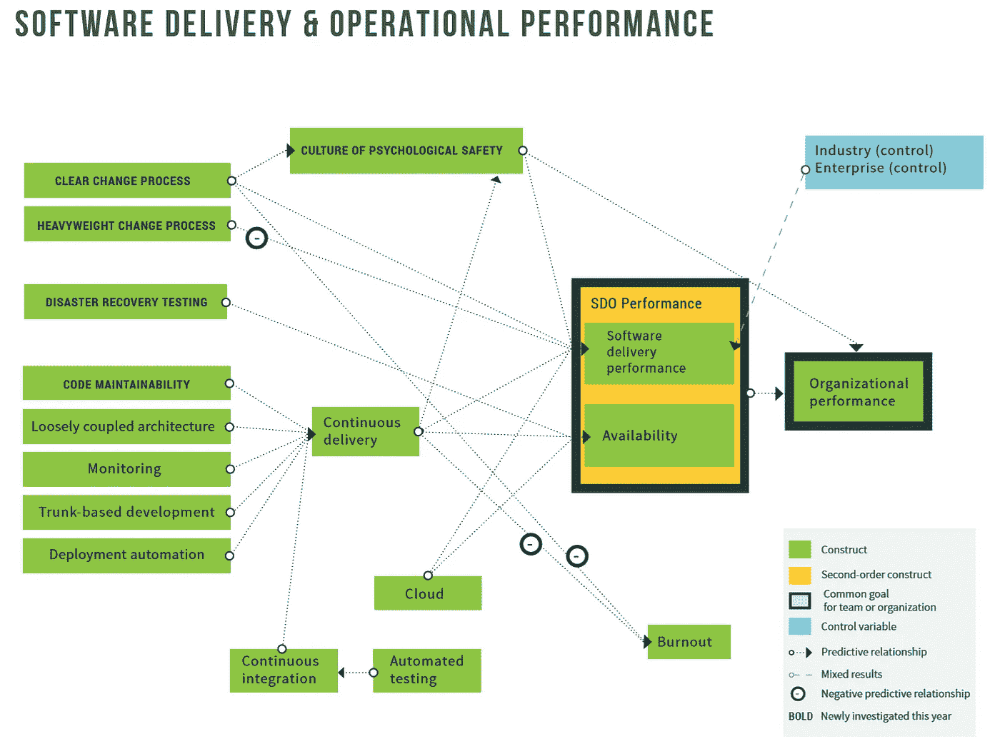

# 特性分支和拉请求如何与最佳实践相违背

> 原文：<https://itnext.io/how-feature-branches-and-pull-requests-work-against-best-practice-a13a85a016ef?source=collection_archive---------1----------------------->

这篇文章是一系列文章的一部分，这些文章与软件开发行业在采用研究成果时遇到的困难有关。你可以阅读文章中的介绍:[对 Dev-Fu 和过程清教主义的执念](https://medium.com/@mortensensc/the-obsession-with-dev-fu-and-process-puritanism-5b00676f3e24)来获得一点脉络。

在第一篇深度文章中，我描述了一个软件开发过程[，为持续集成和工作流](https://medium.com/@mortensensc/optimizing-the-software-development-for-continuous-integration-and-flow-of-work-56cf614b3f59)进行优化。

在这篇文章中，我将深入探讨为什么普遍和广泛采用的实践实际上与我们从 DevOps 和 Accelerate 的研究结果中所了解的背道而驰。更具体地说，我将研究特性分支、拉请求和聚合库。

# 研究成果

在 2016 年 DevOps 报告中，您可以阅读:

> “我们发现，在被合并到主干之前具有非常短的生命周期(不到一天)的分支或分叉，以及总共少于三个活动分支，是连续交付的重要方面，并且都有助于更高的性能。每天将代码合并到主干或主数据库中也是如此。”

在[的后期作品](https://puppet.com/resources/report/state-of-devops-report/)中，这一发现被反复验证，比以往任何时候都更有说服力。似乎没有什么歧义。

基于主干的开发(TBD)和持续集成提高了软件交付的性能。

第 31 页，来自 DevOps 2019 加速状态

这不仅仅是一个积极的影响，这是对监控、部署自动化和代码可维护性的影响。

除非分支保持在最低限度并且非常短暂，否则软件交付性能的一些改进仍然是无法实现的。

先说清楚。DevOps 状态中显示的交付性能改进并不小…它们是两位数的改进乘数。

根据经验，您拥有的分支越多，它们存在的时间越长，这些软件交付性能的改进就越难以实现。最有可能的是，软件交付性能实际上受到了阻碍。

尽管如此，我还是一次又一次地看到，人们看待“完整”功能分支、Git-flow 等。与作为行业中事实上的标准的拉请求相结合。挑战它会让人觉得你是个异教徒、十足的白痴或者根本不是专业开发人员。

# 您对功能分支和拉请求有什么问题？

我的主要目标是专业开发团队，而不是志愿者驱动的开源项目。也就是说，在这样一个环境中，我们了解我们的贡献者，并且信任他们。或者，如果人们背叛了信任，可以采取制裁措施。这改变了与是否使用特征分支以及是否使用严格的拉请求策略相关的决策的一些变量的权重。其他团队对代码库的贡献也可能会影响这些变量，但是我将在下文中忽略这一点。

我通常发现使用分支是默认的。建议直接提交给 master，或者将半成品(特性切换)特性放入 master，通常被认为是你不能做的事情。还是很业余的。而暗示它的唯一理由一定是因为太弱的饭桶傅。

# 餐饮与公共关系部的 TBD

写这篇文章时，我最初将 TBD 等同于直接提交给 master，分支和拉请求基本上是不允许的。在与不同的人讨论后，我发现一些团队使用特性分支和拉请求进行 TBD，[Trunkbaseddevelopment.com](https://trunkbaseddevelopment.com/short-lived-feature-branches/)也描述了短暂的特性分支。由于我无法重新定义 TBD，所以我选择了定义 TBD 的一个具体变体，即 TBD·w·非阻断审查(NBR)，因为在我看来，这最准确地突出了我想要深入研究的差异。

我对特性分支和拉请求的主要问题是它们的寿命。或者拉请求在长时间得不到处理的情况下积灰。而这里的太长是以几天来衡量的。如果你的回答是:“我们只有/大部分是短命的分支”，我会说这太棒了。但我认为你也应该试着提供一些这方面的统计数据。例如，如何计算桶中有多少分支具有生存期(create branch => PR-done ):

*   不到 1 小时
*   不到 3 小时
*   不到 8 小时
*   不到 2 天
*   不到 4 天
*   超过 4 天。

看看存活时间超过一天的树枝的分布和数量。

我试图找到获得这些统计数据的工具或方法。但最终空手而归。( [*不，我不是在寻找众多工具中的一个来告诉谁犯了多少和多少行*](https://www.reddit.com/r/git/comments/g8ft8x/is_there_a_tool_for_getting_statistics_for_git/) *)。*

事实上，持续集成的工具或统计数据要么不存在，要么至少不广为人知，这表明我们作为一个专业人员没有认真对待 DevOps 状态的发现。

所有团队都应该有现成的统计数据:

*   分支金额
*   分支生命周期
*   差异(不推送本地提交时，TBD 仍会出现这种情况)
*   合并手动处理的冲突

以及代码持续集成的类似指标。

我正在开发一个工具，通过检查 git-commits 和 ancestry 来产生和显示这些统计数据——但是如果你知道一个提供提到的数据的好工具，请告诉我😊

这种工具不存在或没有被广泛采用的事实，不仅仅表明我们没有遵循研究结果。这表明我们的工业远不是数据或知识驱动的。

但是，如果您能够创建上述统计数据，并发现您与 master 的集成非常快，那么我会鼓励您尝试完全投入并直接向 master 提交。最好是 NBR——阅读 TBD·w·NBR 文章中的相关内容。在那篇文章中，我还概述了分支和拉请求可能是正确方法的一些情况。

考虑先观察你希望从拉取请求中得到什么。然后弄清楚如何在直接提交给主机的过程中保持这一点。可能只有一些变更实际上与评审相关，这可以通过人与人的评审或类似的方式来完成。但是要想清楚自己想要保留什么，如何用非阻塞的方式实现。

然后试试看。如果它不工作(给它一些时间)，想想你是否能修复它。

作为最后的手段，回去…但是如果你这样做了，我想你会突然发现这个过程乏味而且充满摩擦。

> 只有会动的人才会发现自己的锁链

在使用过短期或长期的特性分支，并尝试过“提交给主”TBD 之后，我非常倾向于后者。

当我再次与分支机构一起工作时，我经常感到在分支机构工作是“安全的”，但在集成时却不安全。我也开始感觉到即将到来的合并乌云正在聚集。

这种不安我在做 TBD·w·NBR 时没有感觉到。然而，在做 TBD·w·NBR 的时候，我也感到有点焦虑，因为我知道我的东西会直接提供给其他人并进行测试。我总是“把手放在铁架上”。这激励/推动人们始终保持代码工作，并以小的安全增量进行变更。

以更小的批量工作，引入增量的可改变的变化和类似的方法极大地降低了整体的压力水平。这还不包括食品与饮料行业的“合并混乱”。

## 限制生产力

Jon Arild trresdal 写了一篇关于特性分支的有趣(也具有挑衅性)的文章:*[*如果你仍然坚持特性分支，你正在伤害你的业务和我们的职业*](https://mrdevops.io/if-you-still-insist-on-feature-branching-you-are-hurting-your-business-and-our-profession-32e1109d4594)*

**他概述了我们使用特征分支给自己制造的各种问题。这些基本上可以归类为，对于软件交付性能，它们阻碍或阻止了哪些最佳实践:**

**1.尽快、经常、小批量交货。消除瓶颈、堵塞和延迟的东西。
3。心理安全
4。接近所提供的值**

**(我已经在[这篇文章](https://medium.com/@mortensensc/value-driven-technical-decisions-in-software-development-c6736f74167)中深入探讨了这些最佳实践)**

**我可能不会附和乔恩·阿里德·托里斯达尔的严厉措辞。我希望保持讨论的建设性，并把重点放在努力实现什么和什么是有价值的。在某些情况下，评估这些可以得出关于使用特征分支的正确结论。尽管我认为这是个例外。**

**我认为上述目标在行业内已经得到了广泛的认同，所以讨论的基本上是如何最好地实现它。**

**在我看来，功能分支和拉式请求将人们推向更大批量的工作，延迟了交付并导致后来的反馈。不管是 TBD w. FB&PR，Gitflow 还是长住特色分店。本质上，特性分支和拉请求会带来固有的、不可避免的冲突。**

**他们反对持续集成，并且经常创建阻塞的工作流，或者要求人们被打断以避免阻塞，导致过程中的上下文切换。后者降低了生产率和质量。我也看到在分支中完成的工作，一般来说，对非编码人员的打击比期望的和通过其他方法可能达到的要晚得多。**

**还有一些其他的问题，例如对 WIP 数量的影响——但是我主要关心的是已经提到的影响。**

**总的来说，我看到很多人远离了上面列表中的第一和第二条。**

**另一方面，我看到 TBD·w·NBR 鼓励人们进行更小幅度的改变，典型的是以一种可折叠的方式。它通过降低早期审查、测试和他人使用之前的成本和延迟来促进早期反馈。它通过让你的工作不断地与其他人的工作集成，并在测试环境中尽可能快地运行来做到这一点。**

**(*原则上，早期评审也可以用于早期创建的拉动式请求，但是我还没有看到广泛使用)。**

**需要明确的是，这些大部分都可以在 TBD w. FB&PRs 中实现。但是由于 TBD 与 FB & PRs 和 TBD 与 NBR*的推动效应和结构，这种差异相当于游向上游或下游。(*TBD·w·NBR*在这里是顺流而下——只是澄清一下)。长寿特征分支基本上是沿着瀑布向上游…***

**

*让我们试着研究一下特性分支和拉请求是如何违背前面提到的最佳实践的。*

## *1.快速交货，经常是小批量交货*

*这个实践是关于精益工作和工作流程的。它旨在确保快速反馈，以便您可以快速纠正并改进您的解决方案或产品。它还减少了浪费或错误工作的数量。*

**

*特征分支在几个方面与此相反。*

*在 TBD，您可以将代码提交给 master，它可以立即部署到测试环境中(与所有其他最近完成的工作集成在一起)。*

*使用分支不仅不会将“逐个提交”合并到主服务器，还会阻止带有拉请求的合并，从而延迟了这一过程。(我知道建立一个“每个分支”的测试环境是可能的。但是我们不要让讨论沿着这条路走下去……)*

*请注意，我关注的是尽快交付给“主人”和测试环境，因为与 FB&PR 相比，这是影响更大的地方。在此之后，确保代码“准备好发布”。*

## *2.消除瓶颈、堵塞和延迟的东西*

*我一次又一次经历的一件事是，当一个团队真正开始振作起来并执行时，分支和拉动请求将开始绊倒他们。*

**

*保罗·卡萨尔斯在 [Unsplash](https://unsplash.com?utm_source=medium&utm_medium=referral) 上的照片*

*轻摇树枝和拉请求变得笨重和笨拙。试图保持分支时间短和变化小，将导致更多与拉请求协调和中断相关的问题。在某些时候，停止竞走，开始跑步。*

**

## *3.心理安全*

*心理安全的好处是，除了幸福感和其他好的效果，人们可以互相挑战。强大和强化的权力结构往往会与此背道而驰。*

*我见过很多次带有所需批准人的拉式请求，以及类似的强化或强调官方或隐含层级的情况。它有可能引入一种权力游戏的战场。这种情况在其他类型的审查中仍然会发生，但是在我看来，在非阻塞审查中不那么普遍。*

*然而，心理安全在 TBD w. NBR 和 FB&PR 之间的差异并不像第一和第二个案例那样大。*

*也就是说，TBD 提高了开发人员的福利，这可以在 DevOps 手册中看到:*

> *基于主干的开发预示着更高的吞吐量和更好的稳定性**，甚至更高的工作满意度和更低的倦怠率**。*

## *4.接近所提供的值*

*当人们在分支机构(自己)工作时，他们冒着欺骗自己的风险，没有从团队成员、业务人员、用户或股东那里获得非常重要的早期反馈。通常是因为他们“需要在集成和测试之前完成特性”。*

# *但是……？*

*我读了很多关于 TBD 的文章和讨论，包括分支和拉请求，单一和多重回购。我也看到这些评论很快变得多么情绪化和令人不快。(对于这件作品，我有点担心……)*

*我会尽量主动一点，解决一些意料之中的反对意见和异议。*

## *拉请求的论据和其中的谬误*

*Pull 请求在 Git(Hub？)，没有分支就不可能创建拉请求。但是，请注意，可以多次关闭和重新打开分支，因此可以一次合并几个特性的提交，以减少特性分支和拉请求的一些负面影响。然而，我很少看到它是如何使用的。它还需要围绕拉取请求进行一些适时的重新调整和协调。*

*以下是我在对各种文章和相关讨论的“调查”中看到的一些陈述。*

> *拉请求确保我们所有的代码都被审查(PRs 是实现这一点的唯一方法)。*

****谬误:****

*这实际上并不正确，原因有几个。要求拉取请求使批准者可以“选择加入”审查代码，并“负责”该代码的合并。通常，当一个公关项目很大时，我们会敬畏地浏览一下，不会深入了解，但通常会相信它是可行的，并且经过了测试。然后按下 approve(可能带有一些关于风格的学究气的评论)。或者，这种行为可能成为分析瘫痪的一种变体，我们很难关闭拉取请求。
如果这是一个小的公关，我们浏览并按下批准。(也许再加上几句关于风格的迂腐评论)
不管你复习的“多好”，都没有什么是“逼着我们复习”的。只有通过签署来承担责任。*

****CI 启用/非阻塞替代:****

*还有其他几种方法可以实现代码审查。(和上面一样的谬误/缺点:-)
按照人遵循的流程就可以做到。例如，在票证关闭之前，作为票证系统流程的一部分进行审查，但可能是在将代码推送到主机之后。提交中的票证编号，以确保轻松访问相关更改。*

*诸如 Upsource 之类的工具使您能够为一个或多个审阅者创建一个审阅，并且还可以基于提交消息中的票据编号将多个提交关联到一个审阅中。这使得能够记录变更的“签署”,并且通过流程或 CI/CD 集成，可以确保在对提交进行审查之前，不会将提交部署到生产中。*

*我们不一定需要在提交进入 QA 或演示环境之前对其进行审查。但这可能是一个要求(例如，法规)，即在代码投入生产之前发生。*

*我实际上喜欢“每次提交”审查(如果认为相关的话，最后可能会进行完整的功能审查),因为它讲述了完整的故事，实现了早期反馈和过程修正。此外，它还提供了关于其他人正在做什么的意识。后者减少了相互绊倒的风险，并增加了向他人提供反馈和建议的机会。最后一个好处也可以通过早期创建的拉请求来实现。*

> *拉式请求确保我们审查整个功能(这只能由 PR 完成)*

****谬误:****

*实际上这里有一些谬误。*

*复习可以在多个层面上进行。代码、任务、特性、架构等。其中一些需要不同的信息。并非所有级别都适用于所有功能。例如，一些评审要求您运行代码，并查看它如何在 UI 或集成端点中工作。*

****CI-enabled/non-blocking 替代:****

*基本上与对“所有代码”的审查相同。*

*NBR——工具或过程提供了创建“特性”评审并在开发过程中维护它的能力。包括所有的讨论。*

> *我们需要在合并前检查代码，这样就不会破坏主代码*

****谬误:****

*这里又有几个谬误。*

*假设评论实际上阻碍了师父突破。尽管有 PRs(甚至有彻底的审查和单元测试)，我还是经常看到这种情况发生。*

*还假设来自 PR 的“阻塞和延迟”不会导致比通过立即合并提交(或直接提交给 master)的情况更多的冲突和破坏 master(或质量降低)。*

*我还发现，当一个特性分支中断主服务器时，与主服务器在直接提交给主服务器时中断的情况相比，主服务器通常会有更长的“中断”时间和更长的平均恢复时间(MTTR)。
最后，假设破坏主控不仅是一个可避免的问题，而且是一个值得避免的问题——而不是在发生时简单地处理它。*

*这里精益原则和 [Andon Cord](https://en.wikipedia.org/wiki/Andon_(manufacturing)) 跃入脑海。当然，我们希望 master 尽可能接近可部署状态——但是如果有人正在构建某个东西，而破坏了其他东西，我们希望尽快知道——并拔掉 Andon 线。*

****CI 启用/非阻塞替代:****

*让主人休息。发生问题时迅速解决。*

*区分成分，所以不是“什么都破”或者“什么都没破”。*

> *将两个分支合并到 master 不会在“它们之间”引入错误*

****谬误:****

*假设当不同的开发人员(或相同的开发人员)在不同的分支工作时，他们不会通过复合变更引入只有在所有东西都被集成后才会出现的错误。这种假设是不安全的。*

****替代品:****

*将所有分支合并到你的分支中，以避免它们之间的错误。(不可行，如果每个人都这样工作，就不会有效果)。*

*短命分支或 CI。如果你有非常短命的分支，为什么要使用分支呢？*

> *每个人都与主干保持同步——因此代码不会分叉，也不会出现冲突*

****谬误:****

*如果人们不合并到 master(这会破坏他们的 pull 请求)，那么从那里取什么呢？*

****备选:****

*TBD(美国)*

> *特性分支允许我们控制哪些特性进入一个版本*

*我之前引用了丹·博达特的话，我认为这句话完美地解决了这个问题。特征分支不应用作特征切换。*

*有许多其他更好的方法来控制什么可以发布，什么不可以。(#功能切换)*

*任何尝试过使用特性分支进行“特性切换”的人都知道，在特性被合并到主特性之后，与“切换”这样的特性相关的痛苦(+风险+延迟+眼泪)。例如，当发现问题本身或依赖性或完全不可预见的事情时。有时可能会在事后引入特性切换，但大多数情况下这是非常困难的，如果没有从一开始就以“切换能力”的心态来构建变更的话。没有它，系统通常不会被测试。*

*如果你使用特征分支(嗯，不是真的:-P)很公平，但是**不要**使用它们作为特征切换。*

*但是和其他事情一样，这里也有例外。这是应用于分支的经典“80/20”法则。(尽管更像是“95/5”*

## *反对 TBD(和 NBR)的论点*

*在关于 TBD 或 FB&PR 的讨论中，给出了为什么 TBD 和 NBR 不可行的许多原因。DevOps 和 Accelerate 的状态告诉我们，这是完全不正确的。它不仅可行，还能提高性能。但是让我们来看看一些论点。*

> *主人会不断地被打破，每个人都被封锁*

*根据我的经验，情况并非如此。然而，如果你的主人经常被打破，如果你放弃特征分支，直接提交给主人，那么我会认为你已经有大问题了。它们只是对你隐藏起来。*

*如果您允许您的在制品“不起作用”(并且不可切换)，那么您正在进行比您应该做的更大的批量工作。你这样做是不安全的。*

*另外“主人坏了”是什么意思？这是否意味着 10.000 个单元测试中有一个失败了？是不是什么都没有建立？它是一个不构建的单一服务吗？或者是某个特性在你使用它的时候抛出了一个异常？*

*根据以上问题的回答，“破碎”可能是完全可以接受的。比其他选择更可取。实际上，尽可能早地发现某个东西坏了是可取的。并让其他所有人都接触到这种变化，会增加触发或发现这种变化的机会。如果你有一个半实现的特性，也就是在生产中关闭的特性，但是在本地或测试中可用，那也不应该被认为是坏的。*

*那么在这个论点中，破碎是什么意思呢？团队规模是多少？而什么是 [MTTR](https://en.wikipedia.org/wiki/Mean_time_to_recovery) 的主人呢？这是否是一种权衡，即有时被破坏(不管这意味着什么)是由及早发现(并修复)故障的优势来衡量的？此外，错过了早期的反馈？*

*无论是小型服务(在 poly 或 mono 回购中)还是更大的模块化整体，很少会“一切都坏了”。它通常是功能的一个子集，不能正常工作，测试失败或者一些依赖关系被破坏。所有这些并不等同于“每个人都被阻止”工作。*

*通过测试(手动或自动)、审查或其他使用它的人来发现它并快速修复它，这是至关重要的。在我看来，TBD·w·NBR 最能促进这一点。*

> *它不会扩展到超过一两个团队*

*这个论点基本上被 DevOps 的 Accelerate 和 State 报告证明是站不住脚的。但是让我们试着用它来运行:*

> *“如果你有 50-100 名开发人员致力于同一个代码库/应用程序/系统，那么做 TBD·w·NBR 会导致混乱，一切都会失控。特性分支和拉取请求给这种潜在的混乱带来了秩序。”*

*有些人可能会认为，功能必须在分支机构中“完成”，因此 TBD w. FB&PR 也可能被视为“引发混乱”。*

*我对这些陈述有一些问题。首先，50-100 名开发人员在做同一件事听起来很做作，或者至少是一个问题，他们有比基于分支策略的解决方案更好的替代解决方案。*

*有些人可能会很快说微服务，每个人都有自己的回购，但我认为这往往会引入一个全新的问题和复杂性的潘多拉盒子。在我的另一篇文章中，我出于多种原因支持庞大的回购，所以让我们尽量不要将微服务和聚合/纳米回购作为所述问题解决方案的一部分。*

*如果实际上有 100 名开发人员在同一个工作日将代码推送到同一个存储库。假设他们平均每天推送代码 2-5 次。也就是每天 500 次推送，每次平均花费 5-10 秒。*

*如果我们将它们完美地排列起来，每天将会增加 20-80 分钟的“积极推动”。因此，在一个 8 小时的工作日中，有足够的时间来满足这些需求。关于推和被告知先拉，这可以作为宏的一部分或手动完成。*

*如果人们没有在相同的代码上工作，那么“拉&推”不应该产生问题。至少没有问题，否则如果使用分支+拉请求就不会成为大问题。*

*可以根据服务变更的目的来分配审查，因此审查者可以是相关的(并不是所有人都需要能够审查所有人)。基本上类似于您对拉请求所做的。*

*所以总而言之，我认为这更多的是膝跳反应反论点，而不是基于实际经验或数据。*

*但我希望看到计算或研究表明 TBD 总体上不可扩展。并且对于遇到的问题的最佳解决方案(就像上面提到的)是使用分支和拉请求。*

# *单、大、多和纳米——回购的类型*

*关于单/大回购与多/纳米回购的讨论，也是一个可以让情绪高涨的话题…*

*因此，让我们进入其中的几个，因为我显然也决定把手伸向那个黄蜂的巢…*

*许多关于团队绩效的资源提到了存储库边界，作为加强团队边界和确保团队分离的一种手段。在我看来，有许多方法可以诱导这一点，不需要特定的存储库策略。然而，即使你把它理解为一个需求，它仍然可能是一个 5-15 人团队的“单一”回购。可能还有多个团队。在这和每个图书馆或服务的回购之间有很大的空间。*

*我更喜欢所需的大存储库。我不争取小仓库。这是因为许多不同的原因，我已经在[“姐妹文章”](https://medium.com/@mortensensc/optimizing-the-software-development-for-continuous-integration-and-flow-of-work-56cf614b3f59)中详细概述了。*

*但是，让我们来讨论一下让存储库变小的理由。*

> *在 Poly Repo 中，您可以获得更简单的 Git 历史。(与 monorepo 相比)*

*这似乎是真的，除非你仔细想想。*

*许多 GIT 工具都有按照路径或消息过滤提交的能力。从几个不同的存储库中汇总历史记录的情况不太常见。(有办法，但是需要你知道要聚合哪些回购)。*

*为什么我要提出后者呢？因为如果你有一个跨多个组件的特性，并且每个组件都在不同的存储库中，那么提交原子的横切变更是不可能的。并且当特定行被更改时，访问其他组件中的更改也是不可能的。*

*这使你失去了关于源历史的一个伟大的东西，即以某种方式完成的隐含文档。即*

> *所以当这一行被更改时，在提交中还有什么被更改。*

*聚集的历史使得导航和理解代码变得更加容易，并且当你需要引入一个变化时，使用“模式匹配”。如果你的答案是“一个 API 的改变和它的使用，应该分阶段发生”(API 提供首先在请求中添加属性。在这之后，更新的 API 字段被“客户端”使用)，那么你们基本上是在争论应该一起改变的东西，不应该。并在延迟上市时间的过程中得到解决。接手多个代码库，丰富的 git 历史，是你真正学会欣赏的东西。当你戴上侦探的帽子，需要理解与代码的特定部分相关的进化、依赖或原因时，丰富、详细的 git 历史会带来好处。*

*当然，令人担忧的是，在 monorepos 中，人们开始创造跨越许多服务的大的跨领域变化。我认为在 poly repo 中工作也是如此，它通常更隐蔽，本地集成测试更容易出错。但当然，有人担心有些人会做出太大的改变，但在我看来，单一回购的优势超过了这种风险，而“大批量工作”的风险可以通过许多比聚回购更有效的手段来应对。*

> *您可以使用 Poly Repo 独立部署。(暗示:您不能使用 monorepo)*

*您可以将许多不同的构建、工件和部署连接到同一个 monorepo。您可以添加路径过滤器和许多其他东西来关注您的管道。基本上重点就是 [Monorepo！=独石](https://blog.nrwl.io/misconceptions-about-monorepos-monorepo-monolith-df1250d4b03c)。*

> *您不能进行粒度访问控制*

*我没有尝试在 monorepo 中提供粒度级的访问控制。如果一些开发人员(例如顾问)需要非常有限的访问权限，可以通过将他们需要访问的部分放到自己的存储库中来实现。这可以根据具体的场景以不同的方式来解决。*

*不过看起来，也有[其他的方式。](https://blog.nrwl.io/misconceptions-about-monorepos-monorepo-monolith-df1250d4b03c)*

> *肥胖的人会长得太大*

*我自己没见过这个。但我能想象这可能会发生。或者至少，处理它所需的工具可能会超过好处。*

*在我看来，这里的答案不会是完全的多元回购(一种服务一种回购)。这可能是有一些肥胖的回复。*

*在所有情况下，从一开始就把这个潜在的未来问题作为做“纳米回购”的理由，在我看来是一个糟糕的推理和错误的决定。即预先获取开销，而不是在必要时获取。*

# *特色分支和拉动式请求的诱人力量以及对 TBD 的恐惧反应*

*我们**有**研究表明 TBD 实际上提高了软件交付的性能。而且上面的谬误也不是很难发现或理解。*

*我还没有发现任何研究表明使用特性分支和拉取请求比使用或不使用 NBR 的直接提交给主 TBD 有优势。***

*那么，为什么人们仍然认为使用特性分支(生命周期可变)和阻塞拉请求是最佳实践呢？*

*是因为感觉应该管用吗？同样的方式瀑布-与彻底的分析和设计提前应该？*

*是因为分支隔离是局部优化吗？这些对个人来说总是感觉很棒。但我们应该以团队和组织优化为目标。*

*我认为在使用特性分支时，会发生某种形式的“分块”工作。即{打开分支-工作-完成-审核-关闭} = >完成完成。
对很多人来说，这种“工作单元”的工作方式和他们所做的改变是有意义的。*

*我想，但这可能只是我的一种偏见，那部分诱惑的力量来自于一种“我们应该”的想法。例如，GitHub 支持它，有 Gitflow,“所有酷的程序员”都使用它(在他们的开源项目中)。所以我们也应该。但是如前所述，与公司或类似的环境相比，开源项目有一组不同的与信任相关的变量。*

*还有一点等级维护和仪式，对一些人来说感觉很好，有一种控制感和安全感。都是“让比我更有经验的人来看我的变化”。而且“我让年轻人不犯错误，不绊倒我们”。每个人都感到安全，因为年长者阻止幼徒开枪打任何人，包括他们自己的脚。尽管事实上这可能会适得其反。*

*利用 devo PS State 和类似物提供的数据，我们应该设计出实现无阻塞和小批量工作流的方法，以确保我们获得尽可能多的价值和交付性能。*

*我们必须恰当地处理规则的异常和例外——而不是让它们遮蔽、定义和阻碍我们的整个过程。我们不应该让更大的复杂性成为共同点。*

*我期待着一次愉快而富有建设性的讨论。*

*我目前非常支持功能切换支持 TBD w. NBR 和连续部署测试。但是我从痛苦的经历中知道，我可能是错误的。我可以学到新的东西。也许一年后我会写我在这篇文章中犯了多么大的错误。但目前我不指望。*

*(**欢迎你把这看作是坎宁安定律的一个版本:*“在互联网上获得正确答案的最好方法是不要问一个问题；就是贴错答案。”*。我将更新文章与任何研究或类似的链接(与我的回应)，如果提供的话。)*

*如果您还没有，您可以阅读本系列的另外两篇文章:*

*[对 Dev-Fu 和过程清教主义的痴迷](https://medium.com/@mortensensc/the-obsession-with-dev-fu-and-process-puritanism-5b00676f3e24)*

*和*

*[优化持续集成和工作流程](https://medium.com/@mortensensc/optimizing-the-software-development-for-continuous-integration-and-flow-of-work-56cf614b3f59)*