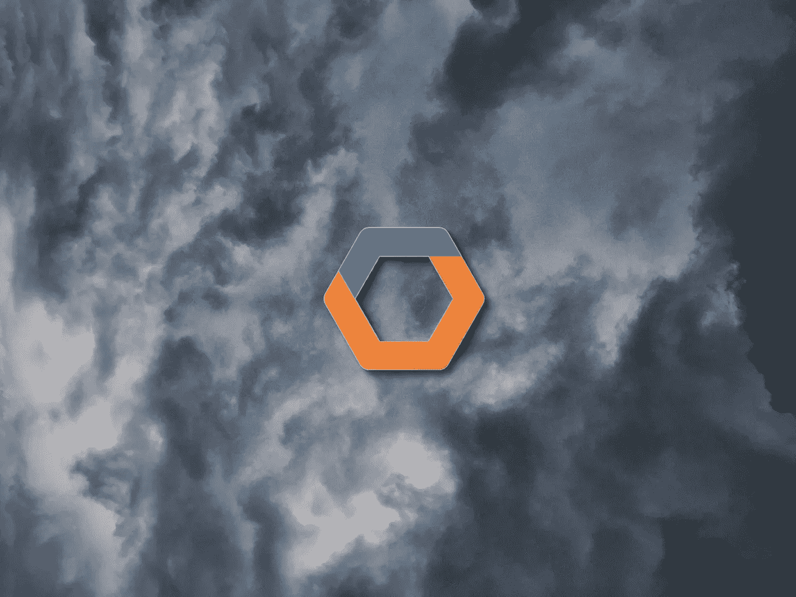
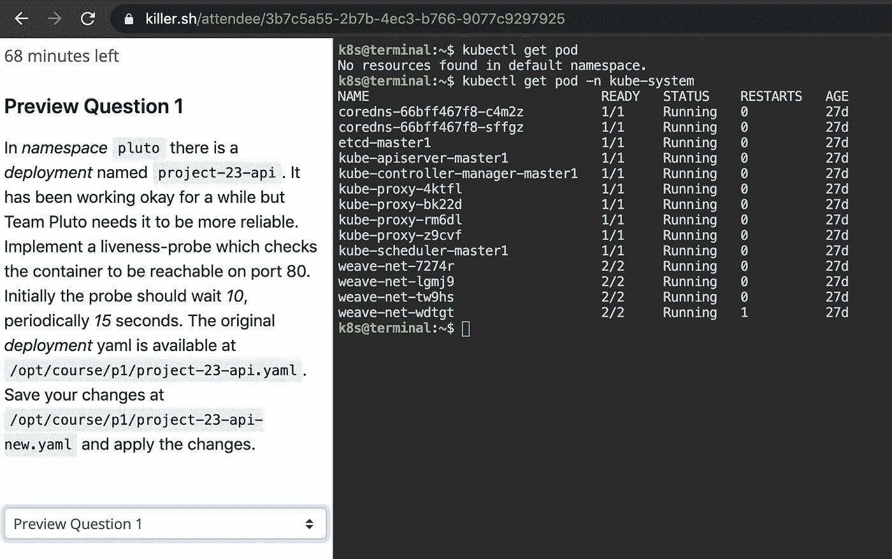
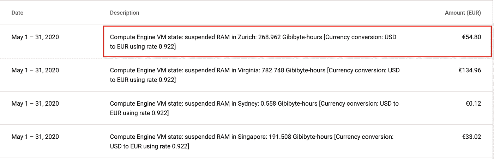
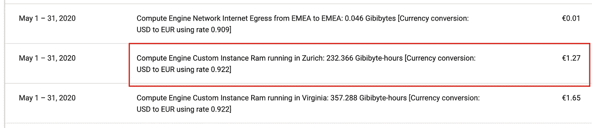
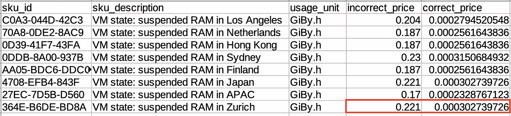

# Gcloud 的计费问题如何导致一天的业务关闭

> 原文：<https://itnext.io/how-gclouds-billing-issue-caused-a-business-shutdown-for-one-day-948962ecc50e?source=collection_archive---------0----------------------->

## 解决方案多云？我们从那次经历中学到了什么

**2020 年 12 月 12 日更新**经过多月，自 5 月以来，这一问题终于得到解决，错误入账的款项已归还。我们由此了解了 GCP 计费的详细情况，这样我们就可以直接告诉支持人员这个问题。还要创建 GCP 开单预警。我们还为 GCP 使用了一个完全独立的银行账户，这样账单错误就不会造成完全的金钱损失。我们也正在迁移多云，以便至少有一个后备方案。不管怎样，很高兴这一切都结束了。

**2020 年 9 月 9 日更新**谷歌承诺偿还他们错误的账单金额，但至今仍未兑现。自 4 月以来，我们每周都与支持部门联系，以收回资金。非常可悲的是谷歌并不急于解决这个问题。

平台是 [killer.sh](https://killer.sh) ，一个针对 Kubernetes CKA 和 CKAD 认证的模拟器。在参加真正的认证之前，用户可以在这里测试他们的知识。

CKA 和 CKAD 认证是动手实践考试。与会者可以进入一个环境，在这个环境中，`kubectl`必须用于与多个 k8s 集群进行交互并解决各种任务。

# 黑仔简单地说

每个用户都可以访问浏览器终端。这个浏览器终端提供了对一个环境的访问，该环境中有各种其他虚拟机和 Kubernetes 集群。

这些环境是 GCP 计算实例，可能非常大，最高可达 30CPU 和 30GB 内存。因此，只要不使用，我们就暂停这些实例。我们使用这个 API 方法来挂起计算实例。

# 该事件

## 发生了什么事？

几周前，我们注意到 Gcloud 突然每天都向**收费，而我们通常每两个月才支付**一次。**我们的应用、行为或用户数量没有变化。所以我们联系了 Gcloud 计费支持。**

## 一级 Gcloud 支持响应

我们通过聊天联系了 Gcloud 计费支持，这很快，但遗憾的是非常低效。我们说，我们没有改变任何东西，但突然每天支付我们原本每两个月才支付的费用。

支持者进行了调查，前后花了两个小时讨论这个问题。然后他们说一切都很正常，很好，我们只是突然用了这么多。他们就如何理解 Gcloud 计费系统给了我们一些提示。

## 接下来我们做了什么？

我们确实**关闭了 [https://killer.sh](https://killer.sh) 的完整平台**。

因为我们认为我们对成本做了疯狂的错误计算，这是我们的错误。也许有一些我们从未见过的隐藏的指控。如果问题仅仅是某个 Gcloud 服务(如 compute)关闭了，至少我们知道这不是我们的错，并且它可能会在某个时间被修复。但不是这个问题。

在与支持人员聊了几个小时后，我们得出结论，这肯定是我们的错，我们需要花大量的时间来调查此事。这意味着我们必须终止所有正在运行的用户会话(计算虚拟机),并阻止新用户付费、注册和使用平台。因为我们每跑一个小时就会损失很多钱。

## 我们在进一步调查中发现了什么？

关机后，我们确实深入挖掘了 Gcloud 的计费数据。我们使用了:

*   账单/交易(详细列出每笔小额费用)
*   计费/计费导出(能够对所有费用使用 SQL 查询)

我们发现基本上是这样的:

苏黎世的悬浮内存

苏黎世在用 RAM

你可以看到悬挂内存比使用中的内存贵得离谱。没道理？没道理啊！

## 第一级支持对调查结果有什么看法？

我们带着我们的发现回到了 Gcloud Billing Support，之后他们将此问题上报给了一个特殊团队(我们称他们为二级支持)。

我们被告知他们会在 24 小时内回复。他们确实在 3 天后做出了回应。

## 我们的临时解决方案

因为我们(自己)发现挂起的 RAM 突然完全定价过高，所以我们简单地禁用了虚拟机的挂起，并再次启用了对我们平台的访问。这意味着用户能够再次使用他们的 Kubernetes CKA/CKAD 模拟器会议。

**但这样做我们实际上损失了金钱**，因为我们无法在用户不使用虚拟机时暂停它们。

## 二级 Gcloud 支持给了我们什么回应？

3 天后支持人员回来说是 Gcloud 的错。他们会:

1.  偿还他们错误记账的钱
2.  除此之外，用同样的金额补偿我们的麻烦，以及开发时间和虚拟机使用方面的更多成本
3.  告诉我们(在我们提出要求后),暂停 RAM 的价格现已恢复正常
4.  请(在我们请求后)给我们发送一份包含错误费用概述的 CSV

显示挂起内存的正确和错误价格

所以如果我的计算没错，对于苏黎士， **Gcloud 突然多充了 730 倍**。

## 现在是什么情况？

一切都恢复正常，我们可以再次使用暂停功能。但我们现在每天都在监控账单报告，并彻底检查每一份寄出的账单。

我想知道如果这次加注不那么疯狂，可能只是翻倍，会发生什么？我们可能没有注意到这一点，并会支付更多…

# 防止这种情况的解决方案是什么？

1.  甚至在事故发生之前就深入了解您的账单
2.  向您的 Gcloud 计算实例添加标签，以便您可以在计费导出 SQL 查询中跟踪这些实例
3.  设置计费预算和警报，以便您知道何时发生异常计费
4.  能够告诉第一级 Gcloud 计费支持到底是什么问题，因为他们可能没有受过这方面的培训

## 多云

在我看来，唯一真正的解决方案是走向多云。如果发生这种情况，能够将你提供的每项服务从一个云提供商转移到另一个云提供商将会给你带来极大的灵活性。此外，如果发生与计费无关的云提供商正常停机。

但是迁移到多云平台很难，需要更多的时间，而且对于小型平台来说可能不可行。

# 结论

我不得不说，我总体上非常喜欢 Gcloud，并建议人们和公司使用它。它非常好用，而且比 AWS 等更容易使用。但是这件事真的让我对 GCP 失去了很大的信心。

支持人员花了 3 天时间才得到结果，这仅仅是因为我们做了深入调查并发现了实际问题。但是 GCP 赔偿了我们错误的账单金额，此外还赔偿了一些损失。

这绝对是一个令人伤脑筋的问题，我们真的想防止再次发生。