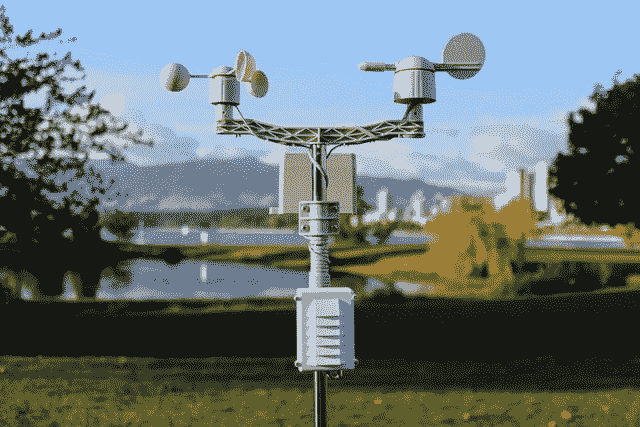
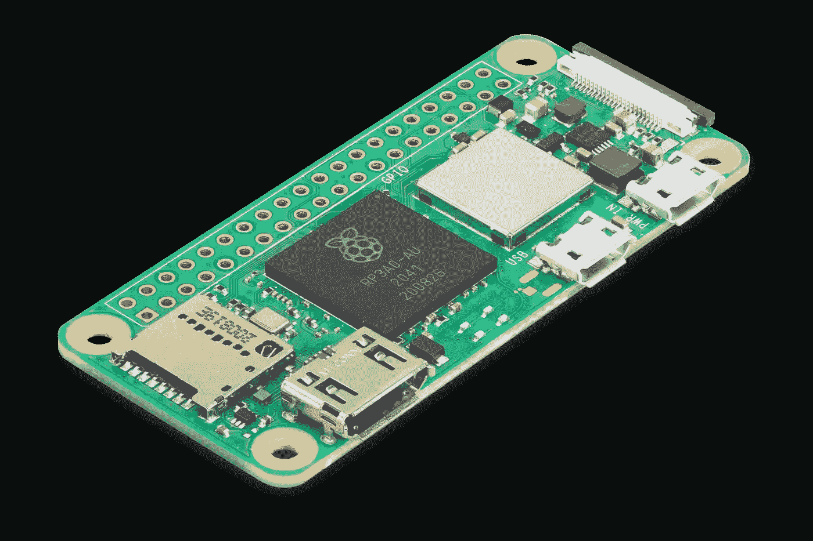
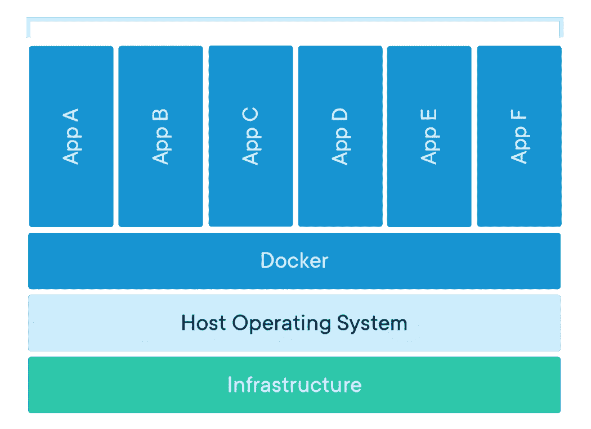

# Docker 容器在物联网设备中有多好？

> 原文：<https://itnext.io/how-good-are-docker-containers-in-the-iot-devices-2295a94dd92d?source=collection_archive---------3----------------------->



Docker 容器(也称为 [OCI](https://opencontainers.org/) 容器)现在是构建和发布应用程序最流行的方式，无论是通过 plain Docker、Docker-Compose、Kubernetes，还是像 Heroku、GCP CloudRun 这样的托管服务。构建和部署容器的简易性使得开发人员和运营团队采用新技术变得轻而易举。

但是物联网设备呢？在本帖中，我们将探讨 Docker 容器的优点以及需要注意的事项。

# Docker 容器为物联网设备做好准备了吗？

是的。设备本身现在已经足够强大，可以运行一个普通的 Linux 发行版，安装一个 Docker 引擎，运行你的容器而不需要太多开销。大多数设备，即使是过时的硬件，也往往比主要云服务提供的小型虚拟机更强大。

[Synpse](https://synpse.net/) 已经被部署在与 RaspberryPi 2(比当前一代弱得多)相当的大型设备上，到目前为止我们还没有观察到任何与性能相关的问题。



比如看[低至 15 美元的 Pi Zero 2](https://www.raspberrypi.com/products/raspberry-pi-zero-2-w/) ，可以给你提供一个四核 64 位 ARM Cortex-A53 处理器，主频 1GHz，SDRAM 512 MB。或者我们可以看看普通的 [Raspberry Pi 4](https://www.raspberrypi.com/products/raspberry-pi-4-model-b/) 或 [Jetson Xavier](https://developer.nvidia.com/embedded/jetson-agx-xavier-developer-kit) ，它们可以提供更高的计算能力。

# 软件部署和 OTA 更新

Docker 最大的优势是能够按照你想要的方式打包应用程序，并且不用太担心主机(你仍然需要考虑操作系统，但要少得多)。在用 Go 编写软件之前，我曾经用 Python 编写后端应用程序。应用程序部署过去很复杂，更新很脆弱，而且我们偶尔会遇到一些依赖冲突。Docker 通过将整个文件系统与已安装的依赖项打包来解决这个问题。你有你的包，你的静态文件放在容器里。



主机上的 Docker

通过这种方式，您可以构建容器，对其运行自动化测试，然后将其部署到服务器。它还为简单的回滚机制铺平了道路，如果出现问题，您可以启动旧版本的 Docker 容器。

对于具有微小应用程序和较少包的物联网产品，OTA 更新过程通常是轻量级的和简单的:下载一个新映像，停止正在运行的容器，从新 Docker 映像启动一个新容器。

# 准备多弓(或至少臂)图像

x86/amd64 Docker 映像与您可能需要部署到物联网设备的映像之间的主要区别在于其架构。当试图在 RaspberryPi 或其他设备上运行您的容器时，这有时可能是一个陷阱，因为错误通常是隐晦的。

幸运的是，DockerHub 和其他注册表支持 multi-arch 映像，您可以推送 x86、arm 32 位和 arm 64 位映像。这极大地简化了部署，因为 Docker 守护进程会自己决定下载哪个映像。我们已经写了一篇关于[建造多拱图像](https://synpse.net/blog/images/multiarch-images/)的文章。

# 持久数据

执行图像处理等人工智能任务或具有本地数据库的应用程序需要持久存储数据。当人们刚刚开始使用 Docker 容器时，存储可能会令人困惑，因为在更新期间重新创建容器时，容器中保存的任何内容都不会持久化。持久化数据的方法是将设备文件系统中的卷挂载到容器中。你可以在阅读更多关于坚持的文章。

# 写/读繁重的目录并延长设备的文件系统寿命

当准备延长设备的使用时间时，您不仅需要考虑更新，还需要考虑其组件的寿命。SD 卡或内置存储可以持续很长时间，但有办法减少它们的负载。

如果您的应用程序需要写入和读取大量数据，最好也挂载`/dev/shm`。你可以在这里阅读更多关于共享内存[的内容。](https://en.wikipedia.org/wiki/Shared_memory)

# 将硬件设备暴露在容器中

你经常需要使用串行设备。容器化的应用程序可以毫无问题地访问它们，但是你需要让 Docker 知道你想把这些设备暴露给你的容器。在 Docker CLI 上，它看起来像这样:

```
docker run -t -i --device=/dev/ttyACM0 ubuntu bash
```

或者，在 Synpse 中，您可以将以下内容添加到您的应用程序规范中:

```
devices:
      - hostPath: /dev/ttyACM0
        containerPath: /dev/ttyACM0
```

# 安全性

当将软件部署到数千台设备上时，您需要考虑“第二天”的操作。即使在发布应用程序之前，规划和测试操作系统和应用程序更新也是至关重要的。您将如何更新应用程序？如果设备连接到互联网，那么即使在多年后，保持设备安全的最佳方法是什么？

通过减少需要安装在设备上的软件包数量，您也大大减少了攻击面。例如，如果您正在部署基于 NodeJS、Python、Ruby 的应用程序，您的设备操作系统不需要运行时，并且可以尽可能地精简。这个很有帮助，凡是没有安装的，都不需要更新。

您还可以使用工具来自动扫描您的图像中的漏洞:

*   [https://github.com/marketplace/actions/container-image-scan](https://github.com/marketplace/actions/container-image-scan)
*   https://docs.docker.com/docker-hub/vulnerability-scanning/

# 开发人员生产力

将容器化应用部署到边缘的另一个重要方面是重用开发人员和运营团队已经熟知的工具。通过选择 Docker 的优势，你没有引入一个新的包装系统。您还可以重用您的 CI 管道。

# 总结

如果您的硬件和操作系统允许，选择 Docker 容器来部署您的应用程序几乎总是更好的。这将提高安全性，简化部署过程，并减少长期运营中的总体问题。重要的部分变成了更新容器的可靠策略。

# 使用 Synpse 进行 OTA 更新

说到管理大型集装箱船队，Synpse 就是为此而生的。它提供了成功部署和运行大规模运营所需的一切:

*   声明式应用程序部署，在 GitHub 或任何其他源代码控制管理系统中存储配置
*   简单回滚
*   GPU 支持
*   音量支持
*   SSH 支持与操作系统更新的 [Ansible](https://www.ansible.com/) 集成
*   每个设备的应用程序日志
*   度量收集

您可以免费试用 Synpse(最多 5 台设备)。查看我们的[快速入门](https://docs.synpse.net/start-here/quick-start-web-user)。

*最初发表于*[*https://synpse.net*](https://synpse.net/blog/using-docker-in-iot-devices/)*。*