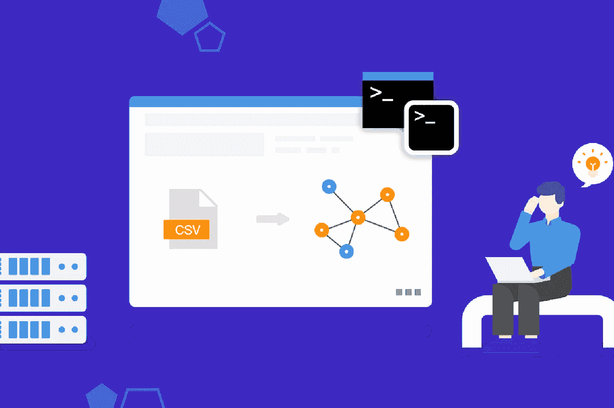
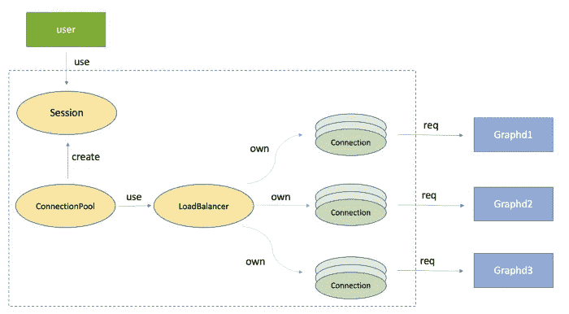

# 图形数据库如何通过 NebulaGraph 客户端与 FB thirty 一起工作

> 原文：<https://itnext.io/how-graph-database-works-with-fbthrift-by-nebulagraph-clients-54f3131829fc?source=collection_archive---------7----------------------->

# 概观

NebulaGraph 客户端为用户提供多种编程语言的 API，与 NebulaGraph 进行交互，并将服务器返回的数据结构重新打包，以便更好地使用。

目前，NebulaGraph 客户端支持 C++、Java、Python、Golang 和 Rust。

# 服务交流框架

NebulaGraph 客户端使用`fbthrift`[https://github.com/facebook/fbthrift](https://github.com/facebook/fbthrift)作为服务器和客户端之间服务通信的 RPC 框架，实现跨语言交互。

总体而言，fbthrift 是:

1.  代码生成器:fbthrift 有一个代码生成器，可以生成数据结构，这些数据结构可以在不同的语言中使用 thrift 进行序列化。
2.  序列化框架:fbthrift 有一组协议来序列化代码生成器生成的结构。
3.  一个 RPC 框架:fbthrift 有一个框架在客户端和服务器之间发送消息，并在接收不同语言的消息时调用应用程序定义的函数。

# 例子

以 Golang 客户端为例，展示 fbthrift 在 NebulaGraph 中的应用。

1.  服务器中`Vertex`结构的定义:

2.在`src/interface/common.thrift`中定义一些数据结构:

在上面的例子中，我们定义了一个顶点结构。`(cpp.type = "nebula::Vertex")`表示该结构对应服务器的`nebula::Vertex`。

3.fbthrift 会自动生成 Golang 中的数据结构:

4.在`MATCH (v:Person) WHERE id(v) == "ABC" RETURN v`中，客户端向服务器请求一个顶点(`nebula::Vertex`)。服务器找到后会**序列化**它。服务器找到这个顶点后，会**序列化**，通过 RPC 通信框架的`transport`发送给客户端。当客户端接收到这些数据后，会被**反序列化**，生成客户端定义的相应数据结构(`type Vertex struct`)。

# 客户

在本节中，我们将以 nebula-go 为例，介绍客户端的不同模块及其主要接口。

1.  **配置**提供整个配置选项。

**2。Session** 提供用户直接调用的接口。

*   接口的定义如下:

**3。连接池**管理所有的连接。主要界面如下:

**4。连接**将**节俭**的网络打包，并提供以下接口:

**5。负载平衡**在连接池中使用。

*   策略:轮询

# 模块的相互作用

1.  连接池

*   初始化:
*   使用时，用户需要创建并初始化一个**连接池**。在初始化过程中，连接池将在用户指定的 NebulaGraph 服务地址建立一个**连接**。如果在集群部署方法中部署了多个图形服务，连接池将使用**轮询策略**来平衡负载，并为每个地址建立几乎相等数量的连接。
*   管理连接:
*   连接池中维护两个队列，**空闲连接队列**和**活动连接队列**。连接池将定期检测过期的空闲连接并关闭它们。这两个队列会使用**读写锁**来保证添加或删除元素时多线程执行的正确性。
*   当会话请求连接到连接池时，它将检查空闲连接队列中是否有可用的连接。如果有任何可用的连接，它们将直接返回到会话供用户使用。如果没有可用的连接，并且当前的连接总数没有超过配置中定义的最大连接数，则会为会话创建一个新连接。如果达到最大连接数，将返回错误。
*   通常，只有在关闭程序时才需要关闭连接池。当程序关闭时，池中的所有连接都将被断开。

2.会议

*   **会话**通过连接池生成。用户需要提供密码进行身份验证。认证成功后，用户将获得一个会话实例，并通过会话中的连接与服务器进行通信。最常用的接口是`execute()`。如果在执行过程中出现错误，客户端将检查错误类型。如果是网络错误，它将**自动重新连接**并再次尝试执行该语句。
*   注意，会话**不支持被多个线程同时使用**。正确的做法是多线程应用多个会话，每个线程使用一个会话。
*   当会话被释放时，它持有的连接将被放回连接池的**空闲连接队列**中，以便它可以在以后被其他会话重用。

3.关系

*   每个连接示例都是等效的，可以由任何会话持有。**这个设计的目的是允许这些连接被不同的会话重用**，减少重复启用和禁用传输。
*   该连接会将客户端的请求发送到服务器，并将结果返回给会话。

4.例子

# **返回的数据结构**

客户端将返回的查询结果通过部分复杂的服务器进行打包，并增加了一个方便使用的接口。

`nebula::Value`在客户端会打包成`ValueWrapper`，通过接口转换成其他结构。(即`node = ValueWrapper.asNode()`)

# 数据结构分析

对于`MATCH p= (v:player{name:"Tim Duncan"})-[]->(v2) RETURN p`，返回的结果是:

我们可以看到返回的结果包含一行，它的类型是一个路径。此时，您可以执行如下操作来获取路径(v2)的目标顶点的属性。

# 客户地址

客户端的 GitHub 地址如下:

*   [https://github.com/vesoft-inc/nebula-cpp](https://github.com/vesoft-inc/nebula-cpp)
*   [https://github.com/vesoft-inc/nebula-java](https://github.com/vesoft-inc/nebula-java)
*   [https://github.com/vesoft-inc/nebula-python](https://github.com/vesoft-inc/nebula-python)
*   [https://github.com/vesoft-inc/nebula-go](https://github.com/vesoft-inc/nebula-go)
*   [https://github.com/vesoft-inc/nebula-rust](https://github.com/vesoft-inc/nebula-rust)

如果您在使用 NebulaGraph 的过程中遇到任何问题，请参考 [NebulaGraph 数据库手册](https://docs.nebula-graph.io)解决问题。详细记录了图形数据库和图形数据库星云图的知识点和具体用法。

如果你想和星云图社区的其他人讨论这个问题，请加入我们的休闲频道！