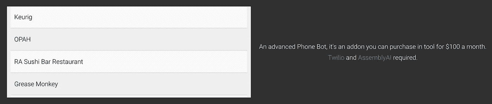

# 黑客如何利用人工智能找到窃取礼品卡的创造性方法。

> 原文：<https://itnext.io/how-hackers-are-finding-creative-ways-to-steal-gift-cards-using-artificial-intelligence-8a0544a54c6f?source=collection_archive---------0----------------------->


黑帽黑客的前提是一个和时间一样古老的故事:找东西，破东西，赚钱。多年来，出现了许多创造性的攻击，这些攻击开创了行业先河，为我们的数字基础设施带来了突破性的变化。虽然有些人可能会认为这些年来攻击已经变得铁板一块，但我认为这不一定是真的。有些人没有意识到最好的和最有创意的攻击是那些我们看不到的攻击。今年夏天，我开始了一次冒险，看看黑帽黑客是如何绕过系统的。我开始在几个互联网论坛上搜索，包括 [nulled](http://nulled.to) 和 [cracked](http://cracked.to) ，惊讶地发现许多服务有数千的页面浏览量。这些论坛经常有 15000 人同时浏览市场和活跃的分享部分。然而，引起我注意的是一家出售星巴克礼品卡的网店。我真的很好奇为什么有人能从不同的商店获得偷来的购物卡。这很有趣，因为卖家出售的这些礼品卡上没有别针。这样就有了一次激动人心的经历。

我一开始假扮(不是真的)开发商，给卖家发了一条信息，询问如果我要买的话，如何检查这些礼品卡的余额。我遇到了一个提示 dm 告诉我，我可以使用商店的礼品卡电话线检查它们。我最初的反应是困惑；我为什么要用电话线？他是不是在利用他们的电话线？他有权限吗？我决定把弄清楚它是如何工作的想法放下几天，然后在接下来的一周里不去想它。然而，有一天，在寻找短信提供商时，它终于点击了。他不知何故获得了一大堆卡，并通过电话提供商在电话线上检查它们的余额。我立即回到论坛，迅速搜索礼品卡机器人。然后，该网站返回了一个名为 easycards.io 的新创建程序的线程。在阅读该线程时，我找到了我正在寻找的内容:



“电话机器人”

当我阅读这些信息时，一切都一目了然；该机器人使用电话提供商(在这种情况下，Twilio)进行呼叫，然后使用语音到文本服务(Assembly)取回余额。考虑到这一点，我决定拿一张被遗忘的旧星巴克礼品卡，这是我收到的生日礼物，并通过电话线为自己检查余额。我通过电话 DTMF 系统输入礼品卡，然后系统提示我输入一个我从未想到的验证码。那一刻，我意识到，这其实比我原先想象的要复杂得多。

机器人必须找到一种方法来调用礼品卡行，输入卡，获取验证码，发送验证码，记录余额，转录余额，并将其发送回用户，所有这些都非常准确。我真的被这项任务的复杂性和粒度所迷惑，我决定自己尝试一下。我再次拨打礼品卡热线，并决定看看它会等待多久，我输入这个验证码。我又一次经历了输入扩展名和卡的动作，直到我被提示输入验证码，短短的 7 秒钟后，我再次被问候“对不起，这是不正确的。”这些程序只有少得可怜的 7 秒钟来获得这个验证码，记录它，转录它，并发送它。我真的很难理解这些卖家是如何用这种方法获得 1500 张余额超过 5 美元的购物卡的。在对复杂性的震惊中，我做了任何优秀程序员都会做的事情，自己做一个。

前一两天，我查阅了 Twilio 的文档，了解这些调用是如何以编程方式进行的。Twilio 拥有几乎所有可以想象到的语言的助手/包装函数库，所以这是一个相当容易的任务。该机器人将首先发起一个呼叫，并通过发送到创建呼叫路由来发送分机和卡号。这种方法需要一种叫做 Twiml(只是 XML 的公司名称)的东西来执行调用操作。Twiml 看起来像这样:

```
<Response>
    <Pause length="70"/>
</Response>
```

python 代码应该是这样的:

```
# Download the helper library from https://www.twilio.com/docs/python/install
import os
from twilio.rest import Client

# Your Account Sid and Auth Token from twilio.com/console
# and set the environment variables. See http://twil.io/secure
account_sid = os.environ['TWILIO_ACCOUNT_SID']
auth_token = os.environ['TWILIO_AUTH_TOKEN']
client = Client(account_sid, auth_token)

call = client.calls.create(
                        url='http://demo.twilio.com/docs/voice.xml',
                        to=gift_card_hotline_phone_number,
                        from_=bought_phone_number
                        send_digits=extension + card_number                    
)

print(call.sid)
```

在 send digits 参数中，您可以等待几秒或半秒，这对于这个用例来说几乎是完美的，因为在输入分机号码之前，您经常需要等待。例如，如果您想等 3 秒钟，拨分机号码 1，然后再等 3 秒钟，您可以输入以下内容:

```
"WWW1WWW"
```

一旦拨打了这个电话，人们可以等待验证码(我不会为星巴克设置时间以防止恶意使用)开始记录电话。对呼叫进行录音会返回一个端点，您可以在该端点处进行录音。这个记录函数是用调用 sid(调用的唯一标识符)调用的，它是从 create call 函数返回的。代码看起来会像这样:

`recording = client.calls(sid)
.recordings
.create()`

大约 5 秒钟后，需要停止这个调用的记录(使用相同的 Twilio API)，然后将 URL 传递给转录服务，如 [Assembly](https://www.assemblyai.com/) 。

```
**import** requests

endpoint = "https://api.assemblyai.com/v2/transcript"

json = {
  "audio_url": recording url from twilio
}

headers = {
    "authorization": "YOUR-API-TOKEN",
    "content-type": "application/json"
}

response = requests.post(endpoint, json=json, headers=headers)

print(response.json())
```

最后，您可以使用 regex 解析转录，并通过 Twilio API 发送回数字。下面是一些伪代码:

```
x = [3-9]\d\dsend_digits(x)
```

一旦你发送了这些数字，你就想再次开始记录，然后在某一点上(一旦你的 Twiml 上的暂停元素结束)，转录返回的内容并交给客户端。在将输入发送回客户端之前，您可能希望将输入整理成简单的有效或无效返回值，以便于查看。你可能还想把新偷来的战利品保存在一个文本文件中。一旦该说的都说了，该做的都做了，你在这张支票上总共花了 0.015 美元。从黑帽子的角度来看，这和你偷别人的礼品卡赚的钱相比是微不足道的。我认为这个项目教会我的比任何事情都多，我们的系统总是受到坏人的攻击。这种攻击方式比任何事情都更证明了攻击正变得越来越复杂，尽管有些人的论点是现在很多攻击都非常相似。我认为，只要看一看引擎盖下的内部深处，就可以了解安全世界的许多情况。我希望这篇文章鼓励你们中的一些人找到自己的“电话机器人”类型的攻击。未来的安全依赖于安全研究人员愿意花更多的时间在内部而不是相互之间。

亚历克斯